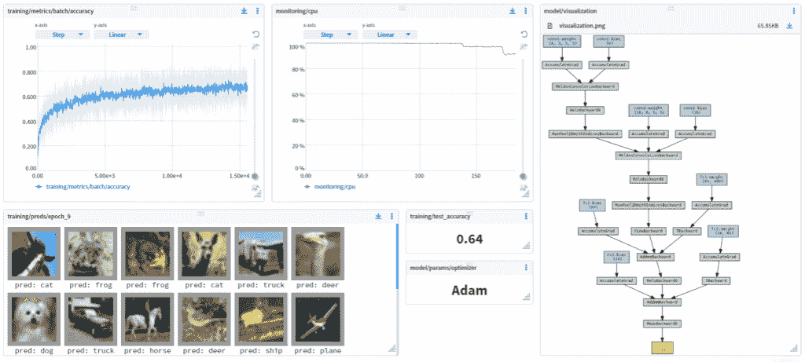

# 机器学习模型可视化的最佳工具

> 原文：<https://web.archive.org/web/https://neptune.ai/blog/the-best-tools-for-machine-learning-model-visualization>

“每个模型都是错的，但有些是有用的”这句话在机器学习中尤其成立。在开发机器学习模型的时候，你要时刻明白它在哪里按预期工作，在哪里惨败。

理解模型的一个重要方法是通过模型可视化。**可视化模型架构**对于以下方面非常重要:

*   模型可解释性
*   结果解释
*   模型调试
*   模型比较

### 阅读有关模型可视化的更多信息

一旦你对一个模型有了一定的了解，你就很棒了，对吗？错误的🙂

通常，你需要做一些或者很多模型改进想法的实验，并且**可视化不同 ML 实验之间的差异**变得至关重要。

有许多方法可以让你理解这一点:

*   查看评估指标(此外，您应该知道如何为您的问题选择评估指标
*   看看性能图表，如 ROC、升力曲线、混淆矩阵等
*   查看学习曲线以估计过度拟合
*   查看最佳/最差情况下的模型预测
*   看看模型训练和推理的资源密集程度(它们转化为严重的成本，并且对业务方面的事情至关重要)
*   使用模型解释工具和技术来审查预测([进一步阅读](https://web.archive.org/web/20220926091556/https://neptune.ai/blog/ml-model-interpretation-tools))

你可以自己完成所有这些(或者大部分)，但是今天有一些工具你可以使用。如果你正在寻找能够帮助你可视化机器学习实验和模型的最佳工具，那么你来对地方了。

## 机器学习实验可视化工具

*Example of model training metadata displayed in a dashboard | *[*See in the app*](https://web.archive.org/web/20220926091556/https://app.neptune.ai/o/common/org/project-cv/e/PROJCV-103/dashboard/variety-metadata-d78dd5d4-dc58-4488-baa0-0bbe1017ceec)

Neptune 是 MLOps 的**元数据存储库，为运行大量实验的团队而构建。‌它为您提供了一个单一的位置来记录、存储、显示、组织、比较和查询您所有的模型构建元数据。**

海王星是用 for:‌

*   **实验跟踪**:在一个地方记录、显示、组织和比较 ML 实验。
*   **模型注册**:对训练好的模型和建模元数据进行版本化、存储、管理和查询。
*   **实时监控 ML 运行**:实时记录和监控模型培训、评估或生产运行。

海王星如何帮助你可视化实验和模型？

*   [记录任何元数据类型](https://web.archive.org/web/20220926091556/https://docs.neptune.ai/you-should-know/what-can-you-log-and-display)，包括参数和指标，以及丰富的对象，如图像、视频、音频和交互式可视化。
*   [可视化记录的元数据](https://web.archive.org/web/20220926091556/https://docs.neptune.ai/you-should-know/displaying-metadata)并以首选方式分析结果——以运行表、图表、仪表板或文件夹结构的形式。
*   [使用智能对照表对比多次运行的超参数和指标](https://web.archive.org/web/20220926091556/https://docs.neptune.ai/you-should-know/comparing-runs)，该对照表突出显示了不同之处。
*   查看不同的参数和配置如何影响结果，并调试和优化模型。
*   [自动监控硬件利用率](https://web.archive.org/web/20220926091556/https://docs.neptune.ai/how-to-guides/model-monitoring) (GPU、CPU、内存)。
*   [注册模型](https://web.archive.org/web/20220926091556/https://docs.neptune.ai/how-to-guides/model-registry)和与之相关的元数据。

Weights & Biases 是一个机器学习平台，供开发人员更快地建立更好的模型。它可以让您快速跟踪实验、对数据集进行版本控制和迭代、评估模型性能、重现模型、可视化结果和发现回归，并与同事分享发现。

****权重&偏差如何帮助你可视化实验和模型？****

*   监控训练运行信息，如损失、准确性(学习曲线)
*   查看权重和偏差(没有双关语)或梯度的直方图
*   在培训期间记录丰富的对象，如图表、视频、音频或交互式图表
*   使用各种比较工具，如显示自动差异的表格、平行坐标图等
*   交互式预测[对象检测模型的包围盒可视化](https://web.archive.org/web/20220926091556/https://www.wandb.com/articles/bounding-boxes)
*   交互式预测掩码[语义分割模型的可视化](https://web.archive.org/web/20220926091556/https://app.wandb.ai/stacey/deep-drive/reports/Image-Masks-for-Semantic-Segmentation--Vmlldzo4MTUwMw)
*   可视化实时指标，如 GPU 和 CPU 利用率
*   构建数据集依赖关系图
*   可视化参数重要性

Comet 是一个**元机器学习平台，用于跟踪、比较、解释和优化实验和模型**。它还允许您实时监控、检测和警报以及调试生产模型。您还可以基于实验和模型数据构建自己的或使用社区提供的自定义可视化和应用程序。

****彗星如何帮助你可视化实验和模型？****

*   使用视觉、音频、文本和表格数据的专用模块可视化样本，以检测过度拟合并轻松识别数据集的问题
*   您可以自定义和组合您的可视化
*   你可以监控你的学习曲线
*   Comet 灵活的实验和可视化套件允许您记录、比较和可视化许多工件类型
*   构建您自己的或使用社区构建的“面板”来可视化您的模型和实验
*   实时监控生产模型

TensorBoard 提供了机器学习实验所需的可视化和工具。它是开源的，为机器学习模型的可视化和调试提供了一套工具。TensorBoard 是市场上最受欢迎的解决方案；因此，它与许多其他工具和应用程序广泛集成。

更重要的是，它有一个广泛的工程师网络使用这个软件，分享他们的经验和想法。这使得一个强大的社区准备解决任何问题。然而，该软件本身最适合个人用户。

TensorBoard 如何帮助你可视化实验和模型？

*   跟踪和可视化损失和准确性等指标
*   可视化模型图(操作和层)
*   查看权重、偏差或其他张量随时间变化的直方图
*   将嵌入投影到低维空间
*   显示图像、文本和音频数据
*   剖析张量流程序

### 5.神圣+全能

神圣+ Omniboard 堆栈实际上由两个开源组件组成——[Sac](https://web.archive.org/web/20220926091556/https://github.com/IDSIA/sacred)red，一个实验管理工具，和 Omniboard，一个神圣的网络仪表板。神圣记录实验数据到 MongoDB 后端，Omniboard 连接到这个后端来可视化实验。

神圣给你一个强大的命令行界面，观察员记录实验信息，并自动播种控制实验的随机性，使结果是可重复的。Omniboard 通过它的一套实验管理、深入研究和比较功能对此进行了补充。

**神圣+ Omniboard 如何帮助你可视化实验和模型？**

*   神圣的 CLI 可用于更新参数和运行同一实验的不同变体
*   在 MongoDB 数据库中保存实验配置
*   在 Omniboard 仪表板上比较不同的实验
*   上滚或下钻实验，以查看集合或单个细节

MLflow 是一个管理端到端机器学习生命周期的开源平台。它是目前使用最广泛的 ML 实验跟踪器，因此得到了各种语言、框架和平台的广泛支持。MLflow 支持通过 Python、R、Java 和 REST APIs 进行日志记录。

作为一个开源项目，MLflow 个人使用没有直接成本。然而，如果您希望使用 MLflow 在大型团队之间进行协作，基础设施成本将会增加，因为您需要拥有自己的远程跟踪服务器。Databricks 的托管 MLflow 为您提供托管服务。

****ml flow 如何帮助你可视化实验和模型？****

## 对照表:ML 实验可视化工具

实验跟踪是所有上述产品的核心用例，因此，大多数产品都提供类似的功能。但是，有些功能并非所有工具都支持。下表强调了上述工具在功能上的一些差异。

海王星

W&B

彗星

张量板

神圣+全能

MLflow

Sacred + Omniboard:

计算机编程语言

可以汇总记录的指标吗？

可以记录硬件消耗吗？

用于实验比较的表格格式差异？

实验参数分组依据？

平行坐标图？

MLflow:

仅在托管版本中

数据的并排比较？

Neptune:

图像、表格、文本

W&B:

音频、HTML、图像、表格、文本、视频

Comet:

绘图、表格、文本

## 机器学习模型可视化工具

dtreeviz 是一个用于决策树可视化和模型解释的 python 库。目前支持 [scikit-learn](https://web.archive.org/web/20220926091556/https://scikit-learn.org/stable) 、 [XGBoost](https://web.archive.org/web/20220926091556/https://xgboost.readthedocs.io/en/latest) 、 [Spark MLlib](https://web.archive.org/web/20220926091556/https://spark.apache.org/mllib/) 和 [Lig](https://web.archive.org/web/20220926091556/https://lightgbm.readthedocs.io/en/latest/) htGBM 树。从 1.3 版本开始，还支持任何具有 predict_proba()的模型的特征空间插图。

dtreevix 如何帮助您可视化模型？

*   可视化基于树的模型
*   说明支持的分类器的特征空间
*   突出显示树中单个观察值的预测路径，并获得相同的简单英语解释
*   可视化叶片指标，如纯度、样品和目标分布
*   在特征空间中可视化分类边界。

Netron 可用于生成神经网络模型的交互式可视化。它以 Python 包、独立应用程序和浏览器应用程序的形式提供。

****Netron 如何帮你可视化模型？****

*   生成神经网络的交互式可视化
*   展开节点以查看图层详细信息
*   支持几乎所有广泛使用的框架
*   无需安装即可使用浏览器应用

NN-SVG 是一个托管应用程序，用于参数化而非手动创建神经网络(NN)架构图。它还提供了将这些绘图导出到可缩放矢量图形(SVG)文件的能力，适合包含在学术论文或网页中。

****NN-SVG 如何帮助你可视化模型？****

*   完全托管的应用程序，无需安装
*   支持 FCNN、LeNet 和 AlexNet 样式
*   高度可定制
*   将生成的原理图导出为 SVG 图像

TensorBoard 主要是一个实验可视化工具，但它也显示 TensorFlow 模型的模型图。

****tensor board 如何帮助你可视化模型？****

*   可视化张量流模型图
*   跟踪和记录张量流实验
*   提供了一个完全管理的版本—[tensor board . dev](https://web.archive.org/web/20220926091556/https://tensorboard.dev/)——它允许您托管、跟踪和共享您的 ML 实验

## 摘要

在这篇博客中，我们介绍并比较了一些目前最流行的模型和可视化工具。与 ML 领域的大多数工具一样，没有一种工具是万能的，使用哪种工具在很大程度上取决于您的具体用例。

您希望可视化什么样的模型？你可视化的目的是什么？

大多数模型可视化工具都是针对特定的架构和用例而构建的。

*   对于基于树的模型， [dtreeviz](https://web.archive.org/web/20220926091556/https://github.com/parrt/dtreeviz) 是一个不错的选择。
*   [TensorBoard](https://web.archive.org/web/20220926091556/https://www.tensorflow.org/tensorboard) 与 Tensorflow/Keras 模型集成得非常好。
*   如果你只是想为你的神经网络模型创建一个非交互式的可视化的例子， [NN-SVG](https://web.archive.org/web/20220926091556/https://github.com/alexlenail/NN-SVG) 可能会节省你一些时间。
*   Netron 制作详细的神经网络模型的交互式可视化，这对调试和优化有很大帮助。

你是一个预算有限的小团队吗？

如果是的话，一些开源和免费工具可能是不错的开始。但是，请记住，随着您的团队的增长，您的自托管成本也会增长。您也可以考虑定价不取决于用户数量的 SaaS 解决方案(例如 Neptune)。这样，当你的需求增加时，你会有更好的准备。

您是一个寻求协作开发的大型团队吗？

大多数 SaaS 解决方案具有丰富的协作功能，如基于 URL 的共享、协作仪表板、报告、用户管理等。

无论如何，希望这篇文章能帮助你做出选择，你会找到你一直在寻找的东西。

快乐观想！

### 西达丹·萨达特

我目前是 Neptune.ai 的一名开发人员，我坚信最好的学习方式是边做边教。

* * *

**阅读下一篇**

## ML 实验跟踪和管理的 15 个最佳工具

10 分钟阅读|作者 Patrycja Jenkner |年 8 月 25 日更新

在进行机器学习项目时，从单次模型训练中获得好的结果是一回事。但是，让你所有的机器学习实验保持良好的组织，并有一个让你从中得出有效结论的过程，则完全是另一回事。

这些需求的答案就是[实验追踪](/web/20220926091556/https://neptune.ai/experiment-tracking)。在机器学习中，实验跟踪是保存所有实验相关信息的过程，这些信息是你在每次实验中所关心的。

ML 团队以不同的方式实现实验跟踪，可能是通过使用电子表格、GitHub 或自建平台。然而，最有效的选择是使用专门为跟踪和管理 ML 实验而设计的工具。

在这篇文章中，我们**概述并比较了 15 个最好的工具，它们可以让你跟踪并管理你的 ML 实验**。你将了解它们的主要特征，并看到它们之间的不同之处。希望这将有助于您评估它们，并根据您的需求选择合适的产品。

## 如何评价一个实验跟踪工具？

“最好的实验跟踪工具是什么？”这个问题没有答案。当你单独工作或在团队中工作时，你的动机和需求可能完全不同。根据您的角色，您可能会寻找各种功能。

**如果你是数据科学家或研究人员，你应该考虑:**

*   如果该工具带有 web 用户界面或基于控制台；
*   如果您能够将该工具与您首选的模型培训框架相集成；
*   您可以记录、显示和比较哪些元数据(代码、文本、音频、视频等。);
*   你能容易地比较多次跑步吗？如果是，以什么格式——只有表格，还是还有图表；
*   如果通过实验来组织和搜索是用户友好的；
*   如果您可以自定义元数据结构和仪表板；
*   如果该工具让您跟踪硬件消耗；
*   与其他团队成员合作有多容易——你能分享一个实验的链接吗，或者你必须使用截图作为解决方法？

**作为一名 ML 工程师，你应该检查这个工具是否让你:**

*   轻松重现和重新运行实验；
*   跟踪和搜索实验谱系(下游使用的数据/模型/实验)；
*   保存、获取和缓存实验数据集；
*   将它与您的 CI/CD 渠道集成；
*   轻松地与同事协作和共享工作。

**最后，作为一名 ML 团队领导，你会对以下内容感兴趣:**

*   一般业务相关的东西，如定价模型、安全性和支持；
*   该工具需要多少基础设施，将其集成到您当前工作流的难易程度；
*   产品是作为商业软件、开源软件还是托管云服务交付的？
*   它具有什么样的协作、共享和审阅功能。

在回顾市场上的工具时，我确保牢记这些动机。所以让我们仔细看看它们。

[Continue reading ->](/web/20220926091556/https://neptune.ai/blog/best-ml-experiment-tracking-tools)

* * *