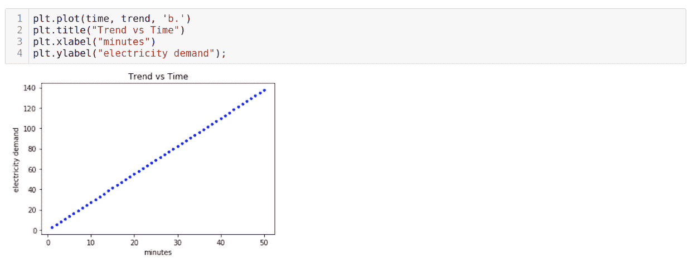
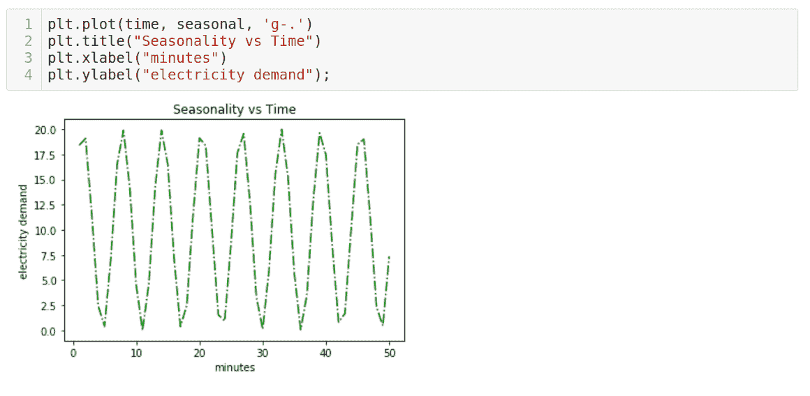
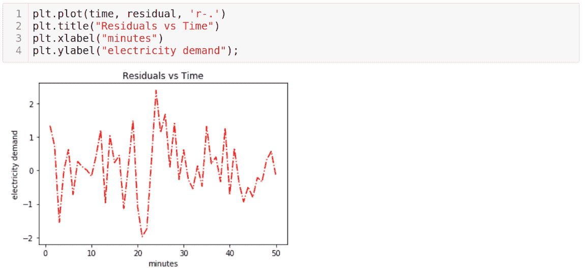
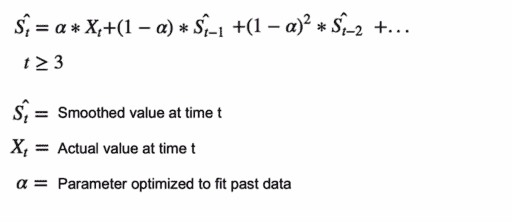
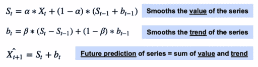
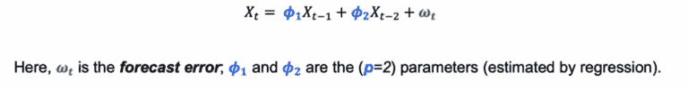
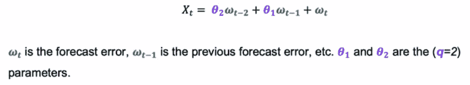
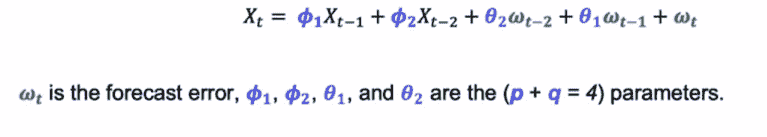

# 时间序列预测:数据、分析和实践

> 原文：<https://web.archive.org/web/https://neptune.ai/blog/time-series-forecasting>

通常，在传统的机器学习方法中，我们将数据随机分为训练数据、测试数据和交叉验证数据。

这里，数据集中的每个点**x****IT5 有:**

*   60%的概率进入 D [列车]
*   进入 D [测试]的概率为 20%
*   进入验证的概率为 20%

代替[基于随机的分裂，我们可以使用另一种叫做基于时间的分裂](https://web.archive.org/web/20221206003808/https://developers.google.com/machine-learning/data-prep/construct/sampling-splitting/example)的方法。当我们的数据集中给定了时间戳时，我们可以根据时间分割数据。

想象你是亚马逊的一名 ML 工程师，试图生产一个模型来对评论进行分类。您随机地将数据分为训练数据和测试数据，在获得所需的准确性之后，您部署模型。随着更多的评论被添加到新产品中，随着时间的推移，模型的准确性可能会降低。基于时间的分割是克服这个问题的一种方法。

在基于时间的拆分中，我们一般基于时间戳对数据进行拆分，并对模型进行训练。这样，我们比基于随机的分裂有更好的机会获得更高的精度。

### 为什么我们需要不同的方法？

标准的 ML 方法不适用于时间序列模型:

*   特征和目标变量是相同的，
*   随着时间的推移相关的数据，
*   通常不稳定(难以建模)，
*   需要大量数据来捕捉模式和趋势，并对这些变化进行适当建模。

## 什么是时间序列？

时间序列是按时间顺序组织的一系列数据点。

## 预测的类型

### 时间序列随处可见

**金融**:我们试图预测可能会对我们的业务目标产生重大影响的股票价格、资产价格、不同的宏观经济因素。

**电子商务**:我们试图预测未来的页面浏览量，与过去相比，是上升还是下降，或者是否有季节性。新用户也是如此，随着时间的推移，你会获得/失去多少新用户？

**业务**:我们试图预测你需要的交易数量、未来收入和未来库存水平。

时间序列分解包括将一个序列视为水平、趋势、季节性和噪声成分的组合。分解提供了一个有用的抽象模型，用于一般地思考时间序列，以及更好地理解时间序列分析和预测中的问题。

时间序列的一个基本主题是时间序列分解:

*   时间序列数据的组成部分
*   季节性模式和趋势
*   时间序列数据的分解

时间序列的组成部分是什么？

**趋势:**在一段时间内改变方向

**季节性:**季节性是指由不同因素引起的周期性行为、峰值或下降，例如:

*   自然发生的事件，如天气波动
*   业务或行政程序，如财政年度的开始或结束
*   社会和文化行为，如节日或宗教仪式
*   日历事件，如每月的星期一数或每年的节假日数

**残差:**我们无法用趋势或季节性来预测的不规则波动。

下面使用 Python 中的 Pandas 和 NumPy 数组构建了趋势图、季节性图和残差因子图。

## 分解模型

### 加性模型

加法模型假设观察到的时间序列是以下分量的总和:

***观察=趋势+季节性***

当季节值和残差值的大小与趋势无关时，使用加法模型。

上面的图表是使用 python 生成的，我们稍后将学习 python

在上面的例子中，我们可以看到残差的季节性不会随着趋势的增加而增加或减少，而是始终保持不变。看着这个图，减去代表趋势的直线，我们可以想象我们只是在季节性成分上加上了直线，不管趋势是什么，都是一样的。

### 乘法模型

乘法模型假设观察到的时间序列是其组成部分的乘积:

***观察值=趋势*季节性*残差***

我们可以通过应用对数变换将乘法模型转换为加法模型:

***【log(时间*季节性*残差)= log(时间)+ log(季节性)+ log(残差)***

如果季节性值和残差值的大小随趋势波动，则使用这些值。

上面的图表是使用 python 生成的，我们稍后将学习 python

在上图中，我们看到趋势增加，所以我们在上升。季节性因素也随着趋势上升。这意味着它很可能是一个乘法模型，所以我们应该划分趋势，然后我们会以更合理的(更一致的)季节性结束。

### 伪可加模型

伪加法模型结合了加法模型和乘法模型的元素。在以下情况下，它们会很有用:

*   时间序列值接近或等于零
*   我们期待与乘法模型相关的特性
*   在这种情况下，被零除通常会成为一个问题

## 使用 Python-Pandas 进行时间序列分解

我们将分别构建虚拟趋势、季节性和剩余成分。这个例子展示了如何使用 Pandas 模块构建一个简单的时间序列数据集。

```py
time = np.arange(1, 51)
```

现在我们需要创造一种趋势。假设我们有一个测量电力需求的传感器。为了简单起见，我们将忽略单位。

```py
trend = time * 2.75
```

现在让我们用图来显示作为时间函数的趋势

现在让我们生成一个季节性组件。



```py
seasonal = 10 + np.sin(time) * 10
```

让我们绘制季节性与时间的关系图。



现在，让我们构造剩余分量。

```py
np.random.seed(10)  
residual = np.random.normal(loc=0.0, scale=1, size=len(time))

```

残差的快速绘图:



## 总趋势、季节性和剩余成分

### 加法时间序列

记住加性时间序列的等式简单来说就是:***O[T]= T[T]+S[T]+R[T]***

**O [t]** =输出
T[T]=趋势
**S [t]** =季节性
**R [t]** =残差
**[t]** =代表特定时间点的变量

```py
additive = trend + seasonal + residual
```


乘法时间序列也是如此，只是我们不做加法，而是将趋势值、季节性值和残差值相乘。

### 信纸和自相关

#### 什么是平稳性？

为了使[时间序列数据保持稳定](https://web.archive.org/web/20221206003808/https://www.quora.com/What-does-stationary-data-mean-in-machine-learning-and-data-science)，数据必须随时间表现出四个特性:

1.**常数平均值:**

一个平稳的时间序列在整个序列中有一个恒定的平均值。

作为一个例子，如果我们要画出这个数列的平均值，这个平均值在任何时候都是成立的。

均值不恒定的一个很好的例子是，如果我们有某种趋势。例如，对于上升或下降趋势，序列结束时的平均值将明显高于或低于序列开始时的平均值。

2.**恒定方差:**

一个平稳的时间序列在整个序列中有一个恒定的方差。

3.**恒定自相关结构:**

自相关仅仅意味着当前的时间序列测量与过去的测量相关。例如，今天的股价往往与昨天的价格高度相关。

相关值之间的时间间隔称为滞后。假设我们想知道今天的股票价格是否与昨天的价格或两天前的价格更相关。我们可以通过计算原始时间序列和延迟一个时间间隔的相同序列之间的相关性来测试这一点。因此，原始时间序列的第二个值将与延迟时间序列的第一个值进行比较。第三个原始值将与第二个延迟值进行比较，依此类推。分别对滞后 1 和滞后 2 执行该过程将产生两个相关输出。这个输出会告诉你哪个滞后更相关。简单来说就是**自相关**。

## 时间序列平滑

### 什么是平滑？

[平滑](https://web.archive.org/web/20221206003808/https://towardsdatascience.com/what-is-label-smoothing-108debd7ef06)是一个过程，通常通过减少噪声的影响来提高我们预测序列的能力。

### 为什么平滑很重要？

平滑是一个重要的工具，让我们提高前瞻性的预测。

考虑下图中的数据。我们如何预测未来一步、两步或三步会发生什么？

一种解决方案是计算序列的平均值并预测未来的值。

但是，使用平均值来预测未来值似乎不是一个好方法，我们可能不会得到准确的预测。相反，我们采用一种叫做指数平滑的技术。

### 单一指数平滑

[单指数平滑](https://web.archive.org/web/20221206003808/https://otexts.com/fpp2/ses.html)也叫简单指数平滑，是一种对没有趋势性或季节性的单变量数据进行时间序列预测的方法。

它需要一个单一的参数，称为*α*(*α*)，也称为平滑因子或平滑系数。



该参数控制先前时间步长的观测值影响指数衰减的速率。Alpha 通常设置为 0 到 1 之间的值。较大的值意味着模型主要关注最近的过去观察值，而较小的值意味着在进行预测时会考虑更多的历史记录。

### 双指数平滑

[双指数平滑](https://web.archive.org/web/20221206003808/https://www.itl.nist.gov/div898/handbook/pmc/section4/pmc434.htm)是指数平滑的扩展，明确增加了对单变量时间序列趋势的支持。

除了用于控制级别平滑因子的 alpha 参数之外，还添加了一个平滑因子来控制趋势变化影响的衰减，称为 beta (b)。



该方法支持以不同方式变化的趋势:加法和乘法，分别取决于趋势是线性的还是指数的。

具有加性趋势的双指数平滑通常被称为 **Holt 的线性趋势模型**，以该方法的开发者 **Charles Holt** 命名。

### 三重指数平滑

[三重指数平滑](https://web.archive.org/web/20221206003808/https://machinelearningmastery.com/exponential-smoothing-for-time-series-forecasting-in-python/)是指数平滑的扩展，它明确地为单变量时间序列增加了对季节性的支持。

这种方法有时被称为**霍尔特-温特斯指数平滑**，以该方法的两位贡献者命名:查尔斯·霍尔特和彼得·温特斯。

除了 alpha 和 beta 平滑因子之外，还添加了一个名为 gamma (g)的新参数，用于控制对季节分量的影响。

与趋势一样，对于季节性的线性或指数变化，可以将季节性建模为加法或乘法过程。

## 自回归模型和移动平均(ARMA)模型

[ARMA 模型](https://web.archive.org/web/20221206003808/http://www-stat.wharton.upenn.edu/~stine/stat910/lectures/08_intro_arma.pdf)结合了两种模型:

第一种是自回归(AR)模型。自回归模型预期序列依赖于其过去的值。

第二种是移动平均线(MA)模型。移动平均模型预期对过去预测误差的系列依赖性。

组合(ARMA)也被称为 Box-Jenkins 方法。

### ARMA 模型:自回归部分

ARMA 模型通常用 **P** 和 **Q** 来表示 **AR** 和 **MA** 分量。对于我们想要预测时间 t 的时间序列变量 X，最后几个观察值是:

***X[t–3]，X[t–2]，X [t- 1]***

**AR(p)** 模型假设依赖于时间序列的最后 p 个值。假设 **p = 2** ，预测具有以下形式:



**Ma(q)** 模型假设依赖于时间序列的最后 q 值。假设 q = 2，预测具有以下形式:



我们一会儿将讨论这些方程的确切含义以及误差是如何计算的。

现在，为了将我们的 AR(p)和 MA(q)模型结合在一起，我们将组合 **AR(p)** 和 **MA(P)** 来产生 **ARMA(p，q)** 模型。对于 **p = 2** 和 **q = 2** ，ARMA (2，2)预测将为:



同样，我们将在动手操作时看到所有这些内容。

在实施 ARMA 模型时，有一些事情需要记住:

*   首先，假设时间序列是平稳的，如果我们使用非平稳的例子，那么回归方法将会失败。

*   一个好的经验法则是，在拟合 ARMA 模型时，至少要有 100 个观测值，这样我们就可以充分证明那些过去的自相关性。

现在，我们将采取一种实用的方法来理解自回归模型，并获得对移动平均线的实用理解。

## 实践方法

数量工具箱中的一个关键概念是均值回归。这一过程指的是一个时间序列，它显示出向其历史平均值回复的趋势。数学上，这样的(连续)时间序列被称为**奥恩斯坦-乌伦贝克过程。**

这与随机行走(亦称布朗运动)形成对比，随机行走对每个特定时刻的位置没有“记忆”。

时间序列的均值回复特性可以用来产生更好的预测。

连续均值回复时间序列可由奥恩斯坦-乌伦贝克随机微分方程表示:

**=θ(μ)+t1】的值**

其中:

*   θ是均值回复率，
*   μ是过程的平均值，
*   σ是过程的方差，
*   是维纳过程或布朗运动。

在一个离散的设置中，该方程表明在下一个时间段价格序列的变化与平均价格和当前价格之间的差异成比例，加上高斯噪声。

更多详情，请看这里的。

### 第一节:ARMA

进入[自回归综合移动平均(ARIMA)](https://web.archive.org/web/20221206003808/https://en.wikipedia.org/wiki/Autoregressive_integrated_moving_average) 建模。当我们在结果和它们的祖先之间有自相关时，我们会在结果图中看到一个主题或关系。这种关系可以用自己的方式建模，使我们能够以与关系的强度和已知值的接近程度成比例的置信度来预测未来(预测随着我们的深入而减弱)。

对于二阶平稳数据(均为均值和方差:********=**和****²******=****²**^(对于所有)，自协方差仅表示为时滞的函数:)**********

 **********=[(******-(****+****-]********

 ****因此，自相关函数定义为:

******=****/****²**********

 ****我们使用不同滞后下这些值的图来确定最佳 ARIMA 参数。注意 phi 是如何改变这个过程的。

### 第 2 部分:自回归(AR)模型

**自相关:**一个变量在不同滞后时与自身的相关性。

AR 模型对过去的实际值进行回归。

这是你应该知道的一阶或 **AR(1)** 公式:

**= 0+11+**

β就像线性回归中的β，ϵ是一个不可减少的误差。

二阶或 **AR(2)** 看起来像这样:

**= 0+11+22+**

我们将生成数据，以深入了解 AR 模型的工作原理。

```py
np.random.seed(123)

time = np.arange(100)

ar1_sample = np.zeros(100)

ar1_sample[0] += np.random.normal(loc=0, scale=2.5, size=1)

for t in time[1:]:
    ar1_sample[t] = (0.7 * ar1_sample[t-1]) + np.random.normal(loc=0, scale=2.5, size=1)

plt.fill_between(time,ar1_sample)
```

在这里，我们为生成的数据创建了一个预测，以表明我们提出了一个大约为 ar(1)且 phi ≈ 0.7 的模型。

```py
model = sm.tsa.ARMA(ar1_sample, (1, 0)).fit(trend='nc', disp=0)
model.params
```

```py
np.random.seed(112)

ar2_sample = np.zeros(100)

ar2_sample[0:2] += np.random.normal(loc=0, scale=2.5, size=2)

for t in time[2:]:
    ar2_sample[t] = (0.3 * ar2_sample[t-1]) + (0.3 * ar2_sample[t-2]) + np.random.normal(loc=0, scale=2.5, size=1)

plt.fill_between(time,ar2_sample)
```

### 第 3 节:移动平均线(MA)模型

#### MA 模型细节

毫安模型由以下等式定义:

**=+θ1+θ2+2+θ**

其中:

*   是白噪声值，
*   是一个常数值，
*   s 是系数，与线性回归中的系数相似。

#### 马模特！=移动平均平滑

一个重要的区别是，移动平均模型与移动平均平滑不是一回事。我们在之前的课程中所做的是平滑。它有我们讨论过的重要特性。然而，移动平均线模型是一个完全不同的野兽。

移动平均平滑对于估计过去数据的趋势和季节性很有用。[另一方面，MA 模型](https://web.archive.org/web/20221206003808/https://otexts.com/fpp2/MA.html)是一种有用的预测模型，它回归过去的预测误差来预测未来值。

很容易将这两种技术混为一谈，但它们的功能截然不同。因此，移动平均模型在概念上是序列的当前值相对于当前和先前(未观察到的)白噪声误差项或随机冲击的线性回归。

假设每个点的随机冲击是相互独立的，并且来自相同的分布，通常是正态分布，位置在零和恒定尺度。

我们将生成数据，以便了解 MA 系列的生成过程。

```py
np.random.seed(12)

time = np.arange(100)

ma1_sample = np.zeros(100)

error = np.random.normal(loc=0, scale=2.5, size=100)

ma1_sample[0] += error[0]

for t in time[1:]:
    ma1_sample[t] = (0.4 * error[t-1]) + error[t]

plt.fill_between(time,ma1_sample)
```

```py

model = sm.tsa.ARMA(ma1_sample, (0, 1)).fit(trend='nc', disp=0)
model.params
```

out:数组([0.34274651])

### 第 3 部分:自相关函数(ACF)

有一个我们需要回答的关键问题:如何选择时间序列的顺序(p 和 q)？

要回答这个问题，我们需要了解自相关函数(ACF)。让我们首先展示不同模拟系列的 ACF 图示例。

```py
fig = sm.tsa.graphics.plot_acf(ar1_sample, lags=range(1,30), alpha=0.05,title = 'ar1 ACF')
fig = sm.tsa.graphics.plot_acf(ma1_sample, lags=range(1,15), alpha=0.05,title = 'ma1 ACF')
```

有必要解释一下。首先，蓝色区域代表一个置信区间。在这种情况下，α被设置为 0.05 (95%置信区间)。这可以设置为您需要的任何浮点值。详见 **plot_acf** 函数。

茎代表滞后相关值。换句话说，滞后 1 将显示与先前内生值的相关性。滞后值为 2 表示与之前的值 2 相关，依此类推。请记住，我们是在回归过去的预测值，这是我们在这里考察的相关性。

置信区间之外的相关性在统计上是显著的，而其他的则不是。

请注意，如果滞后 1 显示强自相关，则滞后 2 也将显示强自相关，因为滞后 1 与滞后 2 相关，滞后 2 与滞后 3 相关，依此类推。这就是为什么你会看到相关性缓慢衰减的 ar1 模型。

如果我们考虑这些函数，我们会注意到自相关会在 AR(1)模型中传播:

*   = 0 + 1 −1 +
*   −1 = 0 + 1 −2 + −1
*   = 0 + 0 + 1 −2 + −1 +

过去的错误会传播到未来，导致我们刚刚提到的慢慢衰减的情节。

对于 MA(1)型号:

= = 0 + θ1 −1 +

只有先前的误差影响将来的误差。

因此，识别 AR(1)模型或 MA(1)模型的一个简单方法是看一个模型的相关性是否会影响下一个模型。

```py
fig = sm.tsa.graphics.plot_acf(ar2_sample, lags=range(1,15), alpha=0.05,title = 'ar2 ACF')
fig = sm.tsa.graphics.plot_acf(ma2_sample, lags=range(1,15), alpha=0.05,title = 'ma2 ACF')
```

## 摘要

在这篇文章中，我们探讨了什么是时间序列预测，以及时间序列预测的重要组成部分是什么。:执行分析时时间序列可以分解成的组成部分。

我们还经历了不同类型的预测，深入到移动平均线、静态模型，以及如何使用 Python 绘制时间序列。

在下一篇文章中，我们将关注如何使用 ARIMA、萨里玛和 FB PROPHET 对时间序列数据建模。感谢阅读！

**参考:**

**图像参考:**************