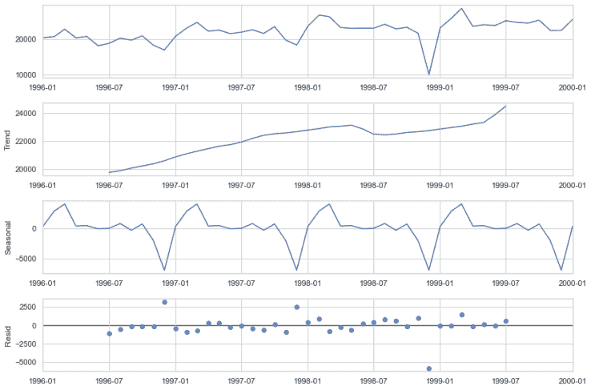
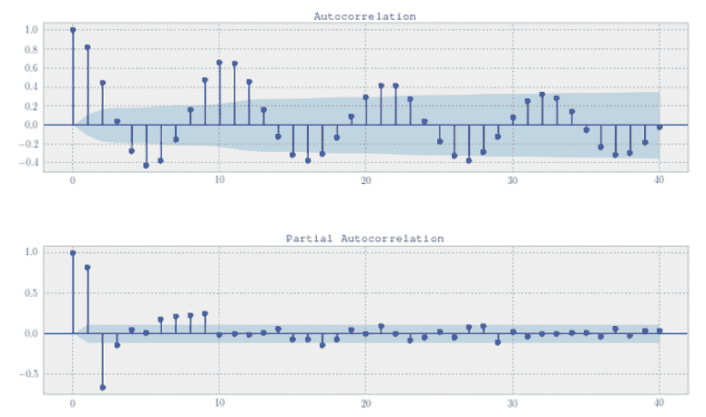

# 时间序列预测:与其他机器学习有何不同？[ML 工程师解释]

> 原文：<https://web.archive.org/web/https://neptune.ai/blog/time-series-prediction-vs-machine-learning>

时间序列是每个数据科学家/ML 工程师在其职业生涯中都会遇到的问题，比他们想象的要多。所以，理解 in-out 是一个重要的概念。

你看，时间序列是一种基于时间维度(如日、月、年等)进行采样的数据。我们将该数据称为“动态的”，因为我们已经基于日期时间属性对其进行了索引。这给了数据一个隐含的顺序。不要误解我的意思，静态数据仍然可以有一个 DateTime 值的属性，但是不会基于该属性对数据进行采样或索引。

当我们对时间序列数据应用机器学习算法并希望对未来的日期时间值进行预测时，例如，在给定过去 5 年的数据的情况下预测 2 月份的总销售额，或者在给定几年的天气数据的情况下预测某一天的天气。这些对时间序列数据的预测被称为**预测。**这与我们处理**静态** **数据**时形成对比。

在这篇博客中，我们将讨论:

## 

*   1 时间序列预测(即预测)与静态机器学习预测有何不同？
*   2 时间序列预测的最佳实践

## 时间序列数据与静态 ML

到目前为止，我们已经建立了一个基线，与静态数据相比，我们应该如何看待时间序列数据。在本节中，我们将讨论处理这两种类型数据的不同之处。

***注*** *:为了简单起见，我们假设数据在所有情况下都是连续的。*

### 缺失数据的输入

缺失数据的插补是任何表格机器学习项目中的关键预处理步骤。在静态数据中，使用简单插补等技术，可以根据属性的性质用数据的平均值、中间值和众数填充缺失数据，或者使用更复杂的方法，如最近邻插补，使用 KNN 算法识别缺失数据。

然而，在时间序列中，缺失数据看起来像这样:

*Time-series – missing data | [Source](https://web.archive.org/web/20221201172104/https://jagan-singhh.medium.com/missing-data-in-time-series-5dcf19b0f40f)*

数据中存在这些明显的缺口，这些缺口无法用任何可用于静态数据的插补策略进行逻辑填补。让我们讨论一些有用的技巧:

*   为什么不用卑鄙来填充呢？静态平均值在这里对我们没有任何好处，因为通过从未来获取线索来填补你缺失的值是没有意义的。在上面的图中，很直观地可以看出，2001-2003 年之间的差距在逻辑上只能用历史数据来填补，即 2001 年之前的数据。

    在时间序列数据中，我们使用所谓的滚动平均值或移动平均值或窗口平均值，这是对属于预定义窗口(如 7 天窗口或 1 个月窗口)的值取平均值。因此，我们可以利用这个移动平均值来填补时间序列数据中任何缺失的空白。

    ***注*** *:在处理时间序列数据中的平均值时，平稳性起着重要的作用。*

*   ****插值法非常流行**** :利用时间序列数据的隐含顺序，插值法通常是设计时间序列数据中缺失部分的首选方法。简而言之，插值使用缺失点之前和之后的值来计算缺失的数据。例如，线性插值通过计算两点之间的直线，对它们求平均，从而得到缺失的数据。

    有许多类型的插值可用，如线性，样条，Stineman。它们的实现在几乎所有的主要模块中都有给出，比如 python 的 pandas [interpolate()](https://web.archive.org/web/20221201172104/https://pandas.pydata.org/docs/reference/api/pandas.Series.interpolate.html) 函数和[R impute 时序包](https://web.archive.org/web/20221201172104/https://cran.r-project.org/web/packages/imputeTS/vignettes/imputeTS-Time-Series-Missing-Value-Imputation-in-R.pdf)。

    虽然，插值也可以用在静态数据中。然而，它没有被广泛使用，因为在静态数据中有更复杂的插补技术(其中一些已经在上面解释过了)。

*   **理解业务用例:**这不是任何处理缺失数据的技术方法。但是我觉得这是最被低估的可以快速产生效果的技术。这包括理解手头的问题，然后设计出最有效的方法。毕竟，在你的用例中，SOTA 可能不是 SOTA。例如，销售数据应该与股票数据区别对待，两者有不同的市场指标。
    顺便说一下，这种技术在静态数据和时间序列数据中很常见。

### 时间序列模型中的特征工程

处理要素是区分时序数据和静态数据的另一个重要步骤。特征工程是一个广义的术语，它包含了各种标准技术和特别方法。与静态数据相比，时间序列数据中的特征处理方式有所不同。

***注:**有人可能会认为插补属于特征工程，这并没有错，但我想在单独的章节中解释这一点，让你有一个更好的想法。*

在静态数据中，对于手头的问题来说，这是非常主观的，但是一些标准技术包括特征变换、缩放、压缩、标准化、编码等。

除了基于时间的特征之外，时间序列数据还可以具有其他属性。如果这些属性是基于时间的，那么产生的时间序列将是多元的，如果是静态的，那么产生的将是具有静态特征的单变量。非基于时间的特性可以利用静态技术中的方法，而不会妨碍数据的完整性。

所有基于时间的组件都有一个确定的模式，可以使用一些标准技术来设计。让我们来看看在处理基于时间的要素时证明有用的一些技术。

#### 时序组件:时序数据的主要特征是什么

首先，每个时间序列数据都有时间序列成分。我们做了一个 STL 分解(使用黄土的季节和趋势分解)来提取这些成分。让我们来看看这些都意味着什么。

*Example of an STL decomposition | [Source](/web/20221201172104/https://neptune.ai/blog/anomaly-detection-in-time-series)*

*   **趋势:**时间序列数据表示一种趋势，其值随时间变化不定，增加的值表示正趋势，减少的值表示负趋势。在上图中，你可以看到一个积极的增长趋势。
*   **季节性**:季节性是指时间序列的一种属性，表现为以恒定频率重复的周期性模式。在上面的例子中，我们可以观察到频率为 12 个月的季节性成分，这大致意味着周期性模式每 12 个月重复一次。
*   **余数:**从数据中提取趋势和季节性后，剩下的就是我们所说的余数(误差)或残差。这实际上有助于时间序列中的异常检测。
*   **周期:**当趋势没有固定的重复或季节性时，时间序列数据被称为周期数据。
*   **平稳性:**当时间序列数据的统计特征不随时间变化时，即均值和标准差不变时，时间序列数据是平稳的。协方差与时间无关。

这些成分被提取出来后，通常构成了时序数据特征工程下一步的基础。从静态数据的角度来看，STL 分解是时间序列世界的描述部分。在处理股票数据时，还有一些特定于时间序列的指标受时间序列数据类型的影响，如*虚拟变量*。

时间序列组件对于分析感兴趣的时间序列变量非常重要，以便了解其行为、模式，并能够选择和拟合适当的时间序列模型。

### 时间序列模型中的分析和可视化

#### 分析

时间序列数据分析与静态数据分析有着不同的蓝图。正如上一节所讨论的，时间序列分析从回答如下问题开始:

*   这个数据有趋势吗？
*   这些数据包含任何类型的模式或季节性吗？
*   数据是平稳的还是非平稳的？

理想的情况是，在找到上述问题的答案后，必须进一步进行分析。与此类似，静态数据分析也有一些程序，如**描述性**、**预测性**、**规定性**。尽管描述性是所有问题陈述的标准，但预测性和规定性是主观的。这些过程在时间序列和静态 ML 中都是常见的。然而，在描述性、预测性和说明性中使用的许多指标有不同的用法，其中之一是**相关性**。

相反，在时间序列数据中，我们使用所谓的**自相关**和**偏相关**。自相关和偏自相关都是当前和过去序列值之间关联的度量，并指示哪些过去的序列值在预测未来值时最有用。

*An example ACF and PACF plot in time-series | [Source](https://web.archive.org/web/20221201172104/https://stats.stackexchange.com/questions/139796/autocorrelation-and-partial-correlation-plots-in-arma-models)*

虽然这两种数据的分析方法有些不同，但核心思想是相同的，这在很大程度上取决于问题陈述。例如，股票和天气数据都是时间序列，但是您可以使用股票数据来预测未来值，使用天气数据来研究季节模式。同样，使用贷款数据，你可以用它来分析借款人的模式，或者检查新借款人是否会拖欠贷款还款。

#### 形象化

可视化是任何分析不可或缺的一部分。不同的问题不是你应该想象什么，而是你应该如何想象。

你看，时间序列数据的基于时间的特征应该被可视化，图的一个轴是时间，而非基于时间的特征受制于解决问题所采用的策略。

*An example visualization of time-series | [Source](https://web.archive.org/web/20221201172104/https://www.stat.pitt.edu/stoffer/tsa4/tsgraphics.htm)*

## 时间序列预测与静态最大似然预测

在上一节中，我们看到了与初始步骤相关的两种数据类型之间的差异，以及在比较两者时方法的差异。在本节中，我们将探讨接下来的步骤，即**预测**或时间序列方面的**预测**。

### 算法

时间序列数据中算法的选择与静态数据中的完全不同。可以外推模式并封装训练数据域之外的时序组件的算法可以被视为时序算法。

现在，大多数静态机器学习算法，如线性回归、支持向量机，都没有这种能力，因为它们为任何新的预测概括了训练空间。他们只是不能表现出我们上面讨论的任何行为。

用于时间序列预测的一些常用算法:

*   **ARIMA:** 代表自回归-积分-移动平均线。它利用自回归和移动平均的组合来预测未来值。点击了解更多[。](https://web.archive.org/web/20221201172104/https://otexts.com/fpp2/arima.html)
*   **EWMA/指数平滑:**指数加权移动平均或指数平滑作为移动平均的升级。它的工作原理是通过对最近发生的值施加更大的权重来减少移动平均线显示的滞后效应。点击了解更多[。](https://web.archive.org/web/20221201172104/https://otexts.com/fpp2/expsmooth.html)
*   **动态回归模型:**该算法还考虑了其他杂项信息，如公共假期、法律变化等。点击了解更多[。](https://web.archive.org/web/20221201172104/https://otexts.com/fpp2/dynamic.html)
*   **Prophet** : [Prophet](https://web.archive.org/web/20221201172104/https://facebook.github.io/prophet/) 由脸书核心数据科学团队发布，是脸书开发的一个开源库，旨在对单变量时间序列数据进行自动预测。
*   **LSTM** :长短期记忆(LSTM)是一种递归神经网络，可以学习序列中项目之间的顺序依赖关系。它常用于解决时间序列预测问题。

这个清单当然不是详尽无遗的。许多复杂的模型或方法，如[广义自回归条件异方差](https://web.archive.org/web/20221201172104/https://www.investopedia.com/terms/g/garch.asp) (GARCH)和[贝叶斯结构时间序列](https://web.archive.org/web/20221201172104/https://en.wikipedia.org/wiki/Bayesian_structural_time_series) (BS 时间序列)在某些情况下可能非常有用。还有像[神经网络自回归](https://web.archive.org/web/20221201172104/https://otexts.com/fpp2/nnetar.html) (NNAR)这样的神经网络模型，可以应用于使用滞后预测器的时间序列，并且可以处理特征。

### 时间序列模型中的评价指标

预测评估包括度量标准，如标度相关误差，如均方误差(MSE)和均方根误差(RMSE)，百分比误差，如平均绝对百分比误差(MAPE)，标度误差，如平均绝对标度误差(MASE)等等。这些指标实际上类似于静态 ML 指标。

然而，虽然评估指标有助于确定拟合值与实际值的接近程度，但它们不能评估模型是否适合时间序列。为此，我们做了一些叫做**残差诊断**的事情。详细了解[这里](https://web.archive.org/web/20221201172104/https://otexts.com/fpp2/residuals.html)。

### 处理异常值/异常情况

离群值困扰着几乎所有真实世界的数据。时间序列和静态数据从识别到处理异常值/异常值采取了两条完全不同的路线。

#### 识别

*   对于静态数据中的识别，我们使用从 Z 得分、箱线图分析到一些高级统计技术(如假设检验)的技术。
*   在时间序列中，我们使用了一系列的技术和算法，从 STL 分析到隔离森林等算法。你可以在这里阅读更多细节[。](/web/20221201172104/https://neptune.ai/blog/anomaly-detection-in-time-series)

#### 处理

*   我们在静态数据中使用诸如修整、基于分位数的下限和上限以及均值/中值插补等方法，具体取决于容量和手头的问题陈述。
*   在时间序列数据中，有许多选项对您的用例来说是高度主观的。其中一些是:
    *   **使用替换**:我们可以计算出可以替换离群值的值，并使其更适合数据。R 中的 tsclean()函数将使用黄土拟合稳健趋势(对于非季节性序列)，或者使用 STL 拟合稳健趋势和季节性分量(对于季节性序列)来计算替换值。
    *   **研究业务**:这不是一种技术方法，而是一种特别的方法。你看，识别和研究问题背后的业务真的可以帮助处理离群值。放弃或取代它是否是一个明智的选择，首先要从里到外研究它。

## 处理时序数据和预测时的最佳实践

虽然在处理时间序列和预测时没有固定的步骤可以遵循，但仍然有一些可以用来获得最佳结果的好方法。

1.  **没有放之四海而皆准的方法:**没有一种预测方法对所有时间序列都是最佳的。在开始预测之前，您需要了解问题陈述、功能类型和目标。您可以根据需要选择算法的一些领域(计算+目标):
    *   统计模型，
    *   机器学习，
    *   和混合方法。

2.  **特性选择**:特性的选择会影响最终的预测误差。换句话说，选择必须仔细进行。有不同的方法，如*相关性分析*，也称为*过滤器*、*包装器*(即迭代添加或移除特征)，以及嵌入(即选择已经是预测方法的一部分)。

3.  **应对过度拟合:**在模型训练期间，可能会出现过度拟合的[风险](/web/20221201172104/https://neptune.ai/blog/overfitting-vs-underfitting-in-machine-learning)，因为最佳模型并不总是导致最佳预测。为了解决过度拟合问题，可以将历史数据分为训练和测试数据，并进行内部验证。

4.  [**数据预处理**](/web/20221201172104/https://neptune.ai/blog/data-preprocessing-guide) :首先要对数据进行分析和预处理，使其干净，便于预测。数据可能包含缺失值，由于大多数预测方法无法处理缺失值，因此必须对值进行估算。

5.  **牢记维度的诅咒**:当训练中的模型呈现出许多维度和许多潜在因素时，它们可能会遇到*维度的诅咒*，这意味着当我们拥有有限数量的训练数据，并且我们向这些数据添加更多维度时，我们在准确性方面的回报开始递减。

6.  **使用季节性数据模式**:如果时间序列数据中存在季节性，则需要包含该季节性模式的多个周期才能做出正确的预测。否则，模型没有办法学习模式。

7.  **在进行预测之前处理异常现象**:异常现象会在模型学习中产生巨大的偏差，更常见的情况是结果总是低于标准。

8.  **仔细研究问题陈述**:这可能是最被低估的实践，尤其是当你刚刚开始处理一个时序问题的时候。确定基于时间和非基于时间的特征，在使用任何标准技术之前先研究数据。

## 你已经到达终点了！

我们成功地理解了时间序列和静态数据在结构和方法上的差异。本博客中列出的部分绝非详尽无遗。当我们针对每个领域中的具体数据问题进行更细致的分析时，可能会有更多的差异。在研究时间序列时，你可以参考以下一些我最喜欢的资源:

### 参考

1.  [https://cran . r-project . org/web/packages/input Time-Series/vignettes/input Time-Series-Time-Series-Missing-Value-插补-in-R.pdf](https://web.archive.org/web/20221201172104/https://cran.r-project.org/web/packages/imputeTS/vignettes/imputeTS-Time-Series-Missing-Value-Imputation-in-R.pdf)
2.  [https://neptune.ai/blog/anomaly-detection-in-time-series](https://web.archive.org/web/20221201172104/http://blog/anomaly-detection-in-time-series)
3.  [https://machine learning mastery . com/resample-interpolate-time-series-data-python/](https://web.archive.org/web/20221201172104/https://machinelearningmastery.com/resample-interpolate-time-series-data-python/)
4.  [https://otexts.com/fpp2/missing-outliers.html](https://web.archive.org/web/20221201172104/https://otexts.com/fpp2/missing-outliers.html)
5.  [https://otexts.com/fpp2/stl.html](https://web.archive.org/web/20221201172104/https://otexts.com/fpp2/stl.html)
6.  [https://otexts.com/fpp2/arima.html](https://web.archive.org/web/20221201172104/https://otexts.com/fpp2/arima.html)
7.  [https://otexts.com/fpp2/expsmooth.html](https://web.archive.org/web/20221201172104/https://otexts.com/fpp2/expsmooth.html)
8.  [https://www . advancing analytics . co . uk/blog/2021/06/22/10-难以置信的有用时间序列预测算法](https://web.archive.org/web/20221201172104/https://www.advancinganalytics.co.uk/blog/2021/06/22/10-incredibly-useful-time-series-forecasting-algorithms)
9.  [https://www . analyticsvidhya . com/blog/2021/05/detecting-and-treating-outliers-treating-the-odd-one-out/](https://web.archive.org/web/20221201172104/https://www.analyticsvidhya.com/blog/2021/05/detecting-and-treating-outliers-treating-the-odd-one-out/)
10.  [https://otexts.com/fpp2/missing-outliers.html](https://web.archive.org/web/20221201172104/https://otexts.com/fpp2/missing-outliers.html)
11.  [https://www . rdocumentation . org/packages/forecast/versions/8.3/topics/ts clean](https://web.archive.org/web/20221201172104/https://www.rdocumentation.org/packages/forecast/versions/8.3/topics/tsclean)
12.  [https://www . research gate . net/publication/332079043 _ Best _ Practices _ for _ Time _ Series _ Forecasting _ Tutorial _ Paper](https://web.archive.org/web/20221201172104/https://www.researchgate.net/publication/332079043_Best_Practices_for_Time_Series_Forecasting_Tutorial_Paper)
13.  [https://www.anodot.com/blog/time-series-forecasting/](https://web.archive.org/web/20221201172104/https://www.anodot.com/blog/time-series-forecasting/)