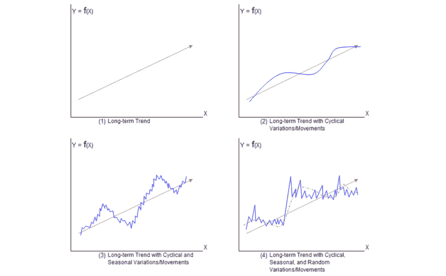
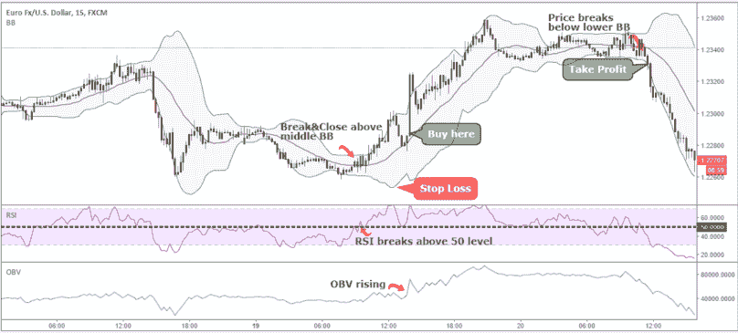
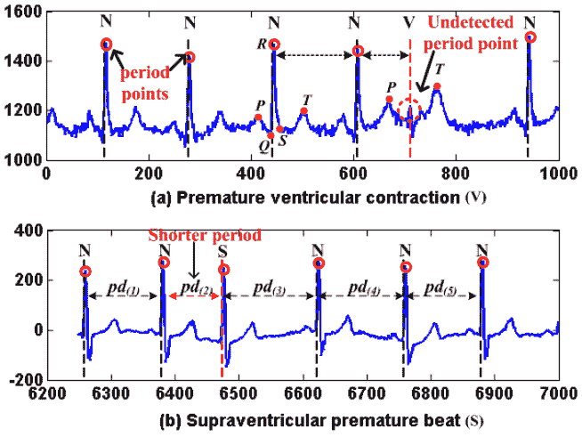
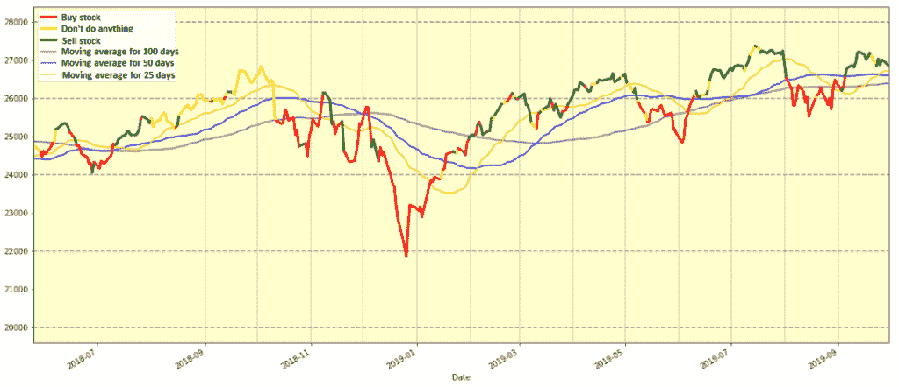
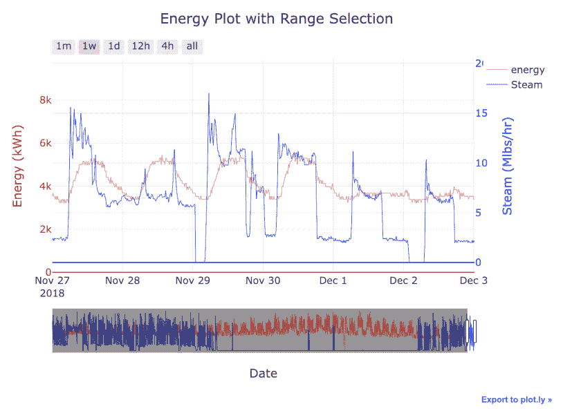
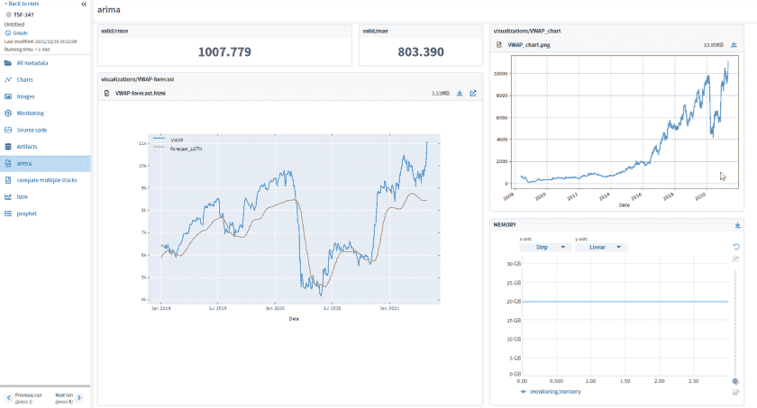
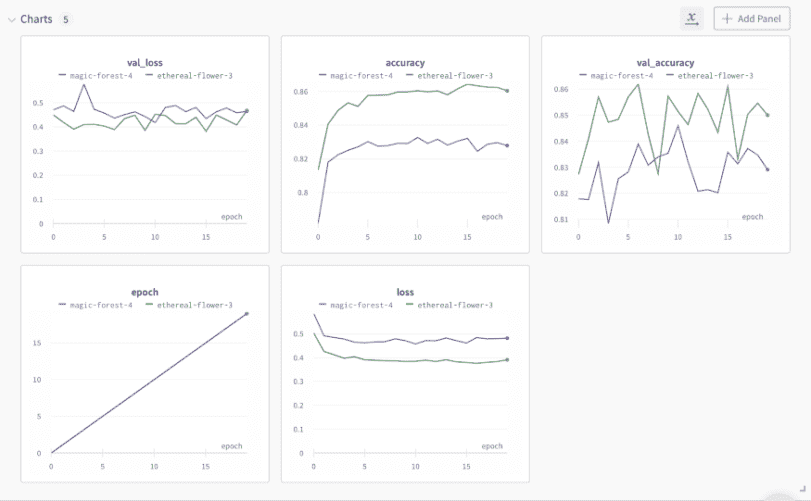
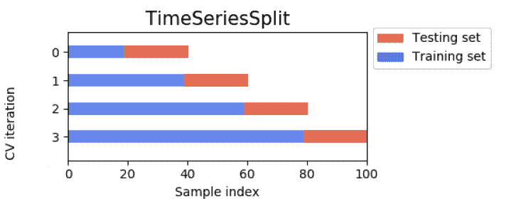
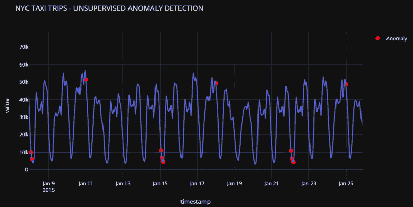

# 时序项目:有帮助的工具、包和库

> 原文：<https://web.archive.org/web/https://neptune.ai/blog/time-series-tools-packages-libraries>

既然你在这里，你大概知道[时间序列数据和静态 ML 数据](/web/20220926092103/https://neptune.ai/blog/time-series-prediction-vs-machine-learning)有点不同。因此，当从事时间序列项目时，数据科学家或 ML 工程师通常会使用特定的工具和库。或者他们使用众所周知的工具，这些工具已经被证明可以很好地适应时间序列项目。

我们认为把这些工具集中在一个地方会很有用，所以我们来了。这篇文章是一个时间序列工具和软件包的数据库。其中有些是众所周知的，有些可能对你来说是新的。希望你会发现整个列表有用！

在我们深入研究工具之前，让我们先了解一些基础知识。

什么是时间序列？

## 时间序列是按时间顺序排列的数据点序列。它是对同一变量在连续时间点的观察。换句话说，这是一组在一段时间内观察到的数据。

数据通常被绘制成图表上的一条线，x 轴是时间，y 轴是每个点的值。此外，时间序列有四个主要组成部分:

1 趋势

## 2 季节变化

*   3 周期性变化
*   4 不规则或随机变化
*   **趋势**简单来说就是数据在许多时期内的总体变化方向，它是数据的长期模式。趋势通常会出现一段时间，然后消失或改变方向。例如，在金融市场中,“看涨趋势”表示金融资产价格总体上升的上升趋势，而“看跌趋势”表示价格下降。
*   广义而言，时间序列的趋势可以是:

**上升趋势:**一个时间序列在一个观察周期内上升。

**下降趋势:**一个时间序列在一个观察周期内下降。

*   **恒定或水平趋势:**一个时间序列在一段观察时间内没有显著的上升或下降。
*   **季节性变化或季节性**是查看时间序列时要考虑的一个重要因素，因为它可以根据过去的数据提供未来可能发生的事情的信息。它是指一个或多个季节(如冬季和夏季)中某个度量值的变化，但也可能是每天、每周或每月的变化。例如，温度具有季节性，因为夏季较高，冬季较低。
*   与季节性变化相反，**周期性变化**没有精确的时间段，可能会有一些时间漂移。例如，金融市场倾向于在高值和低值之间循环，但是在它们之间没有预先确定的时间段。此外，一个时间序列可以有季节性和周期性的变化。例如，众所周知，房地产市场有周期性和季节性模式。季节性模式显示，春季的交易量比夏季多。循环模式反映了人们的购买力，这意味着在危机中，与繁荣时期相比，销售会减少。

**不规则或随机变化**是在趋势、季节和周期成分被去除后剩下的。因此，它也被称为剩余成分。这是一个完全随机且无法预测的时间序列中的非系统部分。

In contrast to seasonal variations, **cyclic variations** don’t have precise time periods and might have some drifts in time. For instance, financial markets tend to cycle between periods of high and low values, but there is no predetermined period of time between them. Besides that, a time series can have both seasonal and cyclic variations. For instance, it’s known that the real estate market has both cyclic and seasonal patterns. The seasonal pattern shows that there are more transactions in the spring rather than in the summer. The cyclic pattern reflects the purchasing power of the people, which means that in a crisis there are fewer sales in contrast to the time when there is prosperity.

一般来说，时间序列经常被用于许多领域，如经济学、数学、生物学、物理学、气象学等。具体来说，时间序列数据的一些例子是:

道琼斯工业平均指数价格

*Time series components |*[*Source*](https://web.archive.org/web/20220926092103/https://itfeature.com/time-series-analysis-and-forecasting/components-of-time-series)

纽约市的气温

*   比特币价格
*   心电图信号
*   术语 MLOps 的 Google 趋势
*   美国的失业率
*   通过时间和类似的网站流量
*   在本文中，我们将看看前面提到的几个例子。
*   时序项目示例

股票市场预测

## [股票市场预测](/web/20220926092103/https://neptune.ai/blog/predicting-stock-prices-using-machine-learning)是一个具有挑战性和吸引力的话题，其主要目标是开发预测未来股票价格的不同方法和策略。有很多不同的技术，从经典的算法和统计方法到复杂的神经网络架构。共同点是它们都利用不同的时间序列来实现准确的预测。业余投资者、金融科技初创公司和大型对冲基金广泛使用股市预测方法。

### 在实践中使用股市预测方法的方式有很多，但最流行的可能是交易。证券交易所的自动交易数量正在上升，据估计，美国证券交易所交易的股票中约有 75%来自算法系统。预测股票未来表现的方法主要有两种:基本面分析和技术分析。

**基本面分析**着眼于公司的财务报表、管理和行业趋势等因素。此外，它还考虑了一些宏观经济指标，如通货膨胀率、国内生产总值、经济状况等。所有这些指标都与时间有关，因此可以用时间序列来表示。

与基本面分析相反，**技术分析**利用交易量、价格变化的模式以及来自市场本身的其他信息来预测股票未来的表现。投资者在做出投资决定之前了解这两种方法是很重要的。

比特币价格预测

比特币是一种价格大幅波动的数字货币。它也是世界上最不稳定的资产之一。比特币的价格是由供求决定的。当对比特币的需求增加时，价格就会上涨，当需求下降时，价格就会下跌。随着近年来需求的增加，价格也在上涨。由于其非常不稳定的性质，预测比特币的未来价格是一项非常具有挑战性的任务。

总的来说，这个问题和股市预测很像，几乎可以用同样的方法来解决。甚至比特币也被证明与标准普尔 500 和道琼斯等指数相关。这意味着，在某种程度上，比特币的价格跟随上述指数的价格。你可以在这里了解更多信息:

*Technical indicators example |* [*Source*](https://web.archive.org/web/20220926092103/https://tradingstrategyguides.com/best-combination-of-technical-indicators/)

### 心电图异常检测

心电图[异常检测](/web/20220926092103/https://neptune.ai/blog/anomaly-detection-in-time-series)是一种检测心电图异常的技术。心电图是一种监测心脏电活动的测试。基本上，它是由心脏产生的电信号，并表示为时间序列。

ECG 异常检测是通过比较 ECG 的正常模式和异常模式来完成的。心电图中有许多类型的异常，它们可以分类如下:

### **心率异常:**这是指心率偏离正常范围的任何变化。这可能是由于心脏的问题或刺激方式的问题。

**心律异常:**心律异常是指任何与其正常模式不同的心律变化。这可能是由于脉冲通过心脏传导的方式有问题，或者脉冲通过心脏传导的速度有问题。

在这个课题上已经做了很多工作，从学术研究到商用心电图机，都有一些很有前景的成果。最大的问题是，该系统应该具有高水平的准确性，并且不应该有任何假阳性或假阴性。这是由于问题的性质和错误预测的后果。

*   **Heart rate anomalies: ** this refers to any change in heart rate from its normal range. This may be due to a problem with the heart or a problem with how it is being stimulated.
*   既然现在我们已经有了一些关于时间序列在行业中的重要性的背景知识，那么让我们来看看一些流行的工具、包和库，它们对任何时间序列项目都是有帮助的。此外，由于大多数与时间序列相关的数据科学和机器学习项目都是用 Python 完成的，因此讨论 Python 支持的工具是有意义的。

我们将主要从四个类别来讨论工具:

*ECG anomalies detection |* [*Source*](https://web.archive.org/web/20220926092103/https://www.researchgate.net/figure/Two-examples-of-local-anomaly-in-ECG-time-series_fig1_292077185)

1 数据准备和特征工程工具

2 数据分析和可视化包

## 3 实验跟踪工具

*   4 时间序列预测包
*   时间序列的数据准备和特征工程工具
*   数据准备和特征工程是数据科学管道中两个非常重要的步骤。数据准备通常是任何数据科学项目的第一步。它是将数据转换成可用于分析和进一步处理的形式的过程。
*   特征工程是从原始数据中提取特征以使其对建模和预测更有用的过程。下面，我们将提到一些用于这些任务的最流行的工具。

### 熊猫时间系列项目

Pandas 是一个用于数据操作和分析的 Python 库。它包括数据结构和处理数字表格和时间序列的方法。此外，它还包含用于处理所有领域的时间序列数据的广泛功能和特性。

它支持各种文件类型的数据输入，包括 CSV、JSON、Parquet、SQL 数据库表和查询以及 Microsoft Excel。此外，Pandas 允许各种数据操作特性，如合并、整形、选择以及数据清理和争论。

#### 一些有用的时间序列特征是:

日期范围生成和频率转换

移动窗口统计

移动窗口线性回归

*   日期转换
*   滞后和更多
*   时间序列的更多相关内容可在下面找到:
*   使用 NumPy 的时序项目
*   NumPy 是一个 Python 库，它增加了对巨大的多维数组和矩阵的支持，以及可能在这些数组上使用的大量高级数学函数。它有一个与 MATLAB 非常相似的语法，包括一个高性能的多维数组对象以及处理这些数组的功能。

NumPy 的 datetime64 数据类型和数组可以非常紧凑地表示时间序列中的日期。使用 NumPy 还使得使用线性代数运算进行各种时间序列运算变得简单。

#### NumPy 文档和教程:

带日期时间的时序项目

Datetime 是一个 Python 模块，它允许我们处理日期和时间。本模块包含处理以下情况所需的方法和功能:

日期和时间的表示

#### 日期和时间的算术

日期和时间的比较

*   使用这个工具处理时间序列很简单。它允许用户将日期和时间转换成对象并操纵它们。例如，只需几行代码，我们就可以将一种日期时间格式转换为另一种格式，添加到日期的天数、月数或年数，或者计算两个时间对象之间的秒差。
*   关于如何开始学习本模块的有用文档:
*   使用 Tsfresh 的时间序列项目

Tsfresh 是一个 Python 包。它自动计算大量的时间序列特征，称为特征。该软件包将统计学、时间序列分析、信号处理和非线性动力学中的既定算法与稳健的特征选择算法相结合，以提供系统的时间序列特征提取。

Tsfresh 包包含一个过滤过程，以防止提取不相关的特征。这个过滤过程评估每个特征对回归或分类任务的解释能力和重要性。

#### 高级时间序列功能的一些示例如下:

傅立叶变换分量

小波变换

部分自相关和其他

*   有关 Tsfresh 软件包的更多信息，请参见以下内容:
*   时间序列的数据分析和可视化软件包
*   数据分析和可视化包是帮助数据分析师根据数据创建图形和图表的工具。数据分析被定义为对数据进行清理、转换和建模的过程，目的是发现对商业决策有用的信息。数据分析的目标是从数据中提取有用的信息，并根据这些信息做出决策。

数据的图形表示被称为数据可视化。数据可视化工具使用图表和图形等可视化元素，提供了一种查看和理解数据趋势和模式的简单方法。

### 有各种各样的时间序列数据分析和可视化软件包，我们将浏览其中的几个。

使用 Matplotlib 的时序项目

可能最流行的数据可视化 Python 包是 Matplotlib。它用于创建静态、动画和交互式可视化。使用 Matplotlib 可以做一些事情，例如:

制作适合出版的情节

#### 创建可以放大、平移和更新的交互式图形

更改视觉样式和布局

*   此外，它还为绘制时间序列图表提供了各种选项。更多信息请点击下面的链接:
*   Create interactive figures that can be zoomed in, panned, and updated
*   使用 Plotly 的时间序列项目

Plotly 是一个用于 Python 和 r 的交互式、开源和基于浏览器的图形库。它是一个高级的、声明性的图形库，有 30 多种图表类型，包括科学图表、3D 图表、统计图表、SVG 地图、金融图表等等。

除此之外，使用 Plotly 还可以绘制基于时间序列的交互式图表，如线条、gantts、散点图等。文档中提供了关于此包的更多信息:

*Example of the Matplotlib chart with time series | Source: Author*

#### Time series projects with Plotly

具有统计模型的时间序列项目

Statsmodels 是一个 Python 包，它提供了用于估计各种统计模型以及运行统计测试和统计数据分析的类和函数。

我们将在关于预测的章节中更详细地介绍这个库，但这里值得一提的是，它为时间序列分解及其可视化提供了一个非常方便的方法。有了这个软件包，我们可以很容易地分解任何时间序列，并分析其组成部分，如趋势，季节性成分，残差或噪音。教程中对此有更多描述:

*Example of the Plotly chart with time series |* [*Source*](https://web.archive.org/web/20220926092103/https://willkoehrsen.github.io/python/data%20visualization/introduction-to-interactive-time-series-visualizations-with-plotly-in-python/)

#### 时间序列的实验跟踪工具

实验跟踪工具通常是高级工具，可用于各种目的，如跟踪实验结果，显示如果改变实验中的参数会发生什么，模型管理等。

它们通常比低级包更加用户友好，并且在开发机器学习模型时可以节省大量时间。这里只提到其中的两个，因为它们很可能是最受欢迎的。

### 对于时间序列，有一个方便的环境来跟踪定义的度量和超参数尤其重要，因为我们很可能需要运行许多不同的实验。通常，与一些卷积神经网络相比，时间序列模型并不大，并且作为输入，具有几百或几千个数值，因此模型训练得相当快。此外，它们通常需要相当长的时间来进行超参数调整。

最后，在一个地方连接来自不同包以及可视化工具的模型是非常有益的。

使用 Neptune.ai 的时间序列项目

Neptune.ai 是一个由超过 20，000 名数据科学家、机器学习工程师和研究人员使用的实验跟踪工具。它为在单一位置组织和控制模型提供了一个方便的界面。

有了 Neptune.ai，就有可能

#### 记录关于每个模型的数据集、参数和代码的信息。

将所有的指标、图表和任何其他 ML 元数据组织在一个地方。

轻松的可重复模型训练并进行比较。

*   备份云上的所有内容。
*   将它与超过 25 个库集成，如 PyTorch、TensorFlow、Matplotlib 等。
*   对于任何类型的数据，时间序列也不例外，任何包含时间序列的项目都可以在 Neptune.ai 上跟踪。
*   处理时间序列时有用的资源:
*   具有权重和偏差的时间序列项目

weights & bias(W & B)是一个机器学习平台，类似于 Neptune.ai，旨在帮助开发者更快地建立更好的模型。它旨在支持和优化关键的 MLOps 生命周期步骤，如模型管理、实验跟踪和数据集版本控制。

*Example Neptune.ai dashboard for a time series run |* [*Source*](https://web.archive.org/web/20220926092103/https://app.neptune.ai/o/common/org/project-time-series-forecasting/e/TSF-247/dashboard/arima-563f8dae-919a-43a1-a7a7-bc472220444b)

它只为个人项目提供有限的免费选项，而其他选项每月 50 美元起。作为 Neptune.ai，这个工具在处理时间序列项目时非常有用，为跟踪和管理时间序列模型提供了有用的功能。

#### Time series projects with Weights & Biases

他们的[文档](https://web.archive.org/web/20220926092103/https://docs.wandb.ai/)中提供了更多关于权重和偏差的信息。

时间序列预测包

时间序列项目最重要的部分可能是预测。预测是根据当前和过去的数据预测未来事件的过程。这是基于未来可以从过去实现的假设。此外，它还假设数据中有一些模式可以用来预测接下来会发生什么。

*ML experiment tracking with Weights and Biases |* [*Source*](https://web.archive.org/web/20220926092103/https://towardsdatascience.com/a-guide-to-ml-experiment-tracking-with-weights-biases-93a3a2544413)

时间序列预测有许多方法，从简单的线性回归和基于 ARIMA 的方法，到复杂的多层神经网络或集成模型。在这里，我们将展示一些支持不同类型模型的包。

### 基于统计模型的时间序列预测

Statsmodels 是一个包，我们已经在关于数据可视化工具的部分提到过。但是，这是一个更适合预测的软件包。基本上，这个软件包提供了一系列的统计模型和假设检验。

Statsmodels 包还包括用于时间序列分析的模型类和函数。自回归移动平均模型(ARMA)和向量自回归模型(VAR)是基本模型的例子。马尔可夫转换动态回归和自回归是非线性模型的例子。它还包括时间序列描述统计，如自相关，部分自相关函数，周期图，以及 ARMA 或相关过程的理论性质。

#### 下面介绍了如何使用 Statsmodels 包开始使用时间序列:

Pmdarima 时间序列预测

Pmdarima 是一个统计库，它使用基于 arima 的方法为时间序列建模提供了便利。除此之外，它还有其他功能，例如:

平稳性和季节性的一组统计检验

#### 各种内源和外源变换，包括 Box-Cox 和傅立叶变换

季节性时间序列的分解、交叉验证工具和其他工具

*   也许这个库最有用的工具是 Auto-Arima 模块，它在提供的约束条件下搜索所有可能的 Arima 模型，并根据 AIC 或 BIC 值返回最佳模型。
*   有关 Pmdarima 的更多信息，请参见:
*   用 Sklearn 进行时间序列预测

Sklearn 或 Scikit-Learn 肯定是 Python 中最常用的机器学习包之一。它提供了各种分类、回归和聚类方法，包括随机森林、支持向量机、k-means 等。除此之外，它还提供了一些与降维、模型选择、数据预处理等相关的实用工具。

除了各种模型之外，对于时间序列，还有一些有用的功能，如管道、时间序列交叉验证功能、测量结果的各种度量标准等。

#### Time series forecasting with Sklearn

关于这个库的更多信息可以在下面找到:

用 PyTorch 进行时间序列预测

PyTorch 是一个基于 Python 的深度学习库，用于快速灵活的实验。它最初是由脸书人工智能研究团队的研究人员和工程师开发的，然后开源。深度学习软件如 Tesla Autopilot、优步的 Pyro 和 Hugging Face 的 Transformers 都建立在 PyTorch 之上。

*Time series split using Sklearn |* [*Source*](https://web.archive.org/web/20220926092103/https://datascience.stackexchange.com/questions/41378/how-to-apply-stacking-cross-validation-for-time-series-data)

使用 PyTorch，可以建立强大的递归神经网络模型，如 LSTM 和 GRU，并预测时间序列。此外，还有一个 PyTorch 预测包，具有最先进的网络架构。它还包括一个时间序列数据集类，抽象处理变量转换、缺失值、随机子采样、多个历史长度和其他类似问题。关于这一点的更多信息如下:

#### 基于张量流的时间序列预测

TensorFlow 是一个用于机器学习的开源软件库，基于数据流图。它最初由 Google Brain 团队开发，供内部使用，但后来作为开源项目发布。该软件库提供了一组高级数据流运算符，这些运算符可以组合起来以自然的方式表达涉及多维数据数组、矩阵和高阶张量的复杂计算。它还提供了一些底层原语，比如内核，用于构造自定义操作符或加速常见操作的执行。

Keras 是一个构建在 TensorFlow 之上的高级 API。使用 Keras 和 TensorFlow 可以为时间序列预测建立神经网络模型。下面的教程解释了使用天气时间序列数据集的时间序列项目的一个示例:

#### 利用 Sktime 进行时间序列预测

Sktime 是一个用于时间序列和机器学习的开源 Python 库。它包括有效解决时间序列回归、预测和分类任务所需的算法和转换工具。创建 Sktime 是为了与 scikit-learn 一起工作，并使其易于为相关的时间序列任务调整算法以及构建复合模型。

总的来说，该套件提供:

#### 时间序列预测的最新算法

时间序列的转换，如去趋势化或去季节化等

模型和转换的管道，模型调整工具，以及其他有用的功能

*   下面介绍了如何开始使用该库:
*   用 Prophet 进行时间序列预测
*   Prophet 是由脸书的核心数据科学团队发布的开源库。简而言之，它包括一个用于预测时间序列数据的程序，该程序基于一个加法模型，该模型将几个非线性趋势与年度、周和日季节性以及假日效应结合起来。它最适用于具有强烈季节性影响的时间序列和多个季节的历史数据。它能够处理缺失数据、趋势变化和异常值。

关于先知图书馆的更多信息如下:

#### 用 Pycaret 进行时间序列预测

PyCaret 是 Python 中的一个开源机器学习库，可以自动化机器学习工作流。使用 PyCaret，可以用最少的工作和几行代码构建和测试几个机器学习模型。

基本上，用最少的代码，不深究细节，就可以构建一个从 EDA 到部署的端到端的机器学习项目。

#### 这个库有一些有用的时间序列模型，其中包括:

季节性天真预测者

ARIMA

多项式趋势预测器

*   套索网有去季节化和去趋势化选项和许多其他选项
*   ARIMA
*   有关 PyCaret 的更多信息，请点击此处:
*   用 AutoTS 进行时间序列预测

AutoTS 是 Python 的时间序列包，旨在自动进行时间序列预测。它可用于寻找单变量和多变量时间序列的最佳时间序列预测模型。此外，AutoTS 本身会清除任何 NaN 值或异常值。

*Anomaly detection using PyCaret | [Source](https://web.archive.org/web/20220926092103/https://towardsdatascience.com/time-series-anomaly-detection-with-pycaret-706a6e2b2427)*

近 20 个预定义的模型，如 ARIMA，ETS，VECM 可用，并使用遗传算法，为给定的数据集找到最佳的模型，预处理和集成。

#### 关于这个包的一些教程是:

用飞镖进行时间序列预测

Darts 是一个 Python 库，允许对时间序列进行简单的操作和预测。它包括各种各样的模型，从经典的 es 和 ARIMA 到 RNN 和变形金刚。所有模型的使用方式都与 scikit-learn 包中的方式相同。

该库还允许对模型进行简单的回溯测试，合并来自多个模型的预测，以及合并外部数据。它支持单变量和多变量模型。所有可用型号的列表以及几个示例可在此处找到:

#### 基于 Kats 的时间序列预测

Kats 是由脸书基础设施数据科学团队发布的软件包，旨在执行时间序列分析。这个包的目标是提供时间序列分析所需的一切，包括检测、预测、特征提取/嵌入、多变量分析等等。

Kats 提供了一套全面的预测工具，如集成、元学习模型、回溯测试、超参数调整和经验预测区间。此外，它还包括检测时间序列数据中的季节性、异常值、变化点和缓慢趋势变化的功能。使用 TSFeature 选项，可以生成 65 个具有清晰统计定义的特征，这些特征可用于大多数机器学习模型。

#### 关于 Kats 包的更多信息描述如下:

预测库比较

为了便于比较预测包并有一个高层次的概述，下面是一个具有一些共同特征的表格。它显示了一些指标，如 GitHub 星级、发布年份、支持特性等。

More about Kats package is described below:

发行年份

GitHub stars

统计学和计量经济学

机器学习

深度学习

✅ ✅

深度学习:

✅

Statistics & econometrics:

深度学习:

✅

Statistics & econometrics:

统计学&计量经济学:

统计学&计量经济学:

Statistics & econometrics:

✅

深度学习:

✅

Statistics & econometrics:

深度学习:

✅

Statistics & econometrics:

✅

深度学习:

Statistics & econometrics:

✅

Statistics & econometrics:

✅

深度学习:

Statistics & econometrics:

结论

Statistics & econometrics:

在这篇文章中，我们描述了时序项目最常用的工具、包和库。有了这个工具列表，就有可能涵盖几乎所有与时间序列相关的项目。除此之外，我们还提供了预测库的比较，显示了一些有趣的统计数据，比如发布年份、流行程度以及它支持哪种模型。

如果您想更深入地了解时间序列领域，可以使用一组不同的包来处理时间序列:“ [Github:使用 Python 处理时间序列数据](https://web.archive.org/web/20220926092103/https://github.com/MaxBenChrist/awesome_time_series_in_python)”。

## 对于那些想从理论上了解更多时间序列的人来说，Helmut Lütkepohl 教授的书《多时间序列分析新入门》是一个很好的选择。

你搞砸了

Enes 是一名拥有三年多经验的数据科学家。Enes 在数学、计算机科学和机器学习方面有很强的背景，并且热衷于学习和探索与机器学习相关的任何领域。你可以在 Linkedin 上和他联系。

**阅读下一篇**

### 使用机器学习预测股票价格

9 分钟阅读|作者凯瑟琳(易)李| 2022 年 1 月 25 日更新

* * *

**READ NEXT**

## 众所周知，股票市场是不稳定的，动态的，非线性的。由于多种(宏观和微观)因素，如政治、全球经济状况、意外事件、公司财务表现等，准确的股价预测极具挑战性。

但是，所有这些也意味着有大量的数据可以从中发现模式。因此，金融分析师、研究人员和数据科学家不断探索分析技术，以检测股市趋势。这就产生了算法交易的概念，它使用自动化的、预编程的交易策略来执行订单。

在本文中，我们将使用传统的量化金融方法和机器学习算法来预测股票走势。我们将讨论以下主题:

股票分析:基本面与技术面分析

作为时间序列数据的股票价格及相关概念

用移动平均技术预测股票价格

*   LSTMs 简介
*   用 LSTM 模型预测股票价格
*   对新方法的最终想法，如 ESN
*   Introduction to LSTMs 
*   Predicting stock prices with an LSTM model
*   Final thoughts on new methodologies, such as ESN

[Continue reading ->](/web/20220926092103/https://neptune.ai/blog/predicting-stock-prices-using-machine-learning)

* * *