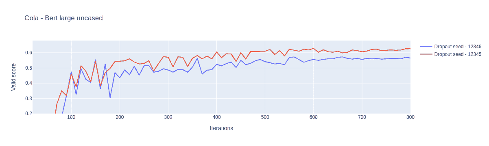
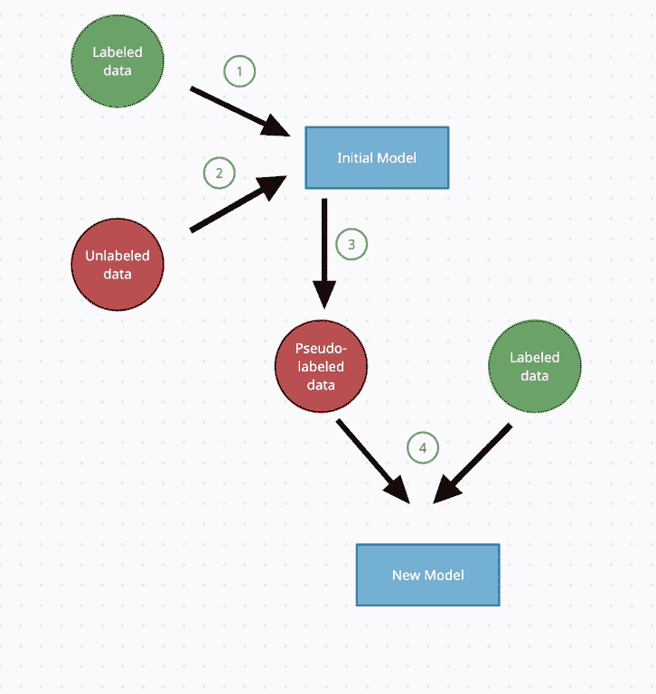
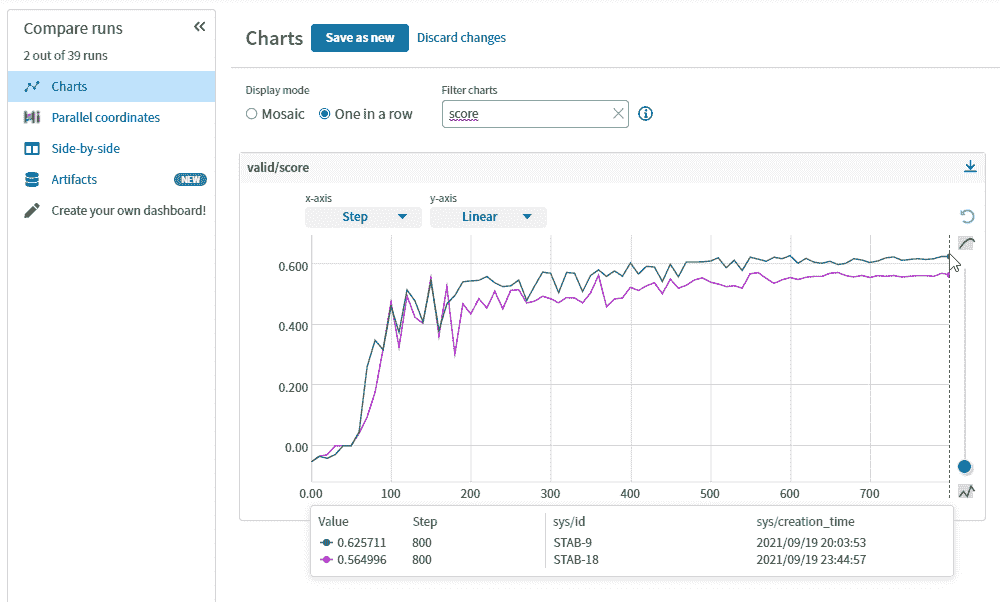

# 训练最先进的 NLP 模型的技巧和诀窍

> 原文：<https://web.archive.org/web/https://neptune.ai/blog/tips-to-train-nlp-models>

这是基于最先进的变压器的时代 [NLP 模型](/web/20221206035207/https://neptune.ai/blog/10-nlp-projects)。随着 [huggingface](https://web.archive.org/web/20221206035207/https://huggingface.co/transformers/) 推出像变形金刚这样的软件包，为任何给定的任务训练 NLP 模型变得非常方便。但是，当每个人都在做同样的事情时，你如何获得额外的优势呢？如何从模特身上获得让你脱颖而出的额外表现？

在本文中，我将讨论一些方法、技巧和诀窍，它们可以帮助您在自然语言处理(NLP)项目中实现这一目标。

但是在此之前，让我们讨论一下 transformer 模型以及在训练它们时出现的挑战。

## 最先进的变压器模型

转换器是一种深度学习模型，它使用一堆编码器和解码器来处理输入数据。它使用注意机制对输入序列数据进行加权。

基于变压器的模型可以大致分为:

*   [自回归模型](https://web.archive.org/web/20221206035207/https://huggingface.co/transformers/model_summary.html?highlight=summary#autoregressive-models):这些模型依赖于变换器的解码器部分，并使用注意屏蔽，使得在每个位置，模型只能看到当前记号之前的记号。例如，GPT。
*   [自动编码模型](https://web.archive.org/web/20221206035207/https://huggingface.co/transformers/model_summary.html?highlight=summary#encoders-or-autoencoding-models):这些模型依赖于转换器的编码器部分，不使用注意屏蔽，因此模型可以看到输入序列中的所有其他标记。比如伯特。
*   [序列到序列](https://web.archive.org/web/20221206035207/https://huggingface.co/transformers/model_summary.html?highlight=summary#sequence-to-sequence-models):型号同时使用变压器的编码器和解码器部分。

Transformers 可用于各种各样的 NLP 任务，如**问题回答、序列分类、命名实体识别**等。基于 transformer 的模型带来的性能也带来了一些其他挑战，如**高计算量、对更大数据集的需求、训练样本中令牌数量的限制、训练不稳定性**等。

你如何应对这些挑战？你可以用什么方法、技巧和窍门来训练最先进的 NLP 模型？

## 技巧 NLP 的迁移学习

将知识从一个模型转移到另一个模型的过程称为迁移学习。有几个任务中可用于训练的数据量非常少。由于现在使用的深度神经网络的参数数量非常大，它们非常渴望训练数据，并且很难用小的训练数据集训练出概括良好的模型。在这种情况下，迁移学习可以解决问题。

我们可以在有大量训练数据可用的类似任务上训练这些深度模型，然后使用学习到的参数对可用训练数据稀缺的目标任务进行进一步训练。通过这样做，模型的表现要比从头开始训练时好得多。有效利用迁移学习有两种可能性。就像烘烤前预热烤箱一样，我们可以在有大量训练数据的相关任务上训练模型，然后:

*   **特征提取器**:我们可以使用这个预训练的模型作为特征提取器(因此冻结模型的参数),并为我们的特定任务训练另一个简单的线性模型，该模型具有少得多的可用训练数据。
*   **微调**:或者我们可以替换特定于任务的层，以适应我们的特定任务，并继续训练整个模型。因此，基本上，预训练模型的最终参数值被用作我们特定任务训练的初始起点。

好了，我们现在熟悉了[迁移学习](https://web.archive.org/web/20221206035207/https://machinelearningmastery.com/transfer-learning-for-deep-learning/)的概念，它广泛应用于计算机视觉任务，如图像分割、物体检测等。但是这对 NLP 有用吗？如何在 NLP 中应用同样的概念？

为了回答这些问题，OpenAI 的研究人员发现，在文章 [**中介绍的 **transformer 模型**是您所需要的全部注意力**](https://web.archive.org/web/20221206035207/https://arxiv.org/abs/1706.03762) **，**在大型数据语料库(如维基百科或图书语料库数据)上为**语言建模任务**进行预训练时，是将学习转移到各种 NLP 任务的理想选择。*语言建模*是给单词序列分配概率，并根据之前的单词上下文预测即将出现的单词的任务。前馈神经语言模型是标准的前馈网络，其在时间“ **t** 将一定数量的先前单词的表示作为输入，并输出可能的下一个单词的概率分布。

## 技巧 2:训练中的不稳定性

微调变压器模型的最大挑战之一是不稳定的训练。随着训练中的微小变化，例如改变随机种子，变压器模型收敛到完全不同的结果，这种现象就是我们所说的不稳定训练。不稳定的培训在工业界和学术界都是一个非常重要的问题。由于这种不稳定性，从业者经常使用不同的随机种子进行多次训练，并评估每 n 次迭代(是的，你没看错，不是每 n 个时期，而是每 n 次迭代)，其中 n 可以低至 5 次迭代，并保存最佳模型。所有这些因素都大大增加了培训时间、成本和维护费用。

这是一个在 CoLA 数据集上训练了两次的 bert-large-uncased 模型的截图。只有应用于模型的丢弃的随机种子从 12345 变化到 12346，我们注意到性能从 0.56 变化到 0.62。请随意使用我们在 [Neptune dashboard 中的日志对此进行更深入的研究。](https://web.archive.org/web/20221206035207/https://app.neptune.ai/vignesh-baskaran/stabilizer/experiments?split=tbl&dash=charts&viewId=standard-view)

*Comparison of validation scores with different seeds*

如此剧烈的不稳定性使得科学比较变得不可能。因此，研究人员正在研究使训练稳定的技术。这个问题没有通用的解决方法，但是有一些技术可以提供一些有希望的解决方案。我们已经在一个名为 Stabilizer 的开源包中实现了其中的一些技术。你可以在这里 [找到它](https://web.archive.org/web/20221206035207/https://github.com/flowerpot-ai/stabilizer)[。](https://web.archive.org/web/20221206035207/https://github.com/flowerpot-ai/stabilizer)接下来，我们将向您展示一些减轻这种不稳定训练的技巧。

### 重新初始化

在该技术中，变换器编码器模型的最后 n 层被重新初始化。这种技术背后的想法是，由于这些变压器模型是在 MLM 和 NSP 任务上预先训练的，更接近输出的变压器的顶层学习预先训练特定于任务的参数，这些参数可能不是最适合我们自己的任务。因此，更接近输出的最后 n 层被重新初始化。这里有[伪代码](https://web.archive.org/web/20221206035207/https://gist.github.com/shahules786/c60e1432e6d8b51d4176b244fba33781)向你展示它是如何做到的。如果你想用一个方便的函数来做这件事，那么请使用[稳定库](https://web.archive.org/web/20221206035207/https://github.com/flowerpot-ai/stabilizer/blob/master/examples/cola.ipynb)。

### 分层学习率衰减

一般来说，神经网络是用应用于其所有层的统一学习速率来训练的。但是当预训练的变压器模型的顶层学习对于它被预训练的任务来说是理想的参数时，它们不提供用于微调的好的初始点。

为了减轻这种情况，我们可以对转换器的每一层应用不同的学习率。例如，我们可以对顶层应用非常高的学习率，而对底层应用小得多的学习率。为了用一个超参数轻松控制学习速率，我们使用了一种叫做**分层学习速率衰减**的技术。在这种技术中，当我们从顶层移动到底层时，我们以指数方式降低学习速率。这样，与可跨任务转移的较低层相比，针对 MLM 或 NSP 目标预先训练的顶层的参数变化很快。这里是[伪代码](https://web.archive.org/web/20221206035207/https://gist.github.com/shahules786/1cf3bd3f987f91a012edcf2c10c32bf9)，向你展示它是如何做到的。如果你想用一个方便的功能来做到这一点，那么请使用[稳定库](https://web.archive.org/web/20221206035207/https://github.com/flowerpot-ai/stabilizer/blob/master/examples/cola.ipynb)。

## 技巧 4:用未标记的文本数据进行预训练

现在让我们来看看一些可以用来预训练模型的目标。正如我们之前看到的，在 GPT 的情况下，模型基于变压器解码器，而在 [BERT](/web/20221206035207/https://neptune.ai/blog/unmasking-bert-transformer-model-performance) 的情况下，模型基于变压器编码器。

### 掩蔽语言模型目标

当用屏蔽语言模型目标进行预训练时，该模型被训练成基于单词的左右上下文来预测单词。为了用 MLM 目标进行训练，随机屏蔽一小部分输入标记，即，用特殊的[屏蔽]标记替换要屏蔽的标记。

### 因果语言模型目标:

当用语言模型目标进行预训练时，该模型被训练成在给定左上下文中的单词的情况下预测句子中的下一个单词。

用于预训练变压器模型的另一个常见任务是下一句预测(NSP)。在 NSP，该模型可以接受由特殊符号[SEP]分隔的一对句子作为输入，并预测二进制标签。训练数据集通过采用文档的语料库来准备，然后句子标记器将文档标记成句子。为了建立一个平衡的数据集，50%的句子时间对是从相互跟随的实际句子中创建的，而另外 50%的时间随机句子被配对在一起。这里有一个[示例代码](https://web.archive.org/web/20221206035207/https://github.com/VigneshBaskar/sota_nlp/blob/master/unlabeled_pretraining.ipynb)向您展示它是如何完成的。

## 技巧 5:用标签数据进行预训练

在上面的部分中，我们看到了基于 transformer 的模型是如何在任务独立的 LM 目标上使用文本语料库进行预训练的。这不会帮助模型学习特定于任务的特征。这造成了预训练和微调之间的差距。为了解决这个问题，我们可以进行特定任务的预训练或使用标记数据的预训练。

在这种方法中，我们在相似的数据集上训练变压器完成相似的任务。然后，我们使用这些训练好的权重来初始化模型权重，并在我们的特定任务数据集上进一步训练模型。该概念类似于计算机视觉中的转移学习，其中我们使用来自在类似任务上训练的一些模型的模型权重来初始化权重。这里你必须调整你想要初始化权重的层数。这项技术的主要挑战是找到解决类似任务的类似数据集。

让我们整合一下完成此任务的步骤:

1.  选择基本变压器型号。让我们说，伯特
2.  查找与给定任务和数据匹配的外部数据集。
3.  在外部数据集上训练基础模型并保存模型权重。
4.  使用这些训练的模型权重再次初始化基础模型。
5.  现在，针对给定的任务，使用您的数据集训练该模型。
6.  调整初始化的层数以获得更好的性能。

这里有[伪代码](https://web.archive.org/web/20221206035207/https://gist.github.com/shahules786/02d8159326cf1714241b8f9ca57930f5)向你展示它是如何做到的。

对未标记数据的预训练仅帮助模型学习一般语言领域特定的特征。与使用未标记的数据进行预训练相比，使用标记的数据进行预训练使模型学习到更多特定于任务的特征。

## 技巧 6:伪标签

在任何深度学习模型中提高泛化能力和鲁棒性的一个简单方法是使用更多的数据进行模型训练。大多数情况下，您可以访问一些您可以使用的未标记的数据，但是标记它是一项缓慢的任务。这时伪标签就大有帮助了。

伪标记是一种**半监督方法，将大量未标记数据与标记数据相结合，用于模型训练**。在这种方法中，我们不是手动标记未标记的数据，而是使用一个经过训练的模型来近似标记，然后将这个新标记的数据与训练集一起输入，以重新训练模型。

*Flowchart for pseudo labeling | Source: Author*

我们现在可以合并**步骤来进行伪标记**:

1.  用训练数据训练和评估初始模型
2.  收集未标记的数据用于伪标记
3.  使用初始模型对未标记的数据进行预测
4.  组合训练集和新标记的数据，并用该集训练新模型。

如果您正在为分类任务进行训练，您可以使用模型的**置信度(预测概率)对伪标签数据进行采样。假设您使用初始二元分类器模型对 1000 个样本的未标记数据进行预测。在此之后，您已经预测了所有这些样本的概率，从中您可以使用大于 0.95 的置信度筛选出样本。通过这样做，您可以减少伪标记过程中可能出现的噪声。**

影响模型性能的另一个因素是**采样率**，采样率是用于伪标记的未标记样本的百分比。您可以通过在保留的验证数据集上绘制**采样率与评分度量图来调整采样率。**

如果您使用 K-fold 方法来训练和评估您的模型，请确保在应用伪标记时没有**数据泄漏。假设您在训练集上训练了一个 5 折叠模型，该模型使用 5 个折叠中的每一个在未标记的数据上创建伪标签。最后，如果您聚合这 5 个折叠预测以创建伪标记数据集并重新训练该模型，则验证分数将会过于乐观，因为用于创建伪标记的 5 个模型中有 4 个在训练时也看到了来自该验证集的样本。为了避免这种间接的数据泄漏，在每个折叠中独立地进行**伪标记和再训练。****

## 技巧 7:实验跟踪对变压器培训的重要性

让我们承认我们都经历过电子表格噩梦。10 年前，当模型简单而确定时，实验记录表还可以。但是在当今世界，我们处理的模型有几百万个(例如，BERT 基本模型有 1.1 亿个参数，BERT 大型模型有 3.45 亿个参数)，有些事情很容易出错。正如我们之前看到的，由于变压器模型训练的不稳定性，可视化验证模型并比较运行中的配置以清楚地了解实验之间的差异非常重要。

因此，实验跟踪可以帮助我们做以下重要的事情:

### 对结果进行目视检查

这是我们在 Kaggle Commonlit 可读性数据集上训练一个模型时获得的两次训练运行的截图。当我们仔细观察时，我们可以注意到，其中一次运行比另一次运行多训练了几次迭代，在训练结束时，模型的性能急剧上升。鉴于 transformer 模型是如此脆弱，实验跟踪仪表板立即允许我们观察这种异常行为，并且通过它们的配置和代码跟踪功能，我们可以很容易地对此进行调查。

*Validation scores with and without SWA*

### 训练运行的比较

使用任何可用的[实验跟踪工具](/web/20221206035207/https://neptune.ai/blog/best-ml-experiment-tracking-tools)，如 Neptune、Wandb 或 Comet，你可以比较关于你正在跟踪的不同指标的不同实验。我们不再需要编写脚本来保存、跟踪和读取配置文件或实验日志，以便对结果进行深入分析。快速进行比较所需的大多数选项都可以通过几次点击获得，因此我们可以交互式地运行分析和训练模型。使用 Neptune 的最大优势之一是，它使这个过程变得非常容易，只需按一下按钮，就能生成视觉上吸引人的图表。下面是 Neptune 的截图，它向我们揭示了哪个参数影响了模型的性能。

*Comparing different experiments in Neptune | [See in the app](https://web.archive.org/web/20221206035207/https://app.neptune.ai/vignesh-baskaran/stabilizer/experiments?compare=JwGmQ&split=cmp&dash=charts&viewId=standard-view&sortBy=%5B%22parameters%2Fdropout_seed%22%5D&sortFieldType=%5B%22int%22%5D&sortFieldAggregationMode=%5B%22auto%22%5D&sortDirection=%5B%22ascending%22%5D&suggestionsEnabled=true&lbViewUnpacked=true&chartFilter=)*

鉴于我们可以通过几行代码获得所有这些好处，训练大型 transformer 模型变得轻而易举！这是海王星项目的链接。快来看看！

## 结论

训练 NLP 模型的 SOTA 就像是在冒险乘坐过山车。该领域正在急剧发展，研究人员每天都在发现新的技巧来可靠地训练这些模型。虽然本文中提到的大多数技巧和诀窍都是高级概念，但我们希望本文中提到的伪代码可以作为一个良好的起点，来提高您当前的 NLP 模型的性能。我们希望通过这篇文章，你能够掌握很好的技术和工具，自信地训练和跟踪稳定的最先进的 NLP 模型。