# ML 模型治理、起源和谱系的最佳工具

> 原文：<https://web.archive.org/web/https://neptune.ai/blog/tools-for-ml-model-governance-provenance-lineage>

ML 软件开发复杂；建立一个 ML 模型是一回事，改进和维护它是另一回事。如果你想让你的机器学习模型健壮、合规，并给出可重现的结果，你必须在质量模型管理上投入时间和金钱。

模型治理、模型起源和模型沿袭工具通过跟踪模型活动、记录数据和模型中的所有变更，以及概述数据管理和处理的最佳实践来帮助您做到这一点。

在本帖中，让我们讨论一下这些工具是什么，以及如何选择最好的工具。虽然这三种实践的目的不同，但它们有很多共同点。因此，一个对模型治理有益的工具，通常对其他两个也是有益的。

我将引导您了解一些在开发人员中最流行的模型治理工具，并解释您应该根据您的特定用例选择哪一个。

## 什么是模型治理？

[模型治理](https://web.archive.org/web/20221206003956/https://www.afponline.org/ideas-inspiration/topics/articles/Details/model-governance-and-model-risk-management/#:~:text=Model%20governance%20is%20a%20set,risk%20management%20activities%20for%20implementation.&text=Model%20risk%20refers%20to%20the,model%20development%2C%20inputs%20or%20outputs.)，正如您可能从术语中理解的那样，是一组实践和技术，用于控制模型开发和实现的过程。任何 ML 模型都必然符合某些期望。它们应该满足技术要求，符合法律要求，并且不存在任何道德问题。

### 为什么要建模治理？

部署模型后，现实世界中的结果与您预期的大相径庭，这是很常见的。为了理解哪里可能出错并快速修复，您需要模型治理。

你一定很熟悉关于 ML 模型，尤其是深度学习模型的‘黑盒’这个术语。它们被描述为神秘的，无法调试的。然而，一旦您有了曾经发生的所有修改的目录，确保模型的正常运行就变得容易多了。

例如，在过去几年中，一个引起社区强烈反对的常见问题是，模型在获得美联储有偏见的数据时会产生有偏见的结果。亚马逊人工智能招聘系统经常被引用为有偏见的人工智能的一个例子。这个系统会惩罚简历中包含“女性”一词的人，就像“女子象棋俱乐部”一样，因为从历史上看，男性占据了大多数职位。

如果你不想让你的公司和亚马逊、谷歌和脸书一样被列入“黑名单”，这些公司因其歧视性的模式而受到广泛批评，那么跟踪数据漂移、异常和偏差的能力可能是有益的。

此外，偏见并不是你的模型可能面临的唯一问题。另一个挑战是保证模型的安全性，尤其是当我们谈论企业级公司时。如果一个模型意外地暴露给你公司内部的另一个部门或者第三方，会有很多不确定性。例如，模型可能被篡改，这可能会给企业带来风险。

### 模型治理的好处

模型治理有明显的好处。然而，从零开始实施并不总是容易的。你需要首先回顾 ML 团队的工作流程，以评估有效性和成本需求。关于模型治理实现最重要的事情是一致性。您必须在所有模型和部门中使用模型治理，而不仅仅是针对少数业务单元。标准化是有效模型治理的关键。

## 什么是模型出处？

[模型起源](https://web.archive.org/web/20221206003956/https://www.sciencedirect.com/science/article/pii/S1364815216308398)与模型治理过程紧密相连，并描述了模型的起源和应用于它的处理步骤。

### 为什么要对出处建模？

通常，在您开始使用 ML 模型之前，您必须准备训练数据，这些数据必须沿着机器学习开发管道经历一个漫长的转换过程。数据起源的想法是跟踪转换的每一步:数据来自哪里，谁改变了它，以及以什么方式改变了它。数据获取、合并、清理和特征提取属于数据起源的范畴。

### 模型起源的好处

在最终版本部署之前，模型会经历很多变化。这个过程通常包括对不同的 ML 技术和架构进行实验，以获得最佳结果。你不能总是预测你的下一个方法是否会有成果。如果没有模型的检查点，很难回到最佳性能点。模型起源工具帮助您跟踪所有的输入(包括数据)、超参数、依赖性等等。

记录所有这些事情可能是一个解决方案，但是对于大型项目来说不是很方便。此外，人为因素总是会将您的模型出处置于风险之中:开发人员经常忘记记录一些小东西，比如元数据注释，他们的疏忽会导致巨大的金钱损失。

因此，以模型起源工具的形式投资自动化解决方案是值得的。对公司特别有帮助，因为有助于提升知名度。你手头有你的模型的地图，可以忘记'[可见性债务](https://web.archive.org/web/20221206003956/https://hub.packtpub.com/technical-and-hidden-debts-in-machine-learning-google-engineers-give-their-perspective/)。

## 什么是模型血统？

[模型谱系](https://web.archive.org/web/20221206003956/https://blog.tail.digital/en/we-need-to-talk-about-model-lineage/#:~:text=Model%20Lineage%20keeps%20the%20history,of%20a%20model%20is%20generated.)是增强模型可见性的另一种技术。它可以检查模型的历史。如果您使用自动化工具，这是日常任务的强烈建议，记录将在每次新版本的模型被训练时自动生成。

模型沿袭工具允许您保留的信息包括用于构建模型的数据类型和算法、用于训练的管道以及所选参数。

### 为什么要模拟血统？

ML 模型开发是一个需要实验的领域。通常需要几周，甚至几个月的时间，才能得出模型配置和超参数的正确组合。通常，研究人员在迭代中工作，从模型的先前版本中保留最好的工作，并改变需要改变的内容。此外，通常会涉及许多训练数据集，这些数据集可以沿着 ML 开发管道进行更改。

当你最终确定模型的最终版本时，可能很难找到是什么改变促成了这一成功。然而，理解这一点很重要，这不仅是为了研究目的，也是为了模型的连续可再现结果。此外，研究人员通常作为团队的一部分工作，有时甚至与其他团队和部门合作。将记录保存在电子表格中不太可持续，也不太容易扩展。

当协作的需求增加时，使用版本控制工具来获得更好的模型可追溯性总是更好的。了解模型的历史使得实验结果具有可重复性，这在商业和学术领域都具有很高的价值。通过模型沿袭工具，可以追踪模型及其组件之间的关系，包括实验、数据集、容器等。它们有助于表示工件和核心之间的关联，并以直观、可视化的方式显示结构。

### 模型谱系的好处

模型血统对于任何公司的透明性和可追溯性都是至关重要的。今天，你的 ML 模型不能简单地代表一个“黑箱”。例如，如果第三方提出法律或道德问题，您将能够分享该模型的所有基本细节。你应该能够追溯到有问题的部分是由谁引入的，并且能够解释和修复它。

此外，模型血统在科学和商业中是至关重要的。你的模型显示的结果应该是可重复的。您的客户或您的同事应该能够运行该模型并获得相同的结果。当您拥有关于其历史和发展的所有数据时，构建和部署一个稳定的模型要容易得多。

既然模型治理、模型起源和模型传承之间的区别和相似之处已经很清楚了，那么让我们来讨论如何为您的公司选择正确的工具。

如果您已经决定转换到模型治理工具，您要做的第一件事就是不要联系软件供应商。事实上，这是你最不应该做的事情。以下是你可以一步一步做的事情:

*   **模型治理采用:**慢慢来，评估您的组织试图实现什么结果。最佳答案是具体的答案，例如，“交付高质量的数据以增加 X 千美元的收入”。你的里程碑应该是精确的和可测量的；只有这样，您才能在一段时间后监控您的模型治理采用的效率。
*   **运营模型发现:**运营模型是一种工具，它将帮助您概述与模型治理相关的角色、职责和业务术语。例如，它将建立数据所有者、决定公司应如何使用数据的个人以及负责数据收集和处理的数据管理员。您还需要开发一套数据治理策略，也就是您的团队必须遵循的规则。
*   **最佳工具的选择:**最佳的数据治理工具将尽可能自动化，并提供最大化的定制，因为每个公司都是不同的。不要害怕与供应商交谈，请他们演示他们的解决方案，并强调重要的功能。有备而来:你有自己的目标和需求，并询问产品将如何帮助你实现它们。

通常你不得不妥协。例如，包含您需要的所有功能以及更多功能的解决方案可能太贵了。在这种情况下，请考虑该零件对您的 ML 工程团队有多重要。提前对特性进行排序是很好的:对于一些团队来说，解决方案支持云是至关重要的；对其他人来说，不尽然。仅仅因为每个人都在云中工作并不意味着你必须这样做。

区分特性优先级的一个好方法是问你自己和你的团队你是否经常执行你想要自动化的任务。如果答案是否定的，也许手动实现它们的成本比自动化要低。

由于模型治理、模型起源和模型传承是紧密相连的，这里有一个统一的工具列表来帮助 ML 团队进行这些实践。

### 1.数据机器人

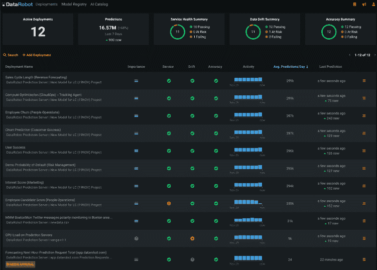

*You can easily set up model governance from the start with DataRobot | [Source](https://web.archive.org/web/20221206003956/https://www.datarobot.com/)*

许多人认为 DataRobot 是一个平台，业务分析师可以在没有深入编程知识的情况下构建预测分析解决方案。DataRobot 的一个关键特性是 AutoML，可以快速、轻松地生成模型。

不过 DataRobot 也为 MLOps 开发了可以和 DataRobot AI 云平台一起使用的产品。DataRobot MLOps 允许简化模型部署，并在其生命周期的每个阶段监控 ML 开发。以下是该工具的主要功能:

*   **角色和职责:** DataRobot 具有从一开始就建立模型治理并在模型生命周期中定义明确角色的必要功能。例如，您可以分配一个生产模型经理、模型管理员、模型验证者等等。您可以为每个角色添加描述，包括所需的资格或其他要求。每个用户可以被分配多个角色。
*   **访问控制:**您可能希望在不同部门甚至团队成员之间建立不同级别的访问控制。这将允许您保护模型环境，并使开发过程更加可控。通过 DataRobot，您可以使用基于角色的访问控制快速实现限制。
*   审计日志: DataRobot 有一个自动化的工具，它会记录所有的更改，以避免遗漏任何重要的内容。为了遵守法律法规，安全日志记录是必要的。它将允许您跟踪系统中的每个更改，并了解更改是何时由谁进行的，这使得故障排除更加容易。
*   **注解**:仅仅从日志记录来判断，理解变更的背景是有挑战性的。这就是为什么用户能够留下关于他们动机的笔记是至关重要的。在 DataRobot 中，用户可以轻松地为他们的操作添加注释，以获得更好的可解释性和透明度。
*   **模型谱系:**当你有了模型的演化历史，更新和维护它就变得容易了。DataRobot 为开发人员提供了跟踪模型历史的可能性，包括模型工件和变更日志。
*   **可追溯的结果:**您的模型提供给您的结果应该总是可追溯到模型版本。记录请求数据和对这些请求的响应值以及相关数据是必不可少的。如果您想要保持您的模型的可追溯性，尤其是如果您继续更新模型，请使用 DataRobot 的内置工具进行模型响应跟踪。
*   **生产模型生命周期管理:** DataRobot 可以在模型生命周期管理的每个阶段为您提供帮助。可以用来做模型再训练；该工具自动发现模型性能问题，并在投入生产之前开始测试过程。它还可以帮助您预热模型，并允许您将模型置于预热模式，以观察其在现实条件下的性能。

### 2.大太酷

[Dataiku](https://web.archive.org/web/20221206003956/https://www.dataiku.com/) 是一个用于数据处理、分析和机器学习的一站式平台。Dataiku 允许您创建、共享和重用使用数据和机器学习来扩展和自动化决策的应用程序。

Dataiku 还将自己定位为一个强大的模型治理工具，借助高级权限管理、SSO 和 LDAP 集成，帮助您管理风险并确保合规性。几个特性使得 Dataiku 成为模型治理的首选工具之一:

*   **监控&MLOps 中的漂移检测:**大台库可以为你监控模型的流水线，确保每个人都按计划进行。如果检测到任何异常，它将向工程师发送有关该问题的警报。它会自动检查评分数据和训练数据是否保持一致，以获得可靠的结果。

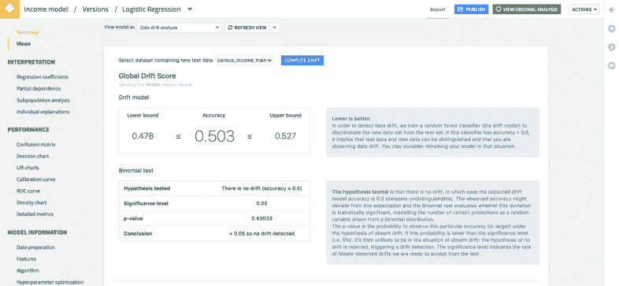

*Dataiku has in-built tools for monitoring and drift detection* *I [Source](https://web.archive.org/web/20221206003956/https://www.dataiku.com/)*

*   **自动模型文档:** Dataiku 通过使用标准模板的自动模型文档生成器，使模型文档更容易。它还跟踪模型版本，以减少协作模型开发中的任何差异。

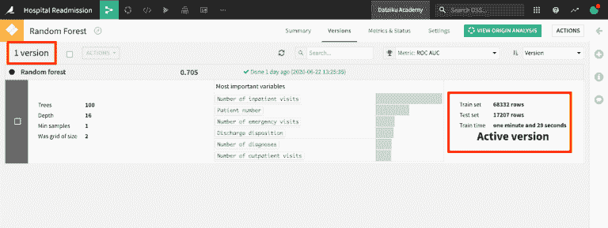

*Dataiku is a tool for automated documentation generation and version control I [Source](https://web.archive.org/web/20221206003956/https://www.dataiku.com/)*

*   **权限管理:**大台库允许您控制模型的可访问性。不同的用户角色对应不同的权限。团队成员可以属于多个用户组，并在不同的项目上拥有不同的权限。

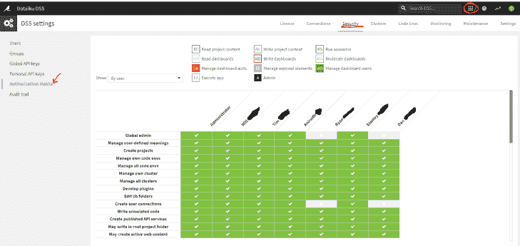

*Permission management with Dataiku I [Source](https://web.archive.org/web/20221206003956/https://www.dataiku.com/)*

*   **SSO 和 LDAP:** Dataiku 为用户认证提供了不同的选项。您可以集成单点登录或目录服务(SSO)，包括 LDAP 认证服务，如 Microsoft Active Directory。当您允许人们访问您的关键系统时，正确的身份认证是必不可少的，并且对于您的公司遵守内部和外部法规控制也是必要的。

*   **审计:** Dataiku 为所有用户活动创建日志，并为系统中的对象更改提供丰富的审计跟踪。如果出现任何问题，团队将很容易发现问题的根源，因为日志包含所有用户操作的数据，包括他们的 ID、IP 地址和身份验证方法。

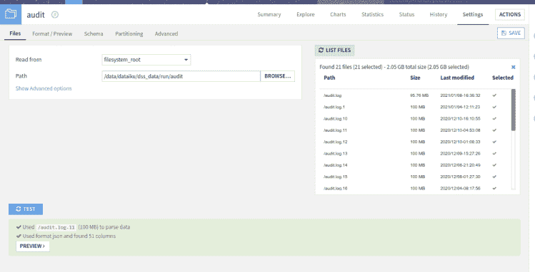

*Audit trail for increased traceability with Dataiku | [Source](https://web.archive.org/web/20221206003956/https://www.dataiku.com/)*

*   **安全的 API 访问:** Dataiku 通过提供 API 访问控制来增强灵活性。这将允许您为您的业务应用程序设计端点服务，如风险评估评分。API 密钥和多级认证安全 API 集成。

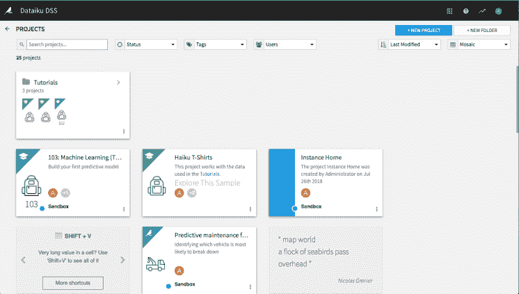

*Dataiku provides secure API access | [Source](https://web.archive.org/web/20221206003956/https://www.dataiku.com/)*

### 3.多米诺数据实验室

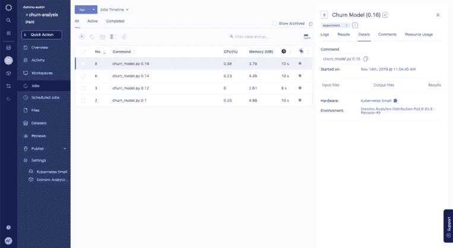

*Streamline model governance with Domino Data Lab platform | [Source](https://web.archive.org/web/20221206003956/https://www.dominodatalab.com/)*

[Domino Data Lab](https://web.archive.org/web/20221206003956/https://www.dominodatalab.com/) 是一个功能丰富的 MLOps 和模型监控中心。它通过支持企业范围的数据科学安全性来帮助企业成功扩展。

使用 Domino Data Lab，数据科学家可以很容易地在同一个平台上同时协作完成多个不同的项目。Domino Data Lab 没有在数据、工具或语言方面限制它们，所以它们不必遭受基础设施的摩擦。

*   **统一模型监控** : Domino Data Lab 让你在一个界面中轻松监控你的机器学习模型的不同方面。它自动检测变化，跟踪性能，并保留所有用户活动的记录。Domino Lab 甚至可以在业务受到严重影响之前排除潜在的问题。
*   **增强的可再现性**:由于 Domino Data Lab 自动跟踪代码、使用的工具、框架和包的变化，显示可再现的结果变得更加容易。您可以向客户端团队提供在他们那边部署模型或在将来更新模型所需的所有信息。
*   **企业级安全**:机器学习模型有一个复杂的架构，这使得它更难保护它们免受漏洞和恶意攻击。Domino Data Lab 提供了一个环境，在这个环境中，可定制的权限可以安全地保护每个数据科学操作、单点登录(SAML 或 OIDC)和凭证传播。
*   **可审计的环境:** Domino Data Lab 使监控模型如何随时间变化变得容易。它跟踪变更的历史，并使您能够追溯到管道的任何阶段，以满足必要的法规。****
*   **强大的集成:**该工具集成了许多流行的协作、数据科学和项目管理工具，如吉拉、谷歌云、AWS、英伟达等。

### 4.数据处理机

[Datatron](https://web.archive.org/web/20221206003956/https://www.datatron.com/) 是一个用于 AI 模型操作和模型治理的集中式平台。它将帮助您自动化模型部署、监控、治理，并跨不同部门标准化流程。

以下是 Datatron 对于模型治理的一些关键特性:

*   **Dashboard:** Dashboard 选项卡让您有机会概述 ML 模型的健康状况，而不必深入了解细节。您可以为模型调查设置定制的度量和参数。例如，您可以监控使用的 CPU、内存等。

*Monitor model health with Datatron dashboard I [Source](https://web.archive.org/web/20221206003956/https://datatron.com/)*

*   **健康度评分:**该功能自动评估模型的整体健康度，并以通俗易懂的方式展示。

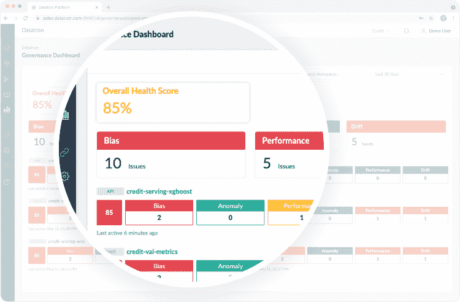

*Datatron scores the health of your model | [Source](https://web.archive.org/web/20221206003956/https://datatron.com/)*

*   ML 网关:在复杂的多组件项目中，这些网关可以改进模型和数据的编排。网关被设计为快速扩展并支持更多的用例，这样即使在经历活跃增长时，您的项目也能保持合规性。

*   **偏差、漂移、性能、异常检测**:偏差、漂移和异常如果未被宣布，会导致严重的问题。Datatron 具有强大的偏置监控功能。它的异常检测机制通过从多个来源收集数据、分析模型和系统日志来识别潜在问题，并向工程师发出警报。它还捕捉数据漂移，即模型部署后发生的数据变化。

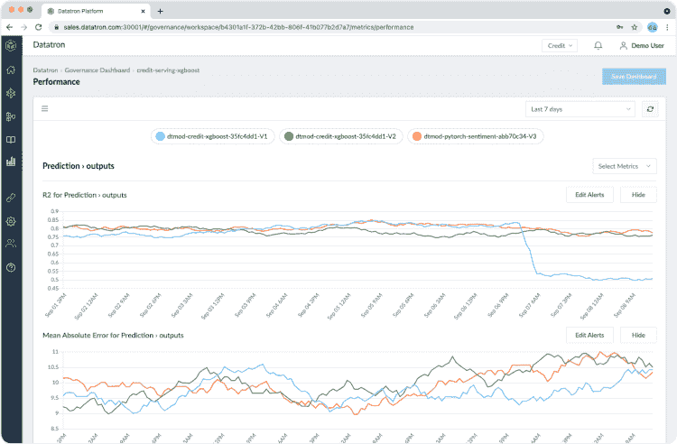

*You can easily conduct anomaly detection with Datatron | [Source](https://web.archive.org/web/20221206003956/https://datatron.com/)*

*   **自定义 KPI**:每个企业在实施模型治理策略时追求不同的目标。该功能允许公司定义自己的 KPI，设置阈值和警报。中央治理仪表板显示每个用户的 KPI。

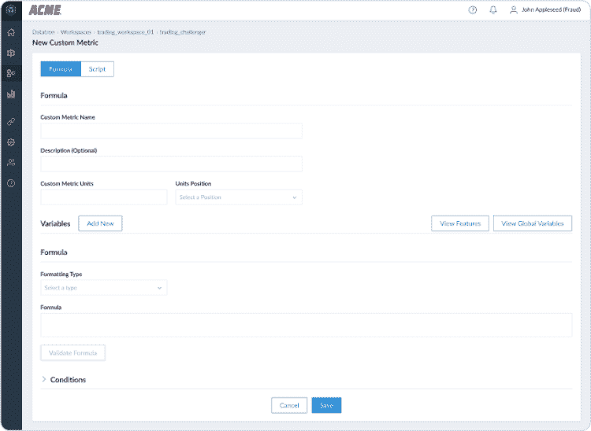

*Datatron allows companies to define their own KPIs | [Source](https://web.archive.org/web/20221206003956/https://datatron.com/)*

*   **警报**:如果出现问题，Datatron 会自动通知用户，例如，如果模型落后于性能阈值或发现数据异常。可以选择不同的沟通渠道，如电子邮件、Slack 或其他信使。

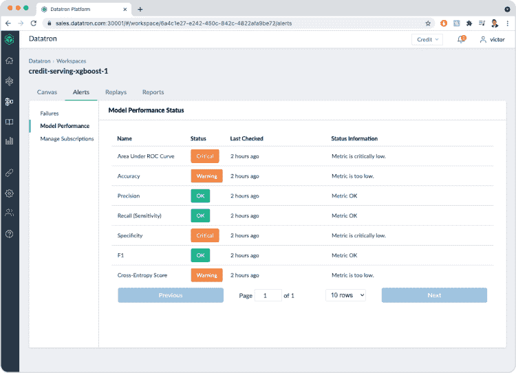

*Datatron sends alerts if the model doesn’t meet predefined KPIs | [Source](https://web.archive.org/web/20221206003956/https://datatron.com/)*

*   **可解释性:**模型治理和可解释性携手并进。Datatron 的可解释性管理功能包括监控模型，跟踪和可视化他们的见解，使用有效负载日志记录端点来捕获评分请求。这允许 L 团队增加涉众和用户对他们产品的信任。

*   **Jupyter 支持**:Datatron 一个令人兴奋的特性是支持 Jupyter 笔记本的直接导入。它们可以由数据科学家与当前模型一起运行，这有助于更快地进行实验，并简化假设的验证。

### 5.海王星

[Neptune.ai](https://web.archive.org/web/20221206003956/https://neptune.ai/) 是一个平台，使数据科学家和机器学习工程师能够管理他们所有的模型，并在一个地方构建、记录、存储和显示他们的 MLOps 元数据。它还提供了用于实验跟踪和模型注册的工具，这些工具对于从事研究和生产以及运行许多实验的团队来说是非常有用的。

海王星。人工智能并不是专门为模型治理而构建的。然而，它支持多种模型治理特性。如果您正在为一个小型或中型团队寻找一个工具，希望增强对模型开发的控制，这是正确的选择，因为该工具是轻量级的，并且易于理解。

以下是一些可能会让您考虑将 Neptune 用于模型治理的特性:

*   **了解模型是如何构建的:**当您将模型投入生产时，您希望确切了解它是如何构建的，这样您就可以对其结果的可重复性充满信心。Neptune.ai 允许你[精确地监控哪些工件被使用了](https://web.archive.org/web/20221206003956/https://docs.neptune.ai/you-should-know/displaying-metadata#artifacts)，它们在哪里，并且如果需要的话，允许未来的用户重新运行这个模型。
*   **打包、测试和评审新模型版本:**当您从数据科学家那里获得一个新模型时，您希望能够快速打包、测试和评审它，而不要浪费时间调整它以用于生产用途。该工具自动化了模型的打包和测试过程，并提供了[版本控制工具](https://web.archive.org/web/20221206003956/https://docs.neptune.ai/you-should-know/what-can-you-log-and-display#data-version-control-dvc)以方便部署。
*   **拥有完整的模型谱系和可追溯性:**当来自法律/合规/业务部门的人员要求进行生产模型审计时，您希望能够拥有完整的模型谱系，知道它是针对哪些数据进行培训的、由谁构建的、何时更新的。Neptune.ai 让你可以自信地向商业利益相关者展示这些信息。
*   **构建 MLOps 平台:**当您[为您的数据科学团队构建 MLOps 平台](/web/20221206003956/https://neptune.ai/mlops-tool-stack)时，您想要添加一个用于实验跟踪、模型注册、数据版本控制的组件，以便模型构建管道是可管理的、可复制的和符合规范的。所有这些都可以使用 Neptune.ai 平台访问，并且比使用企业级解决方案花费更少的时间进行微调。

### 6.权重和偏差

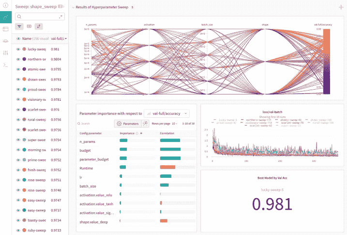

*Weights & Biases is a feature-rich tool for model governance, model lineage, and model provenance | [Source](https://web.archive.org/web/20221206003956/https://wandb.ai/site)*

[权重](https://web.archive.org/web/20221206003956/https://wandb.ai/site) [&偏差](https://web.archive.org/web/20221206003956/https://wandb.ai/site)是一个帮助 ML 团队用不同的超参数组合并行训练他们的模型的解决方案。

它也是一个有用的深度学习实验跟踪工具。您只需要编写模型训练的代码并调整超参数。解决方案将帮助您完成剩下的工作。它将管理批量和实时评估的生产节点的移动。原因有几个

*   **个性化的可共享仪表板**:在权重&偏好下，您可以轻松创建项目仪表板，并与其他利益相关者共享。您甚至可以安排仪表板更新，以便参与项目开发的每个人都可以看到您的工作成果并跟踪 KPI 合规性。
*   **简单协作:**这个工具是为满足企业级项目的需求而制作的。如果您使用数百个不同的数据集，并一遍又一遍地经历数据转换过程的各个步骤，那么对于您和您的团队来说，之后仍然很容易找到您想要的东西。
*   **权限控制:** W & B 允许你给不同的团队成员分配控制权，点击几下就能管理。这些权限包括项目的创建、修改、只读模式等等。用户可以属于多个组，并且他们的访问权限可以根据项目和/或组织而有所不同。
*   **可审计性:**得益于透明且易于管理的环境，总是可以跟踪不同项目之间的变更并维护 ML 模型血统。在内部或外部审计的情况下，您不必担心任何事情，因为您需要的所有数据都被安全地存储和备份。

### 7.亚马逊 SageMaker

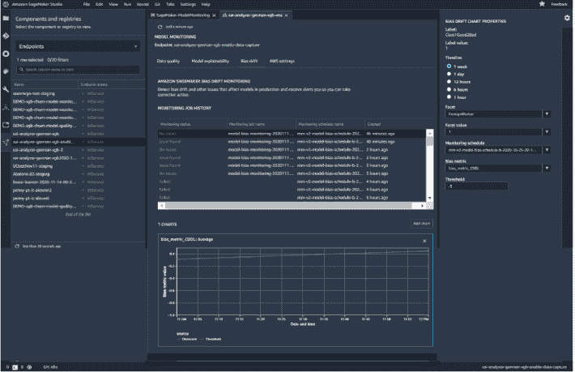

*Amazon SageMaker can be used for production monitoring and experiment management | [Source](https://web.archive.org/web/20221206003956/https://aws.amazon.com/sagemaker/)*

[亚马逊 SageMaker](https://web.archive.org/web/20221206003956/https://aws.amazon.com/sagemaker/) 是一个帮助数据科学家管理他们的机器学习项目的平台。在这里，您可以在云中创建和训练机器学习模型，并将它们部署到您的环境中。

Amazon SageMaker 还为其用户配备了 ML 模型治理工具。当我们谈论模型治理时，必须提到的工具是 Amazon SageMaker 模型监视器。

这是亚马逊 SageMaker 相对较新的功能。模型监视器对您的项目很有帮助，原因如下:

*   **生产监控:**该工具持续监控您的模型的性能，跟踪并记录任何变化、偏差和数据漂移。它有助于实验跟踪和研究，但也可以应用于生产模型的开发和部署。如果需要立即采取行动，模型监视器会提醒您。
*   **预测:**模型部署后，它们可以展示与您预期不同的性能。在这种情况下，重要的是手头有一个工具，它可以收集关于什么出错的事后数据，并预测它的请求和来自您的端点的响应。
*   **实验管理:**模型监视器可以分析在 ML 模型运行期间收集的数据，以将其与其他训练实验进行比较。
*   **ML 模型优化:**亚马逊 SageMaker 自动优化 ML 模型进行部署。SageMaker Edge Manager 可以让你的模型运行速度提高 25 倍，具体取决于你选择的硬件。它还允许您使用不同的框架(如 DarkNet、Keras、PyTorch)来优化模型。
*   **集成:**您可以使用 API 将 SageMaker Edge Manager 与您现有的应用程序集成。它支持 Java、Go、Python、Ruby 和其他常见的编程语言。

## 结论

如果您一步一步地接近它，选择模型治理工具会变得容易。首先，您需要定义您的目标和期望，以选择具有适合您业务的功能的工具。只有在这一步完成之后，您才应该开始接触供应商并测试他们的工具。

|  | 易于设置 | 集成支持 | 企业级可扩展 | 模型版本控制 | 易于审计 | 文档和社区 |
| --- | --- | --- | --- | --- | --- | --- |
|  |  |  |  |  |  |  |
|  |  |  |  |  |  |  |
|  |  |  |  |  |  |  |
|  |  |  |  |  |  |  |
|  |  |  |  |  |  |  |
|  |  |  |  |  |  |  |
|  |  |  |  |  |  |  |