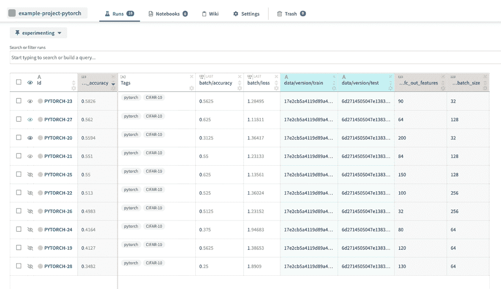

# 机器学习中的 12 大现场跟踪工具

> 原文：<https://web.archive.org/web/https://neptune.ai/blog/top-12-on-prem-tracking-tools-in-machine-learning>

云很酷——它们提供可扩展性、成本节约以及与众多工具集成的能力。任何东西都有应用程序——机器学习平台、数据存储、项目管理、调试和许多其他工具都在为我们竞争，随时可以使用。

然而，当一个人需要(或想要！)在本地基础设施上运行培训。它可以是在超级计算机上启动的科学项目。它可以是银行或医疗保健相关机构内部构建的模型，由于合规性问题，这些机构无法使用基于云的服务。

或者，该公司已经投资了其服务器场，并且不想在内部拥有适量计算能力的情况下为云支付过高的费用。原因数不胜数，有些令人惊讶，有些则平淡无奇。

对于习惯了云的数据科学家来说，在本地基础设施上运行项目(以及[跟踪实验](/web/20221007145036/https://neptune.ai/experiment-tracking))的愿景可能会令人不安。但是不要害怕！

**本文涵盖了你可以用来跟踪你的机器学习项目的 12 大内部工具。**

Neptune 是为运行大量实验的研究和生产团队构建的 MLOps 的元数据存储。它有本地版本，可免费试用 30 天。

[Neptune](/web/20221007145036/https://neptune.ai/product) 在云和内部都可用。它为日志度量、数据版本、硬件使用、模型检查点等提供元数据跟踪。

你可以在你的脚本顶部用下面三行代码将 Neptune 连接到你的任何机器学习模型。

您可以用简单的命令`pip install neptune-client`安装 Neptune，并在训练和验证脚本中添加以下代码，以记录您的实验数据。

```py
import neptune.new as neptune

run = neptune.init('work-space/MyProject', api_toke='Your_token')
run['parameters']={'lr':0.1, 'dropout':0.4}

run['test_accuracy'].log(0.84)

```



Neptune 可以集成 [PyTorch](https://web.archive.org/web/20221007145036/https://docs.neptune.ai/integrations-and-supported-tools/model-training/pytorch) 、 [Skorch](https://web.archive.org/web/20221007145036/https://docs.neptune.ai/integrations-and-supported-tools/model-training/skorch) 、 [Ignite](https://web.archive.org/web/20221007145036/https://docs.neptune.ai/integrations-and-supported-tools/model-training/pytorch-ignite) 、 [keras](https://web.archive.org/web/20221007145036/https://docs.neptune.ai/integrations-and-supported-tools/model-training/tensorflow-keras) 等框架。

### **使用海王星的优势**

*   你可以在 Jupyter 笔记本上追踪实验。
*   项目监督以及团队协作
*   比较笔记本
*   搜索并比较你的实验
*   与团队分享您的工作。

Comet 也是一个跟踪机器学习项目的实验工具。Comet 提供了一个自托管和基于云的元机器学习平台，允许数据科学家和团队跟踪、比较、解释、优化实验和模型。

一名内部成员可免费获得，多名成员可获得 30 天试用期。

您可以使用以下代码片段将 comet 与您的任何机器学习项目集成。

你可以用下面的代码安装 Comet`pip install comet_ml`

```py
from comet_ml import Experiment

experiment = Experiment(project_name="my-project", workspace="my-workspace")

```

Comet 可以集成类似 [PyTorch](https://web.archive.org/web/20221007145036/https://pytorch.org/) 、 [fast.ai](https://web.archive.org/web/20221007145036/https://www.fast.ai/) 、 [Ignite](https://web.archive.org/web/20221007145036/https://pytorch.org/ignite/index.html) 、 [Keras](https://web.archive.org/web/20221007145036/https://keras.io/) 等框架。

### **彗星的优点**

*   比较实验以了解模型性能的差异。
*   从您的模型预测中分析并获得洞察力。
*   通过使用最先进的超参数优化和监督早期停止，更快地构建更好的模型。

[权重&偏差](https://web.archive.org/web/20221007145036/https://www.wandb.com/)是一个机器学习的开发工具，用于执行实验跟踪、超参数优化、模型和数据集版本化。

Weights & Biases 通过帮助团队跟踪他们的模型、可视化模型性能以及轻松地自动化培训和改进模型，帮助组织将深度学习研究项目转化为部署的软件。

您可以使用下面的代码`pip install wandb`安装 Weights & Biases，通过下面的代码片段将该工具与您的任何机器学习项目集成。

```py
import wandb
‍

wandb.init(project="gpt-3")
‍

config = wandb.config
config.learning_rate = 0.01
‍

wandb.watch(model)
for batch_idx, (data, target) in enumerate(train_loader):
  ...  
  if batch_idx % args.log_interval == 0:      

    wandb.log({"loss": loss})

```

### **砝码的优势&偏差**

*   适合深度学习实验
*   更快的集成
*   可视化和报告工具的灵活用户界面

MLflow 是一个开源工具，可以部署在云和本地，用于管理机器学习生命周期，包括实验、再现性、部署和中央模型注册。

[MLflow](https://web.archive.org/web/20221007145036/https://mlflow.org/) 有三个构建模块:

1.  **跟踪:**日志和查询实验，比较结果和参数。
2.  **项目:**以可重用的方式封装代码。
3.  **模型:**管理和部署模型。

可以用下面的代码`pip install mlflow`安装 MLflow。

使用 MLflow 进行实验跟踪的线性回归示例:

```py
import numpy as np
from sklearn.linear_model import LinearRegression
from sklearn.metrics import mean_squared_error
import matplotlib.pyplot as plt
import mlflow
import mlflow.sklearn

mlflow.set_tracking_uri('file:/myfullppath/myproject/mlruns')

exp_name = "Simple_Regression"
mlflow.set_experiment(exp_name)

x = np.array([[1], [2], [2.1], [2.5], [2.7], [3], [4], [4.5], [3]])
y = np.array([0.5, 2.2, 2.5, 3, 3.5, 3.1, 5, 5.1, 3.5])

x_train = x[:-2]
y_train = y[:-2]
x_test = x[-2:]
y_test = y[-2:]

with mlflow.start_run():
  model = LinearRegression()
  model.fit(x_train, y_train)
  prediction = model.predict(x_test)
  rmse = np.sqrt(mean_squared_error(y_test, prediction))
  print(rmse)

  mlflow.log_metric("rmse", rmse)
  mlflow.sklearn.log_model(model, "model")

```

### 【MLflow 的优势:

*   开源
*   在本地和云上工作。
*   借助 Apache Spark 扩展到大数据

你可以在这里了解更多关于 MLflow [的信息。](https://web.archive.org/web/20221007145036/https://mlflow.org/)

神圣自动存储每次运行的实验信息，我们可以在 Omniboard 的帮助下可视化该实验。

**神圣的**–我们在模型训练脚本中使用**神圣的**装饰者来自动存储每次运行的实验信息。

omni board–omni board 有助于可视化我们的实验，以便跟踪它们，观察每个实验的持续时间，添加注释，以及检查实验(失败或完成)。

你可以用下面的命令`pip install sacred`安装[神圣&全能](https://web.archive.org/web/20221007145036/https://github.com/IDSIA/sacred)。

### 神圣的优点

*   开源工具
*   易于集成
*   使用 Omniboard 跟踪可视化实验
*   帮助为每个实验添加注释。

你可以在这里了解更多关于神圣的[。](https://web.archive.org/web/20221007145036/https://github.com/IDSIA/sacred#sacred)

[TensorBoard](https://web.archive.org/web/20221007145036/https://www.tensorflow.org/tensorboard) ，开源工具，是 [TensorFlow](https://web.archive.org/web/20221007145036/https://www.tensorflow.org/) 的可视化工具包，为机器学习实验提供可视化和工具，包括度量可视化、模型图可视化等。

用张量板显示图形的简化代码:

```py
import tensorflow as tf

writer = tf.summary.create_file_writer('./folder')

accuracy = [0.1, 0.4, 0.6, 0.8, 0.9, 0.95] 

with writer.as_default():
    for step, acc in enumerate(accuracy):
        tf.summary.scalar('Accuracy', acc, step) 
        writer.flush() 

writer.close() 

```

启动网络服务器:

```py
tensorboard --logdir='./folder'

```

### **冲浪板的优势**

*   提供调试机器学习模型训练所需的度量和可视化
*   写总结来形象化学习
*   易于集成
*   大型社区

你可以在这里了解更多关于 TensorBoard [的信息。](https://web.archive.org/web/20221007145036/https://www.tensorflow.org/tensorboard)

Deepkit.ai 是一个开源的机器学习开发工具和培训套件，用于深入、快速和可重复的现代机器学习。

Deepkit.ai 可以用来跟踪你的实验，调试你的模型，管理计算服务器。

### **deep kit . ai 的主要优势**

*   实验管理
*   模型调试
*   计算管理

Guild AI 是一个开源工具，最适合个人项目。它提供机器学习运行的参数跟踪、加速的 ML 模型开发、测量实验和[超参数调整](/web/20221007145036/https://neptune.ai/blog/hyperparameter-tuning-in-python-a-complete-guide-2020)。

Guild AI 会自动捕捉训练跑步的每个细节，作为独特的实验。

### **公会 AI 的主要优势**

*   分析、可视化和差异
*   使用 AutoML 进行超参数调谐
*   并行处理
*   百分之百免费

Trains 是一个开源平台，用于跟踪和控制生产级深度学习模型。

任何处于模型原型阶段的研究团队都可以通过添加几行代码，在其内部 [Trains](https://web.archive.org/web/20221007145036/https://github.com/allegroai/trains) 的服务器上建立并存储有见地的条目。

Trains 与任何 DL/ML 工作流程无缝集成。它自动将实验与训练代码(git commit + local diff + Python 包版本)链接起来，并自动以 Python 代码的形式存储 jupyter 笔记本。

### **火车的主要优势**

*   易于集成。
*   为生产级深度学习模型做好了准备。
*   实验的自动记录。
*   资源监控(CPU/GPU 利用率、温度、IO、网络等。).

Polyaxon 是一个用于构建、培训和监控大规模深度学习应用的平台，为机器学习应用提供可重复性、自动化和可扩展性。支持 Tensorflow、MXNet、Caffe、PyTorch 等所有深度学习框架。

[Polyaxon](https://web.archive.org/web/20221007145036/https://polyaxon.com/) 提供节点管理和智能容器，实现深度学习模型的高效开发。

### **poly axon 的主要优点**

*   为大规模生产级深度学习模型做好了准备。
*   支持几乎所有深度学习框架。
*   为机器学习应用程序提供可再现性、自动化和可扩展性。

Valhoai 是一个 MLOps 平台(管理 ML 生命周期的机器学习和操作的结合)。该工具通过自动化实验跟踪和基础设施管理，使数据科学家能够专注于构建定制模型。

### **瓦罗海的优势**

[Kubeflow](https://web.archive.org/web/20221007145036/https://www.kubeflow.org/) 是一个基于开源机器学习 Kubernetes 的平台，用于开发、部署、管理和运行可扩展的机器学习工作流。

Kubeflow 提供创建交互式 Jupyter 笔记本、运行模型服务、运行模型培训、创建 ML 管道的服务。它还支持多种框架。

Kubeflow 提供 Kubernetes 自定义资源(CRD ),运行各种分布式和非分布式培训作业。其中一些如下:

1.  张量流训练(TFJob)
2.  PyTorch 培训
3.  MXNet 培训
4.  MPI 培训
5.  链式训练

Kubleflow 支持独立的模型服务系统和多框架模型服务。

多框架服务包括:

1.  kfserving 很少核心服务
2.  本托尔
3.  独立框架服务:

张量流服务

1.  张量流批量预测
2.  NVIDIA Triton 推理服务
3.  **kube flow 的优势**

### 最后的想法

## 上面列出的工具将云的便利带到了本地基础设施，解决了项目期间可能遇到的大多数精确问题。所以，不要害怕，拿起你选择的武器，在你现有的基础设施上进行实验！

还有一个需要提及的本地基础设施的特征。云服务没有即时的可伸缩性。如果完成内部基础架构培训需要八个小时，您别无选择，只能等待。打个盹，做些伸展运动，读本书。内部基础架构有其优点！

Python 和机器学习讲师| probog.com 创始人

**阅读下一篇**

* * *

在 AILS 实验室建立可扩展的医学 ML 研究工作流程[案例研究]

## 8 分钟阅读| Ahmed Gad |发布于 2021 年 6 月 22 日

8 mins read | Ahmed Gad | Posted June 22, 2021

AILS Labs 是一个生物医学信息学研究小组，致力于使人类更加健康。这个任务就是**建造模型，也许有一天可以拯救你的心脏病**。它归结为应用机器学习来基于临床、成像和遗传学数据预测心血管疾病的发展。

四名全职和五名以上兼职团队成员。生物信息学家、内科医生、计算机科学家，许多人都有望获得博士学位。正经事。

虽然业务可能是一个错误的术语，因为面向用户的应用程序还没有在路线图上，但研究是主要的焦点。**研究如此激烈，以至于需要一个定制的基础设施**(花了大约一年时间建造)来从不同类型的数据中提取特征:

电子健康记录(EHR)，

*   诊断和治疗信息(时间-事件回归方法)，
*   图像(卷积神经网络)，
*   结构化数据和心电图。
*   通过融合这些特征，精确的机器学习模型可以解决复杂的问题。在这种情况下，这是心血管一级预防的*风险分层。*本质上，它是关于**预测哪些患者最有可能患心血管疾病**。

AILS 实验室有一套完整的研究流程。每个目标都有七个阶段:

定义要解决的任务(例如，建立心血管疾病的风险模型)。

1.  定义任务目标(例如，定义预期的实验结果)。
2.  准备数据集。
3.  使用 Jupyter 笔记本以交互模式处理数据集；快速试验，找出任务和数据集的最佳特性，用 R 或 Python 编码。
4.  一旦项目规模扩大，使用像 Snakemake 或 Prefect 这样的工作流管理系统将工作转化为可管理的管道，并使其可重复。否则，复制工作流程或比较不同模型的成本会很高。
5.  使用 Pytorch Lightning 与 Neptune 集成创建机器学习模型，其中应用了一些初始评估。记录实验数据。
6.  最后，评估模型性能并检查使用不同特征和超参数集的效果。
7.  扩大机器学习研究的 5 个问题

## AILS Labs 最初是由一小群开发人员和研究人员组成的。一个人编写代码，另一个人审查代码。没有太多的实验。但是协作变得更具挑战性，随着新团队成员的到来，新问题开始出现:

数据隐私，

1.  工作流程标准化，
2.  特征和模型选择，
3.  实验管理，
4.  信息记录。
5.  Information logging.

[Continue reading ->](/web/20221007145036/https://neptune.ai/blog/ml-research-workflow-case-study-ails-labs)

* * *