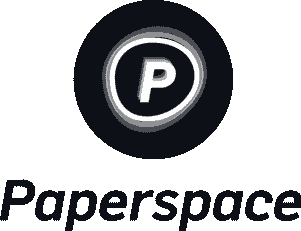

# 作为数据科学家，你想查看的 12 个机器学习播客

> 原文：<https://web.archive.org/web/https://neptune.ai/blog/top-machine-learning-podcasts>

众所周知，在这个数字时代，教育有多种形式，如视频、pdf、电子书和播客。播客在学生或学习者中变得越来越受欢迎，因为电子设备易于访问，并且能够在听众和演讲者之间建立良好的联系。

> “播客的媒介和它的个人性质，你与听众建立的关系以及他们与你的关系——他们可能只是坐在那里，笑着听着……没有什么比这更好的了。”

> 马克·马龙

在这篇文章中，我们将涵盖作为数据科学家你应该看看的 12 大播客。

## 1.作为软件工程师的机器学习

*Source: paperspace.com*

这篇对话是与 [paperspace](https://web.archive.org/web/20221207152458/https://www.paperspace.com/) 、**T3、Dillion Erb、**的联合创始人兼首席执行官的对话。Paperspace 为数据科学家和机器学习工程师提供支持 GPU 的计算资源。Dillion 解释了他们如何建立一个组织来帮助建立和扩展机器学习工作流。

主持人: **[山姆·查林顿](https://web.archive.org/web/20221207152458/https://twitter.com/samcharrington?ref_src=twsrc%5Egoogle%7Ctwcamp%5Eserp%7Ctwgr%5Eauthor)**

嘉宾: **[迪里昂·埃尔布](https://web.archive.org/web/20221207152458/https://www.linkedin.com/in/dillonerb/)**

## 2.新冠肺炎和心理健康 NLP

疫情(新冠肺炎)正在进行，新冠肺炎病例自 2019 年 12 月以来飙升。病例越多，我们掌握的病人数据就越多。在本播客中，斯坦福大学心理学助理教授 Johannes Eichstaedt 讲述了如何利用 Twitter 和脸书等社交媒体数据来理解大量人群和个人的心理行为。

主持人: **[山姆·查林顿](https://web.archive.org/web/20221207152458/https://twitter.com/samcharrington?ref_src=twsrc%5Egoogle%7Ctwcamp%5Eserp%7Ctwgr%5Eauthor)**

嘉宾:[****](https://web.archive.org/web/20221207152458/http://jeichstaedt.com/)

 **## 3.用于无线通信的神经增强

在本播客中， **[麦克斯·韦林](https://web.archive.org/web/20221207152458/https://staff.fnwi.uva.nl/m.welling/)** ，阿姆斯特丹大学机器学习研究主席，高通技术副总裁，提出了一种叫做**神经增强**的原理。

在神经增强中，我们利用深度学习的力量来学习通过简单的人类观察不可能检测到的模式。因此，我们训练一个神经网络，通过使用这三个原则来迭代地修正经典解。

1.  误差估计
2.  MIMO 解调
3.  信道估计

你可以在[这个](https://web.archive.org/web/20221207152458/https://www.universiteitleiden.nl/binaries/content/assets/science/dso/26-6-2020-max-welling.pdf) PDF 中了解更多关于神经增强的信息。

主持人: **[山姆·查林顿](https://web.archive.org/web/20221207152458/https://twitter.com/samcharrington?ref_src=twsrc%5Egoogle%7Ctwcamp%5Eserp%7Ctwgr%5Eauthor)**

嘉宾: [**麦克斯·韦林**](https://web.archive.org/web/20221207152458/https://staff.fnwi.uva.nl/m.welling/)

4.量子机器学习

## **量子机器学习** **是量子物理学和机器学习的交叉。**

量子计算机使用 ***量子比特*** 。量子位被添加了进入*叠加态*的能力，并彼此共享*纠缠态*。

通过利用技术*叠加*和*纠缠*，量子计算机可以执行标准计算机难以处理的量子操作。

在这段播客中，[约尔达尼什·克里尼迪斯](https://web.archive.org/web/20221207152458/https://www.irif.fr/~jkeren/jkeren/Iordanis_Kerenidis.html)是 CNRS 的高级研究员，在 [IRIF](https://web.archive.org/web/20221207152458/http://www.irif.fr/) 大学[算法和复杂性小组](https://web.archive.org/web/20221207152458/https://www.irif.fr/en/equipes/algocomp/index)工作，他探索了量子机器学习的可能性。

主持人: **[山姆·查林顿](https://web.archive.org/web/20221207152458/https://twitter.com/samcharrington?ref_src=twsrc%5Egoogle%7Ctwcamp%5Eserp%7Ctwgr%5Eauthor)**

嘉宾:

5.扰乱 DeepFakes

## Deepfake 可以生成一个人说或做的真实或令人信服的假视频，这些视频可能从未在现实生活中发生过。你可以想象或者不可以想象这会造成多大的混乱。

为了防止**恶意用户**对这种图像翻译系统产生敌对攻击，这种攻击破坏了最终的输出图像。这个问题被称为**扰乱 Deepfakes** 。

在本播客中， **[Nataniel Ruiz](https://web.archive.org/web/20221207152458/https://natanielruiz.github.io/)** 是[波斯顿大学](https://web.archive.org/web/20221207152458/http://www.bu.edu/)二年级博士生，在[图像&视频计算](https://web.archive.org/web/20221207152458/https://www.bu.edu/cs/ivc/)小组中讨论了扰乱**深度假**的概念。

主持人: **[山姆·查林顿](https://web.archive.org/web/20221207152458/https://twitter.com/samcharrington?ref_src=twsrc%5Egoogle%7Ctwcamp%5Eserp%7Ctwgr%5Eauthor)**

嘉宾:

6.人工智能和计算机图形学的交叉

## 英伟达 GPU 和深度学习训练了一个神经网络，直接从演员视频中制作面部动画。它只需要五分钟的训练数据。经过训练的网络从视频中生成整个游戏所需的所有面部动画。

在本播客中， **[英伟达实时渲染研究高级总监亚伦·勒芬](https://web.archive.org/web/20221207152458/https://research.nvidia.com/person/aaron-lefohn)** 将讲述如何利用人工智能的力量从演员视频中生成面部动画视频。

主持人:[诺亚·克雷维茨](https://web.archive.org/web/20221207152458/https://www.linkedin.com/in/noahk/)

嘉宾:[亚伦·勒芬](https://web.archive.org/web/20221207152458/https://research.nvidia.com/person/aaron-lefohn)

7.神经网络、数学和教学

## Grant Sanderson 是 YouTube 上的一名教育家，他将数学可视化，这有助于在更深层次上理解数学。

在本播客中， [Grant](https://web.archive.org/web/20221207152458/https://twitter.com/3blue1brown?ref_src=twsrc%5Egoogle%7Ctwcamp%5Eserp%7Ctwgr%5Eauthor) 将给出他对机器学习和数学之间合作的见解。格兰特还将讲述他是如何受到美国著名物理学家[理查德·费曼](https://web.archive.org/web/20221207152458/https://en.wikipedia.org/wiki/Richard_Feynman)的教学风格的启发。

主持人:[莱克斯·弗里德曼](https://web.archive.org/web/20221207152458/https://www.linkedin.com/in/lexfridman)

嘉宾:[格兰特·桑德森](https://web.archive.org/web/20221207152458/https://twitter.com/3blue1brown?ref_src=twsrc%5Egoogle%7Ctwcamp%5Eserp%7Ctwgr%5Eauthor)

8.让 Waymo 进入自动驾驶

## [Waymo](https://web.archive.org/web/20221207152458/https://waymo.com/) 是一家自动驾驶技术开发公司。它是谷歌母公司 [Alphabet Inc](https://web.archive.org/web/20221207152458/https://en.wikipedia.org/wiki/Alphabet_Inc.) 的子公司。 [Waymo](https://web.archive.org/web/20221207152458/https://waymo.com/) 在亚利桑那州[凤凰城](https://web.archive.org/web/20221207152458/https://en.wikipedia.org/wiki/Phoenix,_Arizona)运营一项名为“Waymo One”的商业[自动驾驶出租车](https://web.archive.org/web/20221207152458/https://en.wikipedia.org/wiki/Self-driving_taxi)服务。

在本播客中， **[Drago Anguelov](https://web.archive.org/web/20221207152458/https://www.linkedin.com/in/dragomiranguelov)** 是首席科学家和 [Waymo](https://web.archive.org/web/20221207152458/https://waymo.com/) 的研究负责人，他将通过向主持人解释自动驾驶的算法来谈论人工智能自动驾驶。

主机:

客人:

**[【安格尔洛夫龙】](https://web.archive.org/web/20221207152458/https://www.linkedin.com/in/dragomiranguelov)**

9.预测洪水

## 在人工智能的帮助下，我们可以提出一个数学模型，用过去的降雨量和水位数据进行训练，这可以帮助我们为危机做好准备，以将危机的损害降至最低。

<https://web.archive.org/web/20221207152458im_/https://neptune.ai/wp-content/uploads/2021/11/water-landscape.mp4>

***Source: [Google Research](https://web.archive.org/web/20221207152458/https://ai.googleblog.com/2019/09/an-inside-look-at-flood-forecasting.html)*** 

在接下来的播客中， [Sella Nevo](https://web.archive.org/web/20221207152458/https://research.google/people/SellaNevo/) 在谷歌研究团队工作，从事[洪水预报项目](https://web.archive.org/web/20221207152458/https://ai.googleblog.com/2019/09/an-inside-look-at-flood-forecasting.html)。Sella 将谈论淹没模型、实时水位测量、高程图创建、水力建模。

主持人:**凯瑟琳·科尔曼&尼尔·阿姆斯**

嘉宾: [**塞拉涅沃**](https://web.archive.org/web/20221207152458/https://research.google/people/SellaNevo/)

10.人工智能和“真正”智能的区别

## 智力可以被称为推理、解决问题或学习的心理能力。因为它依赖于我们大脑的认知功能。现在在这个数字时代，我们还创造了一个术语叫做**人工智能**，它是在数学模型的帮助下，通过训练数据而获得的。

在本期播客中， **[安德鲁·布西](https://web.archive.org/web/20221207152458/https://www.linkedin.com/in/busey)** 一位美国企业家谈论了“真正的”智能和**人工智能**之间的区别。

主持人: [**拜伦李斯**](https://web.archive.org/web/20221207152458/https://byronreese.com/)

嘉宾: **[安德鲁·布西](https://web.archive.org/web/20221207152458/https://www.linkedin.com/in/busey)**

11.对人工智能驱动的医疗助理的现实检查

## 生物医学数据帮助研究人员建立数学模型，以实现医疗保健过程的自动化。例如，我们可以使用计算机视觉通过输入 x 光图像来检测病人是否患有肺炎。

在本播客中，[公民分析](https://web.archive.org/web/20221207152458/https://www.civisanalytics.com/)研发部的数据科学家[凯蒂·马龙](https://web.archive.org/web/20221207152458/https://blog.udacity.com/2016/04/women-in-machine-learning-katie-malone.html)谈论了计算机视觉等算法，一种用于诊断糖尿病视网膜病变，另一种用于对肝癌进行分类。

主持人: **[本·贾菲](https://web.archive.org/web/20221207152458/https://www.linkedin.com/in/benjaffe)**

嘉宾: [**凯蒂·马龙**](https://web.archive.org/web/20221207152458/https://twitter.com/multiarmbandit?lang=en)

12.犯罪学和数据科学

## 随着技术的发展，我们的城市越来越多地被高科技安全所控制。这为城市提供了全天实时信息的来源。

例如，如果我们在抢链视频上训练一个机器学习模型，那么我们可以在实时环境中使用该模型进行推理，以检测某人的链是否被抢。

在本播客中，[扎克·德雷克](https://web.archive.org/web/20221207152458/https://cls.gmu.edu/people/zdrake)是犯罪学、法律和社会专业的博士生，他与主持人 **[凯蒂·马龙](https://web.archive.org/web/20221207152458/https://twitter.com/multiarmbandit?lang=en)** 一起传授人工智能和犯罪学合作的知识。

主持人: [**凯蒂·马龙**](https://web.archive.org/web/20221207152458/https://twitter.com/multiarmbandit?lang=en)

嘉宾:[扎克·德雷克](https://web.archive.org/web/20221207152458/https://cls.gmu.edu/people/zdrake)

在所有这些播客之后，你可能会对学习数据科学感兴趣。所以我列出了你可以免费学习机器学习的资源。

最后的想法

## 人工智能正在成为许多企业的新石油，我们所涵盖的只是冰山一角，所以你最好利用人工智能咒语的知识来让这个世界变得更好。

AI is becoming the new oil for many businesses and what we cover was just the tip of the iceberg,so you better harness yourself with the knowledge of the AI spells to make this world a better place.**