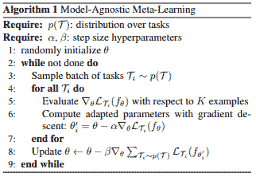

# 理解计算机视觉中的少镜头学习:你需要知道什么

> 原文：<https://web.archive.org/web/https://neptune.ai/blog/understanding-few-shot-learning-in-computer-vision>

自从第一个 [**卷积神经网络** ( **CNN** )算法](/web/20221208040141/http://neptune.ai/blog/graph-neural-network-and-some-of-gnn-applications)被创建以来，它们在 [**计算机视觉** ( **CV** )](/web/20221208040141/http://neptune.ai/blog/computer-vision-resources) 任务上大幅提升了深度学习性能。

2015 年，微软报告称，他们的模型在对来自 [ImageNet](https://web.archive.org/web/20221208040141/http://www.image-net.org/) 数据集的图像进行分类方面实际上比人类更好。[【1】](https://web.archive.org/web/20221208040141/https://www.sicara.ai/blog/2019-07-30-image-classification-few-shot-meta-learning)

如今，当涉及到使用数十亿张图像来解决一项特定任务时，计算机没有对手。尽管如此，在现实世界中，你很少能构建或找到有那么多样本的数据集。

我们如何克服这个问题？如果我们在谈论一个 **CV** 任务，我们可以使用[数据扩充](/web/20221208040141/http://neptune.ai/blog/data-augmentation-in-python) ( **DA** )，或者收集和标记附加数据。

DA 是一个强大的工具，可能是解决方案的重要组成部分。标记额外的样品是一项耗时且昂贵的任务，但它确实能提供更好的结果。

如果数据集真的很小，这两种技术可能都帮不了我们。想象一个任务，我们需要建立一个每类只有一到两个样本的分类，每个样本都超级难找。

这需要创新的方法。[少投学](https://web.archive.org/web/20221208040141/https://arxiv.org/abs/1904.05046)(**)就是其中之一。**

 **在本文中，我们将讨论:

*   什么是**少投学习**——定义、目的和 **FSL** 问题示例
*   少量多次学习变化—**多次学习、少量多次学习、一次学习、零次学习**
*   少击学习逼近**–**元学习**、**数据级**、**参数级****
*   ****元学习算法**–定义，**度量学习**，**基于梯度的元学习****
*   **少镜头图像分类算法——**模型不可知** **元学习****匹配****原型**和**关系网络****
*   ****少拍物体检测**–**约洛玛姆****

 **什么是少投学习？

## **少镜头学习**是机器学习的一个子领域。它是关于当你只有几个带有监督信息的训练样本时，对新数据进行分类。

FSL 是一个相当年轻的地区，需要更多的研究和完善。从今天起，你可以在 **CV** 任务中使用它。计算机视觉模型可以用相对较少的训练样本很好地工作。在这篇文章中，我们将关注计算机视觉领域的 **FSL** 。

例如:假设我们在医疗保健行业工作，在通过 x 光照片对骨骼疾病进行分类时遇到了问题。

一些罕见的病理可能缺少足够的图像用于训练集中。这正是可以通过构建一个 **FSL** 分类器来解决的问题类型。

少量变化

让我们来看看 **FSL** 的不同变体和极端案例。总的来说，研究人员确定了四种类型:

## **N 元学习(NSL)**

**少数镜头学习**

1.  **一次性学习(OSL)**
2.  **小于一或零射学习(ZSL)**
3.  当我们谈论 **FSL** 时，我们通常指的是**N-way-K-Shot-class 化**。
4.  **N** 代表类别数， **K** 代表每一类别中用于训练的样本数。

N 次学习被认为是一个比其他所有概念都更广泛的概念。意思是**少射**、**单射**、**零射学习**是 **NSL** 的子场。

**零距离拍摄**

对我来说，ZSL 最有趣。**零投学习**的目标是在没有任何训练实例的情况下，对看不见的类进行分类。

这可能看起来有点疯狂，但请这样想:你能在没有看到一个物体的情况下对它进行分类吗？如果你对一个对象有一个大概的概念，它的外观，属性和功能，这应该不是问题。

### 这是你在做 **ZSL** 时使用的方法，根据[目前的趋势](https://web.archive.org/web/20221208040141/https://blog.floydhub.com/ten-trends-in-deep-learning-nlp/#zero-shot) , **零距离学习**将很快变得更有效。

**单镜头和少镜头**

至此，你可能已经看到了一个大概的概念，所以在**一次性学习**中，我们每个类只有一个样本也就不足为奇了。**少投**每班有两到五个样本，使它成为 **OSL** 更灵活的版本。

当我们谈论整体概念时，我们使用**少量学习**术语。但是这个领域还很年轻，所以人们会用不同的方式使用这些术语。当你阅读文章时，请记住这一点。

### 少量学习方法

好了，是时候转向更实际的领域，谈谈不同的**少量学习**解决问题的方法了。

首先我们来定义一个 **N 路 K 炮分类**问题。想象一下我们有:

培训(支持)集包括:

## **N** 类标签

**K** 每类的标记图像(少量，每类少于十个样本)

**Q** 查询图片

1.  我们希望将 **Q** 查询图像归类到 **N** 类中。训练集中的 **N** * **K** 样本是我们仅有的例子。这里的主要问题是没有足够的训练数据。[【1】](https://web.archive.org/web/20221208040141/https://www.sicara.ai/blog/2019-07-30-image-classification-few-shot-meta-learning)
    1.  FSL 任务的第一步也是最明显的一步是从其他类似的问题中获取经验。这就是为什么**的少投学习**被定性为**的元学习**问题。
    2.  让我们弄清楚这一点:在传统的分类问题中，我们试图从训练数据中学习如何分类，并使用测试数据进行评估。
2.  在**元学习**中，我们学习如何在给定一组训练数据的情况下学习分类。我们用一组分类问题来解决其他不相关的问题。

一般来说，在解决 **FSL** 问题时，你应该考虑两种方法:

**数据级方法(DLA)**

**参数级方法(PLA)**

**数据级方法**

*   这个方法真的很简单。它基于这样一个概念，如果你没有足够的数据来建立一个可靠的模型并避免过度拟合和欠拟合，你应该简单地添加更多的数据。
*   这就是为什么许多 **FSL** 问题是通过使用来自大型**基础数据集**的额外信息来解决的。**基本数据集**的关键特征是它没有我们在**少量任务**的支持集中拥有的类。例如，如果我们想对一种特定的鸟类进行分类，基本数据集可以包含许多其他鸟类的图像。

我们自己也可以产生更多的数据。为了达到这个目的，我们可以使用**数据增强**，甚至**生成对抗网络** ( **GANs** )。

**参数级方法**

从**参数级**的角度来看，很容易在**少量学习**样本上过度拟合，因为它们经常具有广泛的高维空间。

为了克服这个问题，我们应该限制参数空间，并使用正则化和适当的损失函数。该模型将概括有限数量的训练样本。

另一方面，我们可以通过将模型定向到广泛的参数空间来增强模型性能。如果我们使用标准的优化算法，它可能不会给出可靠的结果，因为训练数据量很小。

### 这就是为什么在**参数级别**上，我们训练我们的模型在参数空间中寻找最佳路线，以给出最佳预测结果。正如我们上面已经提到的，这种技术被称为**元学习**。

在经典范式中，当我们有一个特定的任务时，一个算法正在学习它的任务性能是否随着经验而提高。在**元学习**范例中，我们有一组任务。一个算法正在学习它在每个任务中的性能是否随着经验和任务数量的增加而提高。这种算法叫做**元学习**T4 算法。

假设我们有一个测试任务 **TEST** 。我们将在一批训练任务 **TRAIN** 上训练我们的**元学习** **算法**。从试图解决**训练**任务中获得的训练经验将用于解决**测试**任务。

解决一个 **FSL** 任务有一套步骤序列。假设我们有一个分类问题，就像我们之前提到的那样。首先，我们需要选择一个**基础数据集**。选择一个**基础数据集**至关重要。你想挑一个好的，所以要小心。

现在我们有了**N-way-K-Shot-class ification**问题(姑且称之为**测试**)和一个大的**基本数据集**，我们将把它用作**元学习**训练集(**训练**)。

整个**元训练**过程将有有限数量的**集**。我们组成这样一集**:**

 **从**训练**中，我们采样 **N** 个类和 **K** 个类的支持集图像，以及 **Q** 个查询图像。这样，我们就形成了一个分类任务，类似于我们最终的**测试**任务。

在每集结束时，模型的参数被训练以最大化来自查询集的 **Q** 图像的准确性。这是我们的模型学习解决一个看不见的分类问题的能力的地方。[【1】](https://web.archive.org/web/20221208040141/https://www.sicara.ai/blog/2019-07-30-image-classification-few-shot-meta-learning)

模型的整体效率通过其在**测试**分类任务中的准确性来衡量。

近年来，研究人员发表了许多解决 **FSL** 分类问题的**元学习**算法。它们都可以分为两大类:**度量学习**和**基于梯度的元学习**算法。

**公制学习**

当我们谈论**度量学习**时，我们通常指的是在对象上学习距离函数的技术。

一般来说，**度量学习**算法学习比较数据样本。在**少数**分类问题的情况下，他们基于查询样本与支持样本的相似性对它们进行分类。

正如你可能已经猜到的，如果我们正在处理图像，我们基本上训练一个**卷积神经网络**来输出一个图像嵌入向量，稍后将它与其他嵌入进行比较来预测类别。

**基于梯度的元学习**

对于基于**梯度的**方法，你需要构建一个**元学习器**和一个**基础学习器**。

**元学习者**是跨集学习的模型，而**基础学习者**是由**元学习者**在每集内初始化和训练的模型。

想象一集**元训练**，其中一些分类任务由一个 **N** * **K** 图像支持集和一个 **Q** 查询集定义:

我们选择一个**元学习者**模型，

### 剧集开始了，

我们初始化**基础学习器**(通常是一个 **CNN** 分类器)，

我们在支持集上训练它(用于训练**基础学习者**的精确算法由**元学习者**定义)，

1.  **基础学习者**预测查询集合上的类别，
2.  **元学习器**参数根据分类错误导致的损失进行训练，
3.  从这一点来看，根据您对**元学习者**的选择，管道可能会有所不同。[【1】](https://web.archive.org/web/20221208040141/https://www.sicara.ai/blog/2019-07-30-image-classification-few-shot-meta-learning)

5.  少镜头图像分类算法
6.  *这一段来自 Etienne Bennequin 写的“[元学习的少镜头图像分类](https://web.archive.org/web/20221208040141/https://www.sicara.ai/blog/2019-07-30-image-classification-few-shot-meta-learning)”。*
7.  从总体上看，让我们继续讨论用于解决**少镜头学习**图像分类问题的具体**元学习**算法。

在本节中，我们将介绍:

## **模型不可知元学习(MAML)**

**匹配网络**

**原型网络**

**关系网络**

2.  **模型不可知的元学习**
3.  [MAML](https://web.archive.org/web/20221208040141/https://arxiv.org/abs/1703.03400) 基于**基于梯度的元学习** ( **GBML** )概念。正如我们已经知道的， **GBML** 是关于**元学习者**从训练**基本模型**中获得先前的经验，并学习所有任务的共同特征表示。
4.  每当有新任务要学习时，具有先前经验的**元学习者**将使用新任务带来的少量新训练数据进行一点点微调。

尽管如此，我们不想从一个随机的参数初始化开始。如果我们这样做，我们的算法在几次更新后不会收敛到好的性能。

### **MAML** 旨在解决这个问题。

**MAML** 为**元学习者**的参数提供了良好的初始化，以实现对新任务的最佳快速学习，仅使用少量梯度步骤，同时避免使用小数据集时可能发生的过拟合。

这是如何做到的:

元学习者在每集开始时创建其自身的副本( **C** ),

C 在剧集中接受训练(就像我们之前讨论过的，在**基本模型**的帮助下)，

**C** 对查询集进行预测，

根据这些预测计算的损失用于更新 **C，**

1.  这种情况会一直持续到你完成所有的训练。
2.  这种技术最大的优点是它被认为是不可知的**元学习者**算法选择。因此， **MAML** 方法被广泛用于许多需要快速适应的**机器学习**算法，尤其是**深度神经网络**。

4.  **匹配网络**
5.  [匹配网络](https://web.archive.org/web/20221208040141/https://arxiv.org/abs/1606.04080) ( **MN** )是第一个为解决 **FSL** 问题而设计的**度量学习**算法。

对于**匹配网络**算法，你需要使用一个大的基础数据集来解决一个**的少拍学习**任务。如上所示，这个数据集被分割成几集。此后，对于每一集，匹配网络应用以下程序:

来自支持和查询集的每个图像被馈送到为它们输出嵌入的 **CNN** ，

### 使用从其嵌入到支持集嵌入的余弦距离的软最大值对每个查询图像进行分类，

所得分类上的**交叉熵损失**通过 **CNN** 反向传播。

这样，**匹配网络**学习计算图像嵌入。这种方法允许 **MN** 在没有特定类别先验知识的情况下对图像进行分类。一切都是通过比较不同的类实例来完成的。

1.  由于每一集的类别都不同，**匹配网络**计算图像的相关特征以区分类别。相反，在标准分类的情况下，算法学习特定于每个类别的特征。
2.  值得一提的是，作者实际上对最初的算法提出了一些改进。例如，他们用双向 **LSTM** 增强了他们的算法。每个图像的嵌入依赖于其他图像的嵌入。

    所有的改进建议都可以在他们的[初始](https://web.archive.org/web/20221208040141/https://arxiv.org/pdf/1606.04080.pdf)条中找到。不过，你必须记住，提高算法的性能可能会使计算时间更长。

**原型网络**

[**原型网络**](https://web.archive.org/web/20221208040141/https://arxiv.org/abs/1703.05175) ( **PN** )类似于匹配网络。尽管如此，仍有一些小的差异有助于增强算法的性能。 **PN** 实际上比 **MN 获得更好的结果。**

**PN** 过程本质上是相同的，但是查询图像嵌入并不与来自支持集的每个图像嵌入进行比较。相反，**原型网络**提出了一种替代方法。

在 **PN** 中，你需要形成**级原型**。它们基本上是通过平均来自该类的图像的嵌入而形成的类嵌入。然后，查询图像嵌入只与这些**类原型**进行比较。

### 值得一提的是，在一个**单次学习**问题的情况下，算法类似于**匹配网络**。

还有， **PN** 用欧氏距离代替余弦距离。这被视为算法改进的主要部分。

**关系网络**

为构建匹配的和**原型网络**而进行的所有实验实际上都导致了[关系网络](https://web.archive.org/web/20221208040141/https://arxiv.org/pdf/1711.06025.pdf) ( **RN** )的创建。 **RN** 建立在 **PN** 概念的基础上，但是对算法做了很大的改动。

距离函数不是预先定义的，而是由算法学习的。 **RN** 有自己的**关系**模块来做这件事。如果你想了解更多，请查看[初始文章](https://web.archive.org/web/20221208040141/https://arxiv.org/pdf/1711.06025.pdf)。

整体结构如下。**关系**模块放在**嵌入**模块的上面，该模块是从输入图像中计算嵌入和**类原型**的部分。

### 关系模块被提供了查询图像的嵌入与每个类原型的连接，并且它为每一对输出一个**关系分数**。将 **Softmax** 应用于**关系分数**，我们得到一个预测。

少镜头目标检测

*这一节来自 Etienne Bennequin 写的《[少镜头计算机视觉的元学习算法](https://web.archive.org/web/20221208040141/https://arxiv.org/pdf/1909.13579.pdf)》。*

很明显，在所有的**计算机视觉**任务中，我们都可能遇到 **FSL** 问题。我们已经考虑了**少镜头**图像分类，现在是时候解决**少镜头物体检测**问题了。

让我们定义一个**对象检测**任务。假设我们有一个对象类型列表和一个图像，目标是检测图像上列表中的所有对象。如果满足以下条件，我们就说物体被检测到:

我们通过绘制包含它的最小的边界框来定位它，

## 我们对物体进行了分类。

让我们继续定义 **N 路 K 射物体检测**任务。想象一下:

一种支撑装置，包括:

**N** 类标签、

1.  对于每个类别， **K 个**标记的图像包含至少一个属于该类别的对象，
2.  **Q** 查询图片。

我们的目标是检测查询图像中属于 **N** 个给定类别之一的对象。

1.  注意，与**少拍**图像分类问题有一个关键区别，因为一幅图像可以包含属于一个或几个 **N** 类的多个对象。我们可能会面临一个[类不平衡问题](/web/20221208040141/http://neptune.ai/blog/how-to-deal-with-imbalanced-classification-and-regression-data)，因为我们的算法在每个类的至少 **K** 个示例对象上训练。
    1.  **约洛玛姆**
    2.  **少拍物体探测**领域正在快速发展，但没有太多有效的解决方案。这个问题最稳定的解决方案是 [YOLOMAML](https://web.archive.org/web/20221208040141/https://github.com/ebennequin/FewShotVision) 算法。
2.  **YOLOMAML** 有两个混搭的棋子:[yolov 3](https://web.archive.org/web/20221208040141/https://pjreddie.com/darknet/yolo/)物体检测架构， **MAML** 算法。

如前所述， **MAML** 可以应用于各种各样的**深度神经网络**，这就是为什么开发人员很容易将这两个部分结合起来。

**YOLOMAML** 是 **MAML** 算法对 **YOLO** 探测器的直接应用。如果你想了解更多，请查看[官方 Github 资源库](https://web.archive.org/web/20221208040141/https://github.com/ebennequin/FewShotVision)。

最后的想法

### 在这篇文章中，我们已经弄清楚了什么是**少镜头学习**，有什么 **FSL** 变异和问题处理方法，以及你可以使用什么算法来解决图像分类和**物体检测 FSL** 任务。

据我所知，**小试牛刀学习**是一个快速发展和有前途的领域，但仍然相当具有挑战性和未知性。还有更多的事情要做、研究和开发。

希望有了这些信息，你在开始尝试**少量学习**领域时不会有任何问题。

**附加资源**

[“基于元学习的少镜头图像分类”，作者 Etienne Bennequin](https://web.archive.org/web/20221208040141/https://www.sicara.ai/blog/2019-07-30-image-classification-few-shot-meta-learning)

[“少镜头计算机视觉的元学习算法”，作者 Etienne Bennequin](https://web.archive.org/web/20221208040141/https://arxiv.org/pdf/1909.13579.pdf)

## [https://blog.floydhub.com/n-shot-learning/](https://web.archive.org/web/20221208040141/https://blog.floydhub.com/n-shot-learning/)

[https://medium . com/quick-code/understanding-little-shot-learning-in-machine-learning-Bede 251 A0 f 67](https://web.archive.org/web/20221208040141/https://medium.com/quick-code/understanding-few-shot-learning-in-machine-learning-bede251a0f67)

[https://towards data science . com/model-agnostic-meta-learning-maml-8 a 245d 9 BC 4 AC](https://web.archive.org/web/20221208040141/https://towardsdatascience.com/model-agnostic-meta-learning-maml-8a245d9bc4ac)

https://deepai . org/publication/meta-learning-algorithms-for-less-shot-computer-vision # S2。SS3

### [https://arxiv.org/pdf/1904.05046.pdf](https://web.archive.org/web/20221208040141/https://arxiv.org/pdf/1904.05046.pdf)

1.  [https://www . borealisai . com/en/blog/tutorial-2-little-shot-learning-and-meta-learning-I/#:~:text = The % 20 goal % 20 of % 20 little-shot，class % 20(one % 20 shot % 20 learning)](https://web.archive.org/web/20221208040141/https://www.borealisai.com/en/blog/tutorial-2-few-shot-learning-and-meta-learning-i/#:~:text=The%20goal%20of%20few-shot,class%20(one%20shot%20learning))
2.  [https://deepai.org/publication/few-shot-object-detection](https://web.archive.org/web/20221208040141/https://deepai.org/publication/few-shot-object-detection)
3.  [https://blog.floydhub.com/n-shot-learning/](https://web.archive.org/web/20221208040141/https://blog.floydhub.com/n-shot-learning/)
4.  [https://medium.com/quick-code/understanding-few-shot-learning-in-machine-learning-bede251a0f67](https://web.archive.org/web/20221208040141/https://medium.com/quick-code/understanding-few-shot-learning-in-machine-learning-bede251a0f67)
5.  [https://towardsdatascience.com/model-agnostic-meta-learning-maml-8a245d9bc4ac](https://web.archive.org/web/20221208040141/https://towardsdatascience.com/model-agnostic-meta-learning-maml-8a245d9bc4ac)
6.  [https://deepai.org/publication/meta-learning-algorithms-for-few-shot-computer-vision#S2.SS3](https://web.archive.org/web/20221208040141/https://deepai.org/publication/meta-learning-algorithms-for-few-shot-computer-vision#S2.SS3)
7.  [https://arxiv.org/pdf/1904.05046.pdf](https://web.archive.org/web/20221208040141/https://arxiv.org/pdf/1904.05046.pdf)
8.  [https://www.borealisai.com/en/blog/tutorial-2-few-shot-learning-and-meta-learning-i/#:~:text=The%20goal%20of%20few-shot,class%20(one%20shot%20learning)](https://web.archive.org/web/20221208040141/https://www.borealisai.com/en/blog/tutorial-2-few-shot-learning-and-meta-learning-i/#:~:text=The%20goal%20of%20few-shot,class%20(one%20shot%20learning))
9.  [https://deepai.org/publication/few-shot-object-detection](https://web.archive.org/web/20221208040141/https://deepai.org/publication/few-shot-object-detection)******