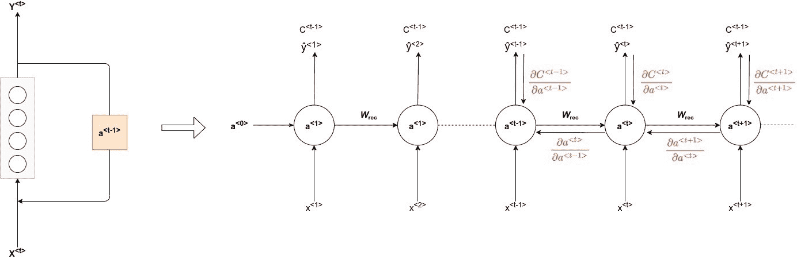

# 理解渐变剪辑(以及它如何解决渐变爆炸问题)

> 原文：<https://web.archive.org/web/https://neptune.ai/blog/understanding-gradient-clipping-and-how-it-can-fix-exploding-gradients-problem>

[梯度裁剪](https://web.archive.org/web/20221206101301/https://deepai.org/machine-learning-glossary-and-terms/gradient-clipping)解决了我们在神经网络反向传播中计算梯度时遇到的最大问题之一。

你看，在反向传递中，我们计算所有权重和偏差的梯度，以便收敛我们的成本函数。这些梯度，以及它们的计算方式，是人工神经网络在各个领域取得成功的秘密。

但是每一件好事都伴随着某种警告。

渐变倾向于封装它们从数据中收集的信息，这些信息还包括大型文本或多维数据中的长期依赖关系。因此，在计算复杂的数据时，事情可能会很快变糟，在这个过程中，你会搞砸你的下一个百万美元模型。

幸运的是，你可以在它发生之前解决它(用渐变剪辑)——让我们先来深入看看这个问题。

到本文结束时，你会知道:

*   什么是渐变剪辑，它是如何发生的？
*   剪辑技术的类型
*   如何在 Tensorflow 和 Pytorch 中实现
*   供您阅读的附加研究

## 反向传播的常见问题

**[反向传播](https://web.archive.org/web/20221206101301/https://discuss.pytorch.org/t/proper-way-to-do-gradient-clipping/191/16)算法是所有现代机器学习应用的核心**，它比你想象的更根深蒂固。

反向传播计算成本函数 w.r.t 的梯度，即网络中的权重和偏差。

它会告诉您需要对您的权重进行的所有更改，以最小化成本函数(实际上，-1*∇的成本函数下降最快，+∇的成本函数上升最快)。

非常酷，因为现在你可以根据你的训练数据来调整所有的权重和偏差。数学很好，都很好。

### 消失渐变

更深层次的网络呢，比如深度循环网络？

成本函数(C)的变化对初始层中的权重或梯度的范数的影响的转换变得非常小，这是由于具有更多隐藏单元的模型复杂度增加，以至于在某个点之后变为零。

这就是我们所说的*消失渐变*。

这阻碍了模型的学习。权重不再有助于成本函数(C)的减少，并且保持不变，影响正向传递中的网络，最终使模型停止。

### 爆炸渐变

另一方面，*爆炸梯度*问题指的是在训练期间梯度范数的**大幅增加。**

此类事件是由长期因素的爆炸造成的，其增长速度可能比短期因素快得多。

这导致网络不稳定，最多不能从训练数据中学习，使得梯度下降步骤不可能执行。

*[arXiv:1211.5063](https://web.archive.org/web/20221206101301/https://arxiv.org/abs/1211.5063)**【cs。LG]:** 高度非线性深度神经网络或递归神经网络的目标函数通常在参数空间中包含由几个参数相乘产生的尖锐非线性。这些非线性在某些地方会引起非常高的导数。当参数接近这样的悬崖区域时，梯度下降更新会将参数弹射得很远，可能会丢失已经完成的大部分优化工作。*

## 深入探讨爆炸梯度问题

为了计算深度递归网络中的梯度，我们使用称为时间反向传播(BPTT)的东西，其中递归模型被表示为深度多层模型(具有无限数量的层)，并且反向传播被应用于展开的模型。



换句话说，这是展开的 RNN 上的**反向传播。**

通过为每个时间步长创建模型的副本，及时展开递归神经网络:

我们用 **a < t >** 表示网络在时间 **t** 的隐藏状态，用 **x < t >** 表示网络在时间 **t** 的输入和 **ŷ < t >** 的输出，用 **C < t >** 表示从时间 **t** 的输出获得的误差。

让我们通过一些方程，看看这一切开始的根源。

在这一点上，我们将偏离经典的 BPTT 方程，重写梯度，以便更好地突出爆炸梯度问题。

这些方程是通过将梯度写成乘积和的形式得到的。

我们还将把我们的流程分成两部分:

*   前进传球
*   偶数道次

### 前进传球

首先，让我们检查在时间步长 **< t >** 神经元的中间激活看起来像什么:

*等式:1.1*

**W_rec** 表示将携带先前时间步长的平移效果的递归矩阵。
**W_in** 是当前时间步长数据进行 matmul 运算的矩阵， **b** 表示偏差。

在时间步长 **< t >** 的中间输出看起来像这样:

*等式:1.2*

请注意，这里的**“σ”代表您选择的任何激活功能**。受欢迎的选择包括 sigmoid，tanh，ReLU。

使用预测值和实际值，我们可以通过对每个时间步长**<>**的各个成本函数求和来计算整个网络的成本函数。

*等式:1.3*

现在，我们有了计算成本函数的一般方程。让我们做一个反向传播，看看梯度是如何计算的。

### 偶数道次

为了从所有时间步长获取梯度，我们再次对时间步长 **< t >** 处的所有中间梯度求和，然后对所有训练样本的梯度进行平均。

*等式:1.4*

所以，我们必须利用导数的链式法则计算任何时间步长 **< t >** 的中间成本函数(C)。

让我们看看依赖图来确定衍生链:

对于时间步长 **< 3 >** ，我们的成本函数将看起来像这样:

*等式:1.5*

*注意:我们只提到了 w.r.t 对 W 的导数，它代表了我们试图优化的所有权重和偏差矩阵。*

正如你在上面看到的，我们得到了激活**a<3>，它将依赖于 **a < 2 >，**等等，直到第一层的激活没有被计算。**

因此，依赖关系将类似于:

甲 <t>→甲 <t-1>→甲 <t-2>→ …→ a <1></t-2></t-1></t>

所以如果我们对 **W** 求导，我们不能简单地把**a<3>视为常数。**

我们需要再次应用链式法则。最后，我们的等式看起来像这样:

*等式:1.6*

我们**总结每个时间步对梯度的贡献。**

换句话说，因为 **W** 用于我们关心的输出的每一步，我们需要通过网络从 **t=3** 一直反向传播到 **t=0** 的梯度。

因此，为了计算时间步长 **< t >** 的激活，我们需要之前时间步长的所有激活。

**注意，∂a < T > /∂a < k >本身就是一个链式法则！**例如:

*等式:1.7*

还要注意的是，因为我们对一个向量的函数求导，结果是一个矩阵(称为[雅可比矩阵](https://web.archive.org/web/20221206101301/https://en.wikipedia.org/wiki/Jacobian_matrix_and_determinant))，它的元素都是逐点求导。

我们可以在等式 1.6 中重写上述梯度:

*等式:1.8*

*等式:1.9*

这表示一个雅可比矩阵，其值是使用 Frobenius 或 2-范数计算的。

为了理解这种现象，我们需要看一下每个时间分量的形式，特别是矩阵因子→ ∂a <t>/ ∂a <k>(等式:1.6，1.9)，其形式为(tk)雅可比矩阵的乘积。</k></t>

同样的，(tk)实数的乘积可以缩小到**零**或者**爆炸**到无穷大，矩阵的乘积也是如此(沿着某个方向 v)。

因此，由于这个时间分量，我们得到了**爆炸梯度**的条件。

### 如何识别和捕捉爆炸渐变？

甚至在训练过程开始之前，很难理解这些梯度问题的识别。

当你的网络是一个深度循环网络时，你必须:

*   持续监控日志，
*   记录成本函数中的突然跳跃

这将告诉你这些跳跃是否频繁，梯度的范数是否呈指数增长。

最好的方法是在可视化仪表板中监控日志。

我们将利用 Neptune AI 令人敬畏的可视化和日志仪表板来监控损失和其他指标，这将有助于识别*爆炸梯度。*您可以阅读下面提到的详细文档来设置您的仪表板。

## 如何修复爆炸渐变:渐变剪辑

有两种技术专注于分解梯度问题。

一种常见的方法是 **L2 正则化**，其在网络的成本函数中应用“权重衰减”。

正则化参数变得更大，权重变得更小，有效地使它们变得不那么有用，结果使模型更加线性。

然而，我们将关注一种在获得结果和易于实现方面更优越的技术——**渐变裁剪**。

### 什么是渐变裁剪？

[梯度削波](https://web.archive.org/web/20221206101301/https://towardsdatascience.com/what-is-gradient-clipping-b8e815cdfb48)是一种方法，其中在通过网络的反向传播期间，将**误差导数改变或削波到阈值**，并使用削波的梯度来更新权重。

通过重新调整误差导数，对权重的更新也将被重新调整，从而显著降低上溢或下溢的可能性。

*具有两个参数 w 和 b 的递归网络中梯度削波的效果梯度削波可以使梯度下降在极其陡峭的悬崖附近表现得更加合理。(左)没有梯度剪裁的梯度下降越过这个小峡谷的底部，然后从悬崖表面接收到非常大的梯度。(右)带渐变剪裁的渐变下降对悬崖的反应更温和。当它爬上悬崖表面时，步长是受限制的，因此它不能被推离解附近的陡峭区域。图改编自 [Pascanu 等人(2013)](https://web.archive.org/web/20221206101301/https://arxiv.org/pdf/1211.5063.pdf) 。*

渐变裁剪有两种实现方式:

*   按值剪裁
*   按范数剪裁

### 按值渐变剪裁

按值裁剪背后的想法很简单。我们**定义最小限幅值和最大限幅值**。

如果一个渐变超过了某个阈值，我们就把这个渐变剪切到这个阈值。如果梯度小于下限，那么我们也将其剪切到阈值的下限。

算法如下:

 ****如果‖**g**≥**max _ threshold**或‖**g**≤**min _ threshold**则

**g** ← **阈值(相应地)**

*如果*结束

其中 *max_threshold* 和 *min_threshold* 是边界值，在它们之间是梯度可以取的值范围。 **g** ，这里是梯度，‖ **g** ‖是 **g** 的范数。

### 按范数渐变剪裁

按规范剪裁背后的思想类似于按值剪裁。不同的是**我们通过将梯度的单位向量与阈值相乘来裁剪梯度。**

算法如下:

 ****如果‖**g**≥**阈值**，则

**g** ← **阈值* g**/**g**

*如果*结束

其中*阈值*为超参数， **g** 为梯度， **g** 为 **g** 的范数。由于**g**/**g**‖是一个单位向量，在重新缩放后，新的 **g** 将具有等于*阈值*的范数。注意，如果‖ **g** ‖ < *c* ，那么我们什么都不需要做，

梯度裁剪确保梯度向量 **g** 的范数至多等于*阈值*。

这有助于梯度下降具有合理的行为，即使模型的损失景观不规则，最有可能是悬崖。

## 深度学习框架中的梯度裁剪

现在我们知道为什么会出现爆炸式渐变，以及渐变裁剪如何解决这个问题。

我们还看到了两种不同的方法，通过这两种方法，您可以将裁剪应用到您的深层神经网络。

让我们看看两种梯度裁剪算法在 Tensorflow 和 Pytorch 等主要机器学习框架中的**实现。**

我们将使用 MNIST 数据集，这是一个用于图像分类的开源数字分类数据。

对于第一部分，我们将进行一些 Tensorflow 和 Keras 通用的数据加载和处理。

### 数据加载

```py
import tensorflow as tf
from tensorflow.keras import Model, layers
import numpy as np
import tensorflow_datasets as tfds

print(tf.__version__)

import neptune.new as neptune
run = neptune.init(project='common/tf-keras-integration',
                   api_token='ANONYMOUS')
```

我们建议您安装 Tensorflow 2 的最新版本，在撰写本文时是 2.3.0，但此代码将与任何未来版本兼容。确保您安装了 2.3.0 或更高版本。在这段摘录中，**我们像往常一样导入了 TensorFlow 依赖项，使用 NumPy 作为我们的矩阵计算库**。

```py
from tensorflow.keras.datasets import mnist

(x_train, y_train), (x_test, y_test) = mnist.load_data()

x_train, x_test = np.array(x_train, np.float32), np.array(x_test, np.float32)

x_train, x_test = x_train.reshape([-1, 28, 28]), x_test.reshape([-1, num_features])

x_train, x_test = x_train / 255., x_test / 255.

train_data = tf.data.Dataset.from_tensor_slices((x_train, y_train))
train_data = train_data.repeat().shuffle(5000).batch(batch_size).prefetch(1)

```

现在，我们来看看如何在 [Tensorflow](/web/20221206101301/https://neptune.ai/integrations/tensorflow) 中实现逐值和逐范数的渐变裁剪。

### TensorFlow

```py
class Net(Model):

    def __init__(self):
        super(Net, self).__init__()

        self.lstm_layer = layers.LSTM(units=num_units)
        self.out = layers.Dense(num_classes)

    def __call__(self, x, is_training=False):

        x = self.lstm_layer(x)

        x = self.out(x)
        if not is_training:

            x = tf.nn.softmax(x)
        return x

network = Net()

```

我们创建了一个简单的 2 层网络，输入层为 LSTM(基于 RNN 的单位)，输出/逻辑层为密集层。

现在，让我们定义要监控和分析的其他超参数和度量函数。

```py
num_classes = 10 
num_features = 784 

learning_rate = 0.001
training_steps = 1000
batch_size = 32
display_step = 100

num_input = 28 
timesteps = 28 
num_units = 32 

def cross_entropy_loss(x, y):

    y = tf.cast(y, tf.int64)

    loss = tf.nn.sparse_softmax_cross_entropy_with_logits(labels=y, logits=x)

    return tf.reduce_mean(loss)

def accuracy(y_pred, y_true):

    correct_prediction = tf.equal(tf.argmax(y_pred, 1), tf.cast(y_true, tf.int64))
    return tf.reduce_mean(tf.cast(correct_prediction, tf.float32), axis=-1)

optimizer = tf.optimizers.Adam(learning_rate)

```

请注意，我们在 logit 层使用 softmax 的交叉熵损失函数，因为这是一个分类问题。您可以随意调整超参数，并使用它来更好地理解流程。

现在，让我们定义优化函数，我们将计算梯度，损失，并优化我们的权重。注意**这里我们将应用渐变剪辑。**

```py
def run_optimization(x, y):

    with tf.GradientTape() as tape:

        pred = network(x, is_training=True)

        loss = cross_entropy_loss(pred, y)

    trainable_variables = network.trainable_variables

    gradients = tape.gradient(loss, trainable_variables)

    gradients = [(tf.clip_by_value(grad, clip_value_min=-1.0, clip_value_max=1.0))
                                  for grad in gradients]

    optimizer.apply_gradients(zip(gradients, trainable_variables))
```

在第 14 行，我们通过迭代第 11 行计算的所有渐变来应用逐值渐变。Tensorflow 在其 API 中有一个显式的函数定义来应用裁剪。

要实现梯度裁剪，只需将第 14 行改为:

```py
gradients = [(tf.clip_by_norm(grad, clip_norm=2.0)) for grad in gradients]

```

让我们定义一个培训循环并记录指标:

```py
for step, (batch_x, batch_y) in enumerate(train_data.take(training_steps), 1):

    run_optimization(batch_x, batch_y)

    if step % display_step == 0:
        pred = lstm_net(batch_x, is_training=True)
        loss = cross_entropy_loss(pred, batch_y)
        acc = accuracy(pred, batch_y)

        run['monitoring/logs/loss'].log(loss)
        run['monitoring/logs/acc'].log(acc)

        print("step: %i, loss: %f, accuracy: %f" % (step, loss, acc))
```

### Keras

Keras 作为 TensorFlow API 的包装器，使事情更容易理解和实现。Keras API 让你专注于定义的东西，并负责梯度计算，在后台反向传播。**渐变裁剪可以简单到在函数中传递一个超参数。**我们来看看具体情况。

```py
from tensorflow.keras.layers import Dense, LSTM
from tensorflow.keras.models import Sequential
from tensorflow.keras.optimizers import SGD
from tensorflow.keras.callbacks import Callback

import neptune
from neptune.new.integrations.tensorflow_keras import NeptuneCallback

import neptune.new as neptune
run = neptune.init(project='common/tf-keras-integration',
                   api_token='ANONYMOUS')

model = Sequential()
model.add(LSTM(units=num_units))
model.add(Dense(num_classes))

```

我们现在要声明渐变裁剪因子，最后用 Keras 的“awesome”来拟合模型。适合”的方法。

```py
optimizer = SGD(lr=0.01, momentum=0.9, clipvalue=1.0)
model.compile(loss='binary_crossentropy', optimizer=optimizer)

neptune_cbk = NeptuneCallback(run=run, base_namespace='metrics')
history = model.fit(train_data, epochs=5, verbose=1,steps_per_epoch=training_steps,callbacks=[neptune_cbk])

```

Keras 优化器负责额外的梯度计算请求(如背景中的裁剪)。开发人员只需要将这些值作为超参数传递。

为了实现按范数裁剪，只需将第 11 行中的超参数改为:

```py
optimizer = SGD(lr=0.01, momentum=0.9, clipnorm=1.0)

```

### PyTorch

尽管在 Tensorflow 和 Pytorch 中，梯度裁剪的实现在算法上是相同的，但在流程和语法上是不同的。

因此，在使用 [Pytorch](/web/20221206101301/https://neptune.ai/integrations/pytorch-lightning) 实现的这一部分中，我们将再次加载数据，但现在使用 Pytorch DataLoader 类，并使用 pythonic 语法计算梯度，并使用我们学习的两种方法裁剪它们。

```py
import os
import argparse
import torch
import torch.nn as nn
import torch.nn.functional as F
import torch.optim as optim
import torchvision
from torch.optim.lr_scheduler import StepLR

import neptune

import neptune.new as neptune
run = neptune.init(project='common/pytorch-integration',
                   api_token='ANONYMOUS')

```

现在，让我们在 PyTorch 中声明一些超参数和数据加载器类。

```py
n_epochs = 2
batch_size_train = 64
batch_size_test = 1000
learning_rate = 0.01
momentum = 0.5
log_interval = 10

random_seed = 1
torch.backends.cudnn.enabled = False
torch.manual_seed(random_seed)

device = torch.device('cuda' if torch.cuda.is_available() else 'cpu')

sequence_length = 28
input_size = 28
hidden_size = 128
num_layers = 2
num_classes = 10
batch_size = 100
num_epochs = 2
learning_rate = 0.01

os.makedirs('files',exist_ok=True)
train_loader = torch.utils.data.DataLoader(
  torchvision.datasets.MNIST('files/', train=True, download=True,
                             transform=torchvision.transforms.Compose([
                               torchvision.transforms.ToTensor(),
                               torchvision.transforms.Normalize(
                                 (0.1307,), (0.3081,))
                             ])),
  batch_size=batch_size_train, shuffle=True)

test_loader = torch.utils.data.DataLoader(
  torchvision.datasets.MNIST('files/', train=False, download=False,
                             transform=torchvision.transforms.Compose([
                               torchvision.transforms.ToTensor(),
                               torchvision.transforms.Normalize(
                                 (0.1307,), (0.3081,))
                             ])),
  batch_size=batch_size_test, shuffle=True)

```

**模特时间！我们将声明相同的模型，将 LSTM 作为输入图层，将 Dense 作为 logit 图层。**

```py
class Net(nn.Module):
    def __init__(self, input_size, hidden_size, num_layers, num_classes):
        super(Net, self).__init__()
        self.hidden_size = hidden_size
        self.num_layers = num_layers
        self.lstm = nn.LSTM(input_size, hidden_size, num_layers, batch_first=True)
        self.fc = nn.Linear(hidden_size, num_classes)

    def forward(self, x):

        h0 = torch.zeros(self.num_layers, x.size(0), self.hidden_size).to(device)
        c0 = torch.zeros(self.num_layers, x.size(0), self.hidden_size).to(device)

        out, _ = self.lstm(x, (h0, c0))  

        out = self.fc(out[:, -1, :])
        return out

model = Net(input_size, hidden_size, num_layers, num_classes).to(device)

criterion = nn.CrossEntropyLoss()
optimizer = torch.optim.Adam(model.parameters(), lr=learning_rate)

```

**现在，我们将定义训练循环，其中梯度计算以及优化器步骤将被定义。这里我们还将定义我们的裁剪指令。**

```py
total_step = len(train_loader)
for epoch in range(num_epochs):
    for i, (images, labels) in enumerate(train_loader):
        images = images.reshape(-1, sequence_length, input_size).to(device)
        labels = labels.to(device)

        outputs = model(images)
        loss = criterion(outputs, labels)

        optimizer.zero_grad()
        loss.backward()

        nn.utils.clip_grad_value_(model.parameters(), clip_value=1.0)

        optimizer.step()

        run['monitoring/logs/loss'].log(loss)
        if (i+1) % 100 == 0:
            print ('Epoch [{}/{}], Step [{}/{}], Loss: {:.4f}'
                   .format(epoch+1, num_epochs, i+1, total_step, loss.item()))

```

由于 PyTorch 将渐变保存在参数名称本身(a.grad)中，我们可以将模型参数直接传递给裁剪指令。第 17 行描述了如何使用 torch 的 *clip_grad_value_* 函数应用逐值剪辑。

**要应用按规范裁剪，您可以将此行改为:**

```py
nn.utils.clip_grad_norm_(model.parameters(), max_norm=2.0, norm_type=2)
```

你可以在这里看到上述指标的可视化[。](https://web.archive.org/web/20221206101301/https://app.neptune.ai/common/pytorch-integration/e/PYTOR1-181/all)

至此，您已经了解了裁剪的作用和实现方法。现在，在本节中，我们将看到它的实际应用，这是一个前后对比的场景，可以让您理解它的重要性。

为此选择的框架将是 Pytorch，因为它具有动态计算范数并将其存储在变量中的特性。

让我们从通常的依赖项导入开始。

```py
import time
from tqdm import tqdm
import numpy as np
from sklearn.datasets import make_regression
import torch
import torch.nn as nn
import torch.nn.functional as F
import torch.optim as optim
from torchvision import datasets, transforms

import neptune.new as neptune
run = neptune.init(project='common/pytorch-integration',
                   api_token='ANONYMOUS')

```

为了保持处理小的规范，我们将只为我们的神经网络定义两个线性/密集层。

```py
class Net(nn.Module):
    def __init__(self):
        super(Net, self).__init__()
        self.fc1 = nn.Linear(20, 25)
        self.fc2 = nn.Linear(25, 1)

        self.ordered_layers = [self.fc1,
                               self.fc2]
    def forward(self, x):
        x = F.relu(self.fc1(x))
        outputs = self.fc2(x)
        return outputs
```

我们创建了" *ordered_layers"* 变量，以便循环访问它们来提取规范。

```py
def train_model(model,
                criterion,
                optimizer,
                num_epochs,
                with_clip=True):
    since = time.time()
    dataset_size = 1000

    for epoch in range(num_epochs):
        print('Epoch {}/{}'.format(epoch, num_epochs))
        print('-' * 10)
        time.sleep(0.1)
        model.train()  

        running_loss = 0.0
        batch_norm = []

        for idx,(inputs,label) in enumerate(tqdm(train_loader)):
            inputs = inputs.to(device)

            optimizer.zero_grad()

            logits = model(inputs)
            loss = criterion(logits, label)

            loss.backward()

            if with_clip:
                nn.utils.clip_grad_value_(model.parameters(), clip_value=1.0)

            for layer in model.ordered_layers:
                norm_grad = layer.weight.grad.norm()
                batch_norm.append(norm_grad.numpy())

            optimizer.step()

            running_loss += loss.item() * inputs.size(0)

        epoch_loss = running_loss / dataset_size

        if with_clip:
           run['monitoring/logs/grad_clipped'].log(np.mean(batch_norm))
        else:
            run['monitoring/logs/grad_nonclipped'].log(np.mean(batch_norm))

        print('Train Loss: {:.4f}'.format(epoch_loss))

        print()

    time_elapsed = time.time() - since
    print('Training complete in {:.0f}m {:.0f}s'.format(
        time_elapsed // 60, time_elapsed % 60))
```

这是一个基本的训练函数，包含包含梯度计算和优化步骤的主事件循环。这里，我们从所说的*“ordered _ layers”*变量中提取范数。现在，我们只需要初始化模型并调用这个函数。

```py
def init_weights(m):
    if type(m) == nn.Linear:
        torch.nn.init.xavier_uniform(m.weight)
        m.bias.data.fill_(0.01)

if __name__ == "__main__":
    device = torch.device("cpu")

    X,y = make_regression(n_samples=1000, n_features=20, noise=0.1, random_state=1)

    X = torch.Tensor(X)
    y = torch.Tensor(y)

    dataset = torch.utils.data.TensorDataset(X,y)
    train_loader = torch.utils.data.DataLoader(dataset=dataset,batch_size=128, shuffle=True)

    model = Net().to(device)
    model.apply(init_weights)
    optimizer = optim.SGD(model.parameters(), lr=0.07, momentum=0.8)
    criterion = nn.MSELoss()

    norms = train_model(model=model,
                        criterion=criterion,
                        optimizer=optimizer,
                        num_epochs=50,
                        with_clip=True 
                        )
```

这将为您指定的指标创建一个图表，如下所示:

您可以看到有和没有剪裁的规范之间的差异。在没有 **限幅的实验**期间，**范数在几个周期之后爆炸到 NaN，而具有** **限幅的实验**相当*稳定*并且*收敛*。这里可以看到海王星实验[这里](https://web.archive.org/web/20221206101301/https://app.neptune.ai/theaayushbajaj/sandbox/e/SAN-11/charts)[可以看到 colab 笔记本里的源代码](https://web.archive.org/web/20221206101301/https://drive.google.com/file/d/1CgxOprdeZhGfVAKvnIZpu1E98S7Tyr4d/view?usp=sharing)。

## 你已经到达终点了！

恭喜你！你已经成功地理解了渐变裁剪方法，它解决了什么问题，以及*爆炸渐变*问题。

下面是一些尾注和未来的研究内容，供你参考。

### 伐木为王！

每当您在一个大型网络上进行一个大项目时，请确保您的日志记录过程是彻底的。

***爆炸梯度*** **只有在你记录和监控得当的情况下才能被高效捕捉。**

您可以使用 Tensorboard 中当前的日志记录机制在 Neptune 的仪表板中可视化和监控其他指标。你要做的就是简单地安装 *neptune-client* 来完成这个任务。在[这里](https://web.archive.org/web/20221206101301/https://docs.neptune.ai/getting-started/installation/installation-neptune-tensorboard.html)浏览文档。

### **研究**

*   这篇[论文](https://web.archive.org/web/20221206101301/https://arxiv.org/pdf/1905.11881.pdf)解释了如何使用梯度裁剪来提高深度网络中的训练速度。
*   这篇[论文](https://web.archive.org/web/20221206101301/http://arxiv.org/pdf/2009.03106v1.pdf)解释了梯度裁剪在差分私有神经网络中的使用。

目前就这些，敬请关注更多！再见！********