# 从机器学习的角度理解向量

> 原文：<https://web.archive.org/web/https://neptune.ai/blog/understanding-vectors-from-a-machine-learning-perspective>

如果你从事机器学习，你将需要使用[向量](https://web.archive.org/web/20221207160113/https://deepai.org/machine-learning-glossary-and-terms/vector#:~:text=Vectors%20are%20commonly%20used%20in,model%20is%20vectorizing%20the%20data.&text=A%20support%20vector%20machine%20analyzes,for%20a%20given%20data%20set.)。几乎没有 ML 模型在项目生命周期的某一点不使用向量。

虽然向量被用于许多其他领域，但是它们在 ML 中的使用方式有所不同。这可能会令人困惑。从 ML 的角度来看，向量的潜在混淆是我们在 ML 项目的不同阶段出于不同的原因使用它们。

这意味着向量的严格数学定义可能无法传达您在 ML 上下文中处理和理解向量所需的所有信息。例如，如果我们认为一个典型的 ML 项目的简单生命周期是这样的:

…然后有三个不同的阶段。每一个都有稍微不同的向量用例。在本文中，我们将通过查看与这些阶段相关的向量来澄清这一切:

1.  **输入**:机器不能像你我一样阅读文字或看图像。它们需要输入被转换或编码成数字。向量和矩阵(我们一会儿会讲到)将文本和图像等输入表示为数字，这样我们就可以训练和部署我们的模型。我们不需要对向量有很深的数学理解，就可以用它们来为我们的输入编码信息。我们只需要知道向量与特征之间的关系，以及如何将这些特征表示为向量。
2.  模型:大多数 ML 项目的目标是创建一个执行某些功能的模型。它可以对文本进行分类，或者预测房价，或者识别情绪。在深度学习模型中，这是通过神经网络实现的，其中神经网络层使用线性代数(如矩阵和向量乘法)来调整你的参数。这就是向量的数学定义与 ML 相关的地方。在这篇文章中，我们不会深入线性代数的细节，但是我们会看看向量和矩阵的重要方面，我们需要使用这些模型。这包括理解向量空间以及为什么它们对 ML 很重要。
3.  **输出**:根据我们的目标，我们的 ML 模型的输出可以是一系列不同的实体。如果我们预测房价，输出将是一个数字。如果我们对图像进行分类，输出将是图像的类别。然而，输出也可以是向量。例如，NLP 模型像[通用句子编码器](https://web.archive.org/web/20221207160113/https://www.tensorflow.org/hub/tutorials/semantic_similarity_with_tf_hub_universal_encoder)(使用)接受文本，然后输出一个表示句子的向量(称为嵌入)。然后，您可以使用这个向量来执行一系列操作，或者作为另一个模型的输入。您可以执行的操作包括在向量空间中将相似的句子聚集在一起，或者使用余弦相似性等操作来查找不同句子之间的相似性。理解这些操作将有助于您了解如何使用像 NLP 模型这样输出向量的模型。

**注**:你可以在 [Github](https://web.archive.org/web/20221207160113/https://github.com/choran/vectors_ml) 上找到这个帖子的所有代码。

## 标量、向量和矩阵

向量并不是机器处理和转换输入时表示数字的唯一方式。虽然我们在这篇文章中主要关注向量，但我们也需要定义其他表示数字的结构。

这将有助于我们在接下来的部分，我们需要了解向量如何与其他结构相互作用。出于本节的目的，让我们将关于[房价](https://web.archive.org/web/20221207160113/https://www.kaggle.com/harlfoxem/housesalesprediction)的 Kaggle 数据集作为我们的参考框架，看看我们如何使用标量、向量和矩阵来表示这些数据。

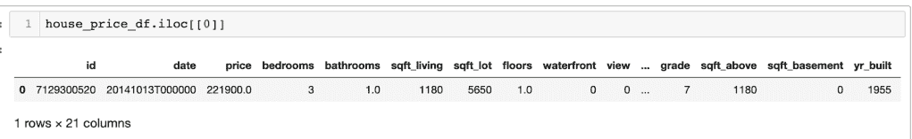

*Our house price data has 18 potential features (21 less id, data and the price we want to predict) that a model could use to help it predict the price. *

**标量**:对我们来说，标量只是数字。我们可以把它们想象成我们使用的任何常规值。我们数据集中的任何单个值都代表一个标量。例如，我们房价数据中的卧室数量将是一个标量。如果我们只使用一个特征作为房价数据的输入，那么我们可以将其表示为一个标量值。

```py
print(house_price_df['bedrooms'].values[0])
3
```

**向量**:在我们的房价数据中，似乎有不止一个可用的特征。我们如何表示多个特征？当试图预测房价时，房子的总面积将是一条有用的信息。最简单的形式是，我们可以把向量看作一维数据结构。我们稍后将更详细地定义一个 vector，但是现在可以把它看作一个列表，让我们把更多的特性传递给我们的模型:

```py
print(house_price_df[["bedrooms", "sqft_lot"]].values[:1])
[[   3 5650]]
```

我们还可以通过以列而不是行的格式排列数据来创建一维向量:

```py
print(house_price_df[["bedrooms", "sqft_lot"]].values.T[:2, :1].shape)
[[   3]
 [5650]]
```

矩阵:到目前为止，我们只看了数据集中的第一栋房子。如果我们需要批量通过多个房子，有他们的卧室和平方英尺/平方米的价值？这就是矩阵的用武之地。您可以将矩阵视为二维数据结构，其中两个维度指的是行数和列数:

```py
print(house_price_df[["bedrooms", "sqft_lot"]].values[:2])
[[   3 5650]
 [   3 7242]]
```

这是一个包含行和列的二维数据结构:

```py
print(house_price_df[["bedrooms", "sqft_lot"]].values[:2].shape)
(2, 2)
```

我们可以添加更多的行，查看前 3 个房价数据，看看这如何改变我们矩阵的形状:

```py
print(house_price_df[["bedrooms", "sqft_lot"]].values[:3].shape)
(3, 2)
```

需要注意的一点是，我们之前创建的向量实际上是一维矩阵。从这个意义上说，向量也可以是矩阵，但反之则不然。矩阵不能是向量。

现在我们已经澄清了一些术语，让我们看看如何使用向量作为我们深度学习模型的输入。

你可以看到 TensorBoard 如何处理标量和向量

## 输入:作为编码器的矢量

正如我们前面提到的，我们在 ML 中使用向量的方式非常依赖于我们是处理输入、输出还是模型本身。当我们使用向量作为输入时，主要用途是它们能够以我们的模型可以处理的格式编码信息，然后输出对我们的最终目标有用的东西。让我们用一个简单的例子来看看向量是如何被用作编码器的。

假设我们想要创建一个写新大卫·鲍依歌曲的 ML 模型。要做到这一点，我们需要在实际的大卫·鲍依歌曲上训练模型，然后用输入文本提示它，然后模型将把它“翻译”成大卫·鲍依式的歌词。从高层次来看，我们的模型应该是这样的:

### 我们如何创建输入向量？

我们需要向我们的模型传递大量大卫·鲍依的歌词，这样它就可以像齐格·星尘一样学习写作。我们知道，我们需要将歌词中的信息编码成一个向量，以便模型可以处理它，神经网络可以开始对我们的输入进行大量的数学运算，以调整参数。另一种思考方式是，我们使用向量来表示我们希望模型学习的特征。

该模型可能试图预测房价，使用我们之前使用的房价数据集来解释标量、向量和矩阵之间的差异。在这种情况下，我们可能会传递诸如房子大小、卧室数量、邮政编码之类的信息。这些都是可能有助于模型预测更准确的房价的特征。很容易看出我们如何为我们的房价模型创建一个输入向量。当我们创建一个包含卧室数量和房屋平方英尺/平方米值的向量时，我们已经展示了如何对这些数据进行编码:

```py
print(house_price_df[["bedrooms", "sqft_lot"]].values[:1])
[[   3 5650]]
```

我们将其描述为一个二维向量，因为它编码了房价数据集的两个部分。我们不应该将这与矩阵是二维数据结构的事实相混淆。当我们说一个矩阵是二维的，我们的意思是它有 2 个索引，行和列。

要标识矩阵中的单个元素，需要指定其行和列的位置。而在 vector 中，它只有一个索引，所以只需要指定一个索引。可以把它想象成对一个列表进行寻址，你只需要确定列表的索引。而矩阵就像一个 numpy 数组，需要指定行和列的值。

### 但是一句话呢？

房价数据集已经包含了创建特征向量所需的所有列，我们可以将这些列用作模型的输入。数据集本身对它们进行了描述。因此，很容易将数据转换或编码成矢量格式。然而，我们的鲍伊歌词不容易转换成矢量。相反，我们需要找到一些规则来编码歌词中包含的信息。

一个简单的方法是给每个单词分配一个数字，并用它来创建一个向量。这可以通过计数矢量化来完成，您可以在 [Scikit Learn](https://web.archive.org/web/20221207160113/https://scikit-learn.org/stable/modules/generated/sklearn.feature_extraction.text.CountVectorizer.html) 中找到一种方法。

阅读如何将 [Sklea](https://web.archive.org/web/20221207160113/https://docs.neptune.ai/integrations-and-supported-tools/model-training/sklea) 与 Neptune 集成，并跟踪您的分类器、回归器和 k-means 聚类结果。

在这里，具体的实现并不重要，只是我们希望找到一种方法，以类似于 house 数据的方式来表示句子。举个例子，就拿鲍伊《一个自由节日的记忆》中的两行歌词来说吧:

首先我们需要创建一个固定长度的向量。在我们根据房价数据示例创建的向量中，每栋房子有 2 个数据点。通过从数据集中添加更多的特征，我们可以很容易地将它变成一个 18 维向量。

为了尝试和确定我们的 Bowie 歌词向量的长度，我们可以用上面两行来代表我们的整个 Bowie 歌词语料库。然后我们有 9 个独特的词或特征。

```py
def get_vocab(text):
    vocab = set()
    for line in text:
        vocab.update([word.lower() for word in line.split()])
    return(vocab)

vocab = get_vocab(lyric_list[0:2])
print(f'There are {len(vocab)} unique words in these lyrics:')
print(f'They are: {vocab}')

```

```py
There are 9 unique words in these lyrics:
They are: {'children', 'in', 'of', 'grass', 'gathered', 'the', 'end', "summer's", 'dampened'}
```

我们这里的输入向量将包含 9 个特征。显然，就输入时可能用到的所有单词而言，这是一个很小的数字。如果我们试图编码一个包含我们不认识的单词的句子，我们可以忽略它。如果该单词确实存在，我们将计算它在输入中出现的次数，并将该值添加到 vocab 中表示该单词的向量维数或特征中。

我们的特征看起来像这样:

```py
count_vector = vector_lookup(lyric_list[0:2])
print(count_vector)

```

```py
{0: 'children', 1: 'in', 2: 'of', 3: 'grass', 4: 'gathered', 5: 'the', 6: 'end', 7: "summer's", 8: 'dampened'}
```

如果单词“children”在输入中出现 2 次，那么向量的第一维将是 2。如果不发生，则为 0。如果我们遇到一个不在词汇库中的单词，我们将什么也不做，因为它没有特征或维度。如果我们想训练出最好的鲍伊歌词写作模型，这显然是不理想的。在下一个例子中，我们将会看到更好的输入编码方式。

如果我们的输入句子是“在草地上玩耍的孩子们”，那么表示这个句子的输入向量将如下所示:

```py
print(input_vector(count_vector, "The children played in the grass"))

```

```py
[1, 1, 0, 1, 0, 2, 0, 0, 0]
```

单词*‘children’*出现一次，是我们向量的第一个特征，所以是 1。的*没有出现在输入句中，所以为零。单词“*”出现了两次，因此索引 5 处的特征的值为 2。**

 *现在让我们使用“一个自由节日的记忆”中的所有歌词，看看我们对同一个句子的输入向量是什么样子的:

```py
count_vector = vector_lookup(lyric_list)
full_vec = input_vector(count_vector, "The children played in the grass")
print(f'The new feture size is {len(count_vector)}')
print(full_vec)
```

新的特征尺寸是 129

```py
[0, 0, 0, 0, 0, 0, 0, 0, 0, 0, 0, 0, 0, 0, 0, 0, 1, 0, 0, 0, 0, 0, 0, 0, 0, 0, 0, 0, 0, 0, 0, 0, 0, 0,
0, 0, 0, 0, 0, 0, 0, 0, 0, 0, 0, 0, 0, 0, 0, 0, 0, 0, 0, 0, 0, 0, 0, 1, 0, 0, 0, 0, 2, 0, 0, 0, 0, 0,
 0, 0, 0, 0, 0, 0, 0, 0, 0, 0, 0, 1, 0, 0, 0, 0, 0, 0, 0, 0, 0, 0, 0, 0, 0, 0, 0, 0, 0, 0, 0, 0, 0, 0,
 0, 0, 0, 0, 0, 0, 0, 0, 0, 0, 0, 1, 0, 0, 0, 0, 0, 0, 0, 0, 0, 0, 0, 0, 0, 0, 0]
```

我们看到更多的零，因为有更多的特征，而且它们并不都出现在每个输入句子中。这就是我们所说的稀疏向量——它不是“密集”分布的。大多数特征不编码任何信息，因为它们是空的(它们被设置为零)。

这是低效的，因为大多数特征不包含太多信息。在实践中，我们可以通过用更少的零创建“更密集”的向量的方法来解决这个问题。

### 密集向量是什么样子的？

我们为输入 Bowie lyric 模型而创建的向量很少。我们可以使用一个完全独立的模型来接收一个句子并返回一个密集的向量，而不是创建我们自己的向量。然后我们可以用它作为我们自己学习鲍伊歌词模型的输入。

这是一个将模型链接在一起的例子，其中您使用一个模型的输出作为另一个模型的输入。这也是一个模型输出向量的例子，我们将在后面的文章中讨论。

通用句子编码器 (USE)是一个可以接受文本输入并输出向量的模型的例子，就像我们需要的 Bowie 模型一样。使用将产生包含 512 个维度的输出向量。这些可以被认为是我们新的输入向量，而不是我们稀疏填充的计数向量。

如前所述，这些向量包含 512 个特征或维度。有趣的是，向量的大小并不随[输入句子](https://web.archive.org/web/20221207160113/https://www.tensorflow.org/hub/tutorials/semantic_similarity_with_tf_hub_universal_encoder)的大小而变化:

```py
sample_sentences = ["We scanned the skies with rainbow eyes",
                    "We looked up into the sky",
                    "It was raining and I saw a rainbow",
                    "This sentence should not be similar to anything",
                    "Erer blafgfgh jnjnjn ououou kjnkjnk"]

logging.set_verbosity(logging.ERROR)

sentence_embeddings = embed(sample_sentences)

for i, sentence_embedding in enumerate(np.array(sentence_embeddings).tolist()):
  print("Lyrics: {}".format(sample_sentences[i]))
  print("Embedding size: {}".format(len(sentence_embedding)))
  sentence_embedding_snippet = ", ".join(
      (str(x) for x in sentence_embedding[:3]))
  print("Embedding: [{}, ...]n".format(sentence_embedding_snippet))

```

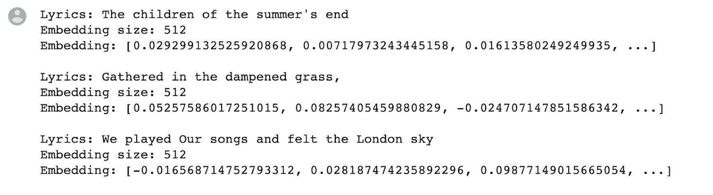

如果你仔细观察这些向量，你会发现在所有的特征中很少有零。这就是为什么它们被描述为“密集”向量。另一件要注意的事情是，我们不知道这些特性意味着什么。在我们的 Bowie 歌词示例中，我们定义了特性，因此我们确切地知道每个输入向量维度与什么相关。相比之下，对于使用，我们不知道第 135 维是否与大写、长度或特定单词相关。甚至可能没有这些特征的尺寸，我们只是猜测。

在我们对维度知之甚少的情况下创建向量似乎毫无意义。但这是向量的一个关键之处，它让向量在 ML 中变得如此强大。我们不需要理解任何关于向量的维度，或者它们是如何被创建的，就可以使用它们。我们需要理解的只是我们可以对向量执行的操作，以及这些向量所在的空间。但是在我们看当我们把一个向量传递给模型时会发生什么之前，我们需要看一下我们如何把矩阵作为输入。

**鲍伊歌词矩阵**

```py
import numpy as np
np.set_printoptions(threshold=10)
lyrics = []
for lyric in lyric_list[15:18]:
    print(lyric)
    vec = input_vector(count_vector, lyric)
    lyrics.append(vec)

lyric_matrix = np.array(lyrics)
print(f'Matrix shape: {lyric_matrix.shape})')
print(lyric_matrix)

```

```py
And fly it from the toppest top
of all the tops that man has
pushed beyond his Brain.
Matrix shape: (3, 129))
[[0 0 0 ... 0 0 0]
 [1 0 0 ... 0 0 0]
 [0 0 0 ... 0 0 0]]
```

正如我们所提到的，矩阵是向量的矩形阵列。它们是使我们能够以二维格式存储信息的数据结构。对于我们的 Bowie 模型，我们可能希望成批传递句子，而不是一次一个句子作为输入。为此，我们将信息存储在一个矩阵中，并将其传递给我们的模型。然后，模型可以以类似于向量的方式处理矩阵。在图像处理中，矩阵用于表示作为模型输入的图像。例如，著名的 [Minst 数据集](https://web.archive.org/web/20221207160113/https://www.tensorflow.org/datasets/catalog/mnist)使用 28 X 28 矩阵来表示灰度数字。行中的每个元素都是 0-255 之间的值，代表其灰度强度。

## 模型:向量作为变压器

此时，我们已经将输入表示为一个向量，并希望用它来训练我们的模型。换句话说，我们希望我们的模型学习一种转换，这种转换使用我们输入中的特性来返回实现某个目标的输出。我们已经讨论了这种目标的一个例子:

1.  **预测房价**:我们展示了如何创建一个向量，该向量对房价数据中所需的特征进行编码。在这个场景中，我们想要学习一个使用这些特性来输出房子的预测价格的转换。
2.  **创建 Bowie 风格的歌词**:对于我们的 Bowie 模型，输出是文本，转换是将输入的句子转换成 Bowie 风格的歌词。
3.  **句子编码器**:使用模型将输入句子转换成输出向量。它的目标是创建一个输出句子，使用输入句子的特征，在一个叫做向量空间的东西中表示那个句子。

神经网络是一种创建可以学习这些转换的模型的方法，因此我们可以将我们的房价数据转化为预测，将我们枯燥的句子转化为鲍伊式的思考。

具体来说，神经网络的[隐藏层](https://web.archive.org/web/20221207160113/https://deepai.org/machine-learning-glossary-and-terms/hidden-layer-machine-learning)接收我们的矢量化输入，创建一个权重矩阵，然后使用该权重矩阵创建我们想要的输出:

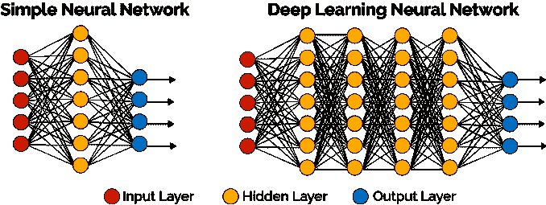

*The hidden layer is where the computation takes place to learn the transformations we need to create our outputs. Source [DeepAi.org](https://web.archive.org/web/20221207160113/https://deepai.org/machine-learning-glossary-and-terms/hidden-layer-machine-learning)*

我们不需要进入神经网络如何工作的细节。但我们确实需要了解更多关于向量和矩阵的知识，以及它们是如何相互作用的，这样我们才能理解我们为什么使用它们，更重要的是，我们如何使用这些网络的输出。因此，在本节中，我们将:

1.  **定义向量**:我们需要从数学的角度简要定义向量，并展示上下文与我们使用它们作为输入的方式有何不同。
2.  **向量空间**:向量生活在向量空间中。如果你理解了这些空间是如何工作的，那么你就能理解为什么向量在 ML 中很重要的大部分原因。
3.  **向量和矩阵运算**:我们通过将向量与矩阵相乘来操作向量。它们挤压、挤压、移动和变换向量，直到我们的模型学会了一些我们可以用于输出的东西。这些操作对最后一节很重要，在最后一节中，我们将看看当我们的模型输出向量时使用的常见操作，就像使用模型对我们的 Bowie 歌词所做的那样。

本节的目标是帮助我们理解，我们在 ML 模型中使用向量学习函数的方式与我们在输入和输出中使用向量的方式略有不同。

这就是为什么 ML 项目中管道阶段的环境是重要的。关于向量的有用知识可能是不同的，这取决于你想用你的向量做什么。希望了解这一点能对你未来的 ML 项目有所帮助。

### 什么是向量？

以前，我们将向量定义为一系列数字或一维数据结构。这有助于我们理解如何将来自数据集的信息编码为输入传递给 ML 模型。

在这些模型中，一旦接收到输入，重要的是要理解向量是具有不同寻常的大小和方向的对象:

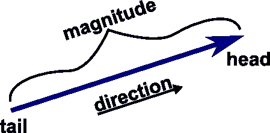

*Most people will be familiar with the definition of a vector as being something that has both magnitude and direction. Source [MathInsight.org](https://web.archive.org/web/20221207160113/https://mathinsight.org/vector_introduction)*

我们不会在这个定义上花时间，因为大多数人都熟悉它，但是我们要注意:

1.  **几何**:这个定义有一个几何方面，因为它有一个方向。这意味着它存在于一个几何空间中，我们可以对向量进行操作，改变它的方向和/或大小。这也意味着这些空间可以有维度。上面的例子显示了一个二维向量，但它可以有三维甚至更多维，这使得人们很难想象。
2.  **与输入的相关性**:我们在这里也可以看到，理解一个矢量有大小和方向并不能真正帮助我们将输入编码为矢量。我们不需要理解我们从房价数据中创建的向量的方向来创建有用的输入。

MathInsight 网站有一个[很好的工具](https://web.archive.org/web/20221207160113/https://mathinsight.org/vector_introduction)来探索向量的一些重要性质。您可以操纵向量在图形中移动，但请注意向量的大小和方向不会改变:

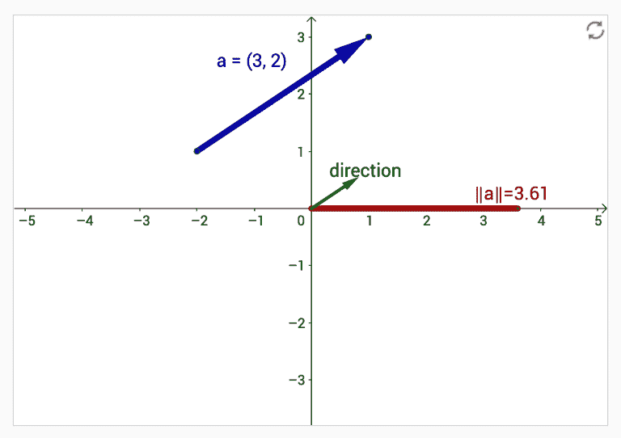

*We can see the vector has a magnitude and direction, and is located in a certain part of the graph.*

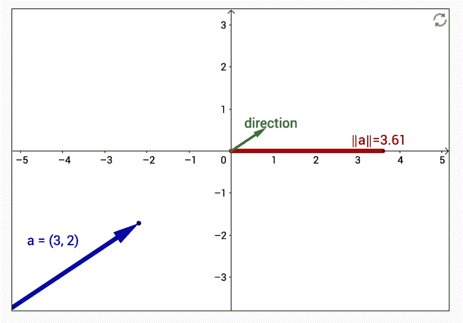

*We note that we can move the vector to a different part of the graph, but the magnitude and direction are still the same. The point in space to which the vector now points is different.*

从上面的例子中我们可以看到，一个向量存在于一个叫做向量空间的空间中，我们可以操纵这个向量在这个空间中移动。理解这个向量空间的本质是在 ML 中使用向量的关键。我们需要定义向量空间的含义。

### 向量空间

我们可以把向量空间想象成包含所有向量的区域。我们可以认为这些空间与向量的维数有关。如果我们上面的向量例子是二维的，它可以用 X 和 Y 坐标来描述，就像你在 matplotlib 上画的大多数二维图形一样:

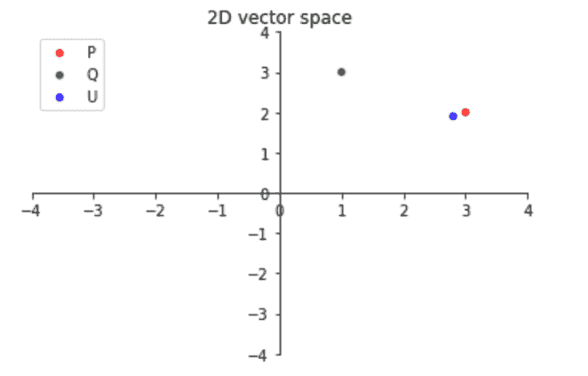

*2-D vector spaces are similar to common graphs we would draw in matplotlib. Notice here that we have drawn the vectors as points without the arrows. This is to show that we can also think of vectors as points in these vector spaces.*

向量空间的关键在于它是一种定义一组向量的方法，我们可以在其中执行运算，比如向量加法和乘法。结果，我们可以得到三维向量空间，其中向量由 3 个坐标定义。这些向量空间之间的唯一区别是它们的维度。

我们可以对每个空间中的向量执行相同的操作，例如:

1.  **加法**:我们将两个向量相加，创建第三个向量。
2.  **乘法**:我们可以将一个矢量乘以一个标量来改变矢量的大小。

这些向量空间具有定义所有这些操作如何发生的性质。换句话说，向量空间具有以下性质:

1.  加法必须创建一个新的矢量。
2.  加法是**可换的**，即向量 A +向量 B ==向量 B +向量 A。
3.  必须有一个**零向量**，当加到另一个向量上时返回该向量的单位向量，即 0 +向量 A ==向量 A + 0 ==向量 A。
4.  对于每个矢量，都有一个指向相反方向的反向矢量。
5.  向量加法也是**联想**，即向量 A +(向量 B +向量 C) ==(向量 A +向量 B) +向量 C。

向量空间对 ML 很重要，因为它们是我们所有变换发生的空间，在这里输入向量被操纵以创建我们输出所需的权重。我们不需要深入这些转换的细节，但是我们需要提到一些在下一节中很重要的操作，在下一节中，我们尝试对我们的输出执行操作以实现一些最终目标。

### 向量和矩阵运算

有一些关键的向量操作会在大多数 ML 项目中频繁出现，所以我们需要在这里涵盖它们。在下一节中，我们将查看这些操作的一些工作示例，使用 USE 模型来生成 512 维句子向量。我们将了解的操作有:

1.  **向量范数**:在第一部分，我们注意到你可以把向量想象成代表特征的数字列表。特征的数量与向量的维数有关，正如我们刚刚看到的，与向量所在的向量空间有关。因为这些向量有一个大小，我们可以用向量范数得到它的大小。这些范数表示向量的大小或长度，可以用于不同向量之间的简单比较。因为范数代表向量的大小，所以它总是正数。即使向量中的所有值都是负的，也是如此。有很多方法可以得到向量的范数，最常见的有:
    1.  L1 范数=矢量的绝对值之和，也称为[曼哈顿距离](https://web.archive.org/web/20221207160113/https://en.wikipedia.org/wiki/Taxicab_geometry)。

这篇[文章](https://web.archive.org/web/20221207160113/https://medium.com/@tuhinmukherjee74/different-types-of-distances-used-in-machine-learning-8f541bbdce8)很好地概括了这些标准之间的区别以及它们在距离度量中的应用。

2.  L2 范数=向量平方值之和的平方根，也称为欧几里德距离。下面例子中的红线

这是另一篇更详细讨论 L2 规范的文章。

2.  **内积**:内积是对两个向量进行运算并返回一个值的另一种方式。数学上，我们将向量 A 中的每个元素乘以向量 B 中相应的元素，然后将结果相加。与规范不同，内积可以是负数。你可能会听到这被称为点积，它只是欧几里得空间内积的一个特例。几何上，我们可以把内积想成两个向量的大小和它们之间夹角的余弦的乘积。


[*Wikipedia*](https://web.archive.org/web/20221207160113/https://en.wikipedia.org/wiki/Dot_product) *definition of dot product in Euclidean space*

3.  **余弦**:你可以把点积想成两个向量之间的夹角乘以两个向量的长度的余弦。如果向量的大小很重要，也就是说，你认为它携带了一些信息，那么你应该使用点积。相反，如果您只想知道两个向量在方向上有多接近，那么您可以使用余弦相似性度量。余弦只是点积的一种操作，可以忽略幅度，即两个向量之间的余弦角是相同的，即使向量的大小不同:

4.  **向量归一化**:我们现在知道向量有大小，不同的向量可以有不同的大小。有时我们不关心向量的大小，只对它的方向感兴趣。如果我们根本不在乎大小，那么我们可以让每个向量大小相同。我们通过将每个向量除以其大小来实现，从而使每个向量的大小为 1，或者将它们转换为单位向量。现在余弦相似度和点积将返回相同的值:

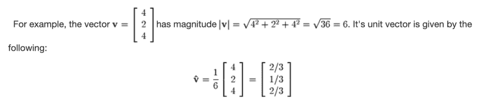

[*Source*](https://web.archive.org/web/20221207160113/https://www.freetext.org/Introduction_to_Linear_Algebra/Basic_Vector_Operations/Normalization/): *Example of vector normalization* 

5.  **降维**:我们的房价向量只有两个维度，因为它们只包含两个特征值。相比之下，我们生成的使用向量有多达 512 个维度。对我们来说，画二维图很容易，但是画 512 维图呢？没那么容易。因此，我们需要使用某些技术来减少向量的维数，而不会丢失太多重要的信息。我们将看看执行这种缩减的最常见方法之一:

[主成分分析(PCA):](https://web.archive.org/web/20221207160113/https://en.wikipedia.org/wiki/Principal_component_analysis) PCA 试图识别解释数据中大部分变化的超平面。类似于我们试图在线性回归中寻找趋势线的方法。PCA 中的主成分是这些超平面的轴。现在，只要把它想成一种用更少的维度来寻找代表向量中大部分变化的值的方法:

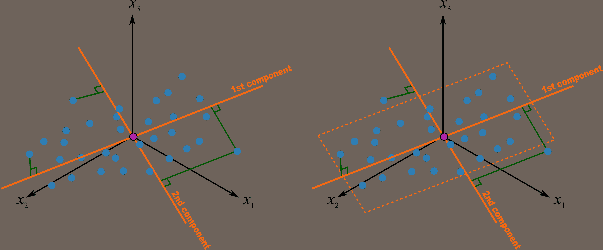

*Source: A great* [*post on PCA*](https://web.archive.org/web/20221207160113/https://learnche.org/pid/latent-variable-modelling/principal-component-analysis/geometric-explanation-of-pca) *if you want to understand it in more detail*

我们在这一部分已经讲了很多，所以在我们看最后一部分之前，让我们来回顾一下。到目前为止，我们:

1.  更详细地定义了**向量**，并展示了如何在向量空间中表示它们。
2.  展示了 ML 模型需要从我们的输入向量的特征中学习，以创建将输入数据转化为我们需要的输出的**转换**。
3.  定义了发生这些变换的**向量空间**。
4.  看了一些我们可以在这些空间中对向量执行的**常见操作**。

现在我们可以看看所有这些工作的结果，也就是我们的产出。我们将展示我们讨论过的所有操作的工作实例，并展示它们如何在许多情况下作为你下一个 ML 项目的一部分被使用。

虽然您不需要理解我们刚刚讨论的所有运算的数学原理，但是对为什么使用它们有一个宽泛的概念基础会有所帮助。当涉及到输出时，这将让您为相关任务选择正确的操作。

## 输出:使用向量运算

正如我们在这篇文章中提到的，如何在 ML 中使用向量取决于管道阶段。在上一节中，我们看到了向量数学、运算和变换是理解深度学习神经网络“幕后”发生的事情的关键。这些计算都发生在输入和输出之间的“隐藏层”。

但是，对于大多数 ML 项目，您不需要这种级别的细节。当然，理解深度学习算法的核心数学肯定是好的，但这对开始使用这些模型并不重要。

例如，正如我们在输入部分所展示的，你不需要矢量数学的详细知识就能以矢量格式编码输入。当你想出如何最好地编码一个句子以便你的模型可以处理它时，向量的大小并不重要。相反，重要的是要知道你正在用编码解决的问题，你是需要一个稀疏的还是密集的向量，或者你想要捕捉什么特征。

现在，类似地，关于你的模型的输出，我们将看看向量的方面，它对 ML 管道的这个阶段最有影响。请记住，这些模型的输出甚至可能不是一个向量，它可能是一幅图像，或者一些文本，或者一个类别，或者一个数字，比如房价。在这些情况下，你不需要处理任何向量，所以你可以像以前一样继续。

但是如果你有一个矢量输出，你将主要关心两个目标:

1.  **其他模型的输入**:你可能想要使用一个模型的矢量输出作为另一个模型的输入，就像我们之前使用的和我们的 Bowie 模型一样。在这些情况下，您可以参考输入部分，将向量视为一个值列表和一个表示相关信息的编码。您还可以使用输出在这个输入的基础上构建一个分类器，并训练它来区分一些领域特定的数据。无论哪种方式，都是将向量作为另一个模型的输入。
2.  **向量函数的输入:**如果输出是一个向量，并且我们没有将其用作另一个模型的输入，那么我们需要将其与向量函数结合使用。使用模型输出一个嵌入(即向量)，但是我们不能孤立地解释这个 512 数组的数字。我们需要对它执行一些功能，以生成我们可以解释的结果。正如我们在上一节中提到的，这些函数可以识别两个向量之间的相似性，并降低向量的维数，以便我们可以可视化它们。知道对于给定的目的需要哪种操作可能会令人困惑。因此，我们将在本节中查看这些操作的一些工作示例。

### 为我们的行动生成向量

我们需要一些示例向量，以便在向量运算中使用。我们可以通过创建一些例句，将它们传递给用户，并存储向量输出来实现这一点。这样，我们可以将每个操作的结果与句子本身进行比较。我们将创建一组句子，一些看起来相似，另一些语义上非常不同:

1.  *我们用彩虹眼扫描天空*—《自由节日的记忆》中鲍伊的歌词
2.  *我们仰望天空*——这是一首非鲍伊的歌词，看起来语义相似
3.  下雨了，我看到了彩虹，这句话似乎和歌词更不一样
4.  *此句不应与任何东西*相似–此句不应有语义重叠
5.  一句完整的胡言乱语

现在让我们看看我们的向量运算告诉我们这些句子。

### 向量范数

我们之前已经看到，向量范数是一种确定向量“大小”的方法。在为我们的向量生成嵌入之后，我们可以得到如下的 L1 和 L2 范数:

```py
for sentence, vector in zip(sample_sentences, sentence_embeddings):
  l1 = norm(vector, 1)
  print(f"L1 norm of '{sentence}': is {l1:.4}")

```

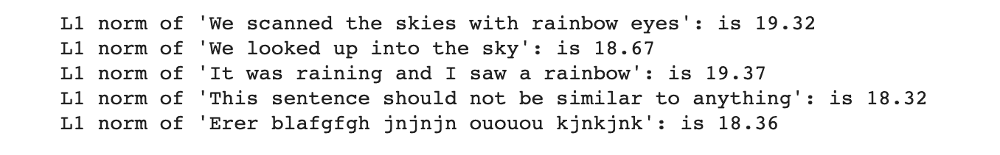

```py
for sentence, vector in zip(sample_sentences, sentence_embeddings):
  l1 = norm(vector)
  print(f"L2 norm of '{sentence}': is {l1:.4}")

```

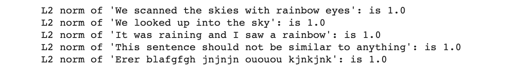

我们可以看到关于这些规范的两点:

1.  L1 规范值在数值上接近，
2.  L2 标准值加起来都是 1。

这可能看起来很奇怪，但是根据我们现在对向量的了解，让我们看看他们在 [Tensorflow 页面](https://web.archive.org/web/20221207160113/https://colab.research.google.com/github/tensorflow/hub/blob/master/examples/colab/semantic_similarity_with_tf_hub_universal_encoder.ipynb)上对使用嵌入是怎么说的:

看起来嵌入已经被规范化了(近似规范化，我不确定它们是什么意思，但是让我们假设它意味着它们被规范化了)。这意味着向量除以它们的大小，然后当我们得到 L2 范数时，它总是 1，也就是单位向量。

作为一个不同的例子，让我们用一个不同的模型来得到我们的向量的 L2 范数，这个模型没有以同样的方式归一化向量。有一个很棒的库可以做到这一点，叫做[快速句子嵌入](https://web.archive.org/web/20221207160113/https://github.com/oborchers/Fast_Sentence_Embeddings/blob/master/notebooks/Tutorial.ipynb) (FSE)。这些向量的 L2 范数不都是 1:

```py
for idx, sentence in enumerate(sample_sentences):
  l2 = norm(model.sv[idx])
  print(f"L2 norm of '{sentence}': is {l2:.4}")

```

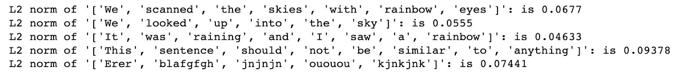

这告诉我们关于向量的什么？实际上，不多。它不擅长识别我们句子之间的语义差异。这可能表明向量的大小不是识别句子之间语义相似性的可靠方法。

### 内积

如果大小本身不能告诉我们很多关于向量的信息，让我们试试内积。记住，这是两个向量乘积的和:

```py
res = {}
for sen in sample_sentences:
    res[sen] = []

for i, s1 in enumerate(sample_sentences):
    for j, s2 in enumerate(sample_sentences):
        dot_prod = np.dot(sentence_embeddings[i], sentence_embeddings[j])
        res[s1].append(round(dot_prod, 3))

pd.DataFrame(res, index=[s for s in sample_sentences])

```


得到每对句子的内积，我们可以看到，当它们相同时，我们得到 1，当它们不相同时，我们得到其他值。如果你看看我们的胡言乱语句子的分数，你可以看到我们对一些对得到一个负分。对于“*这个句子不应该与任何东西*相似”这个句子，我们也得到了低分。我们的鲍伊歌词句子和我们不太折衷的尝试确实产生了相对较高的分数，事实上是所有比较中最高的分数。也许我们毕竟有一些抒情的创造力。

### 余弦相似性

另一个得分是两个向量之间的余弦相似性得分。正如我们之前提到的，这忽略了向量的大小，所以它应该给内积一个不同的结果。但是请记住，我们的嵌入是标准化的，这意味着我们应该得到与内积相同的余弦相似性分数。知道这一点很有好处，因为如果要进行大量的相似性比较，内积运算会更有效。

```py
def get_cos_sim(sen1, sen2):
  sts_encode1 = embed(tf.constant([sen1]))
  sts_encode2 = embed(tf.constant([sen2]))
  cosine_similarities = tf.reduce_sum(tf.multiply(sts_encode1, sts_encode2), axis=1)
  return cosine_similarities

res = {}
for sen in sample_sentences:
    res[sen] = []

for i, s1 in enumerate(sample_sentences):
    for j, s2 in enumerate(sample_sentences):
        cosine = get_cos_sim(sample_sentences[i], sample_sentences[j])
        res[s1].append(round(cosine.numpy()[0], 3))

pd.DataFrame(res, index=[s for s in sample_sentences])

```

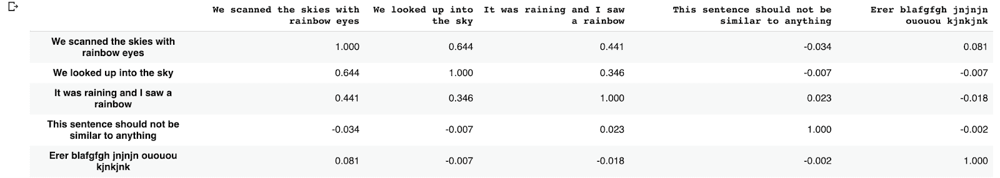

而且看起来分数确实一样！

### 向量归一化

所以我们知道我们的嵌入已经被规范化了，或者，正如他们在 TF 页中所描述的，接近规范化了。在这种情况下，原始嵌入和我们对原始嵌入进行规范化应该没有区别。我们如何衡量这一点？为什么不用嵌入的大小，或者 L2 范数，就像我们之前做的那样。

```py
non_normed_vector = embed(tf.constant([sample_sentences[0]]))

normed_vector = tf.nn.l2_normalize(embed(tf.constant([sample_sentences[0]])), axis=1)

non_normed_vector - normed_vector

```

是的，这两个向量之间的差很小，所以看起来它们已经被归一化了。当我们归一化一个向量时，我们只是将向量中的每个元素除以它的大小。所以你也可以这样做:

```py
x = np.array([7, 6, 10])

nrm = norm(x)
print(f'Norm of vector {x} is {nrm}')
normal_array = x/nrm
print(f'The new normalized vecotr is {normal_array}')
print(f'And the norm of this new vector should be 1.... {norm(normal_array)}')

```

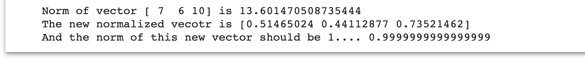

### 降维

当我们谈到向量空间时，我们注意到我们可以降低 512 维向量的维数，这样我们就可以将它们可视化。这是比较我们句子相似度的另一种方式。我们可以做像聚类这样的事情来识别哪些句子彼此相似。这是在大量句子之间寻找相似性的更好的方法，因为我们不需要在所有可能的组合之间进行成对比较。

scikit-learn 中提供了实现这一点的代码，因此您可以相对容易地减少我们嵌入的维度:

```py
from sklearn.decomposition import PCA
import plotly.express as px

def get_3d_viz(X, sentences):

    pca = PCA(n_components=3)
    pca_embed = pca.fit_transform(X)

    df = pd.DataFrame(columns=['x', 'y', 'z', 'word'])
    df['x'], df['y'], df['z'], df['sentence'] = pca_embed[:,0], pca_embed[:,1], pca_embed[:,2], sentences
    fig = px.scatter_3d(df, x='x', y='y', z='z', color='sentence')
    return(fig)

get_3d_viz(sentence_embeddings, sample_sentences)

```

这产生了一个很好的视觉效果，就像这样:

如果你看了上面的可视化，你可能会认为“*这个句子不应该和任何东西*相似”这个句子和我们的胡言乱语的句子看起来很接近，彼此很相似。然而，让我们转换一下我们的视觉，看看三维图像如何帮助我们更好地区分这些句子:

这样做，我们可以看到这些句子和我们的鲍伊歌词之间有一些距离，而我们自己模仿它的尝试是最接近的。正如我们的余弦相似性和内积分数所示。

这显示了能够将向量的维度降低到我们可以在 3d 中可视化的程度的好处。

## 摘要

那么，我们从向量的旋风之旅中学到了什么？希望你能看到我们在 ML 中使用向量的方式与你在学校或大学中学习向量的方式不同——尽管这些知识仍然很重要。向量的数学定义是我们深度学习算法下发生的事情的关键。

然而，关键的区别在于，我们在这些模型的输入和输出中使用向量的方式不同。当你看到一些关于特征向量或者向量的线性无关性的东西时，不要混淆。相反，要知道这些信息很重要，但是为了编码你的输入和使用你的输出向量，你并不真的需要这些信息。

你可以在积累使用向量的经验时涉猎这些知识，但是在 ML 的上下文中，知道你对管道的哪个阶段感兴趣是使用向量的关键。

## 参考

如果你想更深入地了解向量在 ML 中是如何使用的，下面的列表提供了一些很好的资源:

*   你可以在 MathInsight 上找到一个很好的向量概述，它提供了一些关于如何执行常见向量运算(如加法和减法)的几何描述
*   如果你想更好地描述向量规范和标准化，这是一篇很好的[文章](https://web.archive.org/web/20221207160113/https://paulrohan.medium.com/euclidean-distance-and-normalization-of-a-vector-76f7a97abd9),它也涵盖了如何通过 numpy 在 Python 中实现这一点。
*   如果你想理解维数减少，那么看看这篇[文章](https://web.archive.org/web/20221207160113/https://learnche.org/pid/latent-variable-modelling/principal-component-analysis/geometric-explanation-of-pca)，它对 PCA 是如何工作的有一些很好的可视化。
*   这是多伦多大学计算机科学系的一个讲座，讲述不同类型的神经网络以及它们如何转换输入向量来识别模式。
*   这是[另一篇关于神经网络转换的伟大文章](https://web.archive.org/web/20221207160113/https://medium.com/wwblog/transformation-in-neural-networks-cdf74cbd8da8)，专门关注前馈网络并描述向量和矩阵如何参与这些操作。*