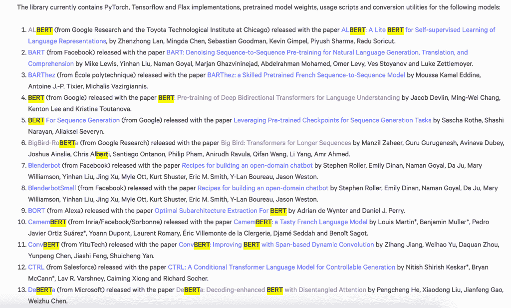
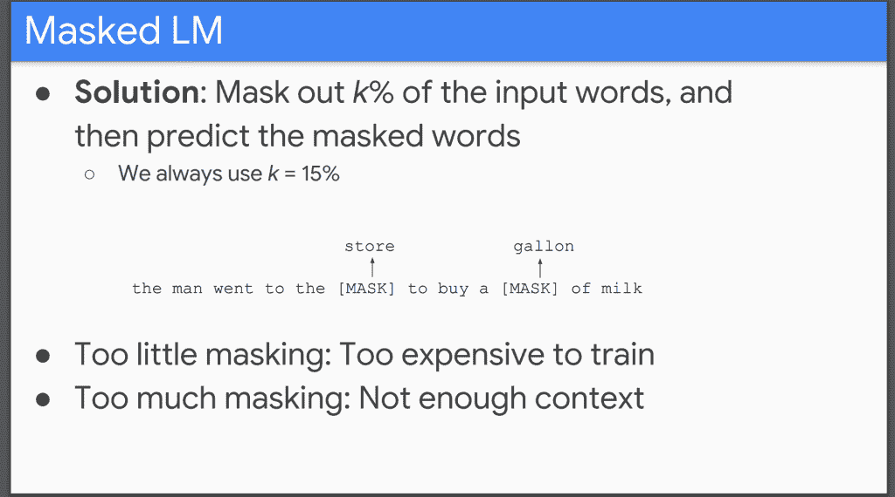

# 揭开 BERT 的面纱:变压器模型性能的关键

> 原文：<https://web.archive.org/web/https://neptune.ai/blog/unmasking-bert-transformer-model-performance>

如果你正在阅读这篇文章，你可能知道像 BERT 这样的深度学习变压器模型。他们正在彻底改变我们处理自然语言的方式。

💡*如果你不知道，我们在[上一篇文章中写了关于 BERT 和 Transformer 架构的历史和影响。](/web/20220928192338/https://neptune.ai/blog/bert-and-the-transformer-architecture-reshaping-the-ai-landscape)*

*Examples of some Transformer models available from HuggingFace (the largest open-source library of Deep Learning NLP models). You can see that most of them are based on BERT in some way.*

这些型号性能非常好。但是为什么呢？为什么与其他变压器型号相比，BERT 的性能如此出色？

有人可能会说伯特没什么特别的。变压器架构是我们近年来看到的最先进(SOTA)改进的独特原因。

这是令人困惑的，因为我们需要确切地知道 BERT 的哪些部分值得在未来的模型中复制。否则，我们最终可能会生产出不必要的庞大的模仿模型，并且包含无助于改进的层次和培训目标。

*Is it masking that makes BERT so special? How does it work? Hopefully, this slide will make more sense after you read this post. Source:* [*Stanford slides by Jacob Devlin*](https://web.archive.org/web/20220928192338/https://nlp.stanford.edu/seminar/details/jdevlin.pdf)

为了澄清这一困惑，我们将看看这一领域的一些最新研究，并提出:

1.  **掩蔽是关键**:“掩蔽”是培训目标，我们将大部分成功归功于 BERT 和类似 BERT 的模型。
2.  **屏蔽需要注意**:虽然屏蔽是区别 BERT 与其他模型的关键因素，但它是建立在通过[变压器架构](https://web.archive.org/web/20220928192338/https://arxiv.org/pdf/1706.03762.pdf)引入的注意机制之上的。
3.  **我们仍然不理解掩蔽**:尽管掩蔽是最近 NLP SOTA 结果中的核心元素，我们仍然不完全理解掩蔽是如何工作的。我们来看看最近的研究，这些研究表明，以前被认为对掩蔽的成功至关重要的语言(如单词排序)的*句法方面并不重要。这提出了一个重要的问题，即我们认为这些模型在学习什么语言。*
4.  我们可能需要重新评估我们是如何学习语言的:人类如何学习语言是一个持续争论的话题。例如，我们认为，当人类学习单词的含义时，他们所做的不仅仅是简单的共现和模式匹配。但是，如果这实际上是像 BERT 这样的模型学习语言的方式，如果它们可以达到或接近人类的水平，那么，人类只是以同样的方式学习和理解语言的有机统计推理引擎吗？也许我们需要重新审视我们认为人类是如何从语言中学习意义的。

似乎很明显，目前，在 NLP 深度学习的技术生命周期中，实践远远领先于理论。我们使用了一些方法，比如屏蔽，这些方法看起来很有效，我们稍微摆弄一下数字，效果会好一点或者差一点。然而，我们无法完全解释为什么会发生这种情况！

有些人可能会觉得这令人沮丧和失望。如果我们不能解释它，那么我们如何使用它？

也许我们不需要完全解释这些模型。我们仍然可以放心地在生产和重要的商业应用中使用它们，同时努力更好地理解它们的内部工作方式。

## 表示和学习:变压器模型如何学习上下文

*Nearly all transformer models learn some form of context which helps improve their performance in NLP tasks. The question is why do models like BERT appear to learn more from context than other models? Is this due to their learning objective? Source:* [*Demystifying BERT*](https://web.archive.org/web/20220928192338/https://www.analyticsvidhya.com/blog/2019/09/demystifying-bert-groundbreaking-nlp-framework/)

伯特不是镇上唯一的表演，或者在这种情况下，是街上唯一的木偶！还有其他模型使用 Transformer 架构，而没有学习目标，如屏蔽(不要担心，我们将很快定义所有这些术语)。我们可以看看这些模型是如何执行的，以及这些模型内部发生了什么，以比较和对比 BERTs 学习目标在来自其输入的学习环境中的执行情况。

上下文是将 BERT 和其他变形金刚模型(如 GPT-3)与以前的模型(如 [Word2Vec](https://web.archive.org/web/20220928192338/https://arxiv.org/pdf/1301.3781.pdf) )区分开来的原因，以前的模型只知道一个单词的一种“意思”。从这个意义上说，Word2Vec 产生静态定义(或嵌入，它们只是表示有问题的单词的向量)，因为它们只有一个含义，不会根据使用它的上下文而改变。

这有明显的局限性。你目前正在阅读一个关于伯特的*帖子，但是你也可以在 ***帖子*** 中接收邮件，或者在你的花园里贴一个木制 ***帖子*** 等等。“ ***post*** ”的每一次使用都有非常不同的含义。这个问题阻止了像 Word2Vec 这样的模型匹配像 BERT (… *或者也许不匹配？稍后我们将讨论 BERT 是否仅仅是带有动态上下文的 Word2Vec 的大规模放大版本*。*

 *在这一节中，我们将看看三种不同类型的模型，它们具有三种不同的学习目标，并表明这些学习目标改变了关于意义和上下文的信息在它们的神经网络层之间传递的方式。这将导致我们声称，当掩蔽被用作学习目标时，这就是为什么像 BERT 这样的模型比非掩蔽替代方案更好地学习上下文的原因。本帖中我们要看的模型是:

1.  **机器翻译(MT)模型**:这是第一批展示 Transformer 架构在神经机器翻译(NMT)等应用中产生重大改进潜力的模型。
2.  **语言模型(LM)** : LMs 如类 GPT 模型，以及它们的递归神经网络(RNN)前身，通过预测序列中的下一个单词来学习。
3.  掩蔽语言模型(MLM) :像伯特这样的 MLM 使用了一种叫做掩蔽的方法，他们试图预测文本序列中的一个随机单词。这对这些模型的工作方式有着非常不同的影响，我们很快就会谈到这一点。

## 表现:变压器模型如何相似

*From a high level, we can think of the Transformer models as composed of two main “parts”; one where they represent the text, and the other where they learn from the text. Source: Author*

所有变压器模型在其神经网络设计中共享一个**通用方法。我们可以认为这种常见的方法有两个主要部分。尽管所有这些网络之间存在许多细微差别，但我们可以从高层次上将它们视为在方法上有些相似。这些网络的两个主要部分是:**

1.  **表示**:这是模型接受文本输入并将其表示为我们称之为嵌入的向量的地方。网络的表示部分将文本信息编码成网络可以“读取”或处理的格式。这包括对单词在句子中的位置以及它与句子中其他单词的关系进行编码。
    在《变形金刚》中，这种信息编码是通过“*注意*”机制实现的(注意机制的细节超出了本文的范围，我们在这里详细讨论了；或者，这篇[帖子](https://web.archive.org/web/20220928192338/https://towardsdatascience.com/illustrated-self-attention-2d627e33b20a)很好地说明了注意力在基于变压器的网络中是如何工作的。对于这篇文章，我们需要知道的是，注意力是一种将关于我们输入文本的信息编码为矢量格式的机制——一种嵌入——我们的神经网络可以处理。
2.  **学习**:一旦 Transformer 模型可以将文本表示为嵌入，我们就可以创建一个学习目标，使模型能够从文本中“学习”。我们希望学习目标将使这些模型能够学习诸如句法结构、语义和上下文之类的东西，这将使它们能够在广泛的语言任务中表现良好。学习目标规定了这些模型可以从它们的训练数据中学习什么，因为它控制了信息如何通过它们的网络流动。

## 学习:变压器型号有何不同

*Each Transformer model can have its learning objective which defines how information flows through the network and how it learns from the input. Source: Author*

每个变压器模型可以创建其学习对象，该学习对象将来自网络表示部分的输出作为其输入。表示部分由记号赋予器和注意层组成，它们接受输入并将其转化为嵌入，以矢量格式表示输入文本。

学习目标的选择对变压器模型至关重要，因为这种选择-

1.  **定义网络如何处理输入**:根据学习目标，变换器模型将一次处理一个令牌(单词)的输入，即它将不能“预测”下一个单词；或者它将能够“双向”处理文本，并在学习时访问过去和未来的标记。
2.  **定义信息如何在网络中流动**:学习对象的目标将定义信息如何在网络中流动。这一点很重要，因为像 Transformer 或 BERT 模型这样的深度神经网络由多层组成，每一层都建立在前一层的输出之上。
    理想情况下，我们希望每一层都在输入中添加信息，并建立在前一层所学的基础上。这样，理论上，随着信息从较低水平传递到较高水平，深度神经网络应该建立更复杂和更高水平的知识。学习对象将定义这个信息流。
    例如，在图像处理中使用的卷积神经网络(CNN)中，网络的低层学习一般细节，如形状的边界和轮廓。然后，更高层学习更多细微的细节，如面部特征和区分同一类型图像的细节方面。如果图像是一只猫，较低层将识别猫的一般格式，并能够将其与狗或人区分开来，较高层将能够区分不同类型的猫。理想情况下(我们不确定，但似乎有可能)，我们希望语言模型以类似的方式从文本中学习信息，以便更高层理解语义和句法特征。

我们在这篇文章中看到的三种模型有不同的学习目标:

1.  **机器翻译(MT)学习目标** : MT 模型获取输入文本，并尝试预测目标句子中的单词。输入句子可以是英语，而目标句子是该句子的法语翻译。ML 模型与这里讨论的其他模型略有不同，因为表示层嵌入不用于直接预测输出。相反，对于 MT 模型，表示层的输出被传递给解码器，解码器将嵌入内容转换回目标语言。出于我们的目的，我们仍然可以用与其他模型相同的方式来考虑它，即学习目标试图预测给定不同源语言输入的目标句子的单词。
2.  **语言模型(LM)学习目标**:像 GPT 这样的 LM 模型试图根据输入句子中的前几个单词来预测下一个单词。因此，学习目标只能访问句子中过去的单词，即它不能“期待”句子中的下一个单词来帮助它预测当前单词。这样，LM 模型被称为是单向的，因为它只从输入开始到输入结束“读取”文本。
3.  **屏蔽语言模型(MLM)** : **学习目标** : MLMs 不是预测下一个单词，而是试图预测从输入中随机选择的“屏蔽”单词。这是[完形填空](https://web.archive.org/web/20220928192338/https://en.wikipedia.org/wiki/Cloze_test)的一种形式，要求参与者预测一个句子中隐藏的单词。它通常被用来评估一个人的语言能力。由于完形填空测试要求用户能够看到所有的文本以理解缺失单词的上下文，所以 MLMs 需要能够同时“看到”所有的文本。这与 LMs 相反，LMs 在预测当前单词时只看到过去的单词。这就是为什么我们说 MLM 是“*双向的*”，因为它们可以访问当前预测单词前后的单词。

## 掩蔽语言模型(MLM)的表现更好吗？

*Example of a person dragging words to missing spaces in a cloze test.* *Source:* [*Wikipedia*](https://web.archive.org/web/20220928192338/https://en.wikipedia.org/wiki/Cloze_test)

我们想要回答的关键问题是，MLM 模型是否比其他模型更擅长学习语言信息。虽然这是一件很难衡量的事情，因为我们首先不知道人类是如何学习语言的，但我们可以通过观察网络各层之间输入信息的变化来估计它。具体来说，我们关注的是:

1.  **模型如何学习输入**:最初，模型需要理解给定的输入。它会查看可用的信息，并在生成学习目标所需的输出之前，尽可能多地尝试和理解输入。
2.  **模型如何使用该信息来执行其任务**:学习目标定义了我们模型的目标，即它试图预测什么。一旦模型了解了一些可用的输入，它就可以关注它需要生成的输出，以尝试并满足学习目标的要求。

例如，假设给你一个类似于*完形填空测试*的任务，并要求你预测遗漏的单词:

> "*这是我看过的[* ***漏字*** *]帖子*"

在这种情况下，你可以先读完整个句子，然后把注意力集中在缺失单词的上下文上。一开始，你不会去想那个缺失的单词本身。你会看它前后的单词，并把它们作为预测丢失单词的依据。

一旦你思考了周围的单词，你就试着去思考缺失的单词。你为这个词想出了一些可能的选项，并考虑它们是否符合上下文。在这种情况下，你会(很明显地)想到像“*最好的*”、“*最伟大的*”、“*完美的*”、“*杰出的*”、“*最好的*”这样的词，并选择其中一个你认为正确的。

一些研究人员已经研究了网络之间信息变化的这个方面，并试图估计不同层之间丢失或获得的信息。他们用几种不同的方法来做这件事。一种方法是查看不同阶段输入层和输出层之间获得或丢失的信息，即输入层和第二层之间的差异、输入层和第五层、第 n 层之间的差异等等。

通过这样做，他们表明:

1.  **机器翻译在各层之间变化较小**:由于机器翻译不预测完形填空类型学习对象的标记，因此它在连续各层的表示之间变化较小。你可以在下图中看到这一点，它显示了层与层之间越来越少的变化。它试图翻译整个句子，所以它没有我们上面提到的两步焦点变化，其中模型理解上下文，然后预测标签。
2.  **语言模型显示伪造和重新记忆的证据**:相比之下，LMs 显示出更多的层间变化，因为它们最初专注于周围单词的上下文，层间的差异逐渐变小。然后，当模型试图预测下一个单词时，我们会看到各层之间的较大变化。
3.  **掩蔽语言模型显示了层间最大的变化**:MLM 在经历这两步过程时，显示了层间更加明显的变化。最初，MLM 丢弃或“丢失”它现在不需要的信息，即该模型关注周围单词的上下文，而不是它试图预测的缺失单词。然后，当它将注意力转移到重新记住与它试图预测的丢失标记相关的信息，即*学习目标*时，我们看到各层之间的表示发生了巨大变化。

## 被掩盖的语言模型秘密:上下文编码和标记重构

MLMs 的类似完形填空的任务，即屏蔽输入中的随机单词，似乎迫使变压器模型经历两个部分的过程，[研究](https://web.archive.org/web/20220928192338/https://arxiv.org/abs/1909.01380)的作者描述为:

1.  **上下文编码**:正如我们之前提到的，这是模型被迫关注周围单词的上下文，而不是学习目标的目的。MLMs 似乎比 LMs 做得更好，因为它们可以访问输入文本中的整个单词数组，而不像 LMs 那样只能访问前面的单词。与 LMs 或 MLMs 类似，MT 模型没有预测输出需求任务的标签，因此它们甚至更快地“忘记”与正在处理的当前单词相关的信息。
2.  **记号重建** : MLMs 显示了一个清晰的第二阶段，其中模型将焦点从学习上下文转移到试图预测丢失或被屏蔽的单词。为此，它会尝试“恢复”或“重建”关于当前输入令牌的信息。它这样做是因为它试图理解当前标记与句子中其他标记的相关程度。在上下文编码阶段，模型查看周围的工作，例如，如果当前单词是“*银行*”，我们可以首先查找类似“*钓鱼*”或“*金钱*”的周围单词，以了解我们所指的是什么类型的“*银行*”，即，一条河“*银行*”或一个金融机构。

该研究中另一个实验的下图更清楚地显示了这一两阶段过程的影响:

在上图中，我们可以看到，MLM 开始重建关于当前输入令牌的信息，而 ML 和 LM 继续丢失与输入令牌相关的信息，即它们没有明确的“重建”阶段。

## 像 BERT 这样的屏蔽语言模型受益于未来

像上面提到的那些研究表明，MLM 似乎是像 BERT 这样的大型预训练模型的更好选择，这些模型需要有更一般的语言知识，以便在下游 NLP 任务中表现得更好。

这似乎与 MLMs 可以访问输入文本中的未来信息的事实有关，因为 Transformer 架构提供了**双向特性**。还记得引言吗，我们提到掩蔽是至关重要的，但它取决于注意力？Transformer 架构的**注意机制**使模型能够在学习与当前输入令牌相关的周围单词的上下文时“展望”未来。

语言模型也可以使用这一功能，因为它们使用相同的底层架构，但是它们的学习目标的性质意味着它们只查看句子中以前的单词。他们不会“预测”接下来的单词，因为这会给网络设计带来一些问题。例如，如果模型可以访问输入中的所有标记，那么从理论上讲，它可以“欺骗”并总是预测正确的下一个单词，而无需学习任何东西。

因此，在模型简单性和学习目标收益之间有一个权衡。MLM 使模型了解更多关于输入文本的信息，但这是以更大的模型复杂性为代价的。

例如，GPT-3 是一种 LM 模型，它使用转换器架构的解码器部分来预测输入序列中的下一个字。像 GPT-3 这样的模型可以通过在更大和多样化的数据集上进行训练来补偿学习目标的差异。GPT-3 的表现表明，你仍然可以通过这条路线实现 SOTA 的结果。

然而，从上面的结果，我们可以看到 MLM 的好处，由于明确的上下文编码和令牌重建阶段。如果你想从你的输入文本中学习上下文，那么传销从更少的内容中学到更多。这似乎与 MLMs 访问当前输入令牌周围的未来上下文的能力有关。

这种环境优势是 MLM 在许多 NLP 任务中表现的关键。但是，有些任务不适合这种双向访问。就像在 GPT X 这样的文本生成模型中，主要目标是预测文本序列中的下一个单词。这些模型可能适合通过 LM 学习目标进行训练，以增强它们在给定输入任务的情况下预测未来单词的能力。

## BERT 中的遮罩是如何工作的？

在我们结束之前，有必要特别了解一下 BERT 及其屏蔽过程实现。

在前面几节中，我们讨论了屏蔽的一般概念，即屏蔽掉一个随机单词。听起来相对容易。

但是，如果您过去曾经使用过 Transformer 模型，您会知道事情会变得更加复杂。BERT 掩蔽实施有两个主要部分:

1.  **屏蔽 15%的输入标记**:BERT 中的屏蔽不只是屏蔽一个标记。相反，它随机选择 15%的输入标记并屏蔽它们。15%是通过试错法选择的。如果你屏蔽了更多的信息，那么模型就很难从输入中学习，因为隐藏了太多的信息。如果您使用少于 15%,可能需要更长的时间和更多的数据来学习足够的上下文，因为模型可能更容易预测丢失的令牌。
2.  **屏蔽记号，正确记号，或错误记号**:这就是开始变得有点奇怪的地方！在选择了我们想要屏蔽的令牌之后，我们需要决定我们是否真的想要屏蔽它们。我们最终不会屏蔽掉我们说过的所有令牌。相反，我们有另一个随机选择过程(我们将在下面讨论),我们选择添加一个隐藏单词的掩码标记，或者用随机选择的不同单词替换该标记，或者用我们最初打算掩码的正确单词替换该标记。听起来很奇怪，对吧？确实是，下面我们会尽量澄清。

## 戴口罩还是不戴口罩？

一旦我们选择了要屏蔽的 15%的输入标记，我们就需要决定是否要屏蔽这些标记。他们在 BERT 中的工作如下:

1.  **80%替换为[MASK]标记**:对于 80%的选定输入，标记被替换为[MASK]标记，类似于前面提到的经典完形填空测试。
2.  **10%替换为不正确的单词**:对于 10%的所选输入，令牌被另一个随机选择的单词替换，该单词的唯一要求是与所选令牌不同。
3.  **10%替换为正确的单词**:剩余 10%的时间，所选令牌简单地替换为正确的令牌。

伯特论文的作者指出，这些不同比率的选择有些武断，是在反复试验的过程中选择的。然而，这背后的想法似乎与:

1.  **如果你一直使用掩码标记**:仅仅使用掩码标记导致模型很少了解周围单词的上下文。这似乎是因为模型知道它可以“忘记”关于周围单词的所有信息，而只关注目标单词。这类似于类似 LM 的方法，意味着 MLM 没有创建我们之前看到的清晰的两阶段、上下文编码和令牌重建信息流，这对于 MLMs 中看到的改进学习非常重要。
2.  **如果你使用掩码标记和正确的单词**:为了解决这个缺点，你可以在 80%的时候使用掩码标记，然后在 20%的时候用正确的单词替换标记。但是有一个问题。模型将知道当掩码不存在时，那么单词是正确的，并且它不需要学习任何东西，只要保持当前单词，因为它是正确的。换句话说，该模型可以“欺骗”而什么也学不到，因为它知道非屏蔽令牌总是正确的。
3.  **如果您使用了掩码标记和错误的单词**:或者，如果您只是一直使用错误的标记，那么当掩码没有出现时，模型将知道所选的标记是错误的标记，并且它会将其视为另一个掩码，即您可能会遇到与上述相同的问题。

结果是，理想的 80/10/10 分割迫使 BERT 了解输入中所有令牌的更多信息，而不仅仅是当前的输入令牌。或者正如[作者指出的](https://web.archive.org/web/20220928192338/https://arxiv.org/pdf/1810.04805.pdf)、*这个过程的优点是变换器编码器不知道它将被要求预测哪些单词或者哪些单词已经被随机单词替换，因此它被迫保持每个输入标记的分布式上下文表示。*

## 关于掩蔽的最新研究？

别担心，我写这篇文章的时候没有中风。这一节的标题是故意弄乱的，以表明词序对我们理解语言的重要性。这就是为什么[单词袋 TF-IDF](https://web.archive.org/web/20220928192338/https://www.analyticsvidhya.com/blog/2020/02/quick-introduction-bag-of-words-bow-tf-idf/) 模型在一些 NLP 任务中表现不佳。他们不保持输入句子中的词序，所以当输入句子的顺序对正在执行的任务很重要时，他们最终会失去一些意义。

像 BERT 这样的 MLM 被认为保留了输入文本中单词的顺序和位置。这经常被认为是他们性能提高的原因。同样，类似完形填空的任务被认为迫使这些模型学习语言的句法和语义方面。这与 Word2Vec 等模型形成对比，word 2 vec 仅从大量文本的分布属性中学习语义。

两篇新的研究论文对掩蔽和 MLMs 给予了更多的关注，并表明我们仍然没有完全理解这一新学习目标的所有细微差别和复杂性:

1.  **掩蔽语言建模和分布假设:语序对 Little 来说很重要**:这篇[论文](https://web.archive.org/web/20220928192338/https://arxiv.org/pdf/2104.06644.pdf)声称单词的语序对 MLMs 来说并不重要。他们通过随机改变输入的句子来做到这一点，并表明这对一系列 NLP 任务的整体性能影响有限。他们认为 MLMs 性能提高的原因可能是:
    1.  **构造糟糕的 NLP 评估框架**:这些模型的测试和评估方式对于这些模型来说可能过于简单。因此，结果不能反映模型在语言任务中的实际能力。相反，作者声称这些评估框架需要改进，以跟上 BERT 等变压器模型的性能。我们在[早先的帖子](/web/20220928192338/https://neptune.ai/blog/ai-limits-can-deep-learning-models-like-bert-ever-understand-language)中谈到变压器模型的潜在极限时也提到了这一点。
    2.  **MLMs 对高阶单词共现统计建模的能力**:该论文声称 BERT 表现如此之好完全是因为它能够从共现数据中学习。掩蔽和注意力只是让 BERT 比 Word2Vec 这样的模型学到更多的信息。
2.  **关于掩蔽语言建模的归纳偏差:从统计到句法依赖**；这篇[论文](https://web.archive.org/web/20220928192338/https://arxiv.org/pdf/2104.05694.pdf)聚焦于 MLMs 的完形填空任务方面并声称:
    1.  MLMs close 任务不是真正的 close 任务:因为 MLMs 随机选择要屏蔽的单词，所以它不是一个监督式完形填空测试。在完形填空测试中，通常选择缺失的单词，以确保问题要求参与者了解该语言的句法性质。随机选择这些缺失的单词意味着一些常见的或无意义的单词，如“*这个*”、“*那个*”、“*那个*”等可以被选择用于完形填空。根据任务的不同，这些单词在强迫模式学习对该任务有意义的东西时可能没有用。
    2.  MLMs 不直接学习句法:人们认为类似完形填空的测试迫使模型学习关于语言句法结构的信息。然而，该论文声称表明，相反，MLM 学习标记之间的直接统计依赖性，但这使得模型能够间接学习语法。以前人们认为仅仅从统计推断中学习句法是不可能的。这篇论文声称，传销确实表明这是可能的

## 摘要

总而言之，让我们重温一下我们在引言中提到的最初的四点:

1.  **掩蔽是 BERTs 成功的关键**:我们看到研究表明掩蔽作为一个学习目标如何改变像 BERT 这样的深度学习变压器神经网络中的信息流。这种变化创建了一个两阶段学习过程，其中模型首先执行*上下文编码*来学习当前输入单词周围的单词。然后它执行*记号重建*，试图预测通过类似完形填空的 MLM 测试选择的输出单词。这种两阶段过程的性质似乎将 MLMs 与 LMs 和 MT 等其他方法区分开来。
2.  **屏蔽需要注意**:虽然屏蔽使 BERT 表现出色，但它仍然需要 Transformer 架构来实现。Transformer 网络使用注意力来双向处理文本，这意味着模型可以在当前输入标记之前和之后查看文本。非 MLM 没有充分利用转换器的这一特性，因此在学习语言特性的能力方面没有以同样的方式受益。
3.  **我们仍然不理解掩蔽**:我们看到最近的研究提出了更多关于掩蔽如何提高性能的问题，而不是答案。然而，这并不意味着掩蔽不起作用。它只是以我们没有想到的方式运作。事实上，我们讨论的一篇论文表明，我们可能能够仅从统计推断中学习高级知识，如语言句法。直到最近，我们才认为这是可能的。
4.  我们需要重新评估我们学习语言的方式吗？如果真的有可能从同现统计这样简单的东西中学习语义和句法知识，那么这对语言意味着什么呢？具体来说，它对我们如何学习语言有什么看法？虽然这是一个有争议的研究领域，但人们认为语言是一个复杂而独特的知识领域，需要独特的类似人类的技能来理解它。但也许我们和伯特这样的模特一样，通过识别常见单词何时一起出现来学习语言？如果是这样的话，那么为什么我们似乎比这些模型更快地学习像语义这样的东西，并且使用更少的数据？通过这种方式，当我们努力更好地理解像 BERT 这样的模型和像掩蔽这样的学习目标时，我们也可以更多地了解我们学习和理解语言的独特能力。

最后，是不是所有的模特都应该像伯特一样接受蒙版？与 NLP 和机器学习中的大多数事情一样，答案是:

> 看情况！

我们可以自信地说，大多数模型都可以通过使用像预训练中的掩蔽这样的方法来改进。然而，在某些情况下，如文本生成，像掩蔽这样的学习目标可能不适合该任务，因为在输入中访问未来的单词可能与特定任务的目标相抵触。对于更一般的模型，目标是训练一个具有一般语言能力并能在广泛的下游任务中表现良好的模型，看起来这些类型的模型确实会受益于类似掩蔽的方法。

## 参考

这种对变压器的研究主要来源于像 Lean Voita 这样的人的惊人工作。她的博客是所有变形金刚资料的一个很好的来源，甚至还有她教的的[课程的资料，非常值得一看。像 Lean 这样的人解释这些模型内部发生了什么的工作对于提高我们对像 BERT 这样的模型如何学习语言任务的理解是至关重要的。在这篇文章中，我特别提到了她的工作:](https://web.archive.org/web/20220928192338/https://lena-voita.github.io/nlp_course.html)

关于 BERT 和 Masking 的更多细节，值得查看的其他文章有:

### Cathal Horan

在 Intercom 的 ML 团队工作，在那里他创造了人工智能产品，帮助企业提高支持客户和与客户沟通的能力。他对哲学和技术的交叉感兴趣，尤其着迷于深度学习等技术如何能够创建有朝一日可能理解人类语言的模型。他最近完成了商业分析理学硕士学位。他的主要学位是电气和电子工程，但他也拥有哲学学位和精神分析研究的哲学硕士学位。

* * *

**阅读下一篇**

## 关于正在重塑人工智能格局的 BERT 和 Transformer 架构，你需要知道的 10 件事

25 分钟阅读|作者 Cathal Horan |年 5 月 31 日更新

目前，很少有人工智能领域比 NLP 更令人兴奋。近年来，可以执行类似人类语言任务的语言模型(LM)已经发展到比任何人预期的更好。

事实上，他们表现得如此之好，以至于[人们怀疑](https://web.archive.org/web/20220928192338/https://neptune.ai/blog/ai-limits-can-deep-learning-models-like-bert-ever-understand-language)他们是否达到了[一般智力](https://web.archive.org/web/20220928192338/https://chatbotslife.com/is-gpt-3-the-first-artificial-general-intelligence-a7390dca155f)的水平，或者我们用来测试他们的评估标准跟不上。当像这样的技术出现时，无论是电力、铁路、互联网还是 iPhone，有一点是明确的——你不能忽视它。它将最终影响现代世界的每一个部分。

了解这样的技术很重要，因为这样你就可以利用它们。所以，我们来学习吧！

我们将涵盖十个方面，向您展示这项技术的来源、开发方式、工作原理以及在不久的将来会有什么样的前景。这十件事是:

1.  **什么是 BERT 和变压器，为什么我需要了解它？**像 BERT 这样的模型已经对学术界和商业界产生了巨大的影响，因此我们将概述这些模型的一些使用方法，并澄清围绕它们的一些术语。
2.  在这些模型之前，我们做了什么？要了解这些模型，重要的是要了解这一领域的问题，并了解在 BERT 等模型出现之前我们是如何解决这些问题的。通过这种方式，我们可以了解以前模型的局限性，并更好地理解 Transformer 架构关键设计方面背后的动机，这是大多数 SOTA 模型(如 BERT)的基础。
3.  **NLPs“ImageNet 时刻；预训练模型:**原来我们都是自己训练模型，或者你要针对某个特定任务，全面训练一个模型。实现性能快速发展的关键里程碑之一是创建预先训练的模型，这些模型可以“现成”使用，并根据您的具体任务进行调整，只需很少的努力和数据，这一过程称为迁移学习。理解这一点是理解为什么这些模型在一系列 NLP 任务中一直表现良好的关键。
4.  **了解变形金刚:**你可能听说过伯特和 GPT-3，但是关于[罗伯塔](https://web.archive.org/web/20220928192338/https://huggingface.co/transformers/model_doc/roberta.html)、[艾伯特](https://web.archive.org/web/20220928192338/https://huggingface.co/transformers/model_doc/albert.html)、 [XLNet](https://web.archive.org/web/20220928192338/https://huggingface.co/transformers/model_doc/xlnet.html) ，或者[龙前](https://web.archive.org/web/20220928192338/https://huggingface.co/transformers/model_doc/longformer.html)、[改革者](https://web.archive.org/web/20220928192338/https://huggingface.co/transformers/model_doc/reformer.html)，或者 [T5 变形金刚](https://web.archive.org/web/20220928192338/https://huggingface.co/transformers/model_doc/t5.html)呢？新模型的数量看起来势不可挡，但是如果您理解 Transformer 架构，您将有机会了解所有这些模型的内部工作方式。这和你理解 RDBMS 技术的时候是一样的，让你很好的掌握 MySQL、PostgreSQL、SQL Server 或者 Oracle 之类的软件。支撑所有数据库的关系模型与支撑我们的模型的转换器架构是一样的。明白了这一点，RoBERTa 或 XLNet 就成了使用 MySQL 或 PostgreSQL 的区别。学习每个模型的细微差别仍然需要时间，但是你有一个坚实的基础，你不是从零开始。
5.  **双向性的重要性**:当你读这篇文章时，你并没有严格地从一边读到另一边。你不是从一边到另一边一个字母一个字母地读这个句子。相反，你正在向前跳跃，从你现在所处的位置之前的单词和字母中学习上下文。事实证明，这是变压器架构的一个关键特性。Transformer 架构支持模型以双向方式处理文本，从开始到结束，从结束到开始。这是以前模型局限性的核心，以前的模型只能从头到尾处理文本。

[Continue reading ->](/web/20220928192338/https://neptune.ai/blog/bert-and-the-transformer-architecture-reshaping-the-ai-landscape)

* * **