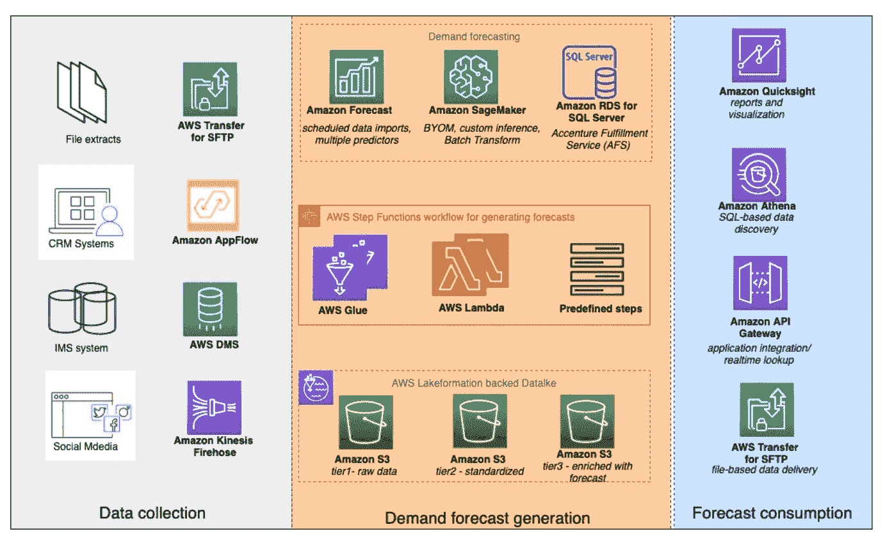

# 供应链中机器学习的用例、算法、工具和示例实现

> 原文：<https://web.archive.org/web/https://neptune.ai/blog/use-cases-algorithms-tools-and-example-implementations-of-machine-learning-in-supply-chain>

我们生活在一个速度至关重要的时代。你的公司交付产品越快，获利越快。速度是公司竞争的关键领域。

与机器相比，人类速度慢且不一致。管理**交付系统的端到端流程(从获取数据、管理数据、理解数据到做出决策**)可能会非常困难和累人。

公司需要一个机器人伴侣，能够在日常和重复任务中表现出色，而不会感到疲劳——人工智能和机器学习。

需求不确定，供应有风险，竞争激烈。供应链(SC)的卓越通常依赖于组织整合端到端流程的能力，这些流程包括获取材料或组件、将它们组装成产品以及将它们交付给客户。

人工智能在改善人类决策过程和商业项目的后续生产力方面显示出巨大的潜力。它可以识别模式，学习商业现象，寻找信息，并智能地分析数据。

在本文中，我们将讨论:

1.  人工智能在供应链中的潜在作用，
2.  必要的算法，
3.  工具和框架，
4.  三个著名公司在供应链中使用 AI 的案例研究，
5.  结论。

## AI/ML 在供应链中的用例

供应链管理已经成为数据密集型。如今，所有的信息都被收集并存储在数据中心，仓库、运输设备的需求可以被替代。

可以获得大量的数据。[专业人士知道它对 SCs 有多重要，在人工智能(AI)的帮助下](https://web.archive.org/web/20221206053619/https://throughput.world/blog/ai-in-supply-chain-and-logistics)他们可以利用它，提出优化的解决方案，并构建可以帮助他们做出更好决策的工具。

### 预测客户行为

客户是不确定的，并根据情绪采取行动。然而，供应链的成功取决于客户数据及其行为。

为了预测客户行为，提出了许多基于电子表格的方法，但随着大数据的兴起，这些方法被证明是过时的。电子表格模型在需求预测方面失败的主要原因是它们对于大规模数据不可伸缩。它们带来了供应链管理中的复杂性和不确定性，无法通过简单的统计方法(如移动平均或指数平滑)提取、分析和解决。

这种不一致的订单模式会导致团队之间的沟通不畅，并降低生产力。对许多公司来说，不一致订单量的可预测性是一个挑战。在这种情况下，AI 和 ML 在最佳水平上更早地为我们提供了客户行为不一致性的更接近预测。

### 预测能力有助于需求预测

需求预测是预测分析的一个领域，在这里，公司预测整个供应链中对产品和装运的需求，即使是在不可控的条件下。

如前所述，传统方法(电子表格模型、统计模型、移动平均和指数平滑)由于影响供应链需求的大量参数而受到限制，这使得这些方法过于简单且极不准确。

在这方面，预测只能提供对供应链中需求变化的**部分理解。此外，无法解释的需求变化可以简单地认为是**统计噪声**，这就是为什么它们在本质上是**非线性**。因此，传统的或简单的模型不能映射重要的和非线性的特征。**

幸运的是，机器学习提供了可以映射重要和非线性特征的算法，并将它们减少为变量，这些变量可以帮助理解过去，准确预测未来事件，帮助他们改善关于现金流、风险评估、容量规划和劳动力规划的决策过程，并满足客户需求。

一些人工智能驱动的需求预测工具包括:

*   我爱 CRM
*   胶囊！胶囊
*   蜂鸟
*   合夥人
*   效果管理器
*   未来市场
*   管道驱动
*   智能需求计划程序

### 避免收费风险

如前所述，客户是情绪化的。如果交货延迟，他们可能会重新考虑购买。或者购买产品后要求退款。

这最终会导致罚款，其中可能包括运费、税款和其他费用。通过像亚马逊使用的集成人工智能，公司可以分析数据，找到最近的配送中心，并减少交付时间。

这种系统可以分析延误的原因和失败的原因，比如合作伙伴之间的争执或与恶劣天气有关的灾难。

### 感知市场形势

市场是建立在人类情绪的基础上的，这使得整个市场变得不可预测和难以理解。

借助人工智能和深度学习系统，我们可以从天气、就业、季节等数据中发现人类行为模式，并帮助公司在仓库存储产品和优化配送系统方面进行良好投资。

这种用于研究市场的模式识别系统可以帮助公司改善其产品组合，并提供更好的客户体验。

### 提高跟踪出发和到达订单的准确性

供应链管理系统与不同的区域配送中心相互连接，这些中心通过运输连接在一起。但是有一些配送中心是为了运输而谨慎连接的。

这引起了企业对能否按时履行合同承诺的担忧。人工智能可以提供实时预测可见性，知道产品在任何给定时间的准确位置，以进行智能决策并提高交付准确性。

Fourkites 是为供应链提供实时可见性的一个很好的例子。

### 改进交货时间和降低成本的遗传算法

在物流业务中，时间和速度至关重要。公司可以使用基于遗传算法的路线规划器来规划最佳的送货路线。

人们认为，人工智能将为供应链、交付和物流过程设立一个新的效率标准。该系统正在快速变化，以自动化、智能化和更高效的方式创造了全球物流公司管理数据、运营和服务客户的“新常态”。

### 改善客户体验

一个企业要成功，顾客必须满意。有一件事可以帮助满足他们，那就是在正确的时间推荐正确的产品。机器学习很好地做到了这一点。

基于客户兴趣的推荐系统可以集成在移动或 web 应用程序中，这样客户的主页就个性化了。

PS:几乎所有热门 app 都有推荐系统。

### 智能仓库效率更高

智能仓库是一个完全自动化的设施，其中大部分工作是通过自主机器人或软件完成的。在此过程中，复杂的任务变得简单，操作变得更具成本效益。

阿里巴巴(Alibaba)和亚马逊(Amazon)通过自动化的使用，将他们的仓库改造成了一个效率的乌托邦。

## 供应链算法

### 卷积神经网络

卷积神经网络(CNN)是一种通常用于处理图像识别的算法，但事实证明，CNN 对于预测也非常有用。

CNN 以从数据集中提取有用的**模式**和**特征**而闻名。这使得 CNN 在解决分类和回归问题时非常可靠。

**CNN 的一个优势是它们共享参数，即与其他分类算法相比，它们需要更少的超参数和更少的监督**。

这就是为什么 CNN 是供应链管理中应用最广泛的算法之一。这里有几个使用 CNN 的例子:

#### 图像分类

*   图像分类用于识别给定图像的类别。它在供应链中非常方便，因为它可以在一个实例中对不同的产品进行分类，并相应地将它们分开。

#### 目标检测

*   对象检测将帮助您立即识别不同的对象。
*   在供应链管理中，你会同时遇到很多产品。手动分离这些产品非常昂贵和耗时。**物体检测**可以帮助你在没有任何人为干预的情况下，快速识别物体并进行分类(使图像分类更加精确)。

#### 图象分割法

*   图像分割是另一种算法，它使用 CNN 在物体本身周围创建一个像素级的**遮罩**，从而了解物体的尺寸。

#### 自主移动机器人

*   自主移动机器人使用 CNN**识别路线**和**导航**到仓库中指定的区域。这些类型的自动化机器人减少了仓库管理中的错误，也减少了仓库中的人工参与，最终降低了事故风险。
*   这些机器人使用图像分类、物体检测和图像分割在仓库中导航，为物体找到适当的指定名称，并知道物体的尺寸，以及避开路上的障碍物。
*   一些公司如[**IAM Robotics**](https://web.archive.org/web/20221206053619/https://www.iamrobotics.com/)[**grey orange**](https://web.archive.org/web/20221206053619/https://www.greyorange.com/)和 [**Bleum**](https://web.archive.org/web/20221206053619/https://www.bleum.com/) 提供移动机器人采摘解决方案，可以提高生产力水平。

#### 预测

*   如前所述，CNN 的能力在于它可以提取有用的模式和特征或表示，使它们在预测销售和未来需求时非常有效。

### 递归神经网络

[递归神经网络(RNN)](https://web.archive.org/web/20221206053619/https://stanford.edu/~shervine/teaching/cs-230/cheatsheet-recurrent-neural-networks) 是一种用于处理序列数据的神经网络，包括文本、句子、语音或视频，或者任何具有序列的东西。

RNN 通过评估输入的先验信息并预测后验或下一个信息来工作。

rnn 在预测上下文信息方面很有用，如完成一个不完整的句子或语音序列。

#### 自然语言处理

[自然语言处理](/web/20221206053619/https://neptune.ai/blog/category/natural-language-processing) (NLP)处理:

**情感分析**–每个公司都需要来自客户的反馈，这通常来自每个产品的评论部分。手动检查每一份评估，并将其分为好的、差的以及介于两者之间的任何等级，这可能是一项单调乏味的工作。通过情感分析，公司可以根据顾客提供的评论和评级来区分好的和坏的产品。这有助于改善用户体验。

聊天机器人是改善用户体验的另一种方式。客户可以与机器人谈论他们的问题或反馈，NLP 可以帮助机器人理解他们。

#### 预测

如前所述，RNN 用于处理序列数据，因此在需求和销售预测中非常有用。

预测的关键架构之一是**长期短期记忆** (LSTM)。LSTM 是一种已经被用于时间序列预测的架构。当像 CNN 这样的好的特征提取算法被添加到它上面时，预测的能力提高了。

### 集成方法

集成方法结合了两种或多种方法来实现给定的结果。由于供应链与理解数据有很大关系，一种方法可能无法提供足够的信息或提取足够的模式来做出任何决策。

一个供应链有几个供应点、几个仓库和来自世界各地的客户，会产生大量的产品，这使得需求预测成为一个高维问题。

为了解决这个问题，数据科学家应用了一种称为**二分图聚类**的聚类技术，来分析数据和不同产品出现的不同模式。例如，用**移动平均模型**和**贝叶斯信任网络**数据科学家创建一个集成模型，现在可以提高预测的准确性。

您可以在本文中了解更多信息:[供应链需求预测的预测性大数据分析:方法、应用和研究机会](https://web.archive.org/web/20221206053619/https://journalofbigdata.springeropen.com/articles/10.1186/s40537-020-00329-2)。

作者在这篇论文中得出结论，集合方法产生了最好的精度和最小的预测误差。

### 表征学习

表征学习是机器学习中的另一种重要方法。表示学习用于提取模式和特征，以:

1.  通过生成模型创建现实生活场景，
2.  了解数据，
3.  降低维度。

表征学习使用 VAE 自动编码器，其中 CNN 架构用于压缩数据，以使其包含潜在变量或主要变量。使用这些变量，我们可以了解数据的行为，并使用它来创建现实生活中的模拟，以防止公司遭受巨大的财务损失。

### 深度强化学习

供应链有许多组件，包括管理从原材料到制造、仓储和向客户配送的投入。

公司必须尽最大努力高效、优化地完成这些任务，同时尽可能降低成本。**优化**是关键。

已经投入了大量的时间和精力来构建有效的供应链优化模型，但是由于它们的规模和复杂性，它们可能难以构建和管理。随着机器学习的进步，特别是**强化学习**，我们可以训练一个机器学习模型来为我们做出这些决定，并且在许多情况下，比传统方法做得更好。

## 合适的库和框架

### 数据可视化和分析

数据可视化在任何 ML 项目中都占有重要的地位，在供应链中也是如此。但是由于供应链处理地理空间和时间序列数据可视化，找到正确的库变得至关重要。

#### 空间数据分析

*   [**叶**](https://web.archive.org/web/20221206053619/https://python-visualization.github.io/folium/quickstart.html)
    *   **Folium 是一个强大的 Python 库，可以帮助您创建多种类型的传单地图。事实上，follow 结果是交互式的，这使得这个库对于构建仪表板非常有用。要获得一个想法，只需在下一张地图上缩放/点击即可获得印象。**

 ***   [**地质公园**](https://web.archive.org/web/20221206053619/https://residentmario.github.io/geoplot/index.html)
    *   Geoplot 是 matplotlib 的扩展，用于地理空间可视化。
    *   geoplot 的一个关键特性是它与 matplotlib 的兼容性，这使得它更容易使用。

*   [**NetworkX**](https://web.archive.org/web/20221206053619/https://networkx.github.io/documentation/networkx-2.2)
    *   NetworkX 是一个 Python 包，用于创建、操作和研究复杂网络的结构、动态和功能。
    *   NetworkX 提供:
        *   研究社会、生物和基础设施网络的结构和动态的工具；
        *   适用于许多应用程序的标准编程接口和图形实现；
        *   多学科合作项目的快速开发环境；
        *   轻松处理大型非标准数据集的能力。

时间序列分析

#### [**【matplot lib】**](https://web.archive.org/web/20221206053619/https://matplotlib.org/)

*   Matplotlib 是 python 社区中使用最广泛的可视化库之一，用于创建图表和绘图。它有很多功能，各有所用。在时间序列分析中，matplotlib 提供了几个非常方便的主要函数。它们是:
    *   线形图。
        *   直方图和密度图。
        *   盒须图。
        *   热图。
        *   滞后图或散点图。
        *   自相关图。
        *   [**海博**](https://web.archive.org/web/20221206053619/https://seaborn.pydata.org/)

[*Source*](https://web.archive.org/web/20221206053619/https://towardsdatascience.com/time-series-analysis-with-theory-plots-and-code-part-1-dd3ea417d8c4)

Seaborn 是另一个被广泛用于可视化的工具，因为它提供了调色板和通过各种阴影和设计的交互。

*   [**阴谋地**](https://web.archive.org/web/20221206053619/https://plotly.com/)
    *   Plotly 提供了一个以上库没有的附加功能。它有一个现场互动设计，具有各种功能，如选择，放大和缩小等。

*   机器学习
    *   请求预报

**ARIMA**

### ARIMA 代表自回归综合移动平均线。它是一类用于理解时间序列数据中不同标准时间结构的模型。

#### ARIMA 非常普遍地用于时间序列分析，包括需求预测。

*   使聚集
    *   [**Sklearn**](https://web.archive.org/web/20221206053619/https://scikit-learn.org/)
    *   Sklearn 提供了很多不同的函数来对你的数据进行聚类。最常用的聚类算法之一是 **K-means** 。使用 K 均值，一组 N 个数据点被分组为 K 个聚类，每个聚类的均值成为其识别位置。

#### 深度学习

*   自然语言处理
    *   [**拥抱脸的变形金刚**](https://web.archive.org/web/20221206053619/https://huggingface.co/)

### Transformers 是一个先进的 python 框架，可以与 pytorch 和 tensorflow 一起使用。

#### 变压器提供了各种预训练模型，用于:

*   面向情感分析的文本分类
    *   聊天机器人的问答
    *   文本摘要
        *   文本翻译
        *   文本生成
        *   计算机视觉
        *   [**Pytorch**](https://web.archive.org/web/20221206053619/https://pytorch.org/)
        *   PyTorch 是一个科学计算框架，广泛支持机器学习算法。基于 Lua 的脚本语言为深度学习提供了广泛的算法，并使用脚本语言 LuaJIT 和底层 C 实现。

#### 它易于实现和使用。

*   您可以创建自己的定制 CNN 模型，也可以应用迁移学习。
    *   Pytorch 有一个广泛而活跃的社区，通过它的论坛帮助和支持其他程序员。
    *   [**张量流**](https://web.archive.org/web/20221206053619/https://www.tensorflow.org/)
    *   Tensorflow 或 tf 是 Google 开发的。它提供了来自 Google 机器学习社区的良好教育支持，并用于构建简单和复杂的神经网络。
    *   与 pytorch 类似，tensorflow 提供了广泛的数学算法来从头构建神经网络。
*   Tensorflow 还有 **Keras** ，这是一个深度学习框架。它是使用最广泛的深度学习框架之一。
    *   与 pytorch 和 tensorflow 相比，Keras 简单易用。
    *   [**OpenCV**](https://web.archive.org/web/20221206053619/https://opencv.org/)
    *   OpenCV 是一个视觉库，用于分析和处理图像和视频。多用于**实时应用**。
    *   它与 pytorch 和 tensorflow 都兼容。
*   强化学习
    *   多级库存系统严重依赖于分布在多个配送中心(DC)的多层供应商，并以外包制造为基础。例如，耐克的分销网络由 7 个区域分销中心(RDC)和 30 多万个 DC 组成；这些配送中心服务于终端客户。
    *   It is compatible with both pytorch and tensorflow. 

#### 我们可以使用 Ray 和 or-gym 建立深度强化学习模型，以优化多级库存管理模型。

**雷**

Ray 是一个开源框架，为构建分布式应用提供了一个简单、通用的 API。

Ray 打包了 **RLlib** ，一个可扩展的强化学习库，和 Tune，一个可扩展的超参数调优库。

*   RLib 支持深度学习框架，包括 PyTorch、PyTorch Lightning、TensorFlow 和 Keras。
    *   **或-健身房**
    *   [OR-Gym](https://web.archive.org/web/20221206053619/https://github.com/hubbs5/or-gym) ，一个开源库，用于开发强化学习算法来解决运筹学问题。
    *   在供应链管理中实施人工智能的三个用例
*   1.亚马逊智能收入和供应链(IRAS)管理
    *   埃森哲的智能收入和供应链(IRAS)平台由埃森哲开发，将 ML 和 AI 模型产生的见解和发现整合到其业务和技术生态系统中。

## 其目的是改善整个供应链管理系统。IRAS 还负责预测和各种其他模型的优化，确保整个系统是最优的和具有成本效益的。

### 1\. Amazon Intelligent Revenue and Supply Chain (IRAS) Management

2.劳斯莱斯用人工智能重新定义运输货物的安全措施

英国传奇汽车制造商劳斯莱斯(Rolls Royce)与英特尔(Intel)合作设计了一种智能人工智能系统，可以使商业运输更快、更安全。他们声称，这项技术将有能力独立管理导航，障碍检测和通信，开发一个新的自主船只系统。

*IRAS objectives and their components | Source:  [Amazon Blog](https://web.archive.org/web/20221206053619/https://aws.amazon.com/blogs/apn/optimizing-supply-chains-through-intelligent-revenue-and-supply-chain-iras-management/)*

在一份声明中，他们表示:“这种合作可以帮助我们支持船主实现导航和操作的自动化，减少人为错误的机会，让船员专注于更有价值的任务。”–[劳斯莱斯](https://web.archive.org/web/20221206053619/https://www.rolls-royce.com/media/press-releases/2018/15-10-2018-rr-and-intel-announce-autonomous-ship-collaboration.aspx)

### 3.UPS ORIAN(道路集成优化和导航)

UPS 是一家跨国包裹递送和供应链公司管理公司。UPS 声称每天递送成千上万件货物，每个工作日 UPS 司机平均递送约 100 件货物。

为了确保包裹能够及时轻松地送达，UPS 提供了最优化的导航系统，称为路上集成优化和导航(ORIAN)。它确保 UPS 司机使用在距离、燃料和时间方面最优的递送路线。

### 据该公司称，“猎户座使用非常先进的算法来收集和处理大量数据，以便他们可以为司机优化路线。这有助于 UPS 以更高效的方式递送和收取包裹。该系统依靠在线地图数据来计算距离和旅行时间，设计最具成本效益的路线。”–[猎户座](https://web.archive.org/web/20221206053619/https://www.pressroom.ups.com/pressroom/ContentDetailsViewer.page?ConceptType=Factsheets&id=1426321616277-282#:~:text=To%20ensure%20UPS%20drivers%20use,Optimization%20and%20Navigation%20(ORION).&text=The%20system%20relies%20on%20online,the%20most%20cost%2Deffective%20routes.)

结论

人工智能在所有行业都在快速发展，它已经被证明是供应链管理中的一个有益工具。如果没有人工智能和人工智能，像亚马逊、耐克、UPS 或沃尔玛这样的公司就不会像现在这样快。人工智能不仅提供了敏捷性、效率和客户满意度，还通过自动驾驶汽车提供了仓库的安全性，使工作流程变得超级顺畅和无错误。

我们讨论的**工具、框架和算法**为我们提供了一种从消费者的角度理解世界的方式，并构建智能系统(包括混合系统),预测需求、故障、情绪，提供安全性并节省大量资金。

## 除了我们讨论的所有内容之外，我希望您尝试一下这个[供应链模拟](https://web.archive.org/web/20221206053619/https://www.anylogistix.com/)。如果你是供应链的新手，这将让你了解供应链管理是如何运作的。

希望你喜欢这篇文章，感谢阅读！

The **tools, frameworks and algorithms** that we discussed offer us a way to understand the world from a consumer’s perspective, and to build intelligent systems (including hybrid) that forecast demands, failures, sentiments, provide safety and save lots of money.

In addition to all that we discussed, I’d like you to try out this [supply chain simulation](https://web.archive.org/web/20221206053619/https://www.anylogistix.com/). If you’re new to the supply chain, this will give you an understanding of how supply chain management works. 

Hope you enjoyed this article, thanks for reading!**