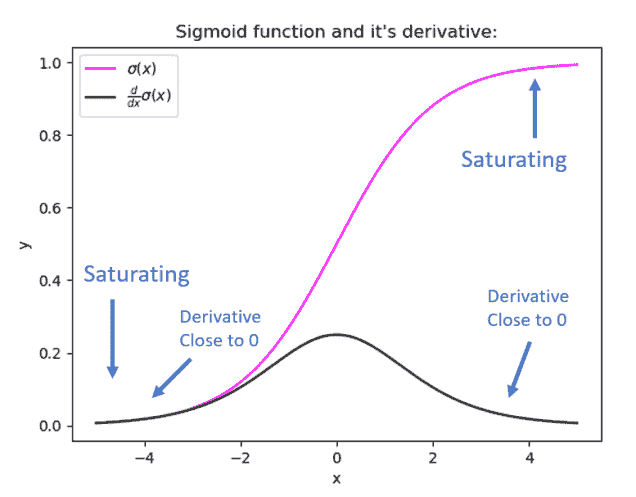
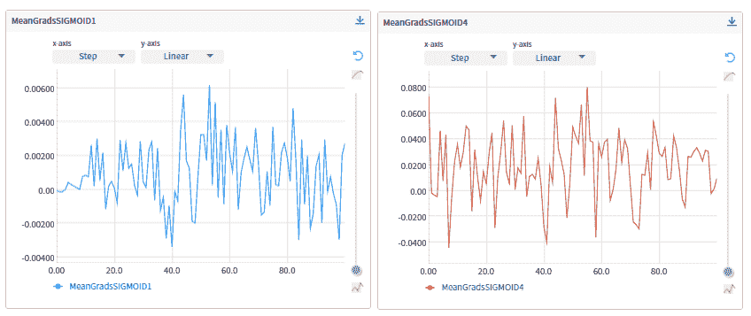
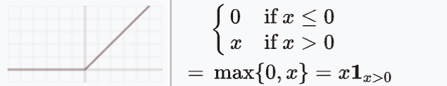
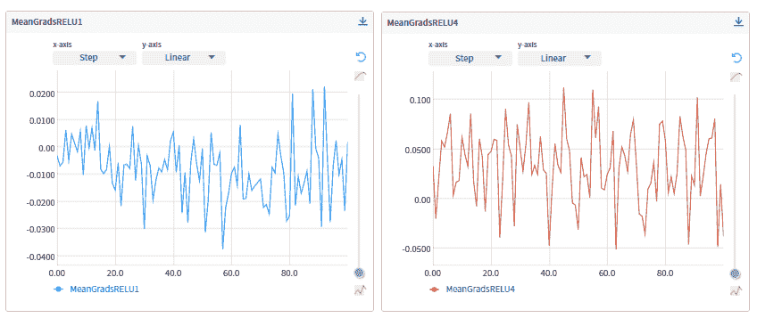
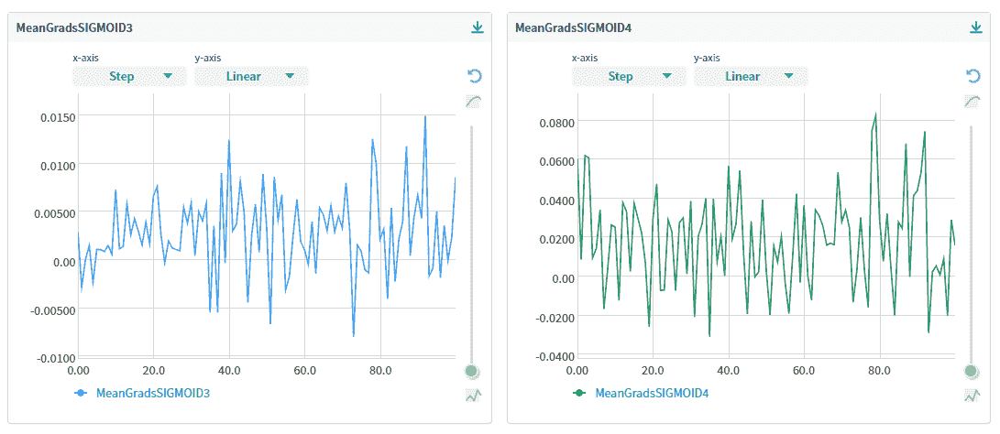
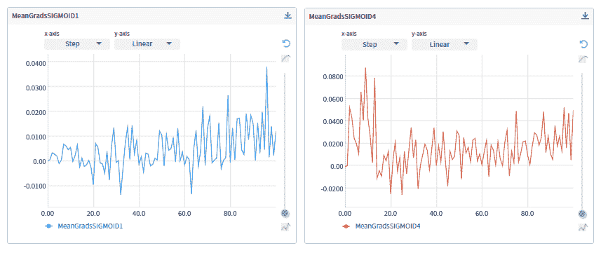
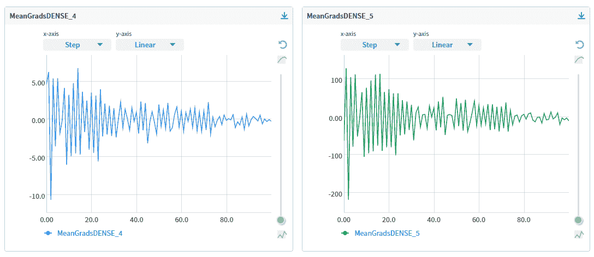
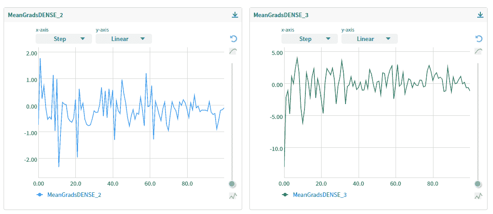

# 神经网络模型中的消失和爆炸梯度:调试、监控和修复

> 原文：<https://web.archive.org/web/https://neptune.ai/blog/vanishing-and-exploding-gradients-debugging-monitoring-fixing>

神经网络模型采用**梯度下降**的优化算法进行训练。输入训练数据有助于这些模型学习，损失函数衡量参数更新时每次迭代的预测性能有多准确。随着训练的进行，目标是通过迭代调整参数来减少损失函数/预测误差。具体来说，梯度下降算法有一个前进步骤和一个后退步骤，这让它做到这一点。

*   在前向传播中，输入向量/数据通过网络向前移动，使用一个公式来计算下一层中的每个神经元。该公式由输入/输出、激活函数 *f* 、权重 *W* 和偏差 *b* 组成:

该计算向前迭代，直到达到输出或预测。然后，我们计算由目标变量 y(在输出层中)和每个预测 y cap 之间的损失函数(例如，均方误差 MSE)定义的差:

*   有了这个初始评估，我们通过反向传递(也称为反向传播)来调整每层中每个神经元的权重和偏差。为了更新我们的神经网络，我们首先计算梯度，这只不过是损失函数 *w.r.t.* 权重和偏差的导数。然后，我们推动我们的算法采取梯度下降步骤来最小化损失函数(其中α是学习速率):

在这种情况下，可能发生两种相反的情况:导数项变得非常小，即接近零，而该项变得非常大并溢出。这些问题分别被称为消失和爆炸梯度。

当你训练你的模型一段时间后，性能似乎没有变得更好，很可能你的模型正在遭受**消失或爆炸梯度**。

本文针对这些问题，具体来说，我们将涵盖:

*   消失和爆炸渐变问题背后的直觉
*   为什么会出现这些梯度问题
*   如何在模型训练过程中识别梯度问题
*   解决消失和爆炸渐变的案例演示和解决方案
    *   消失渐变
        *   ReLU 作为激活函数
        *   降低模型复杂性
        *   具有方差的权重初始值设定项
        *   更好的优化器，具有良好的学习率
    *   爆炸渐变
        *   渐变剪辑
        *   合适的权重初始化器
        *   L2 范数正则化

## 消失或爆发的渐变——问题背后的直觉

### 消失

在反向传播期间，权重更新公式中的(部分)*导数/梯度*的计算遵循链式法则，其中早期层中的梯度是后期层的梯度的乘积:

由于梯度经常变小，直到它们接近零，新的模型权重(初始层的)将几乎与旧的权重相同，而没有任何更新。因此，梯度下降算法永远不会收敛到最优解。这就是所谓的消失梯度问题，这是神经网络不稳定行为的一个例子。

### 爆炸

相反，如果随着反向传播的进行，梯度变得越来越大，甚至越来越小，我们将会以具有大的权重更新的爆炸梯度结束，导致梯度下降算法的发散。

## 为什么会出现渐变消失或爆炸的问题？

有了对什么是消失/爆炸梯度的直观理解，您一定想知道-为什么梯度首先会消失或爆炸，也就是说，为什么这些梯度值在通过网络返回时会减小或爆炸？

### 消失

简而言之，当我们在隐藏层中使用 [Sigmoid](https://web.archive.org/web/20230103154738/https://en.wikipedia.org/wiki/Sigmoid_function) 或 [Tanh](https://web.archive.org/web/20230103154738/https://en.wikipedia.org/wiki/Hyperbolic_functions#Hyperbolic_tangent) **激活函数**时，就会出现渐变消失的问题；这些函数将一个大的输入空间压缩成一个小的空间。以乙状结肠为例，我们有以下概率密度函数:

对参数 x 求导，我们得到:

如果我们想象 Sigmoid 函数及其导数:



*Sigmoid function and its derivative | Source: Author *

我们可以看到，Sigmoid 函数将我们的输入空间压缩到[0，1]之间的范围内，当输入变得相当小或相当大时，这个函数 ***在 0 或 1 处饱和*** 。这些区域被称为“饱和区域”，其导数变得非常接近于零。同样适用于在-1 和 1 处 ***饱和*** 的 Tanh 函数。

假设我们有位于任何饱和区域中的输入，我们将基本上没有梯度值传播回来，导致早期层权重的零更新。通常，对于只有几层的浅层网络来说，这不是什么大问题，但是，当我们添加更多层时，初始层中梯度的消失将导致模型训练或收敛失败。

这是由于将这些小数字的 *n* 相乘以计算 *n* 层网络中早期层的梯度的效果，这意味着梯度随着 *n* 呈指数下降，而早期层训练非常缓慢，因此整个网络的性能下降。

### 爆炸

转到爆炸梯度，简而言之，这个问题是由于分配给神经网络的**初始权重**造成了巨大的损失。大的梯度值可以累积到观察到大的参数更新的点，导致梯度下降振荡而不会达到全局最小值。

更糟糕的是，这些参数可能太大，以至于溢出并返回无法再更新的 NaN 值。

## 如何识别渐层消失或爆炸的问题？

承认梯度的问题是我们需要避免或解决的事情，当它们发生时，我们应该如何知道一个模型正在遭受消失或爆炸的梯度问题？以下是一些迹象。

### 消失

*   在后面的层的参数中观察到大的变化，而前面的层的参数变化很小或保持不变
*   在某些情况下，随着训练的进行，早期层的权重可以变成 0
*   该模型学习缓慢，并且经常多次，在几次迭代之后训练停止
*   模型性能很差

### 爆炸

*   与消失的情况相反，爆炸梯度显示出它本身是不稳定的，批量/迭代与批量/迭代之间的大参数变化
*   模型权重可以很快变为 NaN
*   南也失去了模特

## 修复消失或爆炸渐变问题的实践

记住这些梯度问题的指标，让我们探索潜在的补救措施来解决它们。

*   首先，我们将关注于**消失场景**:模拟一个遭受此问题的**二进制分类**网络模型，然后演示各种解决方案
*   出于同样的原因，我们将在稍后用一个**回归**网络模型来解决**爆炸场景**

通过解决不同类型的深度学习任务，我的目标是演示不同的场景供您带走。还请注意，本文致力于为您提供实用的方法和技巧，因此我们将只讨论每种方法背后的一些直觉，而跳过数学或理论证明。

如上所述，由于观察是确定这些问题的关键部分，我们将使用 [Neptune.ai](https://web.archive.org/web/20230103154738/https://docs.neptune.ai/getting-started/how-to-add-neptune-to-your-code) 来跟踪我们的建模管道:

```py
import neptune.new as neptune
import os
myProject = 'YourUserName/YourProjectName'
project = neptune.init(api_token=os.getenv('NEPTUNE_API_TOKEN'),
                        project=myProject)
project.stop()
```

### 渐变消失时的解决方案

首先我们定义几个 helper 函数来训练并[在 Neptune.ai](https://web.archive.org/web/20230103154738/https://docs.neptune.ai/you-should-know/what-can-you-log-and-display) 中登录我们的模型。

*   记录梯度和重量:

```py
def getBatchGradWgts(grads, wgts, lossVal,
                      gradHist, lossHist, wgtsHist,
                      recordWeight=True, npt_exp=None):
    dataGrad, dataWeight = {}, {}

    for wgt, grad in zip(wgts, grads):
        if '/kernel:' not in wgt.name:
            continue
        layerName = wgt.name.split("/")[0]
        dataGrad[layerName] = grad.numpy()
        dataWeight[layerName] = wgt.numpy()

        if npt_exp:

npt_exp[f'MeanGrads{layerName.upper()}'].log(np.mean(grad.numpy()))
 npt_exp[f'MeanWgtBatch{layerName.upper()}'].log(np.mean(wgt.numpy()))

  gradHist.append(dataGrad)
  lossHist.append(lossVal.numpy())
  if recordWeight:
      wgtsHist.append(dataWeight)
```

```py
def fitModel(X, y, model, optimizer,
              n_epochs=n_epochs, curBatch_size=batch_size, npt_exp=None):

    lossFunc = tf.keras.losses.BinaryCrossentropy()
    subData = tf.data.Dataset.from_tensor_slices((X, y))
    subData = subData.shuffle(buffer_size=42).batch(curBatch_size)

    gradHist, lossHist, wgtsHist = [], [], []

    for epoch in range(n_epochs):
        print(f'== Starting epoch {epoch} ==')
        for step, (x_batch, y_batch) in enumerate(subData):
            with tf.GradientTape() as tape:

                yPred = model(x_batch, training=True)
                lossVal = lossFunc(y_batch, yPred)

            grads = tape.gradient(lossVal, model.trainable_weights)
            wgts = model.trainable_weights
            optimizer.apply_gradients(zip(grads, model.trainable_weights))

            if step == 5:
                getBatchGradWgts(gradHist=gradHist, lossHist=lossHist, wgtsHist=wgtsHist,
                                 grads=grads, wgts=wgts, lossVal=lossVal, npt_exp=npt_exp)
                if npt_exp:
                    npt_exp['BatchLoss'].log(lossVal)

    getBatchGradWgts(gradHist=gradHist, lossHist=lossHist, wgtsHist=wgtsHist,
                     grads=grads, wgts=wgts, lossVal=lossVal, npt_exp=npt_exp)
    return gradHist, lossHist, wgtsHist
```

*   可视化各层的平均梯度:

```py
def gradientsVis(curGradHist, curLossHist, modelName):
    fig, ax = plt.subplots(1, 1, sharex=True, constrained_layout=True, figsize=(7,5))
    ax.set_title(f"Mean gradient {modelName}")
    for layer in curGradHist[0]:
        ax.plot(range(len(curGradHist)), [gradList[layer].mean() for gradList in curGradHist], label=f'Layer_{layer.upper()}')
    ax.legend()
    return fig
```

#### 渐变消失模型

现在，我们将模拟一个数据集，并构建我们的基线**二元**分类神经网络:

```py
X, y = make_moons(n_samples=3000, shuffle=True , noise=0.25, random_state=1234)
```

```py
batch_size, n_epochs = 32, 100
```

```py
npt_exp = neptune.init(
        api_token=os.getenv('NEPTUNE_API_TOKEN'),
        project=myProject,
        name='VanishingGradSigmoid',
        description='Vanishing Gradients with Sigmoid Activation Function',
        tags=['vanishingGradients', 'sigmoid', 'neptune'])

    neptune_cbk = NeptuneCallback(run=npt_exp, base_namespace='metrics')
    def binaryModel(curName, curInitializer, curActivation, x_tr=None):
        model = Sequential()
        model.add(InputLayer(input_shape=(2, ), name=curName+"0"))
        model.add(Dense(10, kernel_initializer=curInitializer, activation=curActivation, name=curName+"1"))
        model.add(Dense(10, kernel_initializer=curInitializer, activation=curActivation, name=curName+"2"))
        model.add(Dense(5, kernel_initializer=curInitializer, activation=curActivation,  name=curName+"3"))
        model.add(Dense(1, kernel_initializer=curInitializer, activation='sigmoid', name=curName+"4"))
        return model

    curOptimizer = tf.keras.optimizers.RMSprop()
    optimizer = curOptimizer
    curInitializer = RandomUniform(-1, 1)

    model = binaryModel(curName="SIGMOID", curInitializer=curInitializer, curActivation="sigmoid")
    model.compile(optimizer=curOptimizer, loss='binary_crossentropy', metrics=['accuracy'])

    curGradHist, curLossHist, curWgtHist = fitModel(X, y, model, optimizer=curOptimizer, npt_exp=npt_exp)

    npt_exp['Comparing All Layers'].upload(neptune.types.File.as_image(gradientsVis(curGradHist, curLossHist, modelName='Sigmoid_Raw')))
    npt_exp.stop()
```

几个注意事项:

*   我们目前的香草/基线模型由 3 个隐藏层组成，每一层都有一个 sigmoid 激活
*   我们使用 RMSprop 作为优化器，Uniform [-1，1]作为权重初始化器

运行此模型将返回 Neptune.ai 中所有时期每个层的(平均)梯度，下面显示了层 1 和层 4 之间的比较:

[](https://web.archive.org/web/20230103154738/https://neptune.ai/blog/vanishing-and-exploding-gradients-debugging-monitoring-fixing/attachment/vanishing-and-exploding-gradients-1)

**Comparison between Layer 1 and Layer 4 from the baseline Sigmoid model generated using Neptune.ai** *| [Source](https://web.archive.org/web/20230103154738/https://app.neptune.ai/katyl/GradientsNew/e/GRAD1-6/charts)*

对于第 4 层，随着训练的进行，我们看到平均梯度的明显波动，然而，对于第 1 层，梯度实际上为零，即，值大约小于 0.006。消失渐变发生了！现在我们来谈谈如何解决这个问题。

#### 使用 ReLU 作为激活功能

如前所述，消失梯度问题是由于 Sigmoid 或 Tanh 函数的饱和性质。因此，一个有效的补救办法是切换到其他激活函数，这些激活函数的导数**不饱和**，例如 ReLU(整流线性单位):



*ReLU as the activation function | [Source](https://web.archive.org/web/20230103154738/https://en.wikipedia.org/wiki/Activation_function)*

如此图所示，对于正输入 x，ReLU 不饱和。当 x <= 0, ReLU has derivative/gradient = 0, and when x > 0 时，导数/梯度= 1。因此，乘以 ReLU 导数会返回 0 或 1；因此，不会有消失的梯度。

为了实现 ReLU 激活，我们可以简单地在如下所示的模型函数中指定` *relu* ':

```py
model = binaryModel(curName="Relu", curInitializer=curInitializer, curActivation="relu")

model.compile(optimizer=curOptimizer, loss='binary_crossentropy', metrics=['accuracy'])
```

运行该模型并比较从该模型计算的梯度，我们观察到跨时期的梯度变化，甚至对于标记为 RELU1:

[](https://web.archive.org/web/20230103154738/https://neptune.ai/blog/vanishing-and-exploding-gradients-debugging-monitoring-fixing/attachment/vanishing-and-exploding-gradients-2)

***Comparison between Layer 1 and Layer 4 from the ReLu model generated using Neptune.ai* | [Source](https://web.archive.org/web/20230103154738/https://app.neptune.ai/katyl/GradientsNew/e/GRAD1-8/charts)**

在大多数情况下，类似 ReLU 的激活函数本身应该足以处理渐变消失的问题。但是，这是否意味着我们要一直使用 ReLU，彻底抛弃乙状结肠？嗯，消失梯度的存在不应该阻止你使用 Sigmoid，它有许多可取的属性，如单调性和易于微分。即使使用 Sigmoid 激活函数，也有一些方法可以解决这个问题，这些方法是我们将在接下来的会议中尝试的。

#### 降低模型的复杂性

由于消失梯度的根本原因在于一堆小梯度的相乘，直观上，通过减少梯度的数量，即减少我们网络中的层数来解决这个问题是有意义的。例如，与基线模型中指定 3 个隐藏层不同，我们可以只保留 1 个隐藏层，以使我们的模型更简单:

```py
def binaryModel(curName, curInitializer, curActivation, x_tr=None):
        model = Sequential()
        model.add(InputLayer(input_shape=(2, ), name=curName+"0"))
        model.add(Dense(3, kernel_initializer=curInitializer, activation=curActivation,  name=curName+"3"))
        model.add(Dense(1, kernel_initializer=curInitializer, activation='sigmoid', name=curName+"4"))
        return model
```

该模型为我们提供了清晰的梯度更新，显示在该图中:

[](https://web.archive.org/web/20230103154738/https://neptune.ai/blog/vanishing-and-exploding-gradients-debugging-monitoring-fixing/attachment/vanishing-and-exploding-gradients-3)

*Comparison between Layer 1 and Layer 4 from the reduced Sigmoid model generated using Neptune.ai | **[Source](https://web.archive.org/web/20230103154738/https://app.neptune.ai/katyl/GradientsNew/e/GRAD1-30/charts)***

这种方法的一个警告是，我们的模型性能可能不如更复杂的模型(具有更多隐藏层)。

#### 使用带有方差的权重初始值设定项

当我们的初始权重设置得太小或缺少方差时，通常会导致梯度消失。回想一下，在我们的基线模型中，我们将权重初始化为均匀的[-1，1]分布，这可能会陷入这些权重太小的陷阱！

在他们 2010 年[的论文](https://web.archive.org/web/20230103154738/http://proceedings.mlr.press/v9/glorot10a/glorot10a.pdf)中，Xavier Glorot 和 Yoshua Bengio 提供了从**特定方差**的均匀或正态分布中采样初始权重的理论依据，并保持所有层的激活方差相同。

在 [Keras/Tensorflow](https://web.archive.org/web/20230103154738/https://keras.io/api/layers/initializers/) 中，这种方法被实现为 Glorot 正态` *glorot_normal* 和 Glorot Uniform`*Glorot _ Uniform*`，顾名思义，这两种方法分别从(截尾)正态和均匀分布中采样初始权重。两者都考虑了输入和输出单元的数量。

对于我们的模型，让我们用 *glorot_uniform* 进行实验，根据 [Keras 文档](https://web.archive.org/web/20230103154738/https://keras.io/api/layers/initializers/#glorotuniform-class):

回到具有 3 个隐藏层的原始模型，我们将模型权重初始化为 *glorot_uniform* :

```py
def binaryModel(curName, curInitializer, curActivation, x_tr=None):
        model = Sequential()
        model.add(InputLayer(input_shape=(2, ), name=curName+"0"))
        model.add(Dense(10, kernel_initializer=curInitializer, activation=curActivation, name=curName+"1"))
        model.add(Dense(10, kernel_initializer=curInitializer, activation=curActivation, name=curName+"2"))
        model.add(Dense(5, kernel_initializer=curInitializer, activation=curActivation,  name=curName+"3"))
        model.add(Dense(1, kernel_initializer=curInitializer, activation='sigmoid', name=curName+"4"))
        return model

    curOptimizer = tf.keras.optimizers.RMSprop()
    optimizer = curOptimizer

    curInitializer = 'glorot_uniform'

    npt_exp['Comparing All Layers'].upload(neptune.types.File.as_image(gradientsVis(curGradHist, curLossHist,
                                                                                    modelName='Sigmoid_NormalWeightInit')))
    npt_exp.stop()
```

检查我们的 Neptune.ai 跟踪器，我们看到梯度随着这个权重初始化而变化，尽管第 1 层(在左边)与最后一层相比显示出较少的波动:

[](https://web.archive.org/web/20230103154738/https://neptune.ai/blog/vanishing-and-exploding-gradients-debugging-monitoring-fixing/attachment/vanishing-and-exploding-gradients-4)

***Comparison between Layer 1 and Layer 4 from the Glorot weight initializer model generated using Neptune.ai*** ***| [Source](https://web.archive.org/web/20230103154738/https://app.neptune.ai/katyl/GradientsNew/e/GRAD1-48/charts)***

#### 选择更好的优化器并调整学习率

现在，我们已经解决了导数和初始权重的选择，公式的最后一部分是学习率。随着梯度接近零，优化器陷入次优局部最小值或鞍点。为了克服这一挑战，我们可以使用一个优化器，它具有将累积的先前梯度考虑在内的动力。例如， [Adam](https://web.archive.org/web/20230103154738/https://arxiv.org/abs/1412.6980) 有一个动量项，计算为过去梯度的指数衰减平均值。

此外，作为一个高效的优化器，Adam 可以快速收敛或发散。因此，稍微降低学习率将有助于防止你的网络太容易发散，从而降低梯度接近零的可能性。要使用 Adam 优化器，我们需要修改的只是 *`curOptimizer`* arg。：

```py
curOptimizer = keras.optimizers.Adam(learning_rate=0.008) 

curInitializer = RandomUniform(-1, 1)

model = binaryModel(curName="SIGMOID", curInitializer=curInitializer, curActivation="sigmoid")
model.compile(optimizer=curOptimizer, loss='binary_crossentropy', metrics=['accuracy'])
```

在上面的代码中，我们将 Adam 指定为模型优化器，学习率相对较小，为 0.008，激活函数设置为 sigmoid。下面是第 1 层和第 4 层渐变的比较:

[](https://web.archive.org/web/20230103154738/https://neptune.ai/blog/vanishing-and-exploding-gradients-debugging-monitoring-fixing/attachment/vanishing-and-exploding-gradients-5)

****Comparison between Layer 1 and Layer 4 from the Adam model generated using Neptune.ai**** ***| [Source](https://web.archive.org/web/20230103154738/https://app.neptune.ai/katyl/GradientsNew/e/GRAD1-50/charts)***

正如我们所看到的，通过 Adam 和调整良好的小学习率，我们看到梯度的变化使它们的值远离零，并且我们的模型也根据下面所示的损失图收敛到局部最小值:

[](https://web.archive.org/web/20230103154738/https://neptune.ai/blog/vanishing-and-exploding-gradients-debugging-monitoring-fixing/attachment/vanishing-and-exploding-gradients-6)

*Selecting better optimizer and adjusting learning rate ***| [Source](https://web.archive.org/web/20230103154738/https://app.neptune.ai/katyl/GradientsNew/e/GRAD1-50/charts)****

到目前为止，我们已经讨论了渐变消失的解决方案，让我们继续讨论渐变爆炸的问题。

### 渐变爆炸时的解决方案

对于爆炸梯度问题，让我们看看这个回归模型。

```py
nfeatures = 15
X, y = make_regression(n_samples=1500, n_features=nfeatures, noise=0.2, random_state=42)

def regressionModel(X, y, curInitializer, USE_L2REG, secondLayerAct='relu'):

    inp = Input(shape = (X.shape[1],))
    if USE_L2REG:

        x = Dense(35, activation='tanh', kernel_initializer=curInitializer,
                  kernel_regularizer=regularizers.l2(0.01),
                  activity_regularizer=regularizers.l2(0.01))(inp)
    else:
        x = Dense(35, activation=secondLayerAct, kernel_initializer=curInitializer)(inp)

    out = Dense(1, activation='linear')(x)
    model = Model(inp, out)
    return model
```

为了编译该模型，我们将使用统一的[4，5]权重初始化器以及 ReLu 激活，目的是创建爆炸梯度情况:

```py
sgd = tf.keras.optimizers.SGD()
curOptimizer = sgd

curInitializer = RandomUniform(4,5)

model = regressionModel(X, y, curInitializer, USE_L2REG=False)
model.compile(loss='mean_squared_error', optimizer=curOptimizer, metrics=['mse'])

curModelName = 'Relu_Raw'
```

```py
curGradHist, curLossHist, curWgtHist = fitModel(X, y, model, optimizer=curOptimizer,                                                modelType = 'regression',                                                npt_exp=npt_exp)

npt_exp['Comparing All Layers'].upload(neptune.types.File.as_image(gradientsVis(curGradHist, curLossHist,
                                                                                modelName=curModelName)))
npt_exp.stop()
```

有了这么大的权重初始化，随着训练的进行，下面的错误消息出现在我们的 Neptune.ai 跟踪器中就不足为奇了，正如前面讨论的那样，这清楚地表明我们的梯度爆炸了:


*Error message in Neptune.ai | Source*

#### 渐变剪辑

为了防止渐变爆炸，最有效的方法之一是渐变裁剪。简而言之，梯度裁剪将导数限定在一个阈值，并使用限定的梯度来更新权重。如果您对该方法的详细解释感兴趣，请参考[文章“了解渐变裁剪(以及它如何修复爆炸渐变问题)”](/web/20230103154738/https://neptune.ai/blog/understanding-gradient-clipping-and-how-it-can-fix-exploding-gradients-problem)。

可以通过` *clipvalue* '参数指定将渐变限制为某个值。如下图所示:

```py
sgd = tf.keras.optimizers.SGD(clipvalue=50)
curOptimizer = sgd
curInitializer = 'glorot_normal'

model = regressionModel(X, y, curInitializer, USE_L2REG=False)
model.compile(loss='mean_squared_error', optimizer=curOptimizer, metrics=['mse'])
curModelName = 'GradClipping' 
```

通过裁剪运行该模型，我们能够将梯度保持在定义的范围内:

合适的权重初始化器

[](https://web.archive.org/web/20230103154738/https://neptune.ai/blog/vanishing-and-exploding-gradients-debugging-monitoring-fixing/attachment/vanishing-and-exploding-gradients-8)

**Layer gradients from the gradients clipping model generated using Neptune.ai* | ***[Source](https://web.archive.org/web/20230103154738/https://app.neptune.ai/katyl/GradientsNew/e/GRAD1-56/charts)****

#### 如前所述，梯度爆炸的一个主要原因在于太大的权重初始化和更新，这是我们的回归模型中梯度爆炸的原因。因此，正确初始化模型权重是解决这个爆炸梯度问题的关键。

与消失梯度相同，我们将使用正态分布实现 Glorot 初始化。

由于 Glorot 初始化与 Tanh 或 Sigmoid 配合使用效果最佳，我们将在本实验中将 Tanh 指定为激活函数:

这是该模型的渐变图，修复了渐变爆炸问题:

```py
curOptimizer = tf.keras.optimizers.SGD()

curInitializer = 'glorot_normal'

model = regressionModel(X, y, curInitializer, USE_L2REG=False, secondLayerAct='tanh')

model.compile(loss='mean_squared_error', optimizer=curOptimizer, metrics=['mse'])

curModelName = 'GlorotInit'
```

L2 范数正则化

除了权重初始化之外，另一个优秀的方法是采用 [L2 正则化](https://web.archive.org/web/20230103154738/https://ml-cheatsheet.readthedocs.io/en/latest/regularization.html)，它通过将模型权重的平方项强加到损失函数来惩罚大的权重值:

[](https://web.archive.org/web/20230103154738/https://neptune.ai/blog/vanishing-and-exploding-gradients-debugging-monitoring-fixing/attachment/vanishing-and-exploding-gradients-7)

*Layer gradients from the Glorot initialization model generated using Neptune.ai | **[Source](https://web.archive.org/web/20230103154738/https://app.neptune.ai/katyl/GradientsNew/e/GRAD1-54/charts)***

#### 添加 L2 范数经常会导致整个网络中较小的权重更新，并且在 Keras 中使用 args 实现这种正则化相当简单。`*内核 _ 正则化子*`和`*活动 _ 正则化子*`:

根据 Razvan 等人的建议，我们将这个模型的初始权重设置为 glorot normal。，2013 初始化小值和方差的参数。这里显示了每层的损耗曲线和梯度:

```py
curInitializer = 'glorot_normal'
x = Dense(35, activation='tanh', kernel_initializer=curInitializer,
          kernel_regularizer=regularizers.l2(0.01),
          activity_regularizer=regularizers.l2(0.01))(inp)

curInitializer = 'glorot_normal'
model = regressionModel(X, y, curInitializer, USE_L2REG=True)
model.compile(loss='mean_squared_error', optimizer=curOptimizer, metrics=['mse'])

curModelName = 'L2Reg'
```

再次，通过所有历元将梯度控制在合理的范围内，并且模型逐渐收敛。

最后的话


**Layer gradients from the L2 regularization model generated using Neptune.ai* | **[Source](https://web.archive.org/web/20230103154738/https://app.neptune.ai/katyl/GradientsNew/e/GRAD1-58/charts)***

除了我们在本文中讨论的主要技术，其他值得尝试避免/修复渐变的方法包括[](https://web.archive.org/web/20230103154738/https://arxiv.org/abs/1502.03167v3)**和 [**缩放输入数据**](https://web.archive.org/web/20230103154738/https://cnvrg.io/gradient-clipping/) 。这两种方法都可以使您的网络更加健壮。直觉是，在反向投影过程中，我们每一层的输入数据可能会有很大的不同(就像前一层的输出一样)。使用批量归一化允许我们固定每个图层的输入数据的均值和方差，从而防止其移动过多。有了更强大的网络，就不太可能遇到两个梯度问题。**

 **## 在本文中，我们讨论了与神经网络训练相关的两个主要问题-消失和爆炸梯度问题。我们解释了它们的原因和后果。我们还研究了解决这两个问题的各种方法。

希望你发现这篇文章是有用的，并且学到了实用的技术来训练你自己的神经网络模型。供您参考，完整的代码可以在我的 [GitHub repo 这里](https://web.archive.org/web/20230103154738/https://github.com/YiLi225/NeptuneBlogs/blob/main/GradientsIssuesNeptune.py)获得，而 [Neptune 项目可以在这里](https://web.archive.org/web/20230103154738/https://app.neptune.ai/katyl/GradientsNew/experiments?compare=GwGgTOEIwBzkA&split=bth&dash=charts&viewId=standard-view)获得。

In this article, we have discussed two major issues associated with neural network training – the Vanishing and Exploding gradients problems. We explained their causes and consequences. We also walked through various approaches to address the two problems. 

Hope you have found this article useful and learned practical techniques to use in training your own neural network models. For your reference, the full code is available in my [GitHub repo here](https://web.archive.org/web/20230103154738/https://github.com/YiLi225/NeptuneBlogs/blob/main/GradientsIssuesNeptune.py) and the [Neptune project is available here](https://web.archive.org/web/20230103154738/https://app.neptune.ai/katyl/GradientsNew/experiments?compare=GwGgTOEIwBzkA&split=bth&dash=charts&viewId=standard-view).**