# NLP 中的矢量化技术[指南]

> 原文：<https://web.archive.org/web/https://neptune.ai/blog/vectorization-techniques-in-nlp-guide>

自然语言是我们人类交流思想和观点的方式。自然语言有两种主要媒介——语音和文本。

对于健康的人来说，听和读毫不费力，但对于机器学习算法来说却很难。这就是为什么科学家们不得不提出自然语言处理(NLP)。

## 什么是自然语言处理？

*   NLP 使计算机能够处理人类语言，理解意义和上下文，以及背后相关的情感和意图，并最终使用这些见解来创造新的东西。
*   NLP 将计算语言学与统计机器学习和深度学习模型相结合。

我们如何开始让计算机能够解释单词呢？这就是矢量化的目的。

## 什么是矢量化？

*   矢量化是一种经典方法的行话，这种方法将输入数据从原始格式(即文本)转换为 ML 模型支持的实数矢量格式。这种方法自从计算机诞生以来就一直存在，它在各个领域都非常有效，现在被用于 NLP。

*   在机器学习中，矢量化是特征提取的一个步骤。这个想法是通过将文本转换为数字向量，从文本中获取一些独特的特征，供模型训练。

我们很快就会看到，有很多方法可以执行矢量化，从简单的二进制术语出现特征到高级的上下文感知特征表示。根据用例以及模型的不同，他们中的任何一个都有可能完成所需的任务。

让我们了解一下这些技术，看看如何使用它们。

## 矢量化技术

### 1.一袋单词

所有技术中最简单的。它包括三个操作:

首先，输入文本被标记化。一个句子被表示为其组成单词的列表，对所有输入的句子都是如此。

在所有获得的标记化单词中，仅选择唯一的单词来创建词汇表，然后按字母顺序排序。

最后，从词汇单词的频率中为输入创建稀疏矩阵。在这个稀疏矩阵中，每一行都是一个句子向量，其长度(矩阵的列)等于词汇表的大小。

让我们来看一个例子，看看它在实践中是怎样的。在这个练习中，我们将使用 Sklearn 库。

让我们进行必要的进口。

```py
from sklearn.feature_extraction.text import CountVectorizer
```

考虑我们有下面的文档列表。

```py
sents = ['coronavirus is a highly infectious disease',
   'coronavirus affects older people the most', 
   'older people are at high risk due to this disease']

```

让我们创建一个 CountVectorizer 的实例。

```py
cv = CountVectorizer()

```

现在让我们对输入进行矢量化，并将其转换为 NumPy 数组，以便于查看。

```py
X = cv.fit_transform(sents) 
X = X.toarray()

```

这是向量的样子:

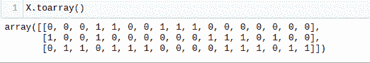

我们把词汇表打印出来，了解一下为什么会是这个样子。

```py
sorted(cv.vocabulary_.keys())

```

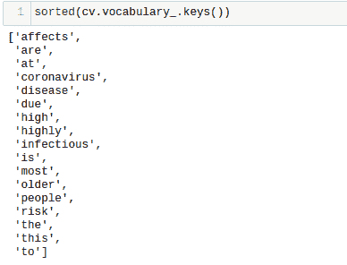

*   你可以看到每一行都是‘sents’中各个句子的相关向量表示。
*   每个向量的长度等于词汇的长度。
*   列表中的每个成员都代表了相关单词在分类词汇中出现的频率。

在上面的例子中，我们仅将单个单词视为在词汇键中可见的特征，即它是一个单字表示。这可以被调整以考虑 n-gram 特性。

假设我们想考虑输入的二元模型表示。这可以通过在实例化 CountVectorizer 对象时简单地更改默认参数来实现:

```py
cv = CountVectorizer(ngram_range=(2,2))
```

在这种情况下，我们的向量和词汇看起来像这样。

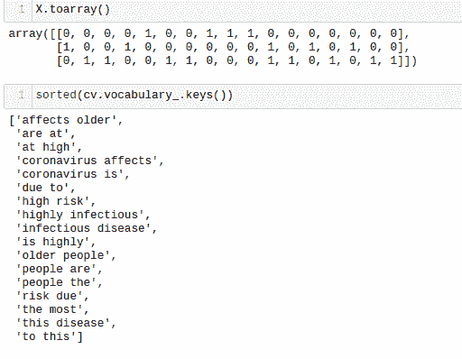

因此，我们可以随心所欲地操作这些特性。事实上，我们还可以将单字母词、双字母词、三字母词等组合起来，形成特征空间。

虽然我们在这里使用 sklearn 构建了一个单词包模型，但它可以通过多种方式实现，例如 Keras、Gensim 等库。您也可以很容易地编写自己的单词包实现。

这是一种简单而有效的文本编码技术，可以多次完成这项工作。

### 2.TF-IDF

TF-IDF 或术语频率-逆文档频率，是一个数字统计，旨在反映一个单词对文档的重要性*。*虽然是另一种基于频率的方法，但也没有一袋文字那么幼稚。

TF-IDF 如何改进单词袋？

在单词包中，我们看到了矢量化只与给定文档中单词的频率有关。结果，对意义贡献不大的冠词、介词和连词变得和形容词一样重要。

TF-IDF 帮助我们克服了这个问题。经常重复的单词不会压倒不太频繁但重要的单词。

它有两个部分:

TF 代表词频。可以理解为归一化的频率得分。它通过以下公式计算:

因此，可以想象这个数字将始终保持≤ 1，因此我们现在判断一个单词在文档中所有单词的上下文中的出现频率。

IDF 代表逆文档频率，但在我们进入 IDF 之前，我们必须弄清楚 DF–文档频率。它由以下公式给出:

DF 告诉我们包含某个单词的文档的比例。那么 IDF 是什么？

它是文档频率的倒数，最终 IDF 得分由以下公式得出:

为什么要逆 DF？

正如我们上面讨论的，其背后的直觉是，一个单词在所有文档中越常见，它对当前文档的重要性就越小。

在最终计算中，采用对数来抑制 IDF 的影响。

TF-IDF 的最终得分为:

这就是 TF-IDF 如何设法融入一个词的意义。分数越高，这个词就越重要。

现在就让我们把手弄脏，看看 TF-IDF 在实践中是什么样子的。

同样，在这个练习中，我们将使用 Sklearn 库，就像我们在单词袋中所做的那样。

进行所需的进口。

```py
from sklearn.feature_extraction.text import TfidfVectorizer

```

让我们再次使用同一套文件。

```py
sents = ['coronavirus is a highly infectious disease',
   'coronavirus affects older people the most', 
   'older people are at high risk due to this disease']

```

创建 TfidfVectorizer 的实例。

```py
tfidf = TfidfVectorizer()

```

让我们现在转换我们的数据。

```py
transformed = tfidf.fit_transform(sents)

```

现在让我们看看哪些特性是最重要的，哪些特性是无用的。为了便于解释，我们将使用熊猫图书馆，只是为了更好地查看分数。

进行所需的导入:

```py
import pandas as pd
```

创建以特征名称(即单词)作为索引、以排序的 TF-IDF 分数作为列的数据帧:

```py
df = pd.DataFrame(transformed[0].T.todense(),
    	index=tfidf.get_feature_names(), columns=["TF-IDF"])
df = df.sort_values('TF-IDF', ascending=False)

```

由于转换后的 TFIDF 特征矩阵以 Scipy 压缩稀疏行矩阵的形式出现，无法以原始形式查看，因此我们在进行转换后，通过 todense()操作将其转换为 Numpy 数组。类似地，我们通过 get_feature_names()获得了标记化单词的完整词汇表。

这是从另一端出来的:

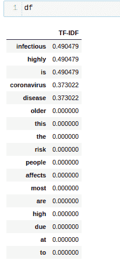

因此，根据 TF-IDF 的说法,“传染性”一词是最重要的特征，而在词汇包等幼稚方法中用于特征构建的许多词在这里都等于 0。这是我们一直想要的。

关于 TF-IDF 的几点建议:

*   n 元语法的概念在这里也是适用的，我们可以将单词组合成 2、3、4 等组来构建我们的最终特征集。
*   除了 n-gram，还有许多参数，如 min_df、max_df、max_features、sublinear_tf 等。一起玩耍。仔细调整这些参数可以为您的模型的功能创造奇迹。

尽管如此简单，TF-IDF 还是被广泛用于信息检索等任务中，以判断哪个响应对查询来说是最好的，在聊天机器人或关键字提取中特别有用，以确定哪个单词在文档中最相关，因此，您会发现自己经常依赖 TF-IDF 的直觉智慧。

到目前为止，我们已经看到了基于频率的文本编码方法，现在是时候看看更复杂的方法了，正如我们所知，这些方法改变了单词嵌入的世界，并在 NLP 中开辟了新的研究机会。

### 3\. Word2Vec

这种方法早在 2013 年由谷歌研究人员在这篇[论文](https://web.archive.org/web/20221114162312/https://arxiv.org/pdf/1301.3781.pdf)中发布，它席卷了 NLP 行业。简而言之，这种方法使用简单的神经网络的能力来生成[单词嵌入](/web/20221114162312/https://neptune.ai/blog/word-embeddings-guide)。

与基于频率的方法相比，Word2Vec 有何改进？

在单词袋和 TF-IDF 中，我们看到了每个单词是如何被当作一个单独的实体来对待的，语义完全被忽略了。随着 Word2Vec 的引入，单词的向量表示被认为是上下文感知的，这可能是有史以来的第一次。

或许，Word2Vec 最著名的例子之一就是下面这个表达式:

**国王——男人+女人=王后**

因为每个单词都被表示为一个 n 维向量，所以可以想象所有的单词都被映射到这个 n 维空间，使得具有相似含义的单词在这个多维空间中彼此非常接近。

Word2Vec 主要有两种实现方式，我们一个一个来看看:

#### 答:**跳格**

第一种是跳格法，我们向神经网络提供一个单词，让它预测上下文。大致的想法可以在下图的帮助下捕捉到:

这里 w[i]是句子中“I”位置的输入单词，输出包含关于“I”的两个前面的单词和两个后面的单词。

从技术上讲，它预测一个单词成为给定目标单词的上下文单词的概率。网络输出的概率会告诉我们在输入单词附近找到每个词汇单词的可能性有多大。

这个浅层网络包括一个输入层、一个隐藏层和一个输出层，我们很快就会看到。

然而，有趣的是，我们实际上并没有使用这个经过训练的神经网络。相反，目标只是在正确预测周围单词的同时学习隐藏层的权重。这些权重就是单词嵌入。

网络要预测多少个邻词是由一个叫做“窗口大小”的参数决定的。该窗口向单词的两个方向延伸，即向左和向右。

假设我们想要在一个输入句子上训练一个跳过 gram 的 word2vec 模型:

**“敏捷的棕色狐狸跳过懒惰的狗”**

下图说明了窗口大小为 2 时，从这句话生成的训练样本。

*   ‘成为第一个目标单词，并且因为它是句子的第一个单词，所以在它的左边没有单词，所以大小为 2 的窗口只延伸到它的右边，导致列出的训练样本。
*   当我们的目标移动到下一个单词时，由于在目标的左边出现了一个单词，所以窗口向左扩展了 1。
*   最后，当目标单词在中间某处时，训练样本按预期生成。

**神经网络**

现在，让我们来讨论将要根据上述训练样本进行训练的网络。

**直觉**

*   如果你知道什么是自动编码器，你会发现这个网络背后的想法类似于自动编码器。

*   你取一个非常大的输入向量，在隐藏层将其压缩成一个密集的表示，然后不是像自动编码器那样重建原始向量，而是输出与词汇表中每个单词相关的概率。

**输入/输出**

现在问题来了，你如何输入一个单一的目标词作为一个大的

向量？

答案是 One-Hot 编码。

*   假设我们的词汇包含大约 10，000 个单词，而我们当前的目标单词“fox”介于两者之间。我们要做的是，在对应于单词“fox”的位置放置 1，在其他位置放置 0，这样我们就有了一个 10，000 维的向量，其中一个 1 作为输入。
*   类似地，我们网络的输出也将是一个 10，000 维的向量，包含我们词汇表中的每个单词成为我们输入目标单词的上下文单词的概率。

这是我们的神经网络的架构，看起来像这样:

*   可以看出，给定我们的词汇量=10，000，输入是一个 10，000 维的向量，包含对应于目标单词位置的 1。
*   输出层由应用了 Softmax 激活函数的 10，000 个神经元组成，以便获得我们词汇表中每个单词的相应概率。
*   现在，这个网络的最重要的部分，隐藏层是一个线性层，即没有应用激活函数，并且该层的优化权重将成为学习的单词嵌入。
*   例如，假设我们决定用上面的网络学习单词嵌入。在这种情况下，隐藏层权重矩阵形状将是 M x N，其中 M =词汇量(在我们的例子中是 10，000)，N =隐藏层神经元(在我们的例子中是 300)。
*   一旦模型得到训练，我们的目标单词的最终单词嵌入将由以下计算给出:

**1×10000 输入向量* 10000×300 矩阵= 1×300 向量**

*   Google 在其训练的模型中使用了 300 个隐藏层神经元，然而，这是一个超参数，可以相应地进行调整以获得最佳结果。

这就是跳格 word2vec 模型的一般工作方式。是时候看看它的竞争对手了。

#### B. **CBOW**

CBOW 代表连续单词包。在 CBOW 方法中，我们不是预测上下文单词，而是将它们输入到模型中，并要求网络预测当前单词。总体思路如下所示:

你可以看到 CBOW 是跳格法的镜像。这里所有的符号的意思和它们在 skip-gram 中的意思完全一样，只是方法颠倒了。

现在，既然我们已经深入研究了什么是 skip-gram 以及它是如何工作的，我们就不再重复这两种方法中常见的部分。相反，我们将只讨论 CBOW 在工作上与 skip-gram 有何不同。为此，我们将粗略地看一下 CBOW 模型架构。

它看起来是这样的:

*   我们的隐藏层和输出层的尺寸保持与 skip-gram 模型相同。
*   然而，正如我们所读到的，CBOW 模型将上下文单词作为输入，这里的输入是 C 个上下文单词，其形式为大小为 1xV 的单热编码向量，其中 V =词汇的大小，使得整个输入 CxV 是多维的。
*   现在，这些 C 向量中的每一个都将乘以我们的隐藏层的权重，其形状为 VxN，其中 V = vocab 大小，N =隐藏层中的神经元数量。
*   如果你可以想象，这将导致 C，1xN 向量，所有这些 C 向量将平均元素的方式，以获得我们的隐藏层的最终激活，然后将馈入我们的输出 softmax 层。
*   隐藏层和输出层之间的学习权重构成了单词嵌入表示。

如果这对你来说有点太难了，CBOW 模型的 TLDR 是:

因为有多个上下文单词，所以进行平均来计算隐藏层值。在这之后，它变得类似于我们的 skip-gram 模型，并且学习的单词嵌入来自输出层权重而不是隐藏层权重。

什么时候使用跳格模型，什么时候使用 CBOW？

*   根据原始论文，skip-gram 可以很好地处理小数据集，并可以更好地表示罕见的单词。
*   然而，CBOW 被发现比 skip-gram 训练得更快，并且可以更好地表示频繁出现的单词。
*   所以选择 skip-gram 还是 CBOW 取决于我们要解决的问题的类型。

现在有了足够的理论，让我们看看如何使用 word2vec 来生成单词嵌入。

在这个练习中，我们将使用 Gensim 库。

进行所需的进口。

```py
from gensim import models

```

现在这里有两个选择，要么我们可以使用预先训练的模型，要么我们自己训练一个新的模型。我们会经历这两种方式。

让我们先使用谷歌预先训练好的模型，看看我们能用它做些什么。你可以从[这里](https://web.archive.org/web/20221114162312/https://drive.google.com/file/d/0B7XkCwpI5KDYNlNUTTlSS21pQmM/edit?resourcekey=0-wjGZdNAUop6WykTtMip30g)下载这个模型，并在下面给出解压文件的路径，或者你可以通过下面的 Linux 命令得到它。

```py
wget -c "https://s3.amazonaws.com/dl4j-distribution/GoogleNews-vectors-negative300.bin.gz"

gzip -d GoogleNews-vectors-negative300.bin.gz

```

让我们现在加载模型，但是，请注意，这是一个非常沉重的模型，您的笔记本电脑可能会因为内存不足而死机。

```py
w2v = models.KeyedVectors.load_word2vec_format(
'./GoogleNews-vectors-negative300.bin', binary=True)

```

任何单词的矢量表示，比如健康，可以通过以下方式获得:

```py
vect = w2v['healthy']
```

这将给出一个 300 维的向量。

我们还可以利用这个预先训练的模型来获得输入单词的相似意思的单词。

```py
w2v.most_similar('happy')
```


令人惊讶的是，它对这项任务的表现是如此之好，输出包括一个相关单词元组及其相应的相似性得分的列表，按相似性降序排列。

如前所述，您也可以训练自己的 word2vec 模型。

让我们再次使用前面的句子集作为数据集来训练我们的自定义 word2vec 模型。

```py
sents = ['coronavirus is a highly infectious disease',
   'coronavirus affects older people the most', 
   'older people are at high risk due to this disease']

```

Word2vec 需要标记化句子列表形式的训练数据集，因此我们将预处理 sents 并将其转换为:

```py
sents = [sent.split() for sent in sents]

```

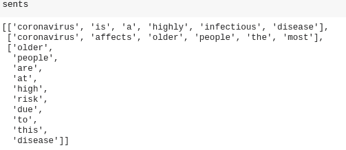

最后，我们可以用以下内容训练我们的模型:

```py
custom_model = models.Word2Vec(sents, min_count=1,size=300,workers=4)
```

这个自定义模型的表现如何将取决于我们的数据集以及它的训练强度。然而，它不太可能击败谷歌预先训练的模型。

这就是 word2vec 的全部内容。如果您想直观感受 word2vec 模型的工作方式，并想更好地理解它，请访问这个[链接。这是见证 CBOW & skip-gram 运行的一个非常酷的工具。](https://web.archive.org/web/20221114162312/https://ronxin.github.io/wevi/)

### 4.手套

GloVe 代表单词表示的全局向量。它是在斯坦福开发的。你可以在这里找到原始论文，它发表于 word2vec 一年之后。

与 Word2Vec 类似，GloVe 背后的直觉也在创建上下文单词嵌入，但考虑到 Word2Vec 的出色性能。为什么需要像手套这样的东西？

【GloVe 如何比 Word2Vec 有所提升？

*   Word2Vec 是一种基于窗口的方法，在这种方法中，模型依赖于本地信息来生成单词嵌入，而单词嵌入又受到我们选择的判定窗口大小的限制。
*   这意味着学习目标词的语义只受原句中周围词的影响，这是一种有点低效的统计使用，因为我们可以处理更多的信息。
*   另一方面，GloVe 捕获全局和局部统计数据，以便得出单词 embeddings。

我们看到 Word2Vec 中使用了局部统计，但是现在什么是全局统计呢？

GloVe 通过对共现矩阵进行训练来获得语义。它建立在单词-单词共现是一条重要信息的想法上，使用它们是对生成单词嵌入的统计的有效使用。这就是 GloVe 如何设法将“全局统计”合并到最终结果中的。

对于那些不知道共现矩阵的人，这里有一个例子:

假设我们有两个文档或句子。

**文献 1:** 闪光的不一定都是金子。

**文件二:**结局好的都是好的。

然后，对于 n = 1 的固定窗口大小，我们的共生矩阵将如下所示:

*   如果您花点时间看一下，就会发现行和列是由我们的词汇表组成的，也就是从两个文档中获得的一组唯一的标记化单词。
*   这里，<start>和<end>用来表示句子的开始和结束。</end></start>
*   大小为 1 的窗口向单词的两个方向延伸，因为“that”&“is”只在“glitters”附近的窗口中出现一次，这就是为什么(that，glitters)和(is，glitters) = 1 的值，现在你知道如何处理这个表了。

关于它的训练，GloVe 模型是一个加权最小二乘模型，因此它的成本函数如下所示:

对于可能共现的每一对单词(I，j ),我们试图最小化它们的单词嵌入的乘积和(I，j)的共现计数的对数之间的差异。f(Pij)项使其成为加权总和，并允许我们对非常频繁的词共现给予较低的权重，从而限制了这种对的重要性。

什么时候使用手套？

*   已经发现 GloVe 在单词类比、单词相似性和命名实体识别任务方面优于其他模型，所以如果你试图解决的问题的性质与这些类似，GloVe 将是一个明智的选择。
*   由于它结合了全局统计，所以它可以捕获罕见词的语义，即使在小语料库上也能表现良好。

现在让我们看看如何利用手套单词嵌入的力量。

首先，我们需要下载嵌入[文件](https://web.archive.org/web/20221114162312/https://www.kaggle.com/watts2/glove6b50dtxt)，然后我们将使用下面的代码创建一个查找嵌入字典。

```py
Import numpy as np

embeddings_dict={}
with open('./glove.6B.50d.txt','rb') as f:
    for line in f:
        values = line.split()
        word = values[0]
        vector = np.asarray(values[1:], "float32")
        embeddings_dict[word] = vector

```

在这个嵌入字典中查询一个单词的向量表示时，结果是这样的。

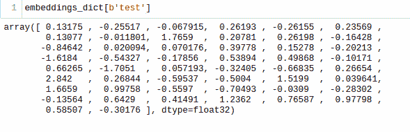

你可能会注意到这是一个 50 维的向量。我们下载了文件 glove.6B.50d.txt，这意味着这个模型已经在 60 亿个单词上进行了训练，可以生成 50 维的单词嵌入。

我们还可以定义一个函数来从这个模型中获取相似的单词，首先进行所需的导入。

```py
From scipy import spatial

```

定义功能:

```py
def find_closest_embeddings(embedding):
   return sorted(embeddings_dict.keys(), key=lambda word: 
spatial.distance.euclidean(embeddings_dict[word], embedding))

```

让我们看看当我们在这个函数中输入“健康”这个词时会发生什么。

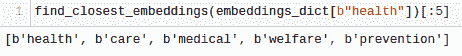

我们提取了模型认为与“健康”最相似的前 5 个单词，结果还不错，我们可以看到上下文已经被很好地捕捉到了。

我们可以用手套做的另一件事是把我们的词汇转换成向量。为此，我们将使用 Keras 库。

您可以通过以下方式安装 keras:

```py
pip install keras
```

我们将使用到目前为止一直在使用的同一组文档，但是，我们需要将它们转换成一个标记列表，以使它们适合矢量化。

```py
sents = [sent.split() for sent in sents]

```

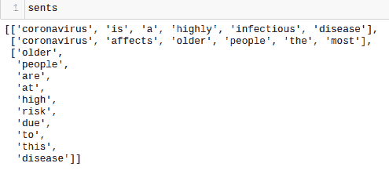

首先，在将数据集转换成嵌入之前，我们必须对其进行一些预处理。

进行所需的进口:

```py
from keras.preprocessing.text import Tokenizer
from keras.preprocessing.sequence import pad_sequences

```

以下代码将索引分配给单词，这些单词稍后将用于将嵌入映射到索引单词:

```py
MAX_NUM_WORDS = 100
MAX_SEQUENCE_LENGTH = 20
tokenizer = Tokenizer(num_words=MAX_NUM_WORDS)
tokenizer.fit_on_texts(sents)
sequences = tokenizer.texts_to_sequences(sents)

word_index = tokenizer.word_index
data = pad_sequences(sequences, maxlen=MAX_SEQUENCE_LENGTH)

```

现在我们的数据看起来像这样:

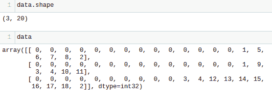

最后，我们可以通过使用上面刚刚创建的嵌入字典执行简单的查找操作，将数据集转换为手套嵌入。如果在字典中找到这个单词，我们将只获取与之相关的单词嵌入。否则，它将仍然是一个零向量。

为此操作进行所需的导入。

```py
from keras.layers import Embedding
from keras.initializers import Constant

EMBEDDING_DIM = embeddings_dict.get(b'a').shape[0]
num_words = min(MAX_NUM_WORDS, len(word_index)) + 1
embedding_matrix = np.zeros((num_words, EMBEDDING_DIM))
for word, i in word_index.items():
    if i > MAX_NUM_WORDS:
        continue
    embedding_vector = embeddings_dict.get(word.encode("utf-8")) 
    if embedding_vector is not None:
        embedding_matrix[i] = embedding_vector

```

这是从另一端出来的:

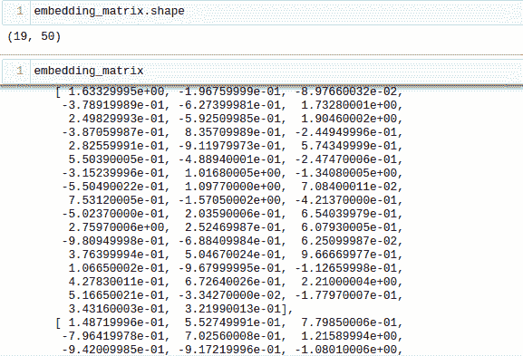

这是一个简单的 NumPy 矩阵，其中索引 I 处的条目是矢量器词汇表中索引 I 的单词的预训练矢量。

您可以看到我们的嵌入矩阵具有 19×50 的形状，因为我们的词汇表中有 19 个唯一的单词，并且我们下载的手套预训练模型文件具有 50 维向量。

您可以使用 dimension，只需更改文件或从头开始训练您自己的模型。

这个嵌入矩阵可以以你想要的任何方式使用。它可以被输入到神经网络的嵌入层，或者只是用于单词相似性任务。

这就是手套，让我们继续下一个矢量化技术。

### 5\. FastText

FastText 是脸书在 2016 年推出的。FastText 背后的思想与 Word2Vec 非常相似。然而，像 Word2Vec 和 GloVe 这样的方法仍然缺少一样东西。

如果你一直在关注，你一定注意到了 Word2Vec 和 GloVe 的一个共同点——我们如何下载一个预先训练好的模型，并执行查找操作来获取所需的单词嵌入。尽管这两个模型都经过了数十亿单词的训练，但这仍然意味着我们的词汇量是有限的。

FastText 如何超越其他产品？

FastText 比其他方法有所改进，因为它具有对未知单词的泛化能力，这是其他方法一直缺少的。

它是怎么做到的？

*   FastText 不是使用单词来构建单词嵌入，而是更深入一层，即字符层。积木是字母而不是单词。
*   通过 FastText 获得的单词嵌入不是直接获得的。它们是低层嵌入的组合。
*   用字符代替单词还有一个好处。训练所需的数据更少，因为一个单词在某种程度上变成了它自己的上下文，从而可以从一段文本中提取更多的信息。

现在我们来看看 FastText 是如何利用子词信息的。

*   假设我们有单词“reading ”,长度为 3-6 的字符 n 元语法将以如下方式为该单词生成:

*   尖括号表示开始和结束。
*   由于可能有大量的 n 元文法，所以使用散列，而不是学习每个唯一 n 元文法的嵌入，我们学习全部 B 个嵌入，其中 B 表示桶大小。原纸用的是 200 万的桶大小。
*   通过这个散列函数，每个字符 n-gram(比如‘eadi’)被映射到 1 到 B 之间的一个整数，并且该索引具有相应的嵌入。
*   最后，通过平均这些组成的 n 元文法嵌入来获得完整的单词嵌入。
*   尽管这种散列方法会导致冲突，但它有助于在很大程度上控制词汇表的大小。

FastText 中使用的网络类似于我们在 Word2Vec 中看到的网络，就像我们可以在两种模式下训练 fast text——CBOW 和 skip-gram，因此我们在这里不再重复这一部分。如果想详细了解 Fasttext 的更多内容，可以参考这里的原始论文——[paper-1](https://web.archive.org/web/20221114162312/https://arxiv.org/pdf/1607.04606.pdf)和 [paper-2](https://web.archive.org/web/20221114162312/https://arxiv.org/pdf/1607.01759.pdf) 。

让我们继续，看看我们能用 FastText 做些什么。

你可以用 pip 安装 fasttext。

```py
pip install fasttext

```

你可以从[这里](https://web.archive.org/web/20221114162312/https://fasttext.cc/docs/en/english-vectors.html)下载一个预先训练好的快速文本模型，或者你可以训练你自己的快速文本模型并将其用作文本分类器。

因为我们已经看到了足够多的预训练模型，即使在这种情况下也没有什么不同，所以在这一节中，我们将专注于如何创建自己的快速文本分类器。

假设我们有以下数据集，其中有关于一些药物的对话文本，我们必须将这些文本分为 3 种类型，即与它们相关的药物类型。

现在，为了在任何数据集上训练快速文本分类器模型，我们需要以某种格式准备输入数据，该格式为:

**_ _ 标签 __ <标签值> <空格> <关联数据点>**

我们也将为我们的数据集这样做。

```py
all_texts = train['text'].tolist()
all_labels = train['drug type'].tolist()
prep_datapoints=[]
for i in range(len(all_texts)):
    sample = '__label__'+ str(all_labels[i]) + ' '+ all_texts[i]
    prep_datapoints.append(sample)

```

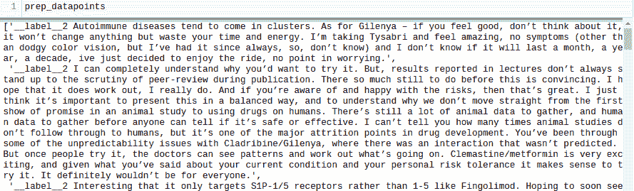

在这一步中，我省略了很多预处理，在现实世界中，最好进行严格的预处理，以使数据适合建模。

让我们将这些准备好的数据点写入一个. txt 文件。

```py
with open('train_fasttext.txt','w') as f:
    for datapoint in prep_datapoints:
        f.write(datapoint)
        f.write('\n')
    f.close()

```

现在我们有了训练快速文本模型所需的一切。

```py
model = fasttext.train_supervised('train_fasttext.txt')

```

由于我们的问题是一个监督分类问题，我们训练了一个监督模型。

同样，我们也可以从训练好的模型中获得预测。

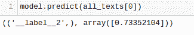

该模型给出了预测的标签以及相应的置信度得分。

同样，这个模型的性能取决于很多因素，就像任何其他模型一样，但是如果您想快速了解基线精度应该是多少，fasttext 可能是一个非常好的选择。

这就是关于快速文本和如何使用它的全部内容。

## 结束了！

在本文中，我们涵盖了单词嵌入的所有主要分支，从简单的基于计数的方法到子单词级别的上下文嵌入。随着自然语言处理的效用不断增加，完全了解它的组成部分是非常必要的。

鉴于我们对幕后发生的事情和这些方法的用例了解得如此之多，我希望现在当你偶然发现一个 NLP 问题时，你将能够做出关于使用哪种嵌入技术的明智决定。

### **未来方向**

我希望不言而喻的是，无论我们在本文中涵盖了什么，都不是详尽无遗的，还有许多技术有待探索。这些只是主要的支柱。

从逻辑上讲，下一步应该是阅读更多关于文档(句子)级嵌入的内容，因为我们已经在这里介绍了基础知识。我会鼓励你去阅读像 Google 的 BERT、通用句子编码器以及相关的主题。

如果你决定尝试 BERT，从[这个](https://web.archive.org/web/20221114162312/https://github.com/hanxiao/bert-as-service)开始。它提供了一个惊人的方式来利用伯特的力量，而不是让你的机器做所有繁重的工作。阅读自述文件以设置它。

目前就这些。感谢阅读！

### 阿布舍克·贾

一个好奇的家伙，目前正在建造模型，希望有一天能建造天网。跟随这个空间，学习未被理清的数据科学概念，并站在未来的正确一边！

* * *

**阅读下一篇**

## 如何构建和管理自然语言处理(NLP)项目

Dhruvil Karani |发布于 2020 年 10 月 12 日

如果说我在 ML 行业工作中学到了什么的话，那就是:**机器学习项目很乱。**

这并不是说人们不想把事情组织起来，只是在项目过程中有很多事情很难组织和管理。

你可以从头开始，但有些事情会阻碍你。

一些典型的原因是:

*   笔记本中的快速数据探索，
*   取自 github 上的研究报告的模型代码，
*   当一切都已设置好时，添加新的数据集，
*   发现了数据质量问题并且需要重新标记数据，
*   团队中的某个人“只是快速地尝试了一些东西”,并且在没有告诉任何人的情况下改变了训练参数(通过 argparse 传递),
*   从高层推动将原型转化为产品“仅此一次”。

多年来，作为一名机器学习工程师，我学到了一堆**东西，它们可以帮助你保持在事物的顶端，并检查你的 NLP 项目**(就像你真的可以检查 ML 项目一样:)。

在这篇文章中，我将分享我在从事各种数据科学项目时学到的关键指针、指南、技巧和诀窍。许多东西在任何 ML 项目中都是有价值的，但有些是 NLP 特有的。

[Continue reading ->](/web/20221114162312/https://neptune.ai/blog/how-to-structure-and-manage-nlp-projects-templates)

* * *