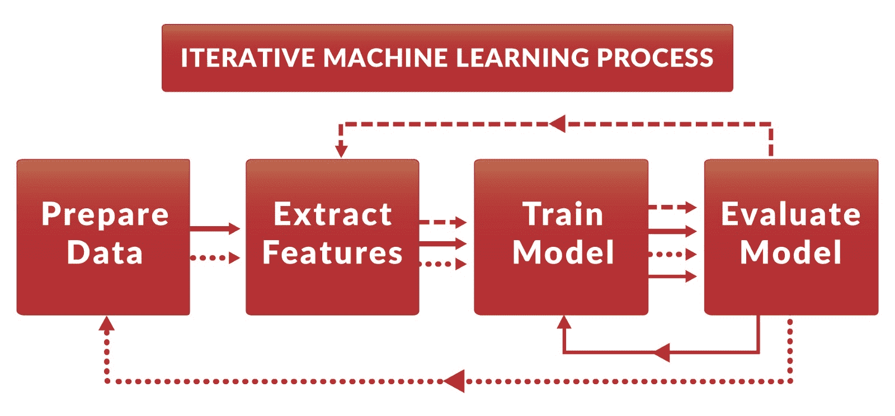
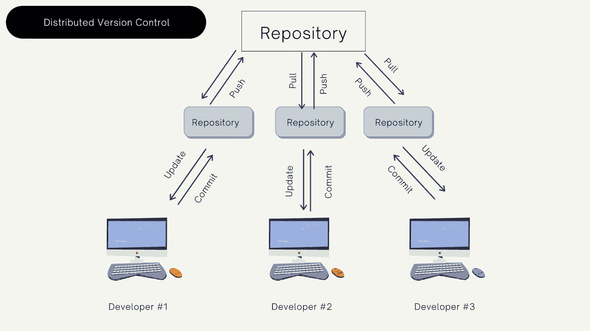
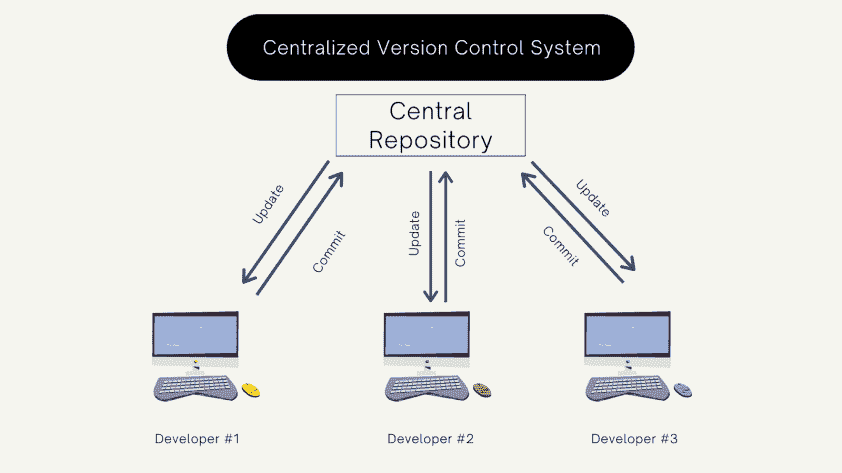

# ML 模型的版本控制:为什么你需要它，它是什么，如何实现它

> 原文：<https://web.archive.org/web/https://neptune.ai/blog/version-control-for-ml-models>

版本控制在任何软件开发环境中都很重要，在机器学习中更是如此。在 ML 中，开发过程非常复杂。它包括大量的数据、多个模型的测试、参数的优化、特性的调整等等。

如果你希望你的研究是可重复的，你需要适当的版本控制工具来管理和跟踪上述所有内容。因此，在本文中，我们将探讨机器学习中的版本控制是什么，为什么需要它，以及如何实现它。

## “版本控制”是什么意思？

版本控制是随着时间的推移跟踪和管理软件变更的过程。无论你是在构建一个应用程序还是一个 ML 模型，你都需要跟踪软件团队成员所做的每一个修改，以修复错误并避免冲突。

为了实现这一点，您可以使用版本控制框架。开发框架是为了跟踪每个参与者的每个单独的更改，并将其保存在一种特殊的数据库中，在那里您可以识别差异，并在合并时帮助防止并发工作中的冲突。

## 为什么我们在 ML 中需要版本控制？

机器学习开发过程包括大量的迭代工作，其中开发人员在改变超参数、代码和数据的同时搜索最佳执行模型。保留这些变化的历史以跟踪与参数相关的模型性能是很重要的，这可以节省您为实验而重新训练模型所花费的时间。

*Machine Learning process | [Source](https://web.archive.org/web/20221208002700/https://www.kdnuggets.com/2017/05/data-version-control-iterative-machine-learning.html)*

机器学习版本控制有三个部分:

有建模代码，也有实现代码。建模代码用于实现模型，实现代码用于推理。它们都可以用不同的编程语言编写，但是维护所有的代码和依赖关系可能会更加困难。

还有元数据，它是关于你的数据和模型的信息。然后是实际数据，即用于训练和运行模型的数据集。元数据可以在不改变数据的情况下改变，版本控制应该将数据链接到适当的元。

该模型通过模型参数和超参数将上述所有内容联系起来。当您使用模型版本控制系统时，您会得到很多好处:

*   合作:如果你是一个单独的研究者，这可能并不重要。当你和一个团队一起工作并且你的项目很复杂的时候，如果没有版本控制系统，合作会变得非常困难。
*   *版本化:* 在进行更改的同时，模型可以中断。有了版本控制系统，当你的模型崩溃时，你会得到一个有用的变更日志，你可以恢复你的变更以回到一个稳定的版本。
*   *再现性:*通过为整个机器学习管道拍摄快照，您可以再次再现相同的输出，即使使用训练过的权重，这可以节省重新训练和测试的时间。
*   *依赖跟踪:* 跟踪数据集的不同版本(训练、评估和开发)，调整模型超参数和参数。通过使用版本控制，您可以在不同的分支或者存储库上测试不止一个模型，调整模型参数和超参数，并监控每个变更的准确性。
*   *模型更新:* 模型开发不是一步到位的，它是循环往复的。在版本控制的帮助下，您可以控制发布哪个版本，同时继续开发下一个版本。

### 机器学习版本控制类型

ML 版本控制有两种类型:

*   **集中式**版本控制系统。
*   **分布式**版本控制系统。

一个**分布式版本控制系统** (DVCS)是一个版本控制系统，其中完整的代码库可以在开发者的本地计算机上获得，包括历史。这使得开发人员能够在本地合并和创建分支，而根本不需要连接到远程服务器或任何网络。这些系统的一个例子是 Git。

使用这种方法进行模型开发的优势在于，可以在您的机器上单独工作，而不需要联机，并且不依赖于单个服务器进行备份。这对于培训目的和项目仍然很小的时候很有用。然而，当项目存储库变得更大时，这将需要一个大的存储器来保存开发人员计算机上的所有历史和所有分支数据，这就是为什么引入了另一种集中式版本控制方法。

*Distributed Version control | [Source](/web/20221208002700/https://neptune.ai/blog/version-control-guide-for-machine-learning-researchers)*

一个**集中式版本控制** **系统** (CVCS **)** 是一个版本控制，开发者必须从一个包含所有文件和文件历史的单一集中式服务器中签出存储库。

这些系统使得在一个地方控制完整的代码库变得容易，并且每个人都知道发生的任何变化。然而，如果出现中央服务器连接问题，它会很慢，而且将所有备份放在一个地方也有风险。

这个可以在你的模型足够成熟的时候使用，作为产品的一部分使用。您有不同的团队处理大量的特性和变更，您不需要将所有的代码都放在开发人员的计算机上，并且您希望降低合并和添加变更的复杂性。

此外，CVCS 减少了开发所需的存储空间，因为您将只有一台服务器包含所有的代码更改，开发人员只需要在本地工作的系统的单一版本。

*Centralized Version Control | [Source](/web/20221208002700/https://neptune.ai/blog/version-control-guide-for-machine-learning-researchers)*

## 模型版本控制

在模型开发过程中，开发人员会遇到一些问题:

*   模型是在哪些超参数上训练的？
*   上次模型训练后有哪些代码改动？
*   模型是在哪个数据集上训练的？
*   从上次模型培训开始，对依赖关系进行了哪些更改？
*   导致模型失败的变化是什么？
*   使模型表现更好的变化是什么？
*   该型号的最新版本是什么？

为了回答这些问题，您需要跟踪模型开发过程中所做的变更，这就提出了什么需要版本化的问题。

## ML 开发中什么需要版本化？

回答这个问题取决于您处于模型开发的哪一步。让我们看看在每个开发步骤中需要对什么进行版本控制。

1.  **型号选择:**

首先，你需要决定使用哪种算法。您可能需要尝试多种算法并比较性能。每个选定的算法都应该有自己的版本，以单独跟踪变化，并[选择最佳执行模型](/web/20221208002700/https://neptune.ai/blog/the-ultimate-guide-to-evaluation-and-selection-of-models-in-machine-learning)。

在编写模型或对模型进行性能更改时，您应该跟踪这些更改，以了解导致性能更改的原因。

这可以通过为每个模型使用不同的存储库来实现。这样，您可以并行测试多个模型，并在模型之间提供一些隔离。

2.  **模型训练:**

应跟踪用于训练的超参数。您可以为每个超参数创建不同的分支来调整它，并跟踪每个超参数变化时的模型性能。

训练参数也应与模型代码和超参数一起进行版本化，以确保相同训练权重的可重复性，甚至在恢复到此版本时节省重新训练模型所需的时间。

要使用版本控制系统实现这一点，您需要为您将要更改的每个特性、参数和超参数创建一个分支。这使您能够一次使用一个变更来执行分析，并在一个存储库中维护与同一个模型相关的所有变更。

3.  **模型评估:**

评估是指开发人员使用保留或测试集来检查模型在从未见过的数据上的表现。

坚持和性能结果应该保存在版本控制系统中，以及每一步性能矩阵的记录。正如在模型训练部分中提到的，在您选择了最适合您需求的参数之后，您将需要将变更合并到一个集成分支，并在这个分支上运行评估。

4.  **模型验证:**

模型验证是验证模型在真实数据上的表现是否符合预期的过程。在这一步中，您必须跟踪每个验证结果，并在模型生命周期中跟踪模型的性能。增强模型性能的模型变化是什么？如果您正在比较不同的模型，那么您应该跟踪用于评估不同模型的验证矩阵。为了实现这一点，在评估了集成分支的性能之后，可以在主分支上进行模型验证，您可以将评估的变更合并到主分支中，对其执行验证，并将符合您的客户规格的变更集标记为准备部署的版本。

5.  **模型部署:**

当您的模型准备好被部署时，您应该跟踪哪个版本被部署以及每个版本中有什么变化。这将使您能够拥有一个分阶段的部署，当您通过在主分支上部署您的最新版本开始时，同时仍然开发和改进您的模型。如果您的模型在部署时失败，这也将为您提供所需的容错能力，以恢复到先前的工作版本。

最后，拥有模型版本控制可以帮助 ML 工程师理解模型中发生了什么变化，研究人员更新了哪些功能，以及功能是如何变化的。当将多个特性集成在一起时，了解做了什么以及如何做，可以影响部署速度和简单性。

## 如何实现模型版本控制

总结一下上一节中提到的内容，实现模型版本控制的步骤如下:

*   为您将要实现的每个模型创建单独的存储库；
*   为每个要评估的模型参数、超参数或特征创建一个单独的分支。
*   创建一个集成分支，在该分支中，您可以根据对每个功能分别进行的性能分析来收集所需的功能；
*   评估集成分支上的模型；
*   从集成分支合并到主分支并执行验证；
*   用版本号标记主分支上的版本。

选择正确的工具来执行版本控制是非常重要的，所选择的工具应该对管道的每个部分提供清晰的愿景，并在不同类型的版本控制(如数据、代码和模型版本控制)之间建立联系(不仅仅是简单的管理和跟踪文件更改)。

一个好的模型版本化系统将使团队成员之间的协作更加顺畅，提供一种可视化数据变更的方式，并使开发过程自动化。

### 海王星

Neptune 是为研究和生产而开发的，它配备了一个中枢，在那里您可以找到帮助您处理从机器学习管道中生成的元数据的方法。它使您能够记录、可视化、存储和比较元数据。

你可以在这里阅读更多关于如何在 Neptune 中创建模型检查点的内容。

### DVC

专为机器学习项目设计的开源版本控制系统，旨在实现机器学习模型的可复制性和共享。

### ML 元数据(MLMD)

一个存储不同组件每次运行时生成的[模型元数据](/web/20221208002700/https://neptune.ai/blog/ml-metadata-store)的库，包括经过训练的模型及其执行。最初设计用于 Tensorflow，但可以独立使用。

## 摘要

在模型开发期间和之后，版本控制是一个非常重要的步骤。它支持多个版本的协作、历史记录和性能监控。

您的项目中需要版本控制什么？这取决于你目前处于开发过程的哪个阶段。无论您将使用集中式版本控制系统还是分布式版本控制系统，您都必须选择满足您需求的适当工具。

参考资料: