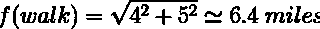
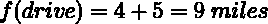
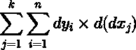
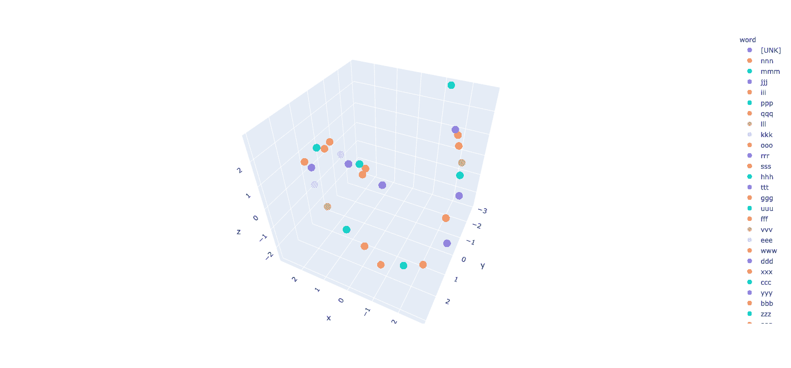
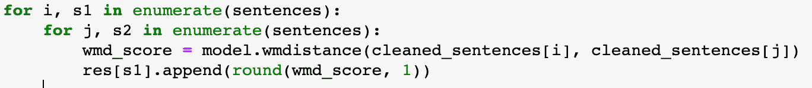
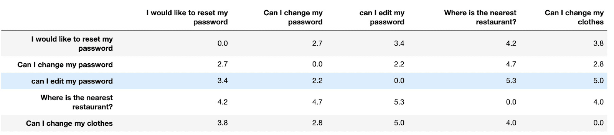

# Wasserstein 距离和文本相似性

> 原文：<https://web.archive.org/web/https://neptune.ai/blog/wasserstein-distance-and-textual-similarity>

在许多机器学习(ML)项目中，当我们必须决定不同感兴趣的对象之间的相似程度时，会出现一个点。

我们可能试图理解不同图像、天气模式或概率分布之间的相似性。对于自然语言处理(NLP)任务，我们可能会检查两个文档或句子在语义或语法上是否相似。

为了做到这一点，我们需要找到一个函数(或操作)来生成一个“测量”相似程度的分数。这个函数可以采取多种形式，但是在许多任务中出现的一个公共度量是 [Wasserstein 距离](https://web.archive.org/web/20221207185249/https://en.wikipedia.org/wiki/Wasserstein_metric) (WD)。

在这篇文章中，我们将探索 WD，也称为[推土机距离](https://web.archive.org/web/20221207185249/https://en.wikipedia.org/wiki/Earth_mover%27s_distance) (EMD)，如何用于测量两个不同文本序列之间的相似性。为此，我们将:

*   回顾距离度量，并展示为什么它们对于许多 ML 相关问题是重要的；
*   描述 WD，并展示如何将其应用于广泛的问题；
*   展示如何将 WD 应用于文本相似性问题；
*   最后，将 WD 与其他距离度量(如余弦相似度)进行比较，并讨论 WD 的一些优点和缺点。

希望我的方法可以帮助你理解 WD 是否可以应用到你的特定 ML 项目中。

*注:我们不会深究 WD 的数学。我们会在最后提供一些关于数学背后的资源，以防你想深入了解。*

## 距离度量

维基百科告诉我们“ *Wasserstein distance […]是定义在给定度量空间 M* 上的概率分布之间的距离函数”。为什么它没有提到识别文本序列之间的相似性？

这不是方法的问题，而是我们如何表现问题。如果我们可以将单词表示为概率分布，那么我们可以使用 WD 来识别两个看似不同的领域中的相似性。但是等等，距离函数到底是什么？

距离函数是我们用来测量两个或更多物体之间距离的东西。很简单，但事实总是如此吗？取决于我们测量什么，有些东西比其他东西更容易测量。

我们来想一些琐碎的例子。如果你住在公园附近，想去对面呢？你需要一个度量函数来回答这个问题。想想吧。你可以走到另一端，在这种情况下，你可以走一条几乎完美的直线穿过公园。或者，你可以开车去，但是那样的话你就不能开车穿过公园，而必须使用最近的道路。

因此，我们可以创建距离度量来了解每种情况下需要行进的距离。对于步行选项，我们可以使用[勾股定理](https://web.archive.org/web/20221207185249/https://en.wikipedia.org/wiki/Pythagorean_theorem)来创建我们的距离度量，对于驾驶选项，简单的加法就可以了。

好吧，这是一个好的，干净的，明确的问题。这个问题很容易用数学来表示，只是直线和简单的形状。如果一切都那么容易表示，那么对于 ML 工程师来说，生活会容易得多。

如果我们要测量的距离很抽象，很模糊怎么办？假设你想知道爱尔兰和美国之间的距离。这指出了距离度量需要解决的关键问题:如何“表示”被比较的对象(实体)？像国家这样的实体不是简单的形状，它们可以用许多不同的方式来表示。

我们可以把每个国家描绘成它们海岸线之间最近的点，然后从点到点画一条线。或者，我们可以在每个国家找到一个中心点，并表示问题和这些点之间的距离。我们也可以在每个国家随机选择多个点并测量每个点之间的距离，然后得出平均值。我们不能说这些都是“正确”或“错误”的答案，这完全取决于我们如何描述这个问题。

## 从距离到相似

测量从美国到爱尔兰的距离是一回事，但这与理解如何将 WD 用于概率分布和 ML 问题(如识别文本相似性)有什么关系呢？使用我们之前的示例，让我们回顾一下测量两点之间的距离需要什么:

1.  **在数学(即公制)空间**中表示物体的方法:在公园的例子中，我们在[欧几里得空间](https://web.archive.org/web/20221207185249/https://en.wikipedia.org/wiki/Euclidean_space)中使用了直线和矩形。以国家为例，我们用散点图来表示国家。
2.  测量空间中物体之间距离的方法:我们使用简单加法或毕达哥拉斯定理来计算公园距离。对于国家，我们使用两点之间的距离或点的样本。

考虑一个概率分布，我们投掷硬币 100 次。这可以用二项式分布来表示。现在，想象一个场景，你有两个硬币，一个是有偏见的，大约有 70%的时间正面朝上，而另一个是公平的，有 50%的时间正面朝上。我们将这些数字放入二项式分布中，我们得到了类似这样的两个图表:

现在我们有:

1.  一种表示事件的方法:我们可以用图形表示在公平和偏见试验中我们看到的 100 次投掷硬币的正面数量；
2.  测量距离的方法:我们需要一些方法来测量这两个分布之间的距离。我们可以把它看作是找到一种方法来测量一个分布上的每一点到另一个分布上的每一点之间的距离。如果你想象上面的分布是由数以百万计的灰尘组成的，那么我们可以将这个问题重新想象为将灰尘从一堆(分布)移动到另一堆。这样，我们就可以对这些分布的相似程度进行评分。

## 瓦瑟斯坦距离和移动的泥土！

我们有两个分布，一个代表一系列公平的硬币投掷，另一个代表一系列有偏见的硬币投掷。我们想知道它们彼此有多相似。现在，我们需要一种方法来测量将一个图上的所有点移动到另一个图上所需的距离。您也可以将图表想象成直方图的形式:

想象一下，每个箱子都是由一系列积木组成的。我们希望将这些块从一个发行版转移到另一个发行版。每个木块都有质量，所以我们需要考虑质量和移动的距离。

这与我们之前提到的度量有一点小小的不同，之前提到的度量包括没有质量的单个点，所以我们只考虑了移动它们所需的距离。现在，我们可以测量将图的一部分(一个块)从一个分布移动到另一个分布所需的“功”。

> 这就像一个成本函数，因为我们希望做最少的工作。正是以这种方式，WD 被称为推土机的距离(EMD)。

我们可以把上面的每一个分布想象成一堆堆的泥土，而不是扔硬币，我们想计算我们需要移动多少才能让一堆和另一堆一样。我们需要做的“工作量”是两堆泥土相似性的度量。工作越少，两堆土，或者分布，或者任何可以用这种方式表示的东西就越相似。

如果我们把所有这些单独的作品加起来，我们可以得到下面的公式:

这是瓦瑟斯坦距离试图计算的粗略近似值。要看这个公式更好的解释，请看[这个精彩的视频](https://web.archive.org/web/20221207185249/https://www.youtube.com/watch?v=ymWDGzpQdls)(但是先把这篇文章看完！).

以上是一种在离散空间中思考这个问题的方法。当你进入连续空间时，你开始看到积分之类的东西，你会看到 WD 的公式更可能是这样的:

WD 或 EMD 可以应用于许多 ML 问题。一旦你可以把你的问题表示成一个度量空间，那么你就可以对它应用 EMD。这方面的一个例子是图像检索。EMD 用于“移动”像素，并通过这样做来识别哪些图像最相似。

## 深入挖掘 EMD

在我们离开 EMD 并开始研究如何使用 WD 来识别文本相似性之前，有必要看另一个例子来帮助理解 WD 试图计算什么。

EMD 可用于图像处理。我们可以认为图像是由像素表示的，每个像素都有一个代表其亮度的权重。在 [RGB 模式](https://web.archive.org/web/20221207185249/https://en.wikipedia.org/wiki/RGB_color_model)中，红色、绿色和蓝色组合在一起，创造出一系列颜色。每个像素都有一个介于 0 和 255 之间的值来表示其亮度。

在下面的图表中，我们表示需要填充的土堆和坑。但是我们也可以认为点代表像素，大小(值)代表它的亮度。所以，这个问题可能是一个图像或一堆土，我们正在试图计算将一个图像转换成另一个图像，或将土从堆中移到坑中需要做多少工作。

红点 y1 到 y4 代表洞，大小就是需要多少土来填。类似地，黑点 x1 到 x8 代表可以用来填充这些洞的土堆。请记住，我们希望移动地球的距离尽可能短，这是我们的成本函数-我们希望做的工作量。

为了填平一个坑，我们需要从最近的一堆土中移走一些土。因此，例如，我们可以将 x1、x2 和 x3 的所有灰尘放入 y1 孔，但我们仍然需要 7 个单位的灰尘来填充它。

我们可以从 x4 开始。下表显示了我们需要从每一堆土中移走的土量以及我们需要移动的距离。

| 地球 | 孔 | 金额 | 距离 | 工作 |
| --- | --- | --- | --- | --- |
| x[1] | y[1] | 1 | 1 | 1 |
| x[2] | y[1] | 1 | 1 | 1 |
| x[3] | y[1] | 2 | 1 | 2 |
| x[4] | y[1] | 7 | 2 | 14 |
| x[4] | y[3] | 1 | 3 | 3 |
| x[5] | y[2] | 1 | 1 | 1 |
| x[6] | y[2] | 2 | 1 | 2 |
| x[7] | y[4] | 1 | 1 | 1 |
| x[8] | y[4] | 1 | 2 | 2 |
| 总计 | 17 | 17 | 27 |  |

这表明，我们总共需要移动 17 个单位的地球，我们所做的功被计算为 27。因此，EMD 计算结果为 2717 = 1.58。

在我们的小例子中，很容易优化最有效的方式来移动地球。但是想象一下在现实生活中，有更多的变量，甚至更多维度的问题，你可以看到手动解决它是如何变得不可能的。

我们需要做更多的计算，模拟每一个可能的场景，然后选择一个需要最小量或最低 EMD 的场景。然而，这个例子有助于展示 WD 的一个简化版本，并很好地让我们看到如何通过嵌入将它应用于文本相似性。

在一堆泥土中寻找意义

## 距离度量的美妙之处在于，一旦我们找到了表示它的方法，我们就可以将它们应用于任何问题。如果我们可以在一个度量空间中以离散的方式表示某样东西，那么 WD 不在乎它是在移动泥土还是在解析散文。它将完全一样地工作。

单词嵌入非常适合这项任务，因为它们是多维向量空间中的点，也就是我们应用 WD 所需要的点。

我们不会在这里详细讨论单词嵌入，所以你可以看看我以前写的一些关于 NLP 中嵌入概念的文章[这里](/web/20221207185249/https://neptune.ai/blog/word-embeddings-deep-dive-into-custom-datasets)和[这里](https://web.archive.org/web/20221207185249/https://blog.floydhub.com/automate-customer-support-part-one/)。简而言之，单词嵌入只是基于它们被训练的文本对意义进行编码的向量。在之前的帖子中，我们展示了如何通过在简单的数据集上训练嵌入并将其投影到 3D 可视化效果上来可视化嵌入:

所以，如果我们可以把单词表示为向量空间中的点，那么我们就可以把每个单词看作一块我们想要移动的泥土。同样，这里的关键是用简单的术语把它想成一个距离函数。我需要将一个单词“移动”多少才能使它与另一个单词相似？

这里的假设是，空间中的一个点，无论它代表概率分布上的一个点，一片地球还是一个词，如果它与另一个点之间的距离为零，则认为它是相同的。

我们将单词从一个地方移到另一个地方来理解它们之间的关系，而不是用洞和成堆的泥土。记住，在嵌入向量空间中，嵌入的位置表明了它与其他单词的关系。如果单词聚集在一起，那么它们是相关的。

在上面的例子中，点数的分布没有模式。他们是随机相关的。当我们更改数据集以确保某些单词之间存在关系时，我们得到了以下可视化结果:

最初的论文介绍了使用 EMD 来识别文本相似性的思想，“从单词嵌入的[到文档距离的](https://web.archive.org/web/20221207185249/https://www.semanticscholar.org/paper/From-Word-Embeddings-To-Document-Distances-Kusner-Sun/66021a920001bc3e6258bffe7076d647614147b7)”，用一个很好的例子显示了这种关系，这个例子通常用于显示如何通过嵌入之间的距离来识别单词相似性。

*How close one embedding is to another here indicates a closer relationship, i.e. the words are semantically related. *

你可以把这个想象成我们在嵌入空间中“移动”每个单词所需的距离，使它们占据相同的空间。你越不需要移动一个单词(你不需要移动“芝加哥”太多来占据与“伊利诺伊”相同的空间)，单词之间就越相似。

我们移动文字就像我们移动泥土一样！这就是为什么这种文本相似性的方法被称为单词移动距离(WMD)。

在这一点上，我们应该认识到 EMD 与 WMD 的相似之处。单词“press”和“media”不需要移动太多来呈现同一个单词，即占据嵌入向量空间中的同一点。

相反，如果句子是“*总统向他在芝加哥的家人讲话*”，那么我们将需要移动“媒体”来占据与“家庭”相同的空间的距离应该比以前更大。

因此，通过将所有这些距离相加，我们应该能够比较不同的句子。就像这个肮脏的例子一样，我们需要做的“单词”越少，或者我们需要移动的距离越少，我们就可以认为句子越相似。

如何使用大规模杀伤性武器

## 好消息是，开始使用 WMD 计算句子之间的相似度相对简单。它是 [Gensim 库](https://web.archive.org/web/20221207185249/https://radimrehurek.com/gensim/auto_examples/tutorials/run_wmd.html)的一部分。您可以下载一个预先训练好的 Word2Vec 模型，并使用现成的模型来测试距离方法。

或者，你也可以[训练你自己的模型](https://web.archive.org/web/20221207185249/https://radimrehurek.com/gensim/auto_examples/tutorials/run_word2vec.html#training-your-own-model)并使用它。对于我们这里的目的，我们将只使用预先训练的一个来显示它是多么容易。你可以在这里找到这个例子[的笔记本。](https://web.archive.org/web/20221207185249/https://github.com/choran/word_movers_distance)

我们将使用现有的最大的预训练模型之一，“word2vec-google-news-300”，它需要很长时间来下载，但如果您只想快速测试它，也可以使用较小的模型。

那么获得大规模杀伤性武器分数就像:

然后你可以比较结果，看看微小的差异对相似性得分有什么影响

注意像“ ***我能换衣服*** ”和“ ***我能换密码*** ”这样的句子的区别。根据大规模杀伤性武器，它们看起来没有那么不同，但我们知道它们更不同(或至少一样不同)，就像“ ***我可以换衣服吗*** ”和“ ***我想重置我的密码*** ”这样的句子。

WMD v 余弦？

## 如果您试图测量两个句子或文档之间的相似性，您可能会使用类似余弦相似性的东西。

例如，在[之前的一篇文章](/web/20221207185249/https://neptune.ai/blog/word-embeddings-deep-dive-into-custom-datasets)中，为了获得我们数据集中单词之间的相似度，我们使用了 [get_similarity](https://web.archive.org/web/20221207185249/https://github.com/choran/word_embeddings/blob/main/train_track_embeddings.ipynb) 函数，该函数使用余弦相似度。这不是计算单词之间的距离，而是测量两个嵌入之间的角度大小。

如果你看上面的图表，你可以看到，根据这些向量之间的角度余弦，这两个词被认为是相似的。换句话说，余弦相似性忽略了向量的大小，只关注方向。尽管第一张图中的向量在大小上有很大差异，但两个例子中的角度没有区别。

在许多情况下，这似乎不是一个问题，无论您使用什么方法都将取决于您自己的用例。但是，[有趣的研究](https://web.archive.org/web/20221207185249/https://arxiv.org/pdf/1508.02297.pdf)表明，这些向量的长度与单词在文本中的重要性有关，单词嵌入是在文本中训练的。

更具体地说，对于要在许多不同的上下文中使用的单词，它们必须没有什么意义。这种无关紧要的词的主要例子是高频停用词，尽管它们的术语频率很高,但它们确实由短向量表示。

换句话说，一个单词在不同的上下文中使用得越多，嵌入就越代表该单词的加权平均值，并且该平均值影响向量的长度，使其更短。理论上，余弦方法会忽略这种幅度差异，而像 WMD 这样的方法不会。

实际上，如果你想基于情感或类似的东西对文本进行分类，这可能对你的结果没有太大影响。然而，对于个别情况，它可能会影响个别句子的相似性。最好的方法永远是尝试这两种方法(或者我们在这里没有提到的许多其他距离度量方法中的一种)，看看哪个单词最适合你的方法。如果你发现在所有情况下都是最好的，你可以最终使用两者的加权平均值。

在比较这些方法时，您还应该考虑这样一个事实，即使用的大多数嵌入都是上下文相关的，因为像 [BERT](https://web.archive.org/web/20221207185249/https://arxiv.org/abs/1810.04805) 这样的模型会根据单词的用法生成许多不同的嵌入来捕捉单词的不同含义。这也可能对您使用的方法产生影响。

同样，最好的方法是两者都尝试，看看哪一个最适合您的特定用例。

最终考虑

## 在这篇文章中，我们从 ML 的角度探索了 WD，以理解如何使用它来度量两个文本序列之间的相似性。为了做到这一点，我们花了一些时间来研究距离度量的一般概念，以及我们如何使用简单的距离方法来测量看似不同的概念，例如概率分布和成堆的灰尘之间的相似性，以及单词和句子之间的相似性。

关键是要理解我们可以用不同的方式来表达每个问题。如果我们可以用某种形式的度量空间来表示它，那么我们可以将 EMD 应用于它，并基于我们需要做的“工作”的数量，理解该空间中实体的相似性。

我们讨论了这种方法如何通过 WMD 来测量单词的相似性，WMD 方法中的一些差异，以及更常见的方法，如余弦相似度。

我们没有解决的一件事是大规模杀伤性武器方法的任何缺点。主要的一个问题是，由于计算的复杂性，它很难用于大型文档。然而，这是一个正在进行的研究和新方法的领域，旨在显著加快大规模杀伤性武器的计算，从而使其适用于更大的文本。

类似地，进一步的工作试图通过[句子移动距离](https://web.archive.org/web/20221207185249/https://www.aclweb.org/anthology/P19-1264v2.pdf) (SMD)将 WMD 扩展到句子，SMD 声称通过使用单词和句子嵌入来从文本序列中准确提取语义相似性，从而显示出改进的结果。

这仍然是一个令人兴奋的快速发展的领域，我迫不及待地想知道接下来会发生什么。感谢阅读！

其他资源:

[EMD 的离散例子](https://web.archive.org/web/20221207185249/https://jamesmccaffrey.wordpress.com/2018/03/05/earth-mover-distance-wasserstein-metric-example-calculation/):这是一篇展示 EMD 离散例子的好文章。我就是用这种方法作为 RGB 图表的基础。这只是一个很好的数据可视化的例子，有助于解释一个问题或概念。

*   [WD math deep dive](https://web.archive.org/web/20221207185249/https://www.youtube.com/watch?v=CDiol4LG2Ao) :我发现 WD 上的这个视频讲座非常有用，也很容易上手。如果你想了解更多 WD 数学背后的细节，我推荐这个视频。
*   [更多 WD 数学知识](https://web.archive.org/web/20221207185249/https://www.youtube.com/watch?v=ymWDGzpQdls):这是另一个视频，我发现它非常有助于理解如何通过一个工作示例导出 WD 的简单(离散)形式。
*   [More WD math](https://web.archive.org/web/20221207185249/https://www.youtube.com/watch?v=ymWDGzpQdls): This was another video I found very helpful to understand how to derive a simple (discrete) form of the WD with a worked example.