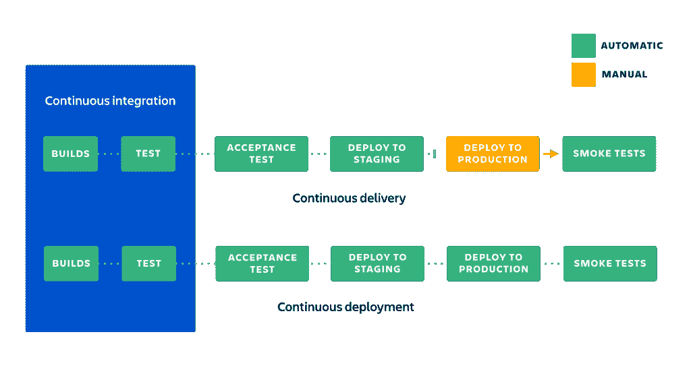
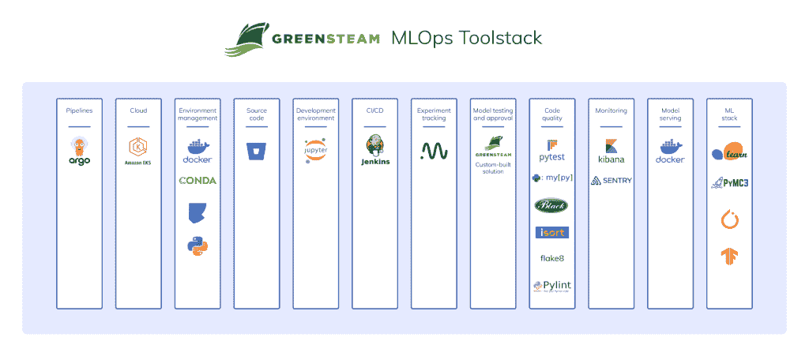
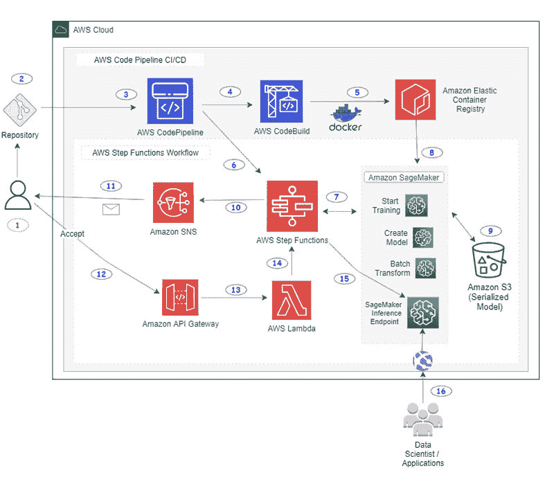
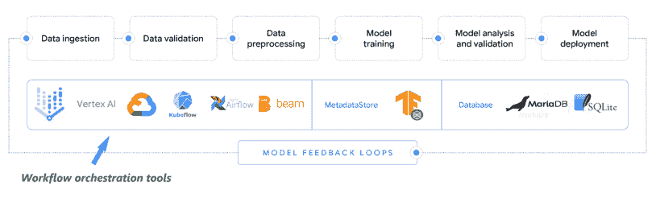
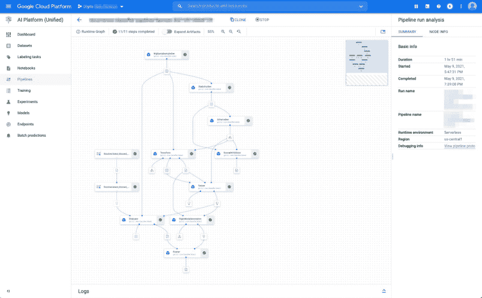

# 机器学习团队在生产中使用 CI/CD 的 4 种方式

> 原文：<https://web.archive.org/web/https://neptune.ai/blog/ways-ml-teams-use-ci-cd-in-production>

[DevOps](https://web.archive.org/web/20220926093601/https://en.wikipedia.org/wiki/DevOps) 中的一个核心概念现在正在走向机器学习操作( [MLOps](/web/20220926093601/https://neptune.ai/blog/mlops) )是 CI/CD——持续集成和持续交付或持续部署。CI/CD 作为核心 DevOps 实践，包含了通过简化应用程序的构建、测试和生产部署来可靠地交付软件应用程序的工具和方法。让我们在下面定义这些概念:

*   [连续交付](https://web.archive.org/web/20220926093601/https://en.wikipedia.org/wiki/Continuous_delivery) (CD)是将每个构建部署到类似生产的环境中，并在部署之前执行应用程序的自动化集成和测试的实践。

*   [持续部署](https://web.archive.org/web/20220926093601/https://en.wikipedia.org/wiki/Continuous_deployment) (CD)通过将应用程序的配置和部署自动化到生产环境，补充了额外步骤的持续集成。

*Continuous Integration vs Continuous Delivery vs Continuous Deployment | [Source](https://web.archive.org/web/20220926093601/https://www.atlassian.com/continuous-delivery/principles/continuous-integration-vs-delivery-vs-deployment)*

过去几年开发的大多数 CI/CD 工具都是为传统软件应用程序而专门构建的。您(可能)知道，开发和部署传统软件应用程序与构建和部署机器学习(ML)应用程序在许多方面有很大不同。这些问题就变成了:

*   ML 团队如何采用现有的 CI/CD 工具来适应他们的机器学习用例？
*   有没有更好的专门为 ML 应用程序构建的选项？

在本文中，您将了解 4 个不同的团队如何使用或已经使用 CI/CD 概念、工具和技术来构建和部署他们的机器学习应用程序。本文的目的是从这些团队实施的不同解决方案(包括其使用案例)中，为您提供 CI/CD 使用的广阔视角。

## 使用 Azure DevOps 为机器学习(ML)提供持续集成和交付(CI/CD)

在本节中，我们将介绍一个团队的工作流程，该团队在 [Azure DevOps](https://web.archive.org/web/20220926093601/https://azure.microsoft.com/en-us/services/devops/) 中为其机器学习工作负载编排 CI/CD 流程。他们的机器学习工作负载大多运行在 [Azure Cloud](https://web.archive.org/web/20220926093601/https://azure.microsoft.com/en-us/) 上。

*感谢*[*Emmanuel Raj*](https://web.archive.org/web/20220926093601/https://www.linkedin.com/in/emmanuelraj7/)*接受我的采访，介绍他的团队如何为他们的 ML 工作负载进行 CI/CD。这一部分利用了采访中 Emmanuel 的回答和他关于 MLOps 的非常实用的书；* [*【工程机器学习运算】*](https://web.archive.org/web/20220926093601/https://www.amazon.com/gp/product/1800562888/ref=as_li_tl?ie=UTF8&camp=1789&creative=9325&creativeASIN=1800562888&linkCode=as2&tag=aischool-20&linkId=be8ff7bb86db916ab514294d387c3c8c) *。*

### 工业

零售和消费品。

### 用例

这个团队帮助零售客户使用机器学习以自动化的方式解决问题。当用户提出票证或票证由维护问题产生时，机器学习用于将票证分类为不同的类别，帮助更快地解决票证问题。

### 概观

为了协调他们的 CI/CD 工作流，团队使用了 Azure DevOps [产品套件](https://web.archive.org/web/20220926093601/https://azure.microsoft.com/en-in/solutions/devops/#products)。他们还为 ML 工作负载配置了开发和生产环境。这些工作流由所有 CI/CD 流程组成，这些流程发生在将模型部署到生产之前的**和部署**之后的**。**

### 将模型部署到生产之前的 CI/CD 工作流

2.  使用[发布管道](https://web.archive.org/web/20220926093601/https://docs.microsoft.com/en-in/azure/devops/pipelines/build/triggers?view=azure-devops#classic-release-pipelines)将工件部署到基础设施目标。在开发环境中测试之后，发布管道将工件转移到[质量保证](https://web.archive.org/web/20220926093601/https://medium.com/globant/designing-a-qa-strategy-for-a-machine-learning-application-c3a577926686)(或 QA)阶段。

3.  **模型测试发生在 QA 阶段**，团队在模型服务上执行 [A/B 测试](https://web.archive.org/web/20220926093601/https://netflixtechblog.com/what-is-an-a-b-test-b08cc1b57962)和[压力测试](https://web.archive.org/web/20220926093601/https://en.wikipedia.org/wiki/Stress_testing_(software)#:~:text=Stress%20testing%20is%20a%20software,for%20all%20types%20of%20software.)，以确保模型准备好部署到生产环境。

4.  人类验证者，通常是产品所有者，确保模型通过测试，已经被验证，然后批准模型使用发布管道被部署到生产环境中。

### 将模型部署到生产后的 CI/CD 工作流

1.  在将模型部署到生产中后，团队**设置 cron 作业**(作为其 CI/CD 管道的一部分)，每周监控[数据漂移](https://web.archive.org/web/20220926093601/https://docs.evidentlyai.com/reports/data-drift)和[概念漂移](https://web.archive.org/web/20220926093601/https://neptune.ai/blog/concept-drift-best-practices)的模型指标，以便当出现需要重新训练模型的不可接受的漂移时，管道可以被[触发](https://web.archive.org/web/20220926093601/https://docs.microsoft.com/en-in/azure/devops/pipelines/process/scheduled-triggers?view=azure-devops&tabs=yaml)。

2.  他们还通过检查 Azure DevOps 管道中的管道版本来监控生产中 CI/CD 管道的性能。检查的目的是确保他们的 CI/CD 管道处于健康和稳定的状态。他们在检查 CI/CD 渠道时遵循的指导方针包括:

*   定期审核系统日志和事件。
*   集成自动化验收测试。
*   需要拉请求来改变管道。
*   在将每个故事或功能添加到管道之前，对它们进行同行代码评审。
*   定期报告对团队所有成员可见的指标。

总而言之，Azure DevOps 为团队提供了一套有用的工具，使开发(机器学习；模型构建)和运营团队和谐地工作。

## 使用 Jenkins 和 Argo 工作流实现 ML 与 GitOps 的持续集成和交付(CI/CD)

在本节中，您将了解一个团队如何能够创建一个框架来编排他们的机器学习工作流，并使用 [GitOps](https://web.archive.org/web/20220926093601/https://www.gitops.tech/) 运行 CI/CD 管道。

感谢格林斯团队前 ML 工程师[*Tymoteusz Wolodzko*](https://web.archive.org/web/20220926093601/https://www.linkedin.com/in/twolodzko/)*接受我的采访。本节利用了 Tymoteusz 在采访中得到的回复以及他在 Neptune.ai 博客上发表的* [*案例研究博文*](/web/20220926093601/https://neptune.ai/blog/mlops-at-greensteam-shipping-machine-learning-case-study) *。*

### 工业

计算机软件

### 用例

[greens team](https://web.archive.org/web/20220926093601/https://www.greensteam.com/)–一家 i4 Insight 公司为海洋行业提供软件解决方案，帮助减少燃料消耗。过量使用燃料既费钱又对环境有害，T2 国际海事组织要求船只经营者更加环保，到 2050 年减少 50%的二氧化碳排放量。

### 概观

为了实现 CI/CD，团队利用 Jenkins 运行代码质量检查的 [GitOps](https://web.archive.org/web/20220926093601/https://www.gitops.tech/) 和在测试环境中使用类似生产运行的冒烟测试。团队有一个模型代码的单一管道，每个拉请求都经过代码审查和自动化的[单元测试](https://web.archive.org/web/20220926093601/https://en.wikipedia.org/wiki/Unit_testing)。

拉取请求还经过了自动化的[冒烟测试](https://web.archive.org/web/20220926093601/https://en.wikipedia.org/wiki/Smoke_testing_(software))，在测试中，他们训练模型并进行预测，在一小块真实数据上运行整个端到端管道，以确保管道的每个阶段都按照预期运行，不会出现任何问题。

对于模型的连续交付，在训练每个模型之后，生成模型质量报告，并且在它们最终被手动部署之前，由领域专家通过手动过程进行审查，在得到领域专家的验证并且通过所有先前的检查之后。

### 了解 GitOps

GitOps 在一些常见的 [DevOps 原则](https://web.archive.org/web/20220926093601/https://www.devopsagileskills.org/dasa-devops-principles/)、[实践](https://web.archive.org/web/20220926093601/https://www.netapp.com/devops-solutions/what-is-devops/)和[工具](https://web.archive.org/web/20220926093601/https://www.guru99.com/devops-tools.html#:~:text=DevOps%20Tool%20is%20an%20application%20that%20helps%20automate%20the%20software%20development%20process.&text=DevOps%20tool%20also%20enables%20teams,and%20helps%20reduce%20manual%20efforts.)之上应用了以 Git 为中心的方法。在 GitOps 中，存储在存储库中的代码和配置被认为是事实的来源，其中基础设施适应代码的变化。GitOps 帮助他们在亚马逊 EKS 以团队要求的速度交付管道，没有运营问题。

### 代码质量检查和使用 Jenkins 管理 CI 渠道

Jenkins 是开发人员中最流行的持续集成工具之一。该团队采用 Jenkins 进行持续集成，以使他们的测试、检查和评审套件更加高效。

1.  为了保持代码质量的一致性，他们把所有的代码检查都移到了包含模型代码的 [Docker](https://web.archive.org/web/20220926093601/https://www.docker.com/) 容器中，这样包括 [flake8](https://web.archive.org/web/20220926093601/https://pypi.org/project/flake8/) 、 [black](https://web.archive.org/web/20220926093601/https://pypi.org/project/black/) 、 [mypy](https://web.archive.org/web/20220926093601/http://mypy-lang.org/) 、 [pytest](https://web.archive.org/web/20220926093601/https://pytest.org/) 在内的代码质量检查工具的版本和配置都统一了。这也帮助他们将本地开发设置与他们在 Jenkins 上使用的相统一。

2.  Docker 确保他们不再有不同版本的依赖关系的问题，这些问题可能会导致本地和 Jenkins 或生产中的不同结果。

3.  对于本地开发，他们有一个 [Makefile](https://web.archive.org/web/20220926093601/https://makefiletutorial.com/) 来构建 [Docker 映像](https://web.archive.org/web/20220926093601/https://docs.docker.com/engine/reference/commandline/images/)并对代码运行所有的检查和测试。

4.  对于代码审查，他们设置了 Jenkins，它作为 CI 管道的一部分运行相同的检查。

### 使用 Argo 管理 CI/CD 管道

该团队需要在不同的场景中针对不同客户的多个数据集测试他们的模型。正如 Tymoteusz Wolodzko 在他的 [explainer 博客帖子](/web/20220926093601/https://neptune.ai/blog/mlops-at-greensteam-shipping-machine-learning-case-study)中承认的那样，这不是他们想要手动设置和运行的东西。

他们需要能够轻松插入生产环境的流程编排和自动化管道。对他们的 ML 代码进行 Dockerizing 使得跨不同环境移动应用程序变得容易，这包括生产环境。

对于编排，团队从[气流](https://web.archive.org/web/20220926093601/https://airflow.apache.org/)切换到 [Argo 工作流](https://web.archive.org/web/20220926093601/https://argoproj.github.io/workflows/)，因此插入他们的容器只是写几行 YAML 代码的问题。

Argo Workflows & Pipelines 是一个开源的容器原生工作流引擎，用于在 Kubernetes 上编排并行作业。这是一个完全为 Kubernetes 设计的云原生解决方案。您可以定义管道工作流，其中各个步骤被视为一个容器。

Argo 工作流允许团队在其亚马逊 EKS 集群上轻松运行机器学习或数据处理的计算密集型作业。流水线中的模型将根据预定的任务定期进行再训练，并接受必要的测试和检查。但是在部署模型之前，它们要经过领域专家的审查和审计。一旦专家确认模型适合部署，那么模型将被手动部署。

下图显示了团队针对 ML 工作负载的整个体系:

*MLOps technological stack at GreenSteams | [Source](/web/20220926093601/https://neptune.ai/blog/mlops-at-greensteam-shipping-machine-learning-case-study)*

## ML 与 AWS 代码管道和 Step 函数的持续集成和交付(CI/CD)

为了编排他们的 CI/CD 工作流，本节中的团队使用了 [AWS 代码管道](https://web.archive.org/web/20220926093601/http://aws.amazon.com/codepipeline)和 [AWS 步骤功能](https://web.archive.org/web/20220926093601/http://aws.amazon.com/step-functions)的组合，以确保他们正在构建一个自动化的 MLOps 管道。

*感谢* [*菲尔·巴斯福德*](https://web.archive.org/web/20220926093601/https://www.linkedin.com/in/philipbasford/) *让我采访他的团队如何为一个公开的 ML 用例做 CI/CD。*

### 工业

运输和物流。

### 用例

对于这个用例，团队来自一家从事公共项目的咨询和专业服务公司。具体来说，他们构建了解决以下问题的机器学习应用程序:

*   预测递送包裹需要多长时间，
*   基于非结构化地址数据预测位置，并将其解析到坐标系(纬度/经度)。

*   [AWS code build](https://web.archive.org/web/20220926093601/http://aws.amazon.com/codebuild)–一个完全托管的持续集成服务，它编译源代码、运行测试并生成准备好部署的软件包。
*   [AWS code pipeline](https://web.archive.org/web/20220926093601/http://aws.amazon.com/codepipeline)–一项全面管理的持续交付服务，帮助您实现发布渠道的自动化。
*   [AWS Step Functions](https://web.archive.org/web/20220926093601/http://aws.amazon.com/step-functions)–一个无服务器的函数编排器，可以轻松对 AWS Lambda 函数和多个 AWS 服务进行排序。

### 概观

AWS Cloud 提供托管 CI/CD 工作流工具，如 [AWS CodePipeline](https://web.archive.org/web/20220926093601/https://aws.amazon.com/codepipeline/) 和 [AWS Step Functions](https://web.archive.org/web/20220926093601/https://aws.amazon.com/step-functions/) ，为他们的机器学习项目进行持续集成和持续交付。为了持续集成，团队使用 [git](https://web.archive.org/web/20220926093601/https://git-scm.com/) 向 [AWS CodeCommit](https://web.archive.org/web/20220926093601/https://aws.amazon.com/codecommit/) 提交，这将触发代码管道中的构建步骤(通过 [AWS CodeBuild](https://web.archive.org/web/20220926093601/https://aws.amazon.com/codebuild/) 作业)，AWS 步骤功能处理来自代码管道的每个操作的工作流编排。

### 理解架构

AWS Step Functions 的工作流编排流程使团队能够轻松管理因使用代码管道运行多个模型和管道而产生的复杂性。团队进行的多模型部署更易于管理和更新，因为 CodePipeline 中的每个管道作业都专注于一个过程，构建也更易于交付和故障排除。

下面是一个使用 AWS CodePipeline 和 Step 函数来编排需要自定义容器的 ML 管道的项目示例。这里，CodePipeline 调用步骤函数，并将容器图像 URI 和唯一容器图像标签作为参数传递给步骤函数:

*Architecture to build a CI/CD pipeline for deploying custom machine learning models using AWS services | [Source](https://web.archive.org/web/20220926093601/https://aws.amazon.com/blogs/machine-learning/build-a-ci-cd-pipeline-for-deploying-custom-machine-learning-models-using-aws-services/)*

你可以在这篇[博客文章](https://web.archive.org/web/20220926093601/https://aws.amazon.com/blogs/machine-learning/build-a-ci-cd-pipeline-for-deploying-custom-machine-learning-models-using-aws-services/)中了解更多关于上述架构的信息。虽然这个团队选择使用这些工具来管理和编排，但值得注意的是，对于持续集成和持续交付(CI/CD)管道，AWS 发布了[亚马逊 SageMaker Pipelines](https://web.archive.org/web/20220926093601/https://aws.amazon.com/sagemaker/pipelines/) ，这是一种易于使用的、专门为 ML 设计的 CI/CD 服务。

Pipelines 是一个用于构建 ML 管道的本地工作流编排工具，它利用了 SageMaker 的直接集成。在这篇[博客文章](https://web.archive.org/web/20220926093601/https://aws.amazon.com/blogs/machine-learning/building-automating-managing-and-scaling-ml-workflows-using-amazon-sagemaker-pipelines/)中，你可以了解更多关于使用 Amazon SageMaker Pipelines 构建、自动化、管理和扩展 ML 工作流的信息。

## 在 Google Cloud 上使用 Vertex AI 和 TFX 为 ML 提供持续集成和交付(CI/CD)

在本节中，我们将了解一个团队，该团队能够在选择和使用工作流编排和管理工具时，利用比传统软件工程项目更适合机器学习项目的管道。

*本节利用* [*【汉尼斯】哈普克*](https://web.archive.org/web/20220926093601/https://www.linkedin.com/in/hanneshapke/) *【数字金融公司 ML 工程师】* [*工作坊*](https://web.archive.org/web/20220926093601/https://cloudonair.withgoogle.com/events/summit-ml-practitioners/watch?talk=t2_s3_rapid_iteration) *在 Google Cloud 的* [*应用 ML 在线峰会*](https://web.archive.org/web/20220926093601/https://cloudonair.withgoogle.com/events/summit-ml-practitioners) *期间关于“利用有限的 DevOps 资源进行快速迭代”。*

### 工业

商业智能和金融技术服务。

### 用例

[数字金融公司](https://web.archive.org/web/20220926093601/https://digits.com/)。是一家金融科技公司，为初创公司和小型企业提供基于机器学习的可视化费用监控仪表板。他们的使用案例侧重于:

1.  为现代企业创建最强大的财务引擎，能够吸收公司的财务信息并将其转换为实时业务模型。
2.  从非结构化文档中提取信息，为客户预测未来事件。
3.  对信息进行聚类，找出对客户业务最重要的内容。

### 概观

Digits 的团队能够通过托管 Vertex AI Pipelines 产品和 TensorFlow Extended 来协调和管理其机器学习管道的持续集成、交付和部署，所有这些都在谷歌云基础设施上运行。

在传统 CI/CD 工具上使用 ML-native pipeline 工具有助于团队确保模型质量的一致性，并确保模型在一个统一的管道中经历特征工程、模型评分、模型分析、模型验证和模型监控的标准工作流。

### TFX 的机器学习管道

随着 Tensorflow 的扩展，当管道部署到测试环境或生产环境时，团队能够将机器学习堆栈的每个组件视为可由第三方工具编排的单独步骤，如 [Apache Beam](https://web.archive.org/web/20220926093601/https://beam.apache.org/) 、 [Apache Airflow](https://web.archive.org/web/20220926093601/https://airflow.apache.org/) 或 [Kubeflow Pipelines](https://web.archive.org/web/20220926093601/https://www.kubeflow.org/docs/components/pipelines/introduction/) 。他们还能够创建自定义组件并将其添加到管道中，而使用传统的 CI/CD 工具很难利用这些组件。

*Machine learning pipelines with TFX | Adapted and modified from [this source](https://web.archive.org/web/20220926093601/https://learning.oreilly.com/library/view/building-machine-learning/9781492053187/)*

与此同时，他们还将他们的 ML 管道从 Kubeflow 转移到了来自 [Google Cloud](https://web.archive.org/web/20220926093601/https://cloud.google.com/) 的 Vertex AI 管道，帮助他们轻松地将模型开发(ML)和运营(Ops)结合到高性能和可复制的步骤中。

使用该团队提供的 Vertex AI 管道的核心优势之一是，它帮助他们从管理管道(自托管 Kubeflow 管道)过渡到利用托管 Vertex AI 管道服务进行工作流编排，从而不再需要维护存储元数据的数据库，启动集群来托管和操作构建服务器和管道。

### 与顶点人工智能管道协调

[Vertex AI](https://web.archive.org/web/20220926093601/https://cloud.google.com/vertex-ai) 是一个托管的 ML 平台，用于每个从业者加快实验速度，加速机器学习模型的部署。它通过以无服务器的方式编排 ML 工作流，并使用 Vertex ML 元数据存储工作流的工件，帮助团队自动化、监控和管理他们的 ML 系统。

通过将 ML 工作流的工件存储在 Vertex ML 元数据中，他们可以分析其工作流工件的谱系，例如，ML 模型的谱系可能包括团队用于创建模型的训练数据、超参数和代码。

*A screenshot of Vertex AI ML pipeline orchestration from the digits team | [Source](https://web.archive.org/web/20220926093601/https://youtu.be/rKC6rMFbOqY?t=627)*

该团队的工作流程包括用 TensorFlow Extended 准备和执行他们的机器学习管道，并将它们运送到 Vertex AI。然后，他们可以从 Vertex AI 管道管理和协调他们的管道，而不必操作他们自己的集群。

### 使用机器学习管道的好处

该团队能够从使用 ML 管道中受益，以多种方式编排和管理他们的 ML 工作负载。正如[汉尼斯·哈普克](https://web.archive.org/web/20220926093601/https://www.linkedin.com/in/hanneshapke/)在[这段视频](https://web.archive.org/web/20220926093601/https://youtu.be/rKC6rMFbOqY?t=873%5D)中所描述的，这家初创公司能够获得以下好处:

*   使用 ML 管道**减少了团队的 DevOps 需求**。
*   当集群在其基础设施上托管管道时，迁移到**托管的 ML 管道减少了运行 24/7 集群的费用。**
*   由于 ML 管道是 ML 工作流的原生部分，**模型更新很容易集成并且是自动化的**，解放了团队去关注其他项目。
*   所有 ML 项目的模型更新都是一致的,因为团队可以运行相同的测试并重用整个管道或管道的组件。
*   所有机器学习相关元数据和信息的一站式位置。
*   模型现在可以被自动跟踪和审计。

## 结论

这篇文章揭示的一个有趣的观点是**使用 CI/CD 工具不足以成功地操作您的机器学习工作负载**。虽然本文中的大多数团队仍然使用传统的 CI/CD 工具，但我们开始看到 ML-native 管道工具的出现，这些工具可以帮助团队(无论其规模如何)更快、更可靠地交付更好的机器学习产品。

如果您和您的团队正在考虑为您的机器学习工作负载采用 CI/CD 解决方案，那么与传统的基于软件工程的 CI/CD 工具相比，任何一种 ML-native 管道工具都可能值得开始使用，当然，这取决于您团队的环境以及有利于使用的工具或供应商。

对于这些工具，您可以查看:

关于在 ML 中利用 CI/CD 的后续步骤，您可以查看以下文章:

下次见，行动愉快！

### 参考资料和资源

#### 使用 Azure DevOps 编排 CI/CD

#### 使用 Jenkins 和 Argo 工作流的 CI/CD 和 GitOps

#### 通过 AWS 代码管道和 Step 函数简化 AWS 云上的 CI/CD

#### 使用顶点人工智能和 TFX 在谷歌云上编排 ML 管道。

### 斯蒂芬·奥拉德勒

开发者倡导者和 MLOps 技术内容创建者。

* * *

**阅读下一篇**

## Continuum Industries 案例研究:如何跟踪、监控和可视化 CI/CD 管道

7 分钟阅读| 2021 年 8 月 9 日更新

[Continuum Industries](https://web.archive.org/web/20220926093601/https://www.continuum.industries/) 是一家基础设施行业的公司，希望自动化和优化线性基础设施资产的设计，如水管、架空传输线、海底电力线或电信电缆。

其核心产品 Optioneer 允许客户输入工程设计假设和地理空间数据，并且**使用进化优化算法来寻找可能的解决方案，以在给定约束的情况下连接 A 点到 B 点。**

首席科学家安德烈亚斯·马莱科斯(Andreas Malekos)致力于研究人工智能发动机，他解释道:

“建造像电力线这样的东西是一个巨大的项目，所以你必须在开始之前获得正确的设计。你看到的设计越合理，你就能做出更好的决定。Optioneer 可以在几分钟内为您提供设计资产，而成本只是传统设计方法的一小部分。”

但是，创建和操作 Optioneer 引擎比看起来更具挑战性:

*   目标函数不代表现实
*   有很多土木工程师事先不知道的假设
*   不同的客户给它提出完全不同的问题，算法需要足够健壮来处理这些问题

与其构建完美的解决方案，不如向他们展示一系列有趣的设计选项，以便他们做出明智的决策。

引擎团队利用来自机械工程、电子工程、计算物理、应用数学和软件工程的各种技能来实现这一目标。

## 问题

无论是否使用人工智能，构建一个成功的软件产品的一个副作用是，人们依赖它工作。当人们依赖您的优化引擎做出价值百万美元的基础设施设计决策时，您需要有一个强大的质量保证(QA)。

正如 Andreas 所指出的，他们必须能够说，他们返回给用户的解决方案是:

*   **好**，意思是这是一个土木工程师可以看到并同意的结果
*   **更正**，这意味着计算并返回给最终用户的所有不同工程数量都尽可能准确

除此之外，该团队还在不断改进优化引擎。但要做到这一点，您必须确保这些变化:

*   不要以这样或那样的方式破坏算法
*   实际上，它们不仅改善了一个基础设施问题的结果，还改善了所有问题的结果

基本上，您需要**建立适当的验证和测试，**但是团队试图解决的问题的性质带来了额外的挑战:

*   您无法自动判断算法输出是否正确。**这不像在 ML 中，你已经标记了数据**来计算你的评估集的准确度或召回率。
*   您**需要一组示例问题，代表算法在生产中需要解决的那类问题的**。此外，这些问题需要被版本化，以便尽可能容易地实现可重复性。

[Continue reading ->](/web/20220926093601/https://neptune.ai/customers/continuum-industries)

* * *