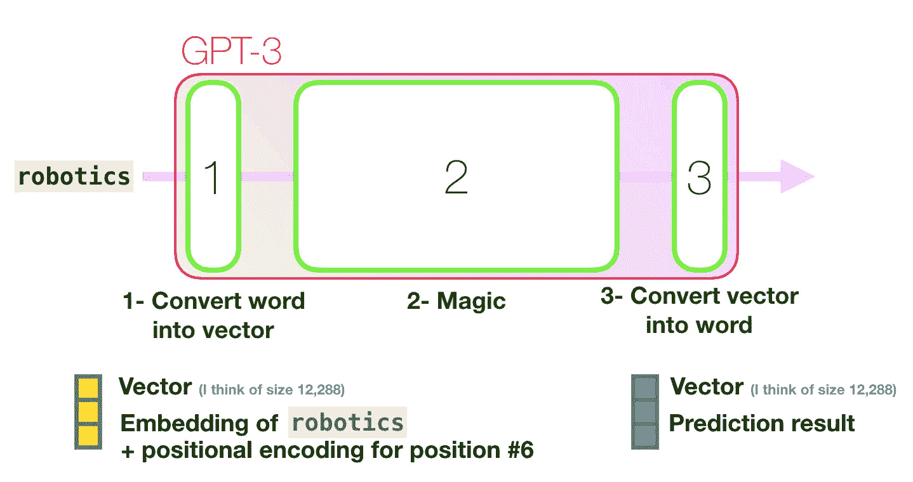
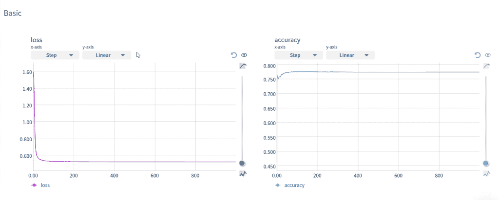
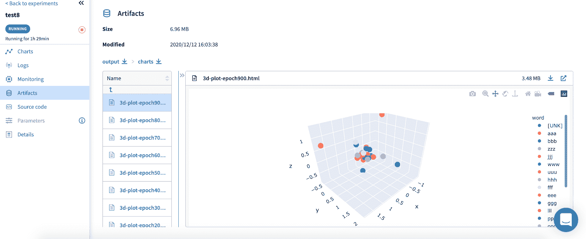
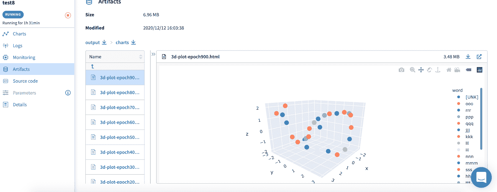

# 训练、可视化和理解单词嵌入:深入定制数据集

> 原文：<https://web.archive.org/web/https://neptune.ai/blog/word-embeddings-deep-dive-into-custom-datasets>

人工智能(AI)发展中最强大的趋势之一是自然语言处理(NLP)领域的快速发展。这一进步主要是由深度学习技术在神经网络架构中的应用推动的，这使得像[伯特](https://web.archive.org/web/20221206214014/https://en.wikipedia.org/wiki/BERT_(language_model))和 [GPT-3](https://web.archive.org/web/20221206214014/https://en.wikipedia.org/wiki/GPT-3) 这样的模型在一系列语言任务中表现得更好，这些任务之前被教导为[超出了大多数 NLP 模型](https://web.archive.org/web/20221206214014/https://thenewstack.io/openais-gpt-3-makes-big-leap-forward-for-natural-language-processing/)的范围。

虽然这些模型的全部潜力可能存在争议(更多内容见[我们关于这些模型是否能真正理解语言的帖子](/web/20221206214014/https://neptune.ai/blog/ai-limits-can-deep-learning-models-like-bert-ever-understand-language))，但毫无疑问，它们对学术界和商界的影响才刚刚开始被感受到。

因此，理解如何为您自己的用例测试和训练这些模型是很重要的。所有这些深度学习模型的一个关键部分是它们能够将语言信息编码到称为[嵌入](https://web.archive.org/web/20221206214014/https://towardsdatascience.com/neural-network-embeddings-explained-4d028e6f0526)的向量中。

在这篇文章中，我们将看看你可以使用的不同技术，以更好地理解语言模型如何捕捉单词之间的上下文关系。我们将通过以下方式做到这一点:

1.  查看数据集，我们需要训练这些模型，看看我们是否可以找到一个简单的方法来帮助我们可视化这些模型如何“学习”不同单词之间的关系
2.  看看您可以使用哪些工具和技术来跟踪这些模型的进度，并在它们处理我们的简化数据集时监控结果
3.  在那之后，你应该有希望能够在一些真实的数据集上，为更复杂的模型重用那个模板。

有许多因素使这种类型的项目变得困难。首先，语言本身是复杂的，所以很难知道一个词和另一个词的关系有多密切。这个模型说“猫”在意思上更接近“狗”或“狮子”是对的吗？其次，我们如何识别这种上下文关系？有没有我们可以用来理解相似性的分数，以及我们可以用来直观理解这种关系的方法？

我们将看看如何定制您的实验来控制其中的一些变量，以便更好地理解模型在处理文本和输出一些非常大的向量时实际上在做什么。说到矢量…

## 向量的世界

该信息可以包括特定单词的语义和句法方面。虽然每个词都可以被认为是一个范畴变量，即一个独立的实体，但它总是与其他词有某种联系。例如，都柏林是爱尔兰的首都。都柏林这个词因此与:

*   作为城市的事物，
*   大写的东西，
*   爱尔兰的东西
*   诸如此类…

如你所见，很难完全定义一个特定单词可能具有的所有关系。然而，这正是我们在创建嵌入时试图做的事情。

伯特和 GPT-3 等最新模型在这项任务上表现出色，因为它们可以处理大量文本，并对它们在这些嵌入中学习到的许多关系进行编码。他们的前辈是“不那么深”的神经网络，如 [Word2Vec](https://web.archive.org/web/20221206214014/https://en.wikipedia.org/wiki/Word2vec) 使用类似的技术来学习单词之间的关联，并将信息编码到嵌入中。



*From [Jay Alammar’s amazing blog](https://web.archive.org/web/20221206214014/http://jalammar.github.io/how-gpt3-works-visualizations-animations/): These models, like GPT-3 here, turn the word into a vector and then do their “magic” to learn the relationship between it and other words depending on the context. (Note you should checkout Jay’s blog for all things deep learning NLP)*

虽然这些技术是相似的，但它们比这些语言模型(LMs)的最新实例中使用的一些更复杂和高级的方法更容易理解。因此，这是一个展示如何训练嵌入并理解它们在被训练时所包含的信息的好地方。

希望这将帮助你在你自己的 ML 项目中应用这些技术到更高级的 LMs，跟踪你的进度，并可视化结果。

## 项目描述

您可能已经接触过大量关于如何创建自己的 word 嵌入的教程和示例。这些资源中的许多都是抓住主题的好方法。

从个人角度来看，我一直在努力理解这些嵌入在给定底层训练数据的情况下表现如何。例如，许多例子使用莎士比亚的作品来训练它们的嵌入。虽然我是“吟游诗人”的粉丝，但在读过他所有的作品后，很难知道“爱”、“家庭”和“战争”这些词应该有多么密切的联系。

同样，Word2Vec 上的[原论文](https://web.archive.org/web/20221206214014/https://arxiv.org/pdf/1301.3781.pdf)中最著名的例子就是[“国王”和“王后”](https://web.archive.org/web/20221206214014/https://kawine.github.io/blog/nlp/2019/06/21/word-analogies.html)之间的关系。相反，我认为创建我们自己的简化语言数据集来训练我们的单词嵌入会更好。这样，我们可以控制词汇之间的关系，并更好地理解嵌入是否确实捕捉到了相关单词之间的关系。

希望这将是一个数据集，您可以使用并改进训练模式高级模型，如那些采用最新 NLP 模型使用的[注意力架构](https://web.archive.org/web/20221206214014/https://arxiv.org/pdf/1706.03762.pdf)的模型，如 BERT 和 GPT-3。

此外，我们将利用[海王星](/web/20221206214014/https://neptune.ai/)来跟踪我们嵌入的进展，并可视化它们的关系。同样，您应该能够使用这些技术轻松地跟踪其他 NLP 项目的进展，在这些项目中，您正在训练自己的嵌入。你可以在这里查看[我在 Neptune](https://web.archive.org/web/20221206214014/https://ui.neptune.ai/choran/sandbox/e/SAN-20/artifacts?path=charts%2F&file=proximity-similarity-3d-plot-epoch900.html) 上的公共项目，看看你按照下面的代码运行时的一些结果。

该项目的结构如下:

1.  **数据集**:为了能够理解我们“单词”之间的关系，我们将定义我们自己的简单语言数据集。
2.  **模型**:我们将使用 [TensorFlow 教程系列](https://web.archive.org/web/20221206214014/https://www.tensorflow.org/tutorials/text/word2vec)中的 Word2Vec 代码。有许多方法可以使用 Word2Vec，例如在 [gensim 库](https://web.archive.org/web/20221206214014/https://radimrehurek.com/gensim/models/word2vec.html)中。TF 教程系列的好处是，你可以看到所有血淋淋的内部，并可以改变任何你喜欢的修补和测试模型。
3.  **[实验跟踪](/web/20221206214014/https://neptune.ai/experiment-tracking)** :我们会在训练时设置海王星来跟踪模型的进度。我们可以用它来跟踪损失和准确性，还可以显示“单词”之间的相似性在训练过程中是如何变化的。
4.  可视化:我们还将展示如何通过观看 Neptune 中的二维和三维可视化来理解玩具数据集中“单词”之间的关系。



*Loss and accuracy charts available in Neptune*

让我们开始创建数据集吧。

## 完美的语言

为了更好地展示像 Word2Vec 这样的模型如何学习单词之间的关系，我们需要创建自己的数据集。我们的目标是创建一个数据集，在这个数据集内，单词的接近度被完美地定义。举个例子，想想你脑海中闪现的任何一个词。

例如，单词“computer”是一个常见的单词，与许多其他单词有关系或“接近”。“计算机”在通常情况下可以互换使用，或者在与 PC、mac、IBM、笔记本电脑和台式机类似的上下文中使用。它通常与屏幕、程序、操作系统、软件、硬件等结合使用。当有人提到“计算机”科学家或“计算机”技术人员时，它与职业相关。

但是嘿！有些人的职业被称为“计算机”，他们负责复杂的计算。这个职业在 17 世纪被提及，当时科学家雇佣“计算机”来帮助他们进行计算，约翰尼斯·开普勒在推进他自己的科学项目之前就是这些计算机中的一员。随着 ENIAC 计算机的出现，这个职业一直繁荣到第二次世界大战结束，那时人类计算机成为了第一批程序员。

考虑到以上所有因素，人们可以期待计算机更人性化。

我们可以在这里继续下去，特定的关系通常是特定于领域的。如果你在医疗保健行业工作，那么“计算机”和 IT 或软件工程师之间的关系可能会有所不同。

这有什么意义？嗯，很难知道“计算机”与这些术语有多相似。是否应该更类似于“操作系统”而不是“笔记本电脑”或“科学家”。不知道这一点，我们将永远谈论 Word2Vec 及其“国王”和“王后”。相反，让我们创建自己的简单语言，这样我们就可以:

1.  缩小词汇量，以便快速训练
2.  定义测试数据集中每个句子的长度，这样我们就不需要任何填充或者增加不同长度句子的复杂性。
3.  在我们的数据集中定义“单词”之间的严格关系，这样我们就可以确切地知道层次结构应该是什么
4.  不包括任何连词或例外或任何混乱不规则的语言魔法，使学习一门新语言如此困难！

我能想到的最简单的方法是用一个简单的词汇，我们有 26 个基于字母表的三个字母的单词，例如“aaa”，“bbb”，“ccc”等等。

然后我们就可以定义这些“词”之间我们想要的“接近度”。“AAA”*这个简单的语言里没有大写！)例如，应该只出现在“bbb”或“ccc”旁边。“bbb”应该只出现在“ccc”或“ddd”等旁边。这样，当我们查看单词之间的相似性时，我们希望看到“aaa”在相似性方面总是接近“bbb”和“ccc ”,但应该远离“xxx”或“zzz”。

这样做的好处是你可以开始让你自己的语言变得简单或复杂。你可以开始包括更复杂的关系或连词等等。包括一个类似于“and”用法的单词，这样它就会出现在你的新语言中的任何单词旁边。然后看和不同的词有多相似。现在，我们将创建一些简单的示例来帮助您开始。

### 随机语言

让我们从一个随机的语言数据集开始，我们不期望你的新语言中的单词之间有任何关系。你可以在这里找到生成你自己语言[的所有相关代码。](https://web.archive.org/web/20221206214014/https://github.com/choran/word_embeddings/blob/main/custom_language_dataset.ipynb)

```py
import string
from random import choice

alpha_d = dict.fromkeys(string.ascii_lowercase, 0)

vocab = {}
for c, l in enumerate(alpha_d, 0):
    vocab[c] = l*3

sen_num = 30000
sen_len = 7
vocab_len = 26

text_file = open("random_vocab.txt", "a")
text_file.truncate(0)
for s in range(sen_num):
    sentence = []
    for w in range(0, sen_len):
        i = choice(range(0, vocab_len))
        sentence.append(vocab[i])
    text_file.write(" ".join(sentence))
    text_file.write("n")
text_file.close()

```

### 简单的语言

现在让我们用一些关系创建一个简单的语言。正如我们上面提到的，我们的语言会有相同长度的句子，这些句子中的“单词”总是彼此靠近。这就像一个简单的字母表的扩展，其中“aaa”总是靠近“bbb”和“ccc”。

```py
import string
from random import choice

alpha_d = dict.fromkeys(string.ascii_lowercase, 0)

vocab = {}
for c, l in enumerate(alpha_d, 0):
    vocab[c] = l*3

sen_num = 30000
sen_len = 7
vocab_len = 26

prev_word = None
text_file = open("proximity_vocab.txt", "a")
text_file.truncate(0)
for s in range(sen_num):
    sentence = []
    start_word = choice(range(0, 18))
    for w in range(0, sen_len):
        i = choice([x for x in range(start_word+w+0, start_word+w+3) if x not in [prev_word]])
        sentence.append(vocab[i])
        prev_word = i
    text_file.write(" ".join(sentence))
    text_file.write("n")
text_file.close()

```

现在让我们从 TensorFlow 教程系列中获取 Word2Vec 代码，用于训练我们的数据集，然后我们将能够通过 Neptune 跟踪和可视化结果。

## Word2Vec 模型

TensorFlow 教程系列有一个[文本部分](https://web.archive.org/web/20221206214014/https://www.tensorflow.org/tutorials/text/word_embeddings)，其中包括许多例子，如 BERT 和 Word2Vec。正如我们之前提到的，我们将使用 Word2Vec 模型来展示如何使用 Neptune 跟踪您的实验，以记录准确性和损失数据，以及单词之间的相似性如何变化和 3D 可视化。

我们将使用 Word2Vec 代码的精简版本，以便于运行。最初的包含了更多的信息，所以一定要检查一下。这很值得一读。这段代码的伟大之处在于，您几乎可以修改所有可用的参数。通过我们设置的跟踪功能，您将能够监控和比较这些变化。
Word2Vec 模型将读入我们创建的简单数据集，然后基于 word 2 vec 中使用的 [Skip-Gram](https://web.archive.org/web/20221206214014/https://www.tensorflow.org/tutorials/text/word2vec#skip-gram_and_negative_sampling) 方法创建训练示例。这种方法试图在给定单词本身的情况下预测单词的上下文。

跳格法试图在给定单词本身的情况下预测其周围的单词

您可以更改所有参数，例如 ***window_size*** ，这是您在每一步中尝试预测的上下文或相邻单词的数量。

下面的代码示例可以在一个笔记本[这里](https://web.archive.org/web/20221206214014/https://github.com/choran/word_embeddings/blob/main/train_track_embeddings.ipynb)找到。

```py

def generate_training_data(sequences, window_size, num_ns, vocab_size, seed):

  targets, contexts, labels = [], [], []

  sampling_table = tf.keras.preprocessing.sequence.make_sampling_table(vocab_size)

  for sequence in tqdm.tqdm(sequences):

    positive_skip_grams, _ = tf.keras.preprocessing.sequence.skipgrams(
          sequence,
          vocabulary_size=vocab_size,
          sampling_table=sampling_table,
          window_size=window_size,
          negative_samples=0)

    for target_word, context_word in positive_skip_grams:
      context_class = tf.expand_dims(
          tf.constant([context_word], dtype="int64"), 1)
      negative_sampling_candidates, _, _ = tf.random.log_uniform_candidate_sampler(
          true_classes=context_class,
          num_true=1,
          num_sampled=num_ns,
          unique=True,
          range_max=vocab_size,
          seed=SEED,
          name="negative_sampling")

      negative_sampling_candidates = tf.expand_dims(
          negative_sampling_candidates, 1)

      context = tf.concat([context_class, negative_sampling_candidates], 0)
      label = tf.constant([1] + [0]*num_ns, dtype="int64")

      targets.append(target_word)
      contexts.append(context)
      labels.append(label)

  return targets, contexts, labels

```

您需要运行的代码在您可以使用的笔记本中，或者您可以直接从 TensorFlow 网站上获取这些代码，然后开始编码并复制您需要的代码。

## 实验跟踪

很难识别单词嵌入中发生的变化。理想情况下，我们希望能够看到随着训练的进行，我们的单词的相似度是如何变化的。我们可以跟踪每个时期的 ***损失*** 和 ***准确性*** 之类的事情，但跟踪我们单词之间的实际相似性会很棒。这是我们如何使用 TensorFlow 的 ***回调*** 功能的一个很好的例子。这将使我们能够准确记录我们想要的，然后在海王星实验中跟踪它。

要设置 Neptune 实验，您只需设置您的凭证并初始化您的 Neptune 模块。

```py
import neptune
from neptunecontrib.api import log_table
from neptunecontrib.api import log_chart

neptune.init(project_qualified_name='choran/sandbox',
             api_token='your token',)

```

然后你需要做的就是开始你的实验，你已经准备好了！

```py
neptune.create_experiment()

```

这应该会输出您的实验的 URL->[https://ui.neptune.ai/<用户>/沙盒/e/SAN-1](https://web.archive.org/web/20221206214014/https://ui.neptune.ai/choran/sandbox/e/SAN-12)

为了检查我们的单词嵌入之间的相似性，我们可以比较一个示例单词的相似性，并跟踪它在不同时期之间如何变化。

```py
def get_similarity(word, X, X_vocab, vocab):

    vocab_d = {}
    for i, w in enumerate(X_vocab):
        vocab_d[w] = i

    y = X[vocab_d[word]].reshape(1, -1)
    res = cosine_similarity(X, y)
    df = pd.DataFrame(columns=['word', 'sim'])
    df['word'], df['sim']= vocab[1:], res
    return(df)

```

那么我们所需要做的就是调用这个函数时用我们自定义的 ***回调*** 函数。你可以阅读更多关于不同的 ***回调*** 特性，你可以在这里使用[。关于自定义 ***回调*** 的示例，请查看 TensorFlow 中关于编写自己的回调](https://web.archive.org/web/20221206214014/https://www.tensorflow.org/api_docs/python/tf/keras/callbacks)[的示例，此处为](https://web.archive.org/web/20221206214014/https://www.tensorflow.org/guide/keras/custom_callback)。

你可以把你的结果以熊猫数据的形式记录下来，然后保存到你的实验中，并跟踪它是如何随时间变化的。

这显示了 900 个历元之后‘BBB’和其他单词之间的余弦相似性。正确地说，它看起来接近“aaa”和“ccc”。但是，随着时间的推移，这种情况发生了怎样的变化，它与随机数据集或更大的数据集相比又如何呢？

## 3d 视觉化

对于我们的 3D 可视化，我们可以使用 plotly 和 PCA 来保存嵌入的 3D 图，并直观地比较它们之间的关系。例如，看看我们的“随机”数据集和更“结构化”的数据集之间的区别。



*We can see here that the clustering of our “words” seems fairly chaotic?*



*Whereas here you can see a “nicer” relationship between our “words”, it seems far more structured and there seems to be a pattern you can investigate by interacting with the visualisation.*

您还可以看到，我们的回调函数是多么简单，可以将这些信息记录并跟踪到 Neptune。

```py
class TrackLossAndSimilarity(tf.keras.callbacks.Callback):

    def on_epoch_end(self, epoch, logs=None):
        neptune.log_metric('loss', logs["loss"])
        neptune.log_metric('accuracy', logs["accuracy"])

        if epoch%100 == 0:
            vocab = vectorize_layer.get_vocabulary()
            X, X_vocab = get_data(word2vec.get_layer('w2v_embedding').get_weights()[0],
                                  vocab)
            check_word = 'bbb'
            sim_df = get_similarity(check_word, X, X_vocab, vocab)
            sim_fig = get_3d_viz(X, X_vocab)
            log_chart(f'3d-plot-epoch{epoch}', sim_fig)
            log_table(f'similarity-{check_word}-epoch{epoch}', sim_df.sort_values('sim', ascending=False))

```

## 总结和后续步骤

最后，让我们回顾一下我们刚刚完成的内容，看看如何使用来训练和测试模式高级模型。

1.  我们创建了自己的“语言学”数据集:这里的目标是创建一个数据集，在这个数据集内我们可以知道(并设计)术语之间的关系。这样，当我们创建嵌入并检查它们的相似性时，我们将知道“aaa”是否更类似于“mmm”而不是“ccc ”,这是有问题的，因为嵌入没有正确地选取我们知道存在的关系。
2.  **我们找到了一个创建嵌入的模型**:我们使用 Word2Vec 模型的一些示例代码来帮助我们理解如何为输入文本创建标记，并使用 skip-gram 方法来学习单词嵌入，而不需要监督数据集。这个模型的输出是我们数据集中每个术语的嵌入。这些是“静态”嵌入，因为每个术语有一个嵌入。
3.  **我们探索了嵌入**:最终目标是理解模型如何将意义编码到嵌入中。因此，我们观察了在随机数据集上训练时嵌入所包含的信息，并将其与结构化数据集进行比较，在结构化数据集上，术语仅在与某些其他术语“接近”的情况下使用。我们通过跟踪示例术语之间的相似性来做到这一点，并显示这种相似性如何随时间变化以及两个实验之间的差异。我们还通过可视化所有嵌入之间的关系来展示这一点。在我们的简单示例中，我们能够看到随机数据集和邻近数据集之间的差异

#### 我如何利用这一点来更好地理解像 BERT 这样的模型？

请记住，不管像 BERT 这样的模型看起来多么先进和复杂，它们最终只是像我们在这里所做的那样将信息编码到一个嵌入中。不同之处在于，设计 [Transformer](https://web.archive.org/web/20221206214014/https://en.wikipedia.org/wiki/Transformer_(machine_learning_model)) 架构的人(这是大多数新的 NLP 模型，如 BERT 和 GPT-3 的基础)找到了一种“更好的”方法来将信息编码到嵌入中。我们使用的嵌入为每个术语生成一个嵌入。

但是，正如我们所知，真实的语言是混乱的，同样的词在不同的上下文中可能有不同的意思。这是一个博客帖子，但你可以张贴邮件，在篮球比赛中你可以张贴，在足球比赛中你可以击中门柱，你可以通过张贴在门上等方式在公共场合显示信息。对于我们刚刚创建的静态嵌入来说，这是一个问题，但是 Transformer 架构试图通过基于“上下文”创建嵌入来解决这个问题。所以它根据单词使用的上下文产生不同的嵌入。

例如，您可以通过创建一个新的数据集来测试这一点，在该数据集内，一个术语被用于非常不同的术语附近。术语“ccc”可以接近当前设计的“bbb”和“ddd ”,但是您也可以添加代码以确保它也接近“xxx”和“yyy”。在这种情况下，您认为“ccc”的相似性值将如何工作？例如，它们会显示出与“ddd”和“xxx”相同的相似性吗？

这里的关键是，你可以在这里应用同样的技术来尝试和理解其他模型是如何工作的。您可以在这个数据集上训练一个 BERT 模型，并尝试看看静态嵌入和基于上下文的嵌入之间有什么区别。如果你想做类似的事情，这里有一些你可以利用的资源:

*   从零开始用世界语训练 BERT:这个来自 HugglingFace 的[指南向你展示如何用一种新的语言从零开始训练 BERT 模型。您可以尝试在您的自定义数据集或更复杂的数据集上进行训练。然后尝试跟踪嵌入，就像我们对 Word2Vec 所做的那样。记住，BERT 嵌入是基于上下文的，所以您不需要像 Word2Vec 那样的查找字典。您将向它输入一个句子，并获得每个单词的嵌入或整个序列的“混合”嵌入。点击](https://web.archive.org/web/20221206214014/https://huggingface.co/blog/how-to-train)了解更多[。](https://web.archive.org/web/20221206214014/https://www.tensorflow.org/hub/tutorials/bert_experts)
*   开始尝试句子嵌入:代替单词嵌入，你可以嵌入整个句子并比较它们的相似性。您可以使用一个简单的自定义数据集，然后获得输入序列的平均嵌入，并使用它来比较整个数据序列并确定它们的相似性。你可以在这里找到这些型号的一些例子[。](https://web.archive.org/web/20221206214014/https://tfhub.dev/google/collections/universal-sentence-encoder/1)
*   上下文与静态嵌入:我们真的需要上下文嵌入吗？上下文嵌入和静态嵌入有什么不同？我们能从上下文嵌入中生成更好的静态嵌入吗？如果你想找到这些问题的答案，请查看[这篇很棒的文章](https://web.archive.org/web/20221206214014/http://ai.stanford.edu/blog/contextual/)。