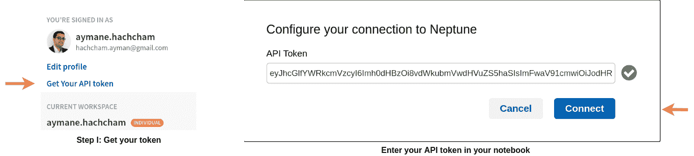

# XGBoost:您需要知道的一切

> 原文：<https://web.archive.org/web/https://neptune.ai/blog/xgboost-everything-you-need-to-know>

[梯度推进(GBM)树](/web/20230304041944/https://neptune.ai/blog/gradient-boosted-decision-trees-guide)在没有指定模型的情况下从数据中学习，它们进行无监督学习。 [XGBoost](https://web.archive.org/web/20230304041944/https://xgboost.readthedocs.io/en/latest/) 是一个流行的梯度推进库，用于 GPU 训练、分布式计算和并行化。它是精确的，它很好地适应所有类型的数据和问题，它有很好的文档，总体来说它非常容易使用。

目前，它是通过机器学习从预测建模中获得准确结果的事实上的标准算法。对于 R、Python 和 C++来说，它是速度最快的梯度提升库，具有非常高的准确性。

我们将探索如何使用该模型，同时使用 Neptune 来呈现和详述 ML 项目管理的一些最佳实践。

如果您不确定 XGBoost 对您来说是不是一个很好的选择，请跟随教程直到结束，然后您将能够做出一个完全明智的决定。

## 集成算法–解释

[集成学习](/web/20230304041944/https://neptune.ai/blog/ensemble-learning-guide)结合几个*学习器*(模型)来提高整体性能，增加机器学习和预测建模的预测性和准确性。

从技术上来说，集成模型的力量很简单:它可以结合成千上万个在原始数据子集上训练的较小的学习者。这可能会导致有趣的观察结果，例如:

*   由于**装袋**，通用模型的方差显著降低
*   由于**升压**，偏置也会降低
*   由于**叠加**，整体预测能力提高

### 集合方法的类型

基于子学习器是如何产生的，集成方法可以分为两组:

1.  ***顺序*** 系综方法——学习者被**顺序生成**。这些方法使用基础学习者之间的依赖性。每个学习者都会影响下一个学习者，同样，也可以推导出一般的父性行为。顺序集成算法的一个流行例子是 **AdaBoost。**
2.  ***并行*** 集成方法——学习者是**并行生成**。基础学习者是独立创建的，以研究和利用与他们的独立性相关的效果，并通过平均结果来减少错误。实现这种方法的一个例子是**随机森林**。

集成方法可以使用**同质学习者**(来自同一个家庭的学习者)或**异质学习者**(来自多个类别的学习者，尽可能准确和多样)。

### 同质和异质 ML 算法

一般来说，同质集成方法具有单一类型的基学习算法。通过给训练样本分配权重，训练数据是多样化的，但是它们通常利用单一类型的基本学习者。

另一方面，异类集成由具有不同基本学习算法的成员组成，这些算法可以被组合并同时用于形成预测模型。

一般的经验法则是:

*   ***同构*** 集成对各种数据使用相同的特征选择，并将数据集分布在几个节点上。
*   *异类集成对相同的数据使用不同的特征选择方法*

 *同质系综:

异质系综:

### 集成算法的重要特征

#### 制袋材料

通过平均多个估计值的性能来减少总体方差。聚合原始数据集的若干个采样子集，用替换法训练随机选择的不同学习者，符合 bootstrap 聚合的核心思想。Bagging 通常使用投票机制进行**分类**(随机森林)和**回归平均**。

***注:*** *记住有些学习者比较稳定，对训练扰动不太敏感。这样的学习器，组合在一起，并不能帮助通用模型提高泛化性能。*

#### 助推

这种技术将*弱学习者*——预测能力差且比随机猜测略好的学习者——与原始数据集的特定加权子集相匹配。对先前分类错误的子集给予较高的权重。

然后，在分类或加权和回归的情况下，将学习者预测与投票机制相结合。

### 众所周知的升压算法

#### adaboost 算法

AdaBoost 代表 ***自适应增压。*** 算法中实现的逻辑是:

*   第一轮分类器(学习器)都使用相等的加权系数来训练，
*   在随后的提升回合中，自适应过程增加被学习者在先前回合中错误分类的数据点的权重，并减少正确分类的数据点的权重。

如果你对算法的描述很好奇，看看这个:

#### 梯度推进

梯度提升使用来自弱学习者的可微分函数损失来概括。在每个提升阶段，学习器被用来最小化给定当前模型的损失函数。提升算法可用于分类或回归。

## 什么是 XGBoost 架构？

XGBoost 代表极端梯度增强。这是梯度推进算法的并行化和精心优化版本。并行化整个增强过程极大地缩短了训练时间。

我们不是在数据上训练最好的可能模型(像传统方法一样)，而是在训练数据集的各个子集上训练成千上万个模型，然后投票选出表现最好的模型。

在许多情况下，XGBoost 比通常的梯度增强算法更好。Python 实现提供了对大量内部参数的访问，以获得更好的精度和准确度。

XGBoost 的一些重要特性是:

*   ***并行化:*** 模型实现用多个 CPU 核进行训练。
*   ***正则化:*** XGBoost 包括不同的正则化惩罚，以避免过拟合。惩罚正则化产生成功的训练，因此模型可以充分地概括。
*   ***非线性:*** XGBoost 可以检测和学习非线性数据模式。
*   ***交叉验证:*** 内置和开箱即用。
*   ***可扩展性:*** XGBoost 可以分布式运行得益于 Hadoop 和 Spark 这样的分布式服务器和集群，所以你可以处理海量数据。它也适用于许多编程语言，如 C++、JAVA、Python 和 Julia。

### XGBoost 算法是如何工作的？

*   考虑一个函数或估计值。首先，我们构建一个从函数梯度导出的序列。下面的等式模拟了一种特殊形式的梯度下降。代表最小化的损失函数，因此它给出了函数减小的方向。是损失函数拟合的变化率，相当于梯度下降中的学习率。被期望适当地近似损失的行为。

*   为了迭代模型并找到最佳定义，我们需要将整个公式表示为一个序列，并找到一个有效函数，该函数将收敛到函数的最小值。该函数将作为一种误差度量，帮助我们降低损耗并保持性能。序列收敛到函数的最小值。这种特殊的符号定义了在评估梯度推进回归量时应用的误差函数。

*要了解更多细节和深入了解渐变增强背后的数学原理，我推荐你查看由* [克里希纳·库马尔·马赫托](https://web.archive.org/web/20230304041944/https://towardsdatascience.com/demystifying-maths-of-gradient-boosting-bd5715e82b7c)撰写的这篇文章。

### 其他梯度提升方法

#### 梯度推进机

GBM 结合了多个决策树的预测，所有弱学习者都是决策树。该算法的关键思想是，这些树的每个节点采用不同的特征子集来选择最佳分割。由于这是一个提升算法，每个新的树都会从以前的错误中学习。

*有用的参考- >* [*了解渐变增压机*](https://web.archive.org/web/20230304041944/https://towardsdatascience.com/understanding-gradient-boosting-machines-9be756fe76ab)

#### 光梯度推进机(LightGBM)

LightGBM 可以处理海量数据。这是训练和预测最快的算法之一。它的通用性很好，这意味着它可以用来解决类似的问题。它可以很好地扩展到大量的内核，并且具有开源代码，因此您可以在您的项目中免费使用它。

*有用参考- >* [*了解 LightGBM 参数(以及如何调优它们)*](/web/20230304041944/https://neptune.ai/blog/lightgbm-parameters-guide)

#### 分类增强(CatBoost)

这一组特定的梯度增强变量通常具有处理分类变量和数据的特定能力。CatBoost 对象可以处理分类变量或数值变量，以及混合类型的数据集。这还不是全部。它还可以使用未标记的示例，并在训练过程中探索内核大小对速度的影响。

*有用参考- >* [*CatBoost:一个自动处理分类(CAT)数据的机器学习库*](https://web.archive.org/web/20230304041944/https://www.analyticsvidhya.com/blog/2017/08/catboost-automated-categorical-data/)

## 将 XGBoost 与 Neptune 集成在一起

### 开始创建您的项目

安装所需的 Neptune 客户端库:

```py
pip install neptune-client

```

安装 Neptune 笔记本插件，保存你所有的工作，并与 Neptune UI 平台链接:

```py
pip install -U neptune-notebooks
```

启用 jupyter 集成:

```py
jupyter nbextension enable --py neptune-notebooks
```

在 Neptune 平台上注册，获取您的 API 密钥，并将您的笔记本与您的 Neptune 会话连接起来:



要完成设置，请在笔记本中导入 Neptune 客户端库，并调用 neptune.init()方法初始化连接:

```py
import neptune
neptune.init(project_qualified_name='aymane.hachcham/XGBoostStudy)
```

### 准备好您的数据集以供使用

为了说明我们可以用 XGBoost 做的一些工作，我挑选了一个数据集，它包含了决定和预测学校学生考试分数的因素。该数据集基于在不同学校水平学习了 4 至 6 个月的学生的数据，包括他们每周的小时数和他们的表现。

该数据集将决定学习质量对学生考试成绩的影响程度。该数据集包含表示在三次考试中获得的关于几个社会、经济和金融因素的结果的数据。

数据集具有以下特征:

*   性别
*   种族/民族
*   父母的教育水平
*   午餐
*   备考课程

我们可以仔细看看种族和性别的分布情况:

*   *按种族分列的数学、阅读和写作成绩*:

```py
import plotly.graph_objects as go

groupe_math_eth = data_exams.groupby(['race/ethnicity'])['math score'].sum().reset_index()
groupe_reading_eth = data_exams.groupby('race/ethnicity')['reading score'].sum().reset_index()
groupe_writing_eth = data_exams.groupby('race/ethnicity')['writing score'].sum().reset_index()
fig = go.Figure(data=[
    go.Bar(name='Math Score', x=groupe_math_eth['race/ethnicity'], y=groupe_math_eth['math score']),
    go.Bar(name='Reading Score', x=groupe_reading_eth['race/ethnicity'], y=groupe_reading_eth['reading score']),
    go.Bar(name='Writing Score', x=groupe_writing_eth['race/ethnicity'], y=groupe_writing_eth['writing score'])
])

fig.update_layout(barmode='group')
fig.show()
```

C 组在所有得分指标上都很突出。这表明，在与种族和民族血统相关的学习成绩方面会有差异。

*   按性别分列的数学、阅读和写作成绩

```py
groupe_math_gen = data_exams.groupby(['gender'])['math score'].sum().reset_index()
groupe_reading_gen = data_exams.groupby('gender')['reading score'].sum().reset_index()
groupe_writing_gen = data_exams.groupby('gender')['writing score'].sum().reset_index()

fig = go.Figure(data=[
    go.Bar(name='Math Score', x=groupe_math_gen['gender'], y=groupe_math_gen['math score']),
    go.Bar(name='Reading Score', x=groupe_reading_gen['gender'], y=groupe_reading_gen['reading score']),
    go.Bar(name='Writing Score', x=groupe_writing_gen['gender'], y=groupe_writing_gen['writing score'])
])

fig.update_layout(barmode='group')
fig.show()
```

相反，我们发现性别对所有三个学科的总体得分没有太大影响。性别似乎不是决定性因素。

#### 对数据进行采样

为了对数据进行采样，我们将使用 XGBoost Python 库中的 DMatrix 对象。将数据采样到子集的过程称为数据分离。DMatrix 是一种内部数据结构，有助于内存管理和数据优化。我们将把数据分成训练和测试子集，然后开始训练。

```py
import xgboost as xgb
from sklearn.model_selection import train_test_split

features = data_exams.iloc[:,:-3]
target = data_exams.iloc[:,-3:] 
```

**将分类变量转换为数值:**

所有特征仍被注册为分类值。为了训练模型，我们需要将每个变量与一个数字代码相关联来识别它，并因此相应地转换 5 个特征列。

1.  首先，使用 pandas 将对象数据类型转换为字符串:

```py
features['gender'].astype('string')
features['race/ethnicity'].astype('string')
features['parental level of education'].astype('string')
features['test preparation course'].astype('string')
```

2.  将性别转换为 0/1 值:

```py
features.loc[features['gender'] == 'male', 'gender'] = 0
features.loc[features['gender'] == 'female', 'gender'] = 1
```

3.  改变父母的教育水平:

```py
features.loc[features['parental level of education'] == 'high school', 'parental level of education'] = 1
features.loc[features['parental level of education'] == 'some college', 'parental level of education'] = 2
features.loc[features['parental level of education'] == 'some high school', 'parental level of education'] = 3
features.loc[features['parental level of education'] == 'associate's degree', 'parental level of education'] = 4
features.loc[features['parental level of education'] == 'bachelor's degree', 'parental level of education'] = 5
features.loc[features['parental level of education'] == 'master's degree', 'parental level of education'] = 6
```

4.  转变午餐价值观:

```py
features.loc[features['lunch'] == 'standard', 'lunch'] = 0
features.loc[features['lunch'] == 'free/reduced', 'lunch'] = 1

```

5.  转变备考课程:

```py
features.loc[features['test preparation course'] == 'none', 'test preparation course'] = 0
features.loc[features['test preparation course'] == 'completed', 'test preparation course'] = 1
```

区分数据特征、我们将尝试用于预测的列以及数据目标，数据目标是代表这些学生获得的数学、阅读和写作分数的最后 3 列。

```py
x_train, x_test, y_train, y_test = train_test_split(features, target, test_size=0.30, random_state=123)
d_matrix_train = xgb.DMatrix(x_train, y_train, enable_categorical=True)
d_matrix_test = xgb.DMatrix(x_test, y_test, enable_categorical=True)
```

#### 将您的脚本连接到海王星

*   首先创建一个新项目，给它一个名字和一个有意义的描述[。](https://web.archive.org/web/20230304041944/https://docs.neptune.ai/getting-started/installation)

*   使用您的 Neptune 凭据连接您的脚本[阅读如何](https://web.archive.org/web/20230304041944/https://docs.neptune.ai/getting-started/hello-world)。

```py
import neptune.new as neptune
experiment = neptune.init(project='aymane.hachcham/XGBoost-Complete-Guide', api_token='API TOKEN')
```

*   前往你的 jupyter 笔记本，启用 Neptune 扩展来访问你的项目[阅读如何](https://web.archive.org/web/20230304041944/https://docs.neptune.ai/integrations-and-supported-tools/ide-and-notebooks/jupyter-lab-and-jupyter-notebook)。

***注意*** *:我强烈建议你看一下[为新的 Neptune Python AP](https://web.archive.org/web/20230304041944/https://docs.neptune.ai/) I 发布的新文档，它结构良好，非常直观。*

### 训练模型

一旦我们正确地分离了我们的训练和测试样本，我们就可以开始将数据拟合到模型中了。在培训过程中，我们将尝试共同记录所有即将到来的评估结果，以便实时了解我们的模型性能。

为了开始使用 Neptune 进行日志记录，我们创建了一个实验和一个定义每个模型版本的超参数列表。

```py
import neptune
from neptunecontrib.monitoring.xgboost import neptune_callback

params = {
    'max_depth':7,
    'learning_rate':0.1,
    'objective': 'reg:squarederror',
    'num_estimators':1000,
    'num_boost_round':1000
}

neptune.create_experiment(
    name='XGBoost-V1',
    tags=['XGBoost', 'Version1'],
    params=params
)
```

使用我们之前设置的参数和 DMatrix 数据开始训练过程。我们还添加了 neptune_callback()函数，它自动完成所有必要的工作，以实时监控损失和评估指标。

```py
watchlist = [(d_matrix_test, 'test'), (d_matrix_train, 'train')]
num_round = 20

xgb.train(params, d_matrix_train, num_round, watchlist, callbacks=[neptune_callback()])
neptune.stop()
```

一旦您的项目连接到平台，Neptune 就会跟踪和监控您的物理资源的当前状态，比如 GPU、内存、CPU 和 GPU 内存。在你做培训的时候，总是密切关注你的资源是非常方便的。

**让我们仔细看看，并尝试解释 XGBRegressor 超参数:**

*   **Learning_rate** :用于控制和调整内部模型估计器的权重。learning_rate 应该始终是一个小值，以强制进行长期学习。
*   **Max_depth:** 表示估计器(本例中为树)的深度程度。小心操作此参数，因为它会导致模型过度拟合。
*   **Alpha:** 一种特定类型的惩罚正则化(L1)来帮助避免过度拟合
*   **Num_estimators:** 模型将基于的估计器的数量。
*   **Num_boost_round:** 升压级数。虽然 *num_estimators* 和 *num_boost_round* 保持不变，但你应该记住，每次更新参数时，num_boost_round 都应该重新调整。

如果你回到 Neptune，在 ***所有元数据*** 下，你会看到注册的模型和登录的所有初始参数。

培训启动后，您可以通过单击当前实验并转到“图表”部分来监督培训和评估指标日志。Neptune 提供的直观和符合人体工程学的 UI，以及与大量 ML 算法和框架的紧密集成，使您能够快速迭代和改进不同版本的模型。

使用 Neptune 回调，我们可以访问关于模型的更多信息，比如特性重要性图和内部估计器的结构。

#### 特征重要性图

XGBRegressor 通常对用于预测的每个特征的重要性顺序进行分类。使用梯度提升的一个好处是，在构建提升的树之后，检索每个属性的重要性分数相对简单。这可以通过计算特征重要性图、可视化提升树中每个特征之间的相似性(特征方面或属性方面)来完成。

*这篇文章解释了如何在 R*->-[中使用 GBM 包计算每个特征的重要性分数](https://web.archive.org/web/20230304041944/https://arxiv.org/pdf/1901.04055.pdf)

我们可以看到,**种族/民族**和**父母的教育水平**是学生成功的主要因素。

#### 版本化您的模型

您可以在 Neptune 中以二进制格式对模型的多个版本进行版本化和存储。一旦训练完成，Neptune 会自动保存模型的当前版本，因此您可以随时返回并加载以前的模型版本进行比较。

在'*All Metadata->Artifacts '*下，您将找到所有已存储的相关元数据:

### 与您的团队协作和共享工作

该平台还允许你以无缝的方式交叉比较你的所有实验。只需检查您想要的实验，就会出现一个显示所有必需信息的特定视图。

你可以通过发送一个链接来分享任何 Neptune 实验。

***注*** *:使用团队计划，你可以和队友分享你所有的工作和项目。*

## 如何超调 XGBRegressor

当时间和资源不成问题时，处理参数调整的最有效方法是对所有参数运行巨大的网格搜索，并等待算法输出最优解。如果您正在开发一个小型或中型数据集，这样做是有好处的。但是对于更大的数据集，这种方法会很快变成一场噩梦，消耗太多的时间和资源。

## 处理大型数据集时超调 XGBoost 的技巧

数据科学家中有一句广为人知的话:“如果你的数据有信号，你可以让你的模型创造奇迹，如果没有信号，就没有信号”。

当有大量训练数据时，我建议最直接的方法是尝试手动研究具有重大预测影响的特征。

*   首先尝试减少你的特征。100 或 200 个功能是很多的，你应该尽量缩小功能选择的范围。您还可以根据特定的标准依靠 [Sele](https://web.archive.org/web/20230304041944/https://scikit-learn.org/stable/modules/generated/sklearn.feature_selection.SelectKBest.html) ctKBest 来选择最佳表现者，在该标准中，每项功能都获得 K 分，并据此进行选择。
*   糟糕的性能也可能与测试数据集的质量评估有关。与您的训练数据相比，测试数据可能代表完全不同的数据子集。因此，您应该尝试进行交叉验证，以便要素的 R 平方值足够可信且足够可靠。
*   最后，如果您发现您的超参数调整仍然影响很小，请尝试切换到更简单的回归方法，如线性、套索、弹性网，而不是坚持 XGBRegression。

因为我们例子中的数据不是很大，我们可以选择第一个选项。然而，由于这里的目标是公开您可以利用的更可靠的模型调优选项，我们将毫不犹豫地选择这个选项。请记住，如果您知道哪些超参数对数据有更大的影响，那么您的工作范围就会小得多。

#### 网格搜索方法

幸运的是，XGBoost 实现了 scikit-learn API，因此使用网格搜索并基于原始超参数集开始为模型推出最佳结果非常容易。

让我们创建一个每个超参数可以取值的范围:

```py
parameters = {
    'learning_rate': [0.1, 0.01, 0.05],
    'max_depth': range (2, 10, 1),
    'n_estimators': range(60, 220, 500, 1000),
    'num_boost_round': range(60, 250, 500, 1000)
}
```

配置您的 GridSearchCV。在这种情况下，评估性能的最佳指标是比较 10 倍交叉验证结果的 [ROC AUC 曲线](https://web.archive.org/web/20230304041944/https://towardsdatascience.com/understanding-auc-roc-curve-68b2303cc9c5)。

```py
from sklearn.model_selection import GridSearchCV

grid_search = GridSearchCV(
    estimator=estimator,
    param_grid=parameters,
    scoring = 'roc_auc',
    n_jobs = 10,
    cv = 10,
    verbose=True
)
```

发布培训:

```py
grid_search.fit(x_train, y_train)
```

处理步骤如下所示:

```py
Fitting 10 folds for each of 96 candidates, totalling 960 fits
[Parallel(n_jobs=10)]: Using backend LokyBackend with 10 concurrent workers.
[Parallel(n_jobs=10)]: Done  30 tasks      | elapsed:   11.0s
[Parallel(n_jobs=10)]: Done 180 tasks      | elapsed:   40.1s
[Parallel(n_jobs=10)]: Done 430 tasks      | elapsed:  1.7min
[Parallel(n_jobs=10)]: Done 780 tasks      | elapsed:  3.1min
[Parallel(n_jobs=10)]: Done 960 out of 960 | elapsed:  4.0min 
```

可以使用字段 best_estimator_ 访问最佳估计值:

```py
xgb_best = grid_search.best_estimator_
```

## XGBoost 利弊

### 优势

*   梯度推进带有一个易于阅读和解释的算法，使其大多数预测易于处理。
*   增强是一种弹性和稳健的方法，可以很容易地防止和避免过度拟合
*   XGBoost 在具有子组的中型、小型数据和没有太多特征的结构化数据集上表现非常好。
*   这是一个很好的方法，因为现实世界中的大多数问题都涉及到分类和回归，而 XGBoost 是这两个任务的主宰。

### 不足之处

*   XGBoost 在稀疏和非结构化数据上表现不佳。
*   一个经常被遗忘的事情是，梯度提升对异常值非常敏感，因为每个分类器都被迫修复前一个学习器中的错误。
*   整个方法很难扩展。这是因为估计者将他们的正确性建立在先前的预测值上，因此这个过程需要很大的努力来简化。

## 结论

我们已经涵盖了梯度推进的许多方面，从理论的角度出发，到更实际的路径。现在，您可以看到将[实验跟踪](/web/20230304041944/https://neptune.ai/experiment-tracking)和模型管理添加到 XGBoost 训练和 Neptune 超调中是多么容易。

和往常一样，我会在下面给你留下一些有用的参考资料，这样你就可以扩大你的知识面，提高你的编码技能。

敬请关注更多内容！

**参考文献:***